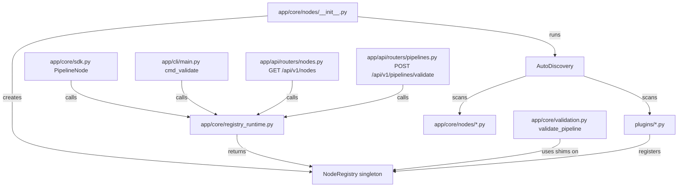

# Design Document — App Pydantic Migration and FastAPI Redesign

← Back to spec root: `.kiro/specs/app-pydantic-migration/`

## Overview

This work completes the transition to the Enhanced Node System and delivers a complete FastAPI redesign that exposes the full power of the new node architecture. AudioBuilder is a **universal data pipeline builder** — not just audio. The new node system supports any domain (Audio, ML, Data, Automation, Video), and the API must reflect that.

The migration is purely surgical for Layers 1 and 2 — no new architecture, no new abstractions. Layer 3 (API) is a full redesign: versioned endpoints, split routers, rich node catalogue, DAG pipeline support, and fixed async run tracking.

### Goals

- Zero remaining references to `registry[node_type]["schema"]`, `registry[node_type]["class"]`, or `register(registry)` patterns anywhere in the codebase.
- All timestamps are UTC-aware (`datetime.now(timezone.utc)`), eliminating Python 3.12 deprecation warnings.
- `IngestionJob` is a Pydantic `BaseModel`, consistent with the rest of the data layer.
- `PipelineCache.load` uses `AudioSample.model_validate()` so Pydantic v2 validation is applied on cache reads.
- The SDK's `Node` class is renamed `PipelineNode` to stop shadowing `app.core.nodes.base.Node`.
- All API endpoints are under `/api/v1/` with focused routers; legacy root paths return 301 redirects.
- The Node Catalogue API exposes full node metadata, port schemas, type compatibility, and TypeCatalogue browsing.
- The Pipeline API supports both linear and DAG pipeline formats.
- The `/run-async` dual-RunManager bug is fixed — one RunManager, one run_id.
- Pipeline validation is generalized — no hardcoded audio-specific first/last node rules.

### Non-Goals

- No changes to the 27 already-migrated audio nodes.
- No changes to `app/core/webhook.py` or `app/api/routers/registry_api.py` internal logic (only moved under `/api/v1/`).
- No changes to `app/core/validation.py` — the `NodeRegistry` compatibility shims make it work as-is.
- No frontend changes — the frontend will use the 301 redirects during the transition period.
- No new pipeline execution engine — `run_pipeline()` is unchanged.

---

## Architecture

The migration touches four logical layers. Each layer is documented in a sub-file.

```
┌─────────────────────────────────────────────────────────────────┐
│  Layer 1 — Plugin, SDK, CLI                                     │
│  plugins/noise_node.py  ·  app/core/sdk.py  ·  app/cli/main.py │
│  → design-01-plugin-sdk-cli.md  (unchanged)                     │
├─────────────────────────────────────────────────────────────────┤
│  Layer 2 — Core Services                                        │
│  app/core/logger.py  ·  app/core/run_manager.py                 │
│  app/core/ingestion.py  ·  app/core/pipeline_cache.py           │
│  → design-02-core-services.md  (unchanged)                      │
├─────────────────────────────────────────────────────────────────┤
│  Layer 3 — API Redesign                                         │
│  app/api/main.py (restructured)                                 │
│  app/api/routers/nodes.py  (NEW)                                │
│  app/api/routers/pipelines.py  (NEW)                            │
│  app/api/routers/runs.py  (NEW)                                 │
│  app/api/routers/data.py  (NEW)                                 │
│  app/api/routers/system.py  (NEW)                               │
│  → design-03-api.md  (complete rewrite)                         │
├─────────────────────────────────────────────────────────────────┤
│  Layer 4 — Validation Generalization                            │
│  app/core/validation.py  (no changes — shims handle it)         │
│  app/core/nodes/registry.py  (add __getitem__, keys, items)     │
│  → design-04-validation.md  (NEW)                               │
└─────────────────────────────────────────────────────────────────┘
```

All layers share the same `NodeRegistry` singleton, accessed via `get_registry()` from `app.core.registry_runtime`. The singleton is populated at import time by `AutoDiscovery`.



---

## Sub-File Index

| File | Contents | Status |
|------|----------|--------|
| [design-01-plugin-sdk-cli.md](design-01-plugin-sdk-cli.md) | `NoiseNode` rewrite, SDK `PipelineNode`, CLI `cmd_validate` | Unchanged |
| [design-02-core-services.md](design-02-core-services.md) | `PipelineLogger`, `RunManager`, `IngestionJob`, `PipelineCache` | Unchanged |
| [design-03-api.md](design-03-api.md) | Complete FastAPI redesign — all routers, versioning, node catalogue, pipeline API, runs API, data API | **Rewritten** |
| [design-04-validation.md](design-04-validation.md) | Validation generalization, `NodeRegistry` compatibility shims | **New** |

---

## New Router Layout

```
app/api/
├── main.py                    # Thin app factory: CORS, auth, mounts, router includes, 301 aliases
└── routers/
    ├── nodes.py               # NEW: GET /api/v1/nodes, /nodes/{type}, /nodes/compatible, /types
    ├── pipelines.py           # NEW: POST /api/v1/pipelines/validate, /run, /run-async, /templates
    ├── runs.py                # NEW: GET /api/v1/runs, /runs/{id}, /runs/{id}/status, /checkpoints
    ├── data.py                # NEW: GET /api/v1/data/inputs, /outputs, POST /data/inputs/upload
    ├── system.py              # NEW: POST /api/v1/system/cleanup, GET /system/health
    ├── projects.py            # EXISTING: moved to /api/v1/projects/*
    ├── ingest.py              # EXISTING: moved to /api/v1/ingest/*
    ├── webhooks.py            # EXISTING: moved to /api/v1/system/webhooks
    ├── registry_api.py        # EXISTING: moved to /api/v1/system/projects-registry
    ├── cleanup.py             # EXISTING: absorbed into system.py or kept as-is under /api/v1/
    ├── merge.py               # EXISTING: moved to /api/v1/data/merge
    └── templates_write.py     # EXISTING: absorbed into pipelines.py
```

---

## Data Models

No new data models are introduced. The migration uses existing models:

| Model | Location | Role |
|-------|----------|------|
| `NodeMetadata` | `app/core/nodes/metadata.py` | Node identity, ports, display properties |
| `NodeConfig` | `app/core/nodes/config.py` | Base class for typed node configuration |
| `InputPort` / `OutputPort` | `app/core/nodes/ports.py` | Typed port descriptors |
| `AudioSample` | `app/models/audio_sample.py` | `PortDataType(BaseModel)` for audio data |
| `IngestionJob` | `app/core/ingestion.py` | **Migrated** from `@dataclass` to `BaseModel` |

The `IngestionJob` migration is the only data model change. Before and after:

```python
# BEFORE
@dataclass
class IngestionJob:
    job_id: str
    status: str
    progress: list[dict] = field(default_factory=list)

# AFTER
class IngestionJob(BaseModel):
    job_id: str
    status: str
    progress: list[dict] = Field(default_factory=list)
```

---

## Endpoint Migration Map

| Legacy Path | New Path | Change |
|-------------|----------|--------|
| `GET /schemas` | `GET /api/v1/nodes` | Richer response; legacy returns 301 |
| `POST /validate` | `POST /api/v1/pipelines/validate` | Generalized rules; legacy returns 301 |
| `POST /run-stream` | `POST /api/v1/pipelines/run` | Same behavior; legacy returns 301 |
| `POST /run-async` | `POST /api/v1/pipelines/run-async` | Fixed run_id tracking; legacy returns 301 |
| `GET /templates` | `GET /api/v1/pipelines/templates` | Same behavior; legacy returns 301 |
| `GET /template/{name}` | `GET /api/v1/pipelines/templates/{name}` | Same behavior; legacy returns 301 |
| `GET /runs` | `GET /api/v1/runs` | Same behavior; legacy returns 301 |
| `GET /run/{id}` | `GET /api/v1/runs/{id}` | Same behavior; legacy returns 301 |
| `GET /run/{id}/status` | `GET /api/v1/runs/{id}/status` | Same behavior; legacy returns 301 |
| `GET /run/{id}/checkpoints` | `GET /api/v1/runs/{id}/checkpoints` | node_id instead of node_index; legacy returns 301 |
| `GET /datasets` | `GET /api/v1/data/outputs` | Renamed; legacy returns 301 |
| `GET /dataset` | `GET /api/v1/data/outputs/{project}/{version}` | Path params; legacy returns 301 |
| `GET /dataset-stats` | `GET /api/v1/data/outputs/{project}/{version}/stats` | Path params; legacy returns 301 |
| `GET /input-datasets` | `GET /api/v1/data/inputs` | Renamed; legacy returns 301 |
| `GET /input-dataset` | `GET /api/v1/data/inputs/{label}` | Path param; legacy returns 301 |
| `POST /mic-upload` | `POST /api/v1/data/inputs/upload` | Renamed; legacy returns 301 |
| `GET /registry` | `GET /api/v1/system/projects-registry` | Renamed; legacy returns 301 |
| `POST /cleanup` | `POST /api/v1/system/cleanup` | Renamed; legacy returns 301 |
| `GET /webhooks` | `GET /api/v1/system/webhooks` | Renamed; legacy returns 301 |
| `PUT /webhooks` | `PUT /api/v1/system/webhooks` | Renamed; legacy returns 301 |
| `POST /webhooks/test` | `POST /api/v1/system/webhooks/test` | Renamed; legacy returns 301 |
| `POST /merge` | `POST /api/v1/data/merge` | Renamed; legacy returns 301 |
| `GET /projects/*` | `GET /api/v1/projects/*` | Prefix added; legacy returns 301 |
| `GET /ingest/*` | `GET /api/v1/ingest/*` | Prefix added; legacy returns 301 |
| — | `GET /api/v1/nodes/{type}/config-schema` | **New** |
| — | `GET /api/v1/nodes/{type}/port-schema` | **New** |
| — | `GET /api/v1/nodes/compatible` | **New** |
| — | `GET /api/v1/types` | **New** |
| — | `GET /api/v1/system/health` | **New** |
| `POST /validate-node` | `POST /api/v1/nodes/{type}/validate-config` | Moved; legacy returns 301 |

---

## Correctness Properties

This feature is suitable for property-based testing in the following areas: noise scaling logic, SDK validation equivalence, UTC timestamp format, structured event passthrough, IngestionJob serialisation, AudioSample round-trip, API response shape, node catalogue completeness, and compatibility query correctness.

The property-based testing library used is **Hypothesis** (already present in the project via `.hypothesis/`).

---

### Property 1: NoiseNode noise scaling

*For any* list of `AudioSample` objects and any positive `noise_level` float, processing the samples through `NoiseNode` should produce output samples whose data arrays differ from the input arrays by values whose RMS magnitude is proportional to `noise_level`.

**Validates: Requirements 1.5**

---

### Property 2: SDK validation equivalence

*For any* registered `node_type` and any config dict, `PipelineNode(node_type, config)` raises a `ValueError` if and only if `registry.get_class(node_type).Config.model_validate(config)` raises a `pydantic.ValidationError`.

**Validates: Requirements 2.3**

---

### Property 3: SDK from_yaml round-trip

*For any* valid pipeline YAML file, `Pipeline.from_yaml(path).nodes` should be a list of `PipelineNode` instances where each instance's `node_type` and `config` match the corresponding entry in the YAML's `pipeline.nodes` list.

**Validates: Requirements 2.7**

---

### Property 4: UTC timestamp format

*For any* call to `PipelineLogger._timestamp()`, the returned string should be parseable as a `datetime` with a UTC offset (`+00:00`), and the parsed datetime should be timezone-aware.

**Validates: Requirements 4.1, 4.7**

---

### Property 5: node_end output_count passthrough

*For any* non-negative integer `n`, calling `logger.node_end(node_type, index, duration, output_count=n)` should emit a structured event dict containing `"output_count": n` exactly.

**Validates: Requirements 4.4**

---

### Property 6: node_end log line completeness

*For any* `node_type` string, `duration` float, and `output_count` integer, the human-readable log message emitted by `node_end` should contain the node type, the duration value, and the output count.

**Validates: Requirements 4.5**

---

### Property 7: RunManager UTC timestamp

*For any* `RunManager` instantiation, the `meta.json` written to disk should contain a `"created_at"` field whose string value ends with `"+00:00"` and is parseable as a UTC-aware `datetime`.

**Validates: Requirements 5.2, 5.3, 5.5**

---

### Property 8: IngestionJob default progress

*For any* `job_id` string and `status` string, `IngestionJob(job_id=job_id, status=status).progress` should equal `[]`.

**Validates: Requirements 6.3**

---

### Property 9: IngestionJob serialisation round-trip

*For any* `IngestionJob` instance, `IngestionJob.model_validate(job.model_dump())` should produce an instance with identical `job_id`, `status`, and `progress` fields.

**Validates: Requirements 6.6**

---

### Property 10: AudioSample metadata round-trip

*For any* dict `meta`, `AudioSample.model_validate({"path": p, "sample_rate": r, "data": None, "metadata": meta}).metadata` should equal `meta`.

**Validates: Requirements 7.3, 7.4**

---

### Property 11: /api/v1/nodes response shape

*For any* node type registered in `NodeRegistry`, the `GET /api/v1/nodes` endpoint response should contain an entry for that node type with keys `node_type`, `label`, `description`, `category`, `version`, `tags`, `input_ports`, `output_ports`, and `config_schema`, all non-null.

**Validates: Requirements 11.1**

---

### Property 12: NodeRegistry __getitem__ shim consistency

*For any* registered `node_type`, `registry[node_type]["schema"]` should equal `registry.get_config_schema(node_type)`, and `registry[node_type]["class"]` should equal `registry.get_class(node_type)`.

**Validates: Requirements 15.1, 15.6**

---

### Property 13: compatible nodes are bidirectionally consistent

*For any* registered `PortDataType` subclass `T`, every node returned by `registry.find_compatible_nodes(T, direction="input")` should have at least one input port whose data type is compatible with `T` according to `CompatibilityChecker.are_compatible`.

**Validates: Requirements 11.6**

---

## Error Handling

| Scenario | Handling |
|----------|----------|
| `PipelineNode` instantiated with unknown `node_type` | `ValueError` with type name + available types list |
| `PipelineNode` instantiated with invalid config | `ValueError` wrapping `pydantic.ValidationError` |
| `PipelineCache.load` encounters corrupt manifest entry | Catches `pydantic.ValidationError`, logs warning, returns `None` |
| `AutoDiscovery` fails to import a plugin file | Logs warning, skips file — does not crash |
| `NodeRegistry.get_class` called with unknown type | Raises `NodeNotFoundError` |
| `GET /api/v1/nodes/{node_type}` with unknown type | HTTP 404 |
| `GET /api/v1/nodes/compatible` with unknown `output_type` | HTTP 400 with descriptive message |
| `POST /api/v1/pipelines/run-async` background thread fails | `meta.json` updated to `"status": "failed"` with error message |
| Legacy root-path endpoint called | HTTP 301 redirect to `/api/v1/` equivalent |

---

## Testing Strategy

**Dual approach**: unit/example tests for specific behaviors and error conditions; property-based tests for universal properties.

**Property-based tests** use Hypothesis with `@settings(max_examples=100)`. Each test is tagged with a comment referencing the design property:
```python
# Feature: app-pydantic-migration, Property N: <property_text>
```

**Unit tests** cover:
- AutoDiscovery smoke checks (NoiseNode registration, no `register()` function)
- SDK `PipelineNode` unknown-type error
- CLI `cmd_validate` success/failure exit codes
- `IngestionJob.progress.append()` mutation
- `PipelineCache.load` ValidationError → `None` path
- `/api/v1/nodes/{type}` HTTP 404 for unknown type
- `/api/v1/pipelines/run-async` returns correct run_id
- Legacy `/schemas` returns HTTP 301

**Integration tests** cover:
- `Pipeline.run()` end-to-end with a minimal YAML
- `GET /api/v1/nodes` returns all registered nodes including `"noise"`
- `POST /api/v1/pipelines/validate` accepts both linear and DAG format
- `POST /api/v1/pipelines/run-async` + `GET /api/v1/runs/{id}/status` round-trip

**Property tests** (Hypothesis) cover Properties 1–13 as listed above.

**Test configuration**:
- Minimum 100 iterations per property test
- Use `@given` with `st.floats`, `st.text`, `st.integers`, `st.dictionaries` strategies
- Mock filesystem I/O in RunManager tests to avoid disk writes
