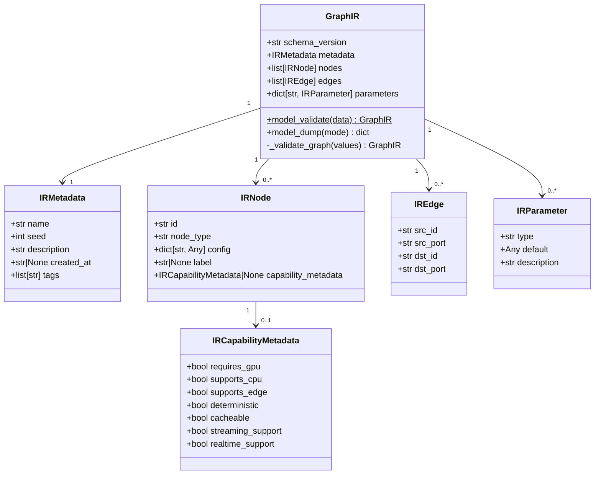

# Design 01 — Graph IR: Models, Loader, and Version Validation

## Overview

This document covers the complete design of the `app/core/ir/` package: the Pydantic model hierarchy, the loader/dumper functions, version validation logic, and the error types. This is the foundation for all other Phase 1 work.

**Requirements addressed:** Req 1.1 – 1.11

---

## Module Structure

```
app/core/ir/
├── __init__.py      # Public re-exports
├── models.py        # GraphIR, IRNode, IREdge, IRParameter, IRMetadata, IRCapabilityMetadata
└── loader.py        # load_ir, dump_ir, load_ir_from_file, dump_ir_to_file, error types
```

`yaml_shim.py` and `migrate.py` are covered in [design-04-yaml-compat.md](design-04-yaml-compat.md).

---

## `app/core/ir/__init__.py`

Re-exports all public symbols so callers can write `from app.core.ir import GraphIR`.

```python
# app/core/ir/__init__.py
"""Graph Intermediate Representation — public API."""
from app.core.ir.models import (
    GraphIR,
    IRCapabilityMetadata,
    IREdge,
    IRMetadata,
    IRNode,
    IRParameter,
)
from app.core.ir.loader import (
    CURRENT_IR_VERSION,
    IRValidationError,
    IRVersionError,
    dump_ir,
    dump_ir_to_file,
    load_ir,
    load_ir_from_file,
)

__all__ = [
    # Models
    "GraphIR",
    "IRCapabilityMetadata",
    "IREdge",
    "IRMetadata",
    "IRNode",
    "IRParameter",
    # Loader
    "CURRENT_IR_VERSION",
    "IRValidationError",
    "IRVersionError",
    "dump_ir",
    "dump_ir_to_file",
    "load_ir",
    "load_ir_from_file",
]
```

---

## `app/core/ir/models.py`

### Design Rationale

- All models use `pydantic.BaseModel` — consistent with the rest of the codebase.
- No imports from `app/core/pipeline.py`, `app/core/nodes/`, or `app/core/sdk.py` — the IR is runtime-agnostic (Req 1.11).
- `GraphIR` uses a Pydantic `model_validator` to enforce node ID uniqueness and edge reference integrity at construction time (Req 1.4.3, Req 1.9).
- `IRNode.id` is validated with a regex pattern (Req 1.4.4).
- `IRCapabilityMetadata` is defined here (not in `metadata.py`) to keep the IR self-contained. `NodeMetadata` imports it for the capability fields extension (see design-05).

### Class Diagram



### Full Implementation

```python
# app/core/ir/models.py
"""Graph IR Pydantic models — runtime-agnostic graph representation.

No imports from app/core/pipeline.py, app/core/nodes/, or app/core/sdk.py.
Only pydantic and the Python standard library.
"""
from __future__ import annotations

import re
from typing import Any

from pydantic import BaseModel, ConfigDict, field_validator, model_validator

# Regex for valid node IDs: alphanumeric, underscores, hyphens only (Req 1.4.4)
_NODE_ID_RE = re.compile(r"^[A-Za-z0-9_-]+$")


class IRCapabilityMetadata(BaseModel):
    """Capability hints for a node instance within a specific graph.

    When set on an IRNode, these values take precedence over the node class's
    NodeMetadata capability fields for that specific instance (Req 5.2.4).

    All fields are optional with sensible defaults (Req 5.1.1).
    """

    model_config = ConfigDict(frozen=True)

    requires_gpu: bool = False
    supports_cpu: bool = True
    supports_edge: bool = False
    deterministic: bool = True
    cacheable: bool = True
    streaming_support: bool = False
    realtime_support: bool = False


class IRMetadata(BaseModel):
    """Graph-level metadata: name, seed, description, timestamps, tags.

    Req 1.3
    """

    model_config = ConfigDict(frozen=True)

    name: str
    seed: int
    description: str = ""
    created_at: str | None = None
    tags: list[str] = []

    @field_validator("name")
    @classmethod
    def _name_non_empty(cls, v: str) -> str:
        if not v.strip():
            raise ValueError("IRMetadata.name must be a non-empty string")
        return v


class IRNode(BaseModel):
    """Specification for a single node in the graph.

    Req 1.4
    """

    model_config = ConfigDict(frozen=True)

    id: str
    node_type: str
    config: dict[str, Any] = {}
    label: str | None = None
    capability_metadata: IRCapabilityMetadata | None = None

    @field_validator("id")
    @classmethod
    def _id_valid(cls, v: str) -> str:
        if not _NODE_ID_RE.match(v):
            raise ValueError(
                f"IRNode.id '{v}' contains invalid characters. "
                "Only alphanumeric characters, underscores, and hyphens are allowed."
            )
        return v

    @field_validator("node_type")
    @classmethod
    def _node_type_non_empty(cls, v: str) -> str:
        if not v.strip():
            raise ValueError("IRNode.node_type must be a non-empty string")
        return v


class IREdge(BaseModel):
    """A directed edge connecting one node's output port to another's input port.

    Req 1.5
    """

    model_config = ConfigDict(frozen=True)

    src_id: str
    src_port: str
    dst_id: str
    dst_port: str


class IRParameter(BaseModel):
    """A graph-level parameter definition.

    Req 1.6
    """

    model_config = ConfigDict(frozen=True)

    type: str
    default: Any
    description: str = ""


class GraphIR(BaseModel):
    """Top-level graph IR model — the canonical representation of a pipeline.

    Req 1.2, 1.4.3, 1.9
    """

    model_config = ConfigDict(frozen=True)

    schema_version: str
    metadata: IRMetadata
    nodes: list[IRNode]
    edges: list[IREdge] = []
    parameters: dict[str, IRParameter] = {}

    @field_validator("schema_version")
    @classmethod
    def _version_non_empty(cls, v: str) -> str:
        if not v.strip():
            raise ValueError("GraphIR.schema_version must be a non-empty string")
        # Validate format: "<major>.<minor>"
        parts = v.split(".")
        if len(parts) != 2 or not all(p.isdigit() for p in parts):
            raise ValueError(
                f"GraphIR.schema_version '{v}' must follow the format '<major>.<minor>' "
                "(e.g. '1.0')"
            )
        return v

    @model_validator(mode="after")
    def _validate_graph(self) -> "GraphIR":
        """Validate node ID uniqueness and edge reference integrity.

        Req 1.4.3: no two nodes may share the same id.
        Req 1.9.1: all edge src_id and dst_id must reference known node ids.
        Req 1.9.2: no duplicate node ids.
        """
        # Build id set and check for duplicates
        seen_ids: set[str] = set()
        for node in self.nodes:
            if node.id in seen_ids:
                raise ValueError(
                    f"Duplicate node id '{node.id}' in GraphIR.nodes. "
                    "All node ids must be unique within a graph."
                )
            seen_ids.add(node.id)

        # Validate edge references
        for edge in self.edges:
            if edge.src_id not in seen_ids:
                raise ValueError(
                    f"IREdge references unknown source node id '{edge.src_id}'. "
                    f"Known node ids: {sorted(seen_ids)}"
                )
            if edge.dst_id not in seen_ids:
                raise ValueError(
                    f"IREdge references unknown destination node id '{edge.dst_id}'. "
                    f"Known node ids: {sorted(seen_ids)}"
                )

        return self
```

---

## `app/core/ir/loader.py`

### Design Rationale

- `CURRENT_IR_VERSION = "1.0"` — the version string for Phase 1.
- `load_ir(data)` validates the dict against `GraphIR` via Pydantic, then performs version checking. Version checking happens after schema validation so that the error message is specific.
- `IRVersionError` is raised when the major version component differs (Req 1.7.3).
- A `UserWarning` is emitted when the minor version is greater than the current (Req 1.7.4).
- `dump_ir(graph)` uses `model_dump(mode="json")` to produce a JSON-serializable dict. This ensures all types (including `Any` fields) are serialized correctly.
- `dump_ir_to_file` writes with 2-space indentation for human readability (Req 1.8.4).

### Version Comparison Logic

```
document version: "2.1"  → major=2, minor=1
current version:  "1.0"  → major=1, minor=0

major differs (2 != 1) → raise IRVersionError

document version: "1.3"  → major=1, minor=3
current version:  "1.0"  → major=1, minor=0

major same, minor greater (3 > 0) → emit UserWarning, continue loading

document version: "1.0"  → major=1, minor=0
current version:  "1.0"  → exact match → load normally
```

### Full Implementation

```python
# app/core/ir/loader.py
"""IR Loader — serialization, deserialization, and version validation.

No imports from app/core/pipeline.py, app/core/nodes/, or app/core/sdk.py.
Only pydantic, json, and the Python standard library.
"""
from __future__ import annotations

import json
import warnings
from pathlib import Path
from typing import Any

import pydantic

from app.core.ir.models import GraphIR

# ── Version constant ──────────────────────────────────────────────────────────

CURRENT_IR_VERSION: str = "1.0"
"""The IR schema version implemented in this phase.

Format: "<major>.<minor>". The loader rejects documents whose major version
differs from this constant's major component.
"""

# ── Error types ───────────────────────────────────────────────────────────────


class IRVersionError(ValueError):
    """Raised when a GraphIR document has an incompatible major schema version.

    Req 1.7.3, 1.7.5
    """


class IRValidationError(ValueError):
    """Raised when a GraphIR document fails structural validation beyond Pydantic.

    Req 1.9.3, 1.9.4
    """


# ── Version validation ────────────────────────────────────────────────────────


def _check_version(schema_version: str) -> None:
    """Validate schema_version against CURRENT_IR_VERSION.

    Raises:
        IRVersionError: if the major version component differs.

    Emits:
        UserWarning: if the minor version component is greater than current.
    """
    try:
        doc_major, doc_minor = (int(x) for x in schema_version.split("."))
        cur_major, cur_minor = (int(x) for x in CURRENT_IR_VERSION.split("."))
    except (ValueError, AttributeError) as exc:
        raise IRVersionError(
            f"Cannot parse schema_version '{schema_version}': {exc}"
        ) from exc

    if doc_major != cur_major:
        raise IRVersionError(
            f"IR document schema_version '{schema_version}' is incompatible with "
            f"the supported version '{CURRENT_IR_VERSION}'. "
            f"Major version mismatch: document={doc_major}, supported={cur_major}. "
            "Run 'audiobuilder migrate --config <path>' to convert to the current format."
        )

    if doc_minor > cur_minor:
        warnings.warn(
            f"IR document schema_version '{schema_version}' has a higher minor version "
            f"than the supported '{CURRENT_IR_VERSION}'. "
            "Some features may not be available. Consider upgrading the platform.",
            UserWarning,
            stacklevel=3,
        )


# ── Public API ────────────────────────────────────────────────────────────────


def load_ir(data: dict[str, Any]) -> GraphIR:
    """Validate and return a GraphIR from a JSON-compatible dict.

    Performs:
    1. Pydantic schema validation (raises pydantic.ValidationError on failure)
    2. Schema version check (raises IRVersionError on major mismatch)

    Args:
        data: A JSON-compatible dict, typically from json.loads() or yaml.safe_load().

    Returns:
        A validated GraphIR object.

    Raises:
        pydantic.ValidationError: if the dict does not conform to the GraphIR schema.
        IRVersionError: if the major version is incompatible.

    Req 1.8.1
    """
    graph = GraphIR.model_validate(data)
    _check_version(graph.schema_version)
    return graph


def load_ir_from_file(path: str) -> GraphIR:
    """Read a JSON file and return a validated GraphIR.

    Args:
        path: Path to the IR JSON file.

    Returns:
        A validated GraphIR object.

    Raises:
        FileNotFoundError: if the file does not exist (Req 1.8.5).
        json.JSONDecodeError: if the file contains invalid JSON (Req 1.8.6).
        pydantic.ValidationError: if the JSON does not conform to GraphIR (Req 1.8.7).
        IRVersionError: if the major version is incompatible.

    Req 1.8.2
    """
    p = Path(path)
    if not p.exists():
        raise FileNotFoundError(f"IR JSON file not found: {path}")

    with p.open("r", encoding="utf-8") as f:
        data = json.load(f)  # raises json.JSONDecodeError on invalid JSON

    return load_ir(data)


def dump_ir(graph: GraphIR) -> dict[str, Any]:
    """Return a JSON-serializable dict from a GraphIR.

    Uses model_dump(mode="json") to ensure all types are JSON-compatible.

    Args:
        graph: A GraphIR object.

    Returns:
        A JSON-serializable dict.

    Req 1.8.3
    """
    return graph.model_dump(mode="json")


def dump_ir_to_file(graph: GraphIR, path: str) -> None:
    """Write a GraphIR to a JSON file with 2-space indentation.

    Args:
        graph: A GraphIR object.
        path: Destination file path. Parent directories must exist.

    Req 1.8.4
    """
    data = dump_ir(graph)
    p = Path(path)
    with p.open("w", encoding="utf-8") as f:
        json.dump(data, f, indent=2, ensure_ascii=False)
        f.write("\n")  # trailing newline for POSIX compliance
```

---

## Round-Trip Guarantee

The round-trip property `load_ir(dump_ir(g)) == g` holds because:

1. `dump_ir(g)` calls `g.model_dump(mode="json")` — produces a plain dict with all values serialized to JSON-compatible types.
2. `load_ir(data)` calls `GraphIR.model_validate(data)` — reconstructs the model from the dict.
3. Pydantic's `model_validate` + `model_dump(mode="json")` are inverse operations for models with `frozen=True` and no custom serializers.
4. The `model_validator` in `GraphIR` re-runs on deserialization, ensuring structural integrity is preserved.

The only caveat: `IRParameter.default` is typed as `Any`. If the default value is a Python object that is not JSON-serializable (e.g. a custom class), the round-trip will fail. The design constrains `IRParameter.default` to JSON-primitive types (str, int, float, bool, None, list, dict) in practice.

---

## Error Handling

| Scenario | Exception | Req |
|---|---|---|
| File not found | `FileNotFoundError` | 1.8.5 |
| Invalid JSON | `json.JSONDecodeError` | 1.8.6 |
| Schema mismatch | `pydantic.ValidationError` | 1.8.7 |
| Duplicate node id | `pydantic.ValidationError` (from `model_validator`) | 1.4.3, 1.9.2 |
| Unknown edge node id | `pydantic.ValidationError` (from `model_validator`) | 1.5.2, 1.9.1 |
| Incompatible major version | `IRVersionError` | 1.7.3 |
| Higher minor version | `UserWarning` (not an exception) | 1.7.4 |

---

## Example IR JSON Document

```json
{
  "schema_version": "1.0",
  "metadata": {
    "name": "wake-word-pipeline",
    "seed": 42,
    "description": "Wake word detection dataset pipeline",
    "created_at": "2024-01-15T10:30:00+00:00",
    "tags": ["audio", "wake-word"]
  },
  "nodes": [
    {
      "id": "input_0",
      "node_type": "input",
      "config": {"path": "workspace/datasets/input/speech"},
      "label": null,
      "capability_metadata": null
    },
    {
      "id": "clean_1",
      "node_type": "clean",
      "config": {"sample_rate": 16000},
      "label": null,
      "capability_metadata": null
    },
    {
      "id": "split_2",
      "node_type": "split",
      "config": {"train": 0.8, "val": 0.1},
      "label": null,
      "capability_metadata": null
    }
  ],
  "edges": [
    {"src_id": "input_0", "src_port": "output", "dst_id": "clean_1", "dst_port": "input"},
    {"src_id": "clean_1", "src_port": "output", "dst_id": "split_2", "dst_port": "input"}
  ],
  "parameters": {}
}
```

---

## Design Constraints

- **No runtime dependencies** — `app/core/ir/models.py` and `app/core/ir/loader.py` import only `pydantic` and the Python standard library (Req 1.11.3).
- **Frozen models** — all IR models use `ConfigDict(frozen=True)` to prevent accidental mutation after construction. This also enables equality comparison via `==` (used in round-trip tests).
- **No mutable runtime state** — `GraphIR` contains no timestamps, run IDs, or execution counters (Req 1.10.4). Those belong to `RunManager`.

---

## References

- [req-01-graph-ir.md](req-01-graph-ir.md) — Requirements 1.1 – 1.11
- [design-05-node-capability-metadata.md](design-05-node-capability-metadata.md) — `IRCapabilityMetadata` usage in `NodeMetadata`
- [design-06-correctness-properties.md](design-06-correctness-properties.md) — IR round-trip property, version rejection property
