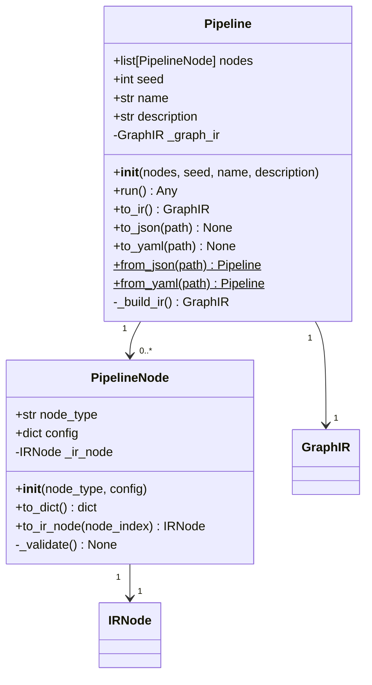
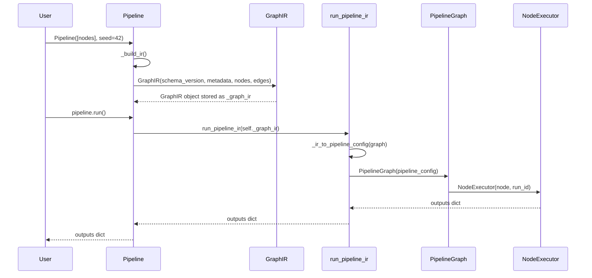

# Design 02 — SDK Consolidation: Pipeline and PipelineNode

## Overview

This document covers the rewrite of `app/core/sdk.py`. The public API of `Pipeline` and `PipelineNode` is unchanged — existing user code requires no modification. The internals are rewritten so that both classes are backed by IR objects (`IRNode` and `GraphIR` respectively).

**Requirements addressed:** Req 2.1 – 2.9

---

## Design Rationale

### Why IR-backed internals?

The current `Pipeline` implementation writes a temporary YAML file and calls `run_pipeline(yaml_path)`. This is fragile (temp file cleanup, encoding issues) and bypasses the IR entirely. After this change:

1. `Pipeline` constructs a `GraphIR` at construction time.
2. `Pipeline.run()` passes the `GraphIR` directly to `run_pipeline_ir()`.
3. No temporary files are created.
4. `to_yaml()` derives YAML from the IR (not from a separate raw dict).
5. `to_json()` / `from_json()` are the canonical serialization methods.

### Backward compatibility

The constructor signatures, attribute names, and method signatures are unchanged. The only observable behavioral difference is:

- `Pipeline.run()` no longer creates a temporary YAML file.
- `Pipeline.from_yaml()` emits a `DeprecationWarning` (via `load_yaml_with_deprecation`).
- `Pipeline` now has new methods: `to_ir()`, `to_json()`, `from_json()`.
- `Pipeline` now accepts optional `name` and `description` constructor arguments.

---

## Class Diagram



---

## `PipelineNode` Design

### Constructor

```python
def __init__(self, node_type: str, config: dict[str, Any] | None = None) -> None:
```

Behavior (unchanged from current):
1. Store `node_type` and `config` as attributes.
2. Call `_validate()` to check config against the node's Pydantic `Config` model.
3. Construct and store an `IRNode` as `self._ir_node`.

The `IRNode` at construction time uses a placeholder `id` of `f"{node_type}_0"`. The real id (with the correct index) is assigned when `to_ir_node(node_index)` is called.

### `to_ir_node(node_index: int) -> IRNode`

Returns an `IRNode` with `id = f"{self.node_type}_{node_index}"`. This is called by `Pipeline._build_ir()` when assembling the `GraphIR`.

```python
def to_ir_node(self, node_index: int) -> IRNode:
    from app.core.ir.models import IRNode
    return IRNode(
        id=f"{self.node_type}_{node_index}",
        node_type=self.node_type,
        config=self.config,
    )
```

### `to_dict() -> dict`

Derives from the backing `IRNode` fields (Req 2.2.3):

```python
def to_dict(self) -> dict:
    return {"type": self._ir_node.node_type, "config": dict(self._ir_node.config)}
```

---

## `Pipeline` Design

### Constructor

```python
def __init__(
    self,
    nodes: list[PipelineNode],
    seed: int = 42,
    name: str = "pipeline",
    description: str = "",
) -> None:
```

Behavior:
1. Store `nodes`, `seed`, `name`, `description` as attributes.
2. Call `_build_ir()` to construct and store the `GraphIR` as `self._graph_ir`.

### `_build_ir() -> GraphIR`

Constructs the `GraphIR` from the node list. For a linear pipeline (no explicit edges), auto-chains `output → input`:

```python
def _build_ir(self) -> GraphIR:
    from app.core.ir.models import GraphIR, IREdge, IRMetadata
    from app.core.ir.loader import CURRENT_IR_VERSION

    ir_nodes = [node.to_ir_node(i) for i, node in enumerate(self.nodes)]

    # Auto-chain: output → input for linear pipelines
    ir_edges = [
        IREdge(
            src_id=ir_nodes[i].id,
            src_port="output",
            dst_id=ir_nodes[i + 1].id,
            dst_port="input",
        )
        for i in range(len(ir_nodes) - 1)
    ]

    return GraphIR(
        schema_version=CURRENT_IR_VERSION,
        metadata=IRMetadata(
            name=self.name,
            seed=self.seed,
            description=self.description,
        ),
        nodes=ir_nodes,
        edges=ir_edges,
    )
```

### `to_ir() -> GraphIR`

Returns the backing `GraphIR` object (Req 2.4.2):

```python
def to_ir(self) -> GraphIR:
    return self._graph_ir
```

### `run() -> Any`

Passes the `GraphIR` directly to `run_pipeline_ir()` — no temporary YAML file (Req 2.4.3, 2.9.4):

```python
def run(self) -> Any:
    from app.core.pipeline import run_pipeline_ir
    return run_pipeline_ir(self._graph_ir)
```

### `to_json(path: str) -> None`

Writes the backing `GraphIR` to a JSON file (Req 2.6.1, 2.6.2):

```python
def to_json(self, path: str) -> None:
    from app.core.ir.loader import dump_ir_to_file
    dump_ir_to_file(self._graph_ir, path)
```

### `from_json(path: str) -> Pipeline` (classmethod)

Loads a `GraphIR` from a JSON file and constructs a `Pipeline` (Req 2.5.1 – 2.5.4):

```python
@classmethod
def from_json(cls, path: str) -> "Pipeline":
    from app.core.ir.loader import load_ir_from_file
    graph = load_ir_from_file(path)  # propagates IRVersionError (Req 2.5.3)

    nodes = [
        PipelineNode(node.node_type, dict(node.config))
        for node in graph.nodes
    ]
    return cls(
        nodes=nodes,
        seed=graph.metadata.seed,
        name=graph.metadata.name,
        description=graph.metadata.description,
    )
```

### `to_yaml(path: str) -> None`

Derives YAML from the backing `GraphIR` (Req 2.7.2). Does NOT emit a `DeprecationWarning` (Req 2.7.3):

```python
def to_yaml(self, path: str) -> None:
    import yaml
    config = self._to_config_dict()
    with open(path, "w", encoding="utf-8") as f:
        yaml.dump(config, f, sort_keys=False)

def _to_config_dict(self) -> dict:
    """Derive the legacy YAML config dict from the backing GraphIR."""
    graph = self._graph_ir
    return {
        "pipeline": {
            "seed": graph.metadata.seed,
            "nodes": [
                {"type": node.node_type, "config": dict(node.config)}
                for node in graph.nodes
            ],
        }
    }
```

### `from_yaml(path: str) -> Pipeline` (classmethod)

Calls `load_yaml_with_deprecation()` which emits a `DeprecationWarning` (Req 2.3.5, 4.2.4):

```python
@classmethod
def from_yaml(cls, path: str) -> "Pipeline":
    from app.core.ir.yaml_shim import load_yaml_with_deprecation
    graph = load_yaml_with_deprecation(path)

    nodes = [
        PipelineNode(node.node_type, dict(node.config))
        for node in graph.nodes
    ]
    return cls(
        nodes=nodes,
        seed=graph.metadata.seed,
        name=graph.metadata.name,
        description=graph.metadata.description,
    )
```

---

## Complete `app/core/sdk.py` Implementation

```python
"""
AudioBuilder Python SDK

Provides a programmatic API for defining and running pipelines without the UI.

Usage:
    from app.core.sdk import PipelineNode, Pipeline

    pipeline = Pipeline([
        PipelineNode("input", {"path": "workspace/datasets/input/speech"}),
        PipelineNode("clean", {"sample_rate": 16000}),
        PipelineNode("split", {"train": 0.8, "val": 0.1}),
        PipelineNode("export", {"project": "my-project", "version": "v1"}),
    ], seed=42)
    pipeline.run()
"""
from __future__ import annotations

from typing import Any


class PipelineNode:
    """Represents a single pipeline node with a type and configuration.

    Validates config against the node's Pydantic Config model on instantiation.
    Internally holds an IRNode object (Req 2.2.1).
    """

    def __init__(self, node_type: str, config: dict[str, Any] | None = None) -> None:
        self.node_type = node_type
        self.config = config or {}
        self._validate()
        # Build the backing IRNode (id is a placeholder; real id set by to_ir_node)
        from app.core.ir.models import IRNode
        self._ir_node = IRNode(
            id=f"{self.node_type}_0",
            node_type=self.node_type,
            config=self.config,
        )

    def _validate(self) -> None:
        """Validate config using registry.get_class() + Config.model_validate()."""
        from app.core.registry_runtime import get_registry
        import pydantic

        registry = get_registry()

        try:
            node_class = registry.get_class(self.node_type)
        except Exception:
            available = sorted(m.node_type for m in registry.list_nodes())
            raise ValueError(
                f"Unknown node type '{self.node_type}'. "
                f"Available types: {', '.join(available)}"
            )

        try:
            node_class.Config.model_validate(self.config)
        except pydantic.ValidationError as exc:
            raise ValueError(
                f"Invalid config for node '{self.node_type}': {exc}"
            ) from exc

    def to_ir_node(self, node_index: int) -> "IRNode":
        """Return an IRNode with the correct positional id (Req 2.2.2)."""
        from app.core.ir.models import IRNode
        return IRNode(
            id=f"{self.node_type}_{node_index}",
            node_type=self.node_type,
            config=self.config,
        )

    def to_dict(self) -> dict:
        """Return legacy dict representation, derived from the backing IRNode (Req 2.2.3)."""
        return {"type": self._ir_node.node_type, "config": dict(self._ir_node.config)}


class Pipeline:
    """Represents a complete pipeline of nodes.

    Internally backed by a GraphIR object (Req 2.4.1).
    Public API is unchanged from the previous implementation.
    """

    def __init__(
        self,
        nodes: list[PipelineNode],
        seed: int = 42,
        name: str = "pipeline",
        description: str = "",
    ) -> None:
        self.nodes = nodes
        self.seed = seed
        self.name = name
        self.description = description
        self._graph_ir = self._build_ir()

    def _build_ir(self) -> "GraphIR":
        """Construct the backing GraphIR from the node list."""
        from app.core.ir.loader import CURRENT_IR_VERSION
        from app.core.ir.models import GraphIR, IREdge, IRMetadata

        ir_nodes = [node.to_ir_node(i) for i, node in enumerate(self.nodes)]

        # Auto-chain: output → input for linear pipelines
        ir_edges = [
            IREdge(
                src_id=ir_nodes[i].id,
                src_port="output",
                dst_id=ir_nodes[i + 1].id,
                dst_port="input",
            )
            for i in range(len(ir_nodes) - 1)
        ]

        return GraphIR(
            schema_version=CURRENT_IR_VERSION,
            metadata=IRMetadata(
                name=self.name,
                seed=self.seed,
                description=self.description,
            ),
            nodes=ir_nodes,
            edges=ir_edges,
        )

    def to_ir(self) -> "GraphIR":
        """Return the backing GraphIR object (Req 2.4.2)."""
        return self._graph_ir

    def _to_config_dict(self) -> dict:
        """Derive the legacy YAML config dict from the backing GraphIR."""
        graph = self._graph_ir
        return {
            "pipeline": {
                "seed": graph.metadata.seed,
                "nodes": [
                    {"type": node.node_type, "config": dict(node.config)}
                    for node in graph.nodes
                ],
            }
        }

    def run(self) -> Any:
        """Execute the pipeline via run_pipeline_ir (Req 2.4.3, 2.9.4)."""
        from app.core.pipeline import run_pipeline_ir
        return run_pipeline_ir(self._graph_ir)

    def to_json(self, path: str) -> None:
        """Serialize the pipeline to an IR JSON file (Req 2.6.1)."""
        from app.core.ir.loader import dump_ir_to_file
        dump_ir_to_file(self._graph_ir, path)

    @classmethod
    def from_json(cls, path: str) -> "Pipeline":
        """Load a Pipeline from an IR JSON file (Req 2.5.1).

        Raises:
            IRVersionError: if the IR document has an incompatible major version (Req 2.5.3).
        """
        from app.core.ir.loader import load_ir_from_file
        graph = load_ir_from_file(path)

        nodes = [
            PipelineNode(node.node_type, dict(node.config))
            for node in graph.nodes
        ]
        return cls(
            nodes=nodes,
            seed=graph.metadata.seed,
            name=graph.metadata.name,
            description=graph.metadata.description,
        )

    @classmethod
    def from_yaml(cls, path: str) -> "Pipeline":
        """Load a Pipeline from a YAML file (deprecated path — emits DeprecationWarning).

        Req 2.3.5, 4.2.4
        """
        from app.core.ir.yaml_shim import load_yaml_with_deprecation
        graph = load_yaml_with_deprecation(path)

        nodes = [
            PipelineNode(node.node_type, dict(node.config))
            for node in graph.nodes
        ]
        return cls(
            nodes=nodes,
            seed=graph.metadata.seed,
            name=graph.metadata.name,
            description=graph.metadata.description,
        )

    def to_yaml(self, path: str) -> None:
        """Serialize the pipeline to a YAML file (Req 2.7.1).

        Derives YAML from the backing GraphIR (Req 2.7.2).
        Does NOT emit a DeprecationWarning (Req 2.7.3).
        """
        import yaml
        config = self._to_config_dict()
        with open(path, "w", encoding="utf-8") as f:
            yaml.dump(config, f, sort_keys=False)
```

---

## SDK Round-Trip Guarantee

The round-trip property `Pipeline.from_json(p.to_json_path()) == p` (Req 2.6.3) holds because:

1. `p.to_json(path)` calls `dump_ir_to_file(self._graph_ir, path)` — writes the IR JSON.
2. `Pipeline.from_json(path)` calls `load_ir_from_file(path)` — reads and validates the IR.
3. The loaded `GraphIR` has the same `nodes`, `edges`, `metadata.seed`, `metadata.name`, and `metadata.description` as the original.
4. The reconstructed `Pipeline` has the same `nodes` (same `node_type` and `config`), `seed`, `name`, and `description`.

Equality is checked by comparing `nodes` (list of `PipelineNode` with same `node_type` and `config`) and `seed`. The `Pipeline` class does not implement `__eq__`, so the property test compares attributes explicitly.

---

## Sequence Diagram: Pipeline.run()



---

## Error Handling

| Scenario | Exception | Req |
|---|---|---|
| Unknown node type | `ValueError` | 2.1.5 |
| Invalid node config | `ValueError` (wraps `pydantic.ValidationError`) | 2.1.5 |
| IR JSON file not found | `FileNotFoundError` | 2.5.3 |
| IR JSON invalid | `json.JSONDecodeError` | 2.5.3 |
| IR schema mismatch | `pydantic.ValidationError` | 2.5.3 |
| Incompatible IR version | `IRVersionError` (propagated, not wrapped) | 2.5.3 |

---

## References

- [req-02-sdk-consolidation.md](req-02-sdk-consolidation.md) — Requirements 2.1 – 2.9
- [design-01-graph-ir.md](design-01-graph-ir.md) — `GraphIR`, `IRNode`, `IREdge`, `IRMetadata`
- [design-03-executor-wiring.md](design-03-executor-wiring.md) — `run_pipeline_ir()`
- [design-04-yaml-compat.md](design-04-yaml-compat.md) — `load_yaml_with_deprecation()`
- [design-06-correctness-properties.md](design-06-correctness-properties.md) — SDK round-trip property
