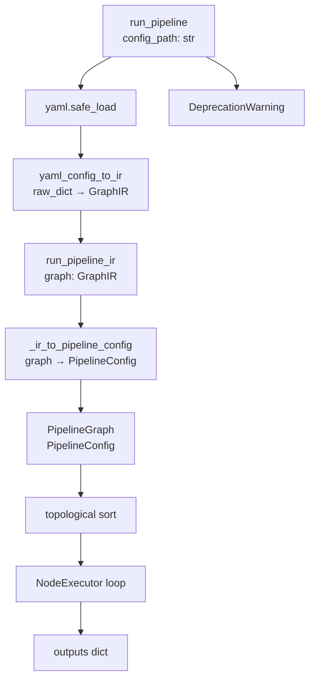
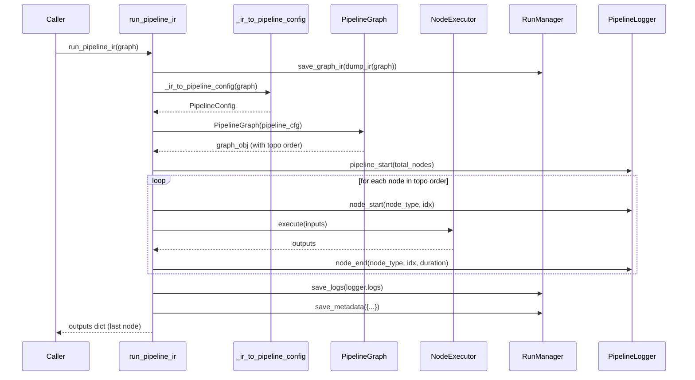

# Design 03 — Executor Wiring: run_pipeline_ir, _ir_to_pipeline_config, RunManager IR Storage

## Overview

This document covers the changes to `app/core/pipeline.py` and `app/core/run_manager.py` to wire the DAG executor to consume `GraphIR` objects natively. The existing `PipelineGraph`, `NodeExecutor`, `NodeSpec`, `EdgeSpec`, and `PipelineConfig` data structures are preserved unchanged. The NDJSON event streaming contract is fully preserved.

**Requirements addressed:** Req 3.1 – 3.8

---

## Design Rationale

### Minimal change principle

The existing `PipelineGraph` and `NodeExecutor` machinery is well-tested and correct. Rather than rewriting it, we add a thin conversion layer (`_ir_to_pipeline_config`) that maps `GraphIR` → `PipelineConfig`, then reuse the existing execution loop.

The new `run_pipeline_ir()` function is essentially the existing `run_pipeline()` body, with the YAML loading step replaced by the IR conversion step.

### Legacy shim

`run_pipeline(config_path)` becomes a shim that:
1. Reads the YAML file.
2. Converts to `GraphIR` via `yaml_config_to_ir()`.
3. Calls `run_pipeline_ir(graph, ...)`.
4. Emits a `DeprecationWarning`.

This preserves backward compatibility (Req 3.3) while routing all execution through the IR path.

---

## Data Flow



---

## `_ir_to_pipeline_config(graph: GraphIR) -> PipelineConfig`

This is a pure conversion function with no side effects. It maps the IR data structures to the existing executor data structures.

```python
def _ir_to_pipeline_config(graph: "GraphIR") -> PipelineConfig:
    """Convert a GraphIR to a PipelineConfig for use by PipelineGraph.

    Req 3.2
    """
    from app.core.ir.models import GraphIR  # type-only import at runtime

    nodes = [
        NodeSpec(
            node_id=ir_node.id,
            node_type=ir_node.node_type,
            config=dict(ir_node.config),
        )
        for ir_node in graph.nodes
    ]

    edges = [
        EdgeSpec(
            src_id=ir_edge.src_id,
            src_port=ir_edge.src_port,
            dst_id=ir_edge.dst_id,
            dst_port=ir_edge.dst_port,
        )
        for ir_edge in graph.edges
    ]

    return PipelineConfig(
        seed=graph.metadata.seed,
        nodes=nodes,
        edges=edges,
    )
```

**Correctness guarantee (Req 3.2.4):** The `PipelineConfig` produced by `_ir_to_pipeline_config` is structurally identical to the one produced by `_parse_pipeline_config` for the same graph. Both produce the same `NodeSpec` list and `EdgeSpec` list, so `PipelineGraph` will compute the same topological order.

---

## `run_pipeline_ir()` Function

The new primary execution entry point. Accepts a `GraphIR` object directly (Req 3.1.1, 3.1.2).

```python
def run_pipeline_ir(
    graph: "GraphIR",
    logger: Any = None,
    use_cache: bool = True,
    checkpoint: bool = False,
    streaming: bool = False,
    observer: NodeObserver | None = None,
    run_manager: Any = None,
) -> dict[str, Any]:
    """Execute a pipeline from a GraphIR object.

    This is the primary execution entry point for Phase 1 and beyond.
    All other entry points (run_pipeline, Pipeline.run, CLI, API) delegate here.

    Args:
        graph: A validated GraphIR object.
        logger: A PipelineLogger instance (created if not provided).
        use_cache: Whether to use PipelineCache for node outputs.
        checkpoint: Whether to write per-node checkpoints.
        streaming: Whether to use NodeExecutor.execute_stream for streaming nodes.
        observer: Optional NodeObserver passed to each node at construction.
        run_manager: Optional RunManager instance (created if not provided).

    Returns:
        The outputs dict of the final node in topological order.

    Req 3.1
    """
    from app.core.logger import PipelineLogger
    from app.core.run_manager import RunManager
    from app.core.pipeline_cache import PipelineCache
    from app.core.ir.loader import dump_ir

    # ── Logger ─────────────────────────────────────────────────────────────────
    if logger is None:
        logger = PipelineLogger()

    # ── Run manager ────────────────────────────────────────────────────────────
    if run_manager is None:
        run = RunManager()
    else:
        run = run_manager

    # ── Store IR JSON in run directory (Req 3.6.1, 3.6.2) ─────────────────────
    run.save_graph_ir(dump_ir(graph))

    # ── Convert IR → PipelineConfig ────────────────────────────────────────────
    pipeline_cfg = _ir_to_pipeline_config(graph)

    # ── Build graph ────────────────────────────────────────────────────────────
    graph_obj = PipelineGraph(pipeline_cfg, observer=observer)

    run_id = str(uuid.uuid4())
    cache = PipelineCache() if use_cache else None
    start_time = time.time()

    total_nodes = len(pipeline_cfg.nodes)
    logger.pipeline_start(total_nodes)

    # ── Setup all NodeExecutors ────────────────────────────────────────────────
    executors: dict[str, NodeExecutor] = {}
    for node_id in graph_obj.execution_order:
        exec_ = NodeExecutor(graph_obj.get_node(node_id), run_id=run_id)
        exec_.setup()
        executors[node_id] = exec_

    # ── Build incoming-edge lookup ─────────────────────────────────────────────
    incoming: dict[str, list[tuple[str, str, str]]] = defaultdict(list)
    for edge in pipeline_cfg.edges:
        incoming[edge.dst_id].append((edge.src_id, edge.src_port, edge.dst_port))

    # ── Execution loop ─────────────────────────────────────────────────────────
    node_outputs: dict[str, dict[str, Any]] = {}
    node_stats: list[dict] = []

    for idx, node_id in enumerate(graph_obj.execution_order):
        node = graph_obj.get_node(node_id)
        exec_ = executors[node_id]
        node_type = type(node).__name__

        logger.node_start(node_type, idx, total_nodes=total_nodes)
        node_start_time = time.time()

        # Assemble inputs from upstream outputs
        inputs: dict[str, Any] = {}
        for src_id, src_port, dst_port in incoming[node_id]:
            upstream_outputs = node_outputs[src_id]
            value = upstream_outputs.get(src_port)
            port = node.input_ports.get(dst_port)
            if port and port.cardinality == "multi":
                inputs.setdefault(dst_port, [])
                inputs[dst_port].append(value)
            else:
                inputs[dst_port] = value

        # Fill unconnected optional ports with None
        for port_name, port in node.input_ports.items():
            if port_name not in inputs and not port.required:
                inputs[port_name] = None

        # Cache check
        cache_hit = False
        if cache is not None:
            input_list = None
            for v in inputs.values():
                if isinstance(v, list):
                    input_list = v
                    break
            if input_list is not None:
                node_cfg_dict = pipeline_cfg.nodes[idx].config
                cache_key = cache.key(
                    node_type, node_cfg_dict, cache.input_hash(input_list)
                )
                if cache.has(cache_key):
                    cached_result = cache.load(cache_key)
                    if cached_result is not None:
                        node_outputs[node_id] = {"output": cached_result}
                        cache_hit = True
                        logger.info(f"[{idx}] {node_type} — cache hit")

        if not cache_hit:
            try:
                if streaming and node.is_streaming:
                    outputs = asyncio.run(_collect_stream(exec_, inputs))
                else:
                    outputs = exec_.execute(inputs)
            except Exception as exc:
                logger.node_error(node_type, idx, exc)
                run.save_logs(logger.logs)
                run.mark_failed(str(exc))
                raise

            node_outputs[node_id] = outputs

            # Save to cache
            if cache is not None:
                output_list = None
                for v in outputs.values():
                    if isinstance(v, list):
                        output_list = v
                        break
                if (output_list is not None and input_list is not None
                        and len(output_list) > 0
                        and hasattr(output_list[0], 'path')
                        and hasattr(output_list[0], 'sample_rate')
                        and hasattr(output_list[0], 'data')):
                    node_cfg_dict = pipeline_cfg.nodes[idx].config
                    cache_key = cache.key(
                        node_type, node_cfg_dict, cache.input_hash(input_list)
                    )
                    cache.save(cache_key, output_list)

        if checkpoint:
            _write_checkpoint(run.base_path, node_id, node_outputs[node_id])

        node_duration = time.time() - node_start_time
        _node_outputs = node_outputs[node_id]
        _output_count = 0
        for _v in _node_outputs.values():
            if isinstance(_v, list):
                _output_count = len(_v)
                break
        logger.node_end(node_type, idx, node_duration, output_count=_output_count)

        node_stats.append({
            "node_id": node_id,
            "node_type": node_type,
            "node_index": idx,
            "duration_s": round(node_duration, 4),
        })

    # ── Teardown ───────────────────────────────────────────────────────────────
    for exec_ in executors.values():
        exec_.teardown()

    total_duration = time.time() - start_time
    logger.summary()

    run.save_logs(logger.logs)
    run.save_metadata({
        "num_nodes": total_nodes,
        "node_stats": node_stats,
        "duration_s": round(total_duration, 4),
    })

    last_id = graph_obj.execution_order[-1]
    return node_outputs[last_id]
```

---

## `run_pipeline()` Shim

The existing `run_pipeline(config_path)` function becomes a shim (Req 3.3). It emits a `DeprecationWarning` and delegates to `run_pipeline_ir()`.

```python
def run_pipeline(
    config_path: str,
    logger: Any = None,
    use_cache: bool = True,
    checkpoint: bool = False,
    streaming: bool = False,
    observer: NodeObserver | None = None,
    run_manager: Any = None,
) -> dict[str, Any]:
    """Execute a pipeline from a YAML config file.

    Deprecated: use run_pipeline_ir() with a GraphIR object, or Pipeline.run() via the SDK.

    This function is preserved for backward compatibility. It converts the YAML
    config to a GraphIR via the YAML shim and delegates to run_pipeline_ir().

    Req 3.3
    """
    import warnings
    from app.core.ir.yaml_shim import yaml_config_to_ir

    warnings.warn(
        "run_pipeline() with a YAML config path is deprecated. "
        "Use run_pipeline_ir() with a GraphIR object, or Pipeline.run() via the SDK.",
        DeprecationWarning,
        stacklevel=2,
    )

    with open(config_path) as f:
        raw = yaml.safe_load(f)

    # Save the original YAML config for backward compatibility (Req 3.6.3)
    if run_manager is None:
        from app.core.run_manager import RunManager
        run_manager = RunManager()
    run_manager.save_config(yaml.dump(raw, sort_keys=False))

    # Convert YAML → GraphIR (no DeprecationWarning from yaml_config_to_ir itself)
    graph = yaml_config_to_ir(raw)

    return run_pipeline_ir(
        graph,
        logger=logger,
        use_cache=use_cache,
        checkpoint=checkpoint,
        streaming=streaming,
        observer=observer,
        run_manager=run_manager,
    )
```

**Note on double-warning (Req 3.3.4):** `yaml_config_to_ir()` does NOT emit a `DeprecationWarning` — it is a pure conversion function. Only `load_yaml_with_deprecation()` emits the warning. `run_pipeline()` emits its own warning about the function being deprecated. These are two different warnings about two different things, so there is no double-warning issue.

---

## `RunManager` Extension: `save_graph_ir()`

A new method is added to `RunManager` to store the IR JSON alongside the run metadata (Req 3.6.1, 3.6.2).

```python
# In app/core/run_manager.py

def save_graph_ir(self, graph_data: dict) -> None:
    """Write the GraphIR JSON to {run_dir}/graph.json.

    Args:
        graph_data: A JSON-serializable dict from dump_ir(graph).

    Req 3.6.1, 3.6.2
    """
    import json
    path = os.path.join(self.base_path, "graph.json")
    with open(path, "w", encoding="utf-8") as f:
        json.dump(graph_data, f, indent=2, ensure_ascii=False)
        f.write("\n")
```

The existing `save_config(config_yaml: str)` method is preserved unchanged (Req 3.6.3). When `run_pipeline()` (the shim) is called, it calls both `save_config()` (for the YAML) and `save_graph_ir()` (for the IR). When `run_pipeline_ir()` is called directly, only `save_graph_ir()` is called.

---

## Run Directory Structure After Phase 1

```
workspace/runs/{run_id}/
├── meta.json        # Run metadata (existing)
├── logs.json        # NDJSON event log (existing)
├── config.yaml      # YAML config (only when run via YAML path)
├── graph.json       # IR JSON (always present after Phase 1)
└── checkpoints/     # Per-node checkpoints (when checkpoint=True)
    └── node_{node_id}/
        ├── manifest.json
        └── *.wav
```

---

## NDJSON Event Streaming Compatibility

The event stream emitted by `run_pipeline_ir()` is identical to the current `run_pipeline()` stream (Req 3.5). The same `PipelineLogger` methods are called in the same sequence:

| Event | Method | Fields |
|---|---|---|
| `pipeline_start` | `logger.pipeline_start(total_nodes)` | `total_nodes` |
| `node_start` | `logger.node_start(node_type, idx, total_nodes)` | `node_type`, `node_index`, `total_nodes` |
| `node_end` | `logger.node_end(node_type, idx, duration, output_count)` | `node_type`, `node_index`, `duration_s`, `output_count` |
| `node_error` | `logger.node_error(node_type, idx, exc)` | `node_type`, `node_index`, `error_message` |
| `pipeline_summary` | `logger.summary()` | `total_duration_s`, `total_samples_out` |

---

## Caching Compatibility (Req 3.7)

The cache key derivation is unchanged:

```python
cache_key = cache.key(node_type, node_cfg_dict, cache.input_hash(input_list))
```

Where `node_cfg_dict` comes from `pipeline_cfg.nodes[idx].config` — the same dict that was in the YAML config, now passed through the IR. The cache key is therefore identical for equivalent graphs.

---

## Checkpoint Compatibility (Req 3.8)

The `_write_checkpoint(run_base_path, node_id, outputs)` helper is called with the same arguments as before. The `node_id` comes from `graph_obj.execution_order[idx]`, which is the `IRNode.id` (e.g. `"clean_1"`). The checkpoint directory structure is unchanged:

```
{run_dir}/checkpoints/node_{node_id}/
```

---

## Sequence Diagram: run_pipeline_ir()



---

## Error Handling

| Scenario | Behavior | Req |
|---|---|---|
| Node execution fails | `logger.node_error()`, `run.mark_failed()`, re-raise | 3.1.5 |
| Cycle in graph | `PipelineGraphError` from `PipelineGraph` | 3.4.4 |
| Unknown node type | `NodeNotFoundError` from `PipelineGraph._build()` | 3.4 |
| Invalid node config | `pydantic.ValidationError` from `PipelineGraph._build()` | 3.4 |

---

## References

- [req-03-executor-wiring.md](req-03-executor-wiring.md) — Requirements 3.1 – 3.8
- [design-01-graph-ir.md](design-01-graph-ir.md) — `GraphIR`, `IRNode`, `IREdge`
- [design-04-yaml-compat.md](design-04-yaml-compat.md) — `yaml_config_to_ir()`
- [design-06-correctness-properties.md](design-06-correctness-properties.md) — Executor equivalence property, deterministic replay property
