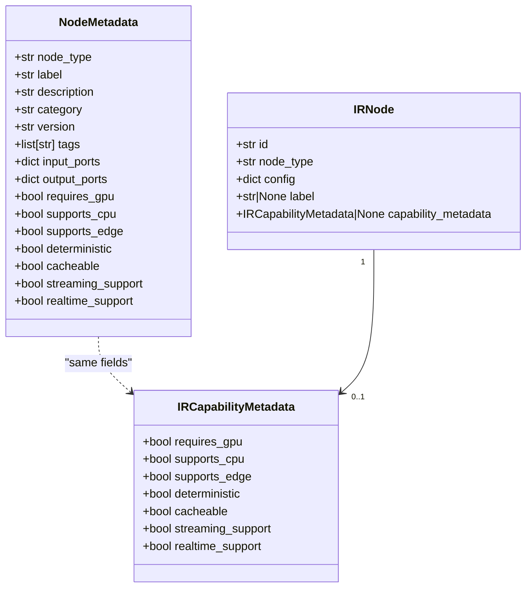

# Design 05 — Node Capability Metadata

## Overview

This document covers the extension of `NodeMetadata` with capability fields, the `IRCapabilityMetadata` model (already defined in `app/core/ir/models.py`), the `AutoDiscovery` population behavior, and the API response shape changes.

**Requirements addressed:** Req 5.1 – 5.5

---

## Design Rationale

### Backward compatibility first

The capability fields are all optional with sensible defaults. Existing node implementations that declare `metadata: ClassVar[NodeMetadata]` without capability fields will continue to work — Pydantic applies the defaults automatically (Req 5.5.1).

### Single source of truth for capability fields

The capability field definitions live in `IRCapabilityMetadata` (in `app/core/ir/models.py`). `NodeMetadata` imports and re-uses the same field definitions to avoid duplication. This ensures that `NodeMetadata` capability fields and `IRCapabilityMetadata` fields are always in sync (Req 5.2.2).

### No AutoDiscovery changes required

`AutoDiscovery` already copies all `NodeMetadata` fields to the registry. Since the new capability fields are part of `NodeMetadata`, they are automatically included in the registry without any changes to `AutoDiscovery` logic (Req 5.3.1, 5.3.2).

---

## Class Diagram



---

## Updated `app/core/nodes/metadata.py`

The capability fields are added as optional fields with defaults. The `IRCapabilityMetadata` model is NOT imported here to avoid a circular dependency — the fields are declared directly on `NodeMetadata` with the same names and defaults.

```python
# app/core/nodes/metadata.py
"""NodeMetadata — describes a node's identity, ports, and display properties."""
from __future__ import annotations

from typing import Any

from pydantic import BaseModel, ConfigDict, field_validator


class NodeMetadata(BaseModel):
    """Describes a node's identity, ports, and display properties.

    Serialisable to JSON for API responses. AutoDiscovery populates
    input_ports and output_ports from the node class if not set explicitly.

    Capability fields (Req 5.1.1) are optional with sensible defaults.
    Existing node implementations that do not declare capability fields
    will have defaults applied automatically (Req 5.5.1).
    """

    model_config = ConfigDict(arbitrary_types_allowed=True)

    # ── Identity fields (unchanged) ───────────────────────────────────────────
    node_type: str
    label: str
    description: str
    category: str
    version: str = "1.0.0"
    tags: list[str] = []

    # ── Port dicts (unchanged) ────────────────────────────────────────────────
    # Populated by AutoDiscovery from the node class's port declarations.
    input_ports: dict[str, dict[str, Any]] = {}
    output_ports: dict[str, dict[str, Any]] = {}

    # ── Capability fields (Req 5.1.1) ─────────────────────────────────────────
    # All optional with sensible defaults. Machine-readable for Phase 2 (MCP).
    requires_gpu: bool = False
    """Whether the node requires a GPU to execute."""

    supports_cpu: bool = True
    """Whether the node can execute on CPU."""

    supports_edge: bool = False
    """Whether the node is suitable for edge deployment (Phase 6 hook)."""

    deterministic: bool = True
    """Whether the node produces identical outputs for identical inputs and seed."""

    cacheable: bool = True
    """Whether the node's outputs can be safely cached."""

    streaming_support: bool = False
    """Whether the node supports streaming execution via process_stream."""

    realtime_support: bool = False
    """Whether the node can process data in real-time."""

    @field_validator("node_type", "label", "description", "category")
    @classmethod
    def _non_empty(cls, v: str) -> str:
        if not v.strip():
            raise ValueError("field must be a non-empty string")
        return v
```

---

## `IRCapabilityMetadata` (defined in `app/core/ir/models.py`)

Already defined in [design-01-graph-ir.md](design-01-graph-ir.md). Reproduced here for reference:

```python
class IRCapabilityMetadata(BaseModel):
    """Capability hints for a node instance within a specific graph.

    When set on an IRNode, these values take precedence over the node class's
    NodeMetadata capability fields for that specific instance (Req 5.2.4).
    """
    model_config = ConfigDict(frozen=True)

    requires_gpu: bool = False
    supports_cpu: bool = True
    supports_edge: bool = False
    deterministic: bool = True
    cacheable: bool = True
    streaming_support: bool = False
    realtime_support: bool = False
```

`IRCapabilityMetadata` is importable from `app.core.ir` (Req 5.2.5):

```python
from app.core.ir import IRCapabilityMetadata
```

---

## AutoDiscovery Behavior (Req 5.3)

No changes to `AutoDiscovery` are required. The existing `_register_node()` method in `app/core/nodes/discovery.py` already copies the `NodeMetadata` instance from the node class's `metadata` ClassVar to the registry. Since `NodeMetadata` now includes capability fields with defaults, the registry automatically stores them.

**Scenario 1: Node declares capability fields**

```python
class MyGPUNode(Node):
    metadata = NodeMetadata(
        node_type="my_gpu_node",
        label="My GPU Node",
        description="A node that requires a GPU",
        category="ML",
        requires_gpu=True,
        supports_cpu=False,
        deterministic=False,
    )
```

The registry stores `requires_gpu=True`, `supports_cpu=False`, `deterministic=False`, and all other fields at their defaults.

**Scenario 2: Node does not declare capability fields (existing nodes)**

```python
class CleanNode(Node):
    metadata = NodeMetadata(
        node_type="clean",
        label="Clean",
        description="Cleans audio samples",
        category="Preprocessing",
    )
```

The registry stores all capability fields at their defaults: `requires_gpu=False`, `supports_cpu=True`, `supports_edge=False`, `deterministic=True`, `cacheable=True`, `streaming_support=False`, `realtime_support=False`.

---

## Capability Resolution in the Executor

When `run_pipeline_ir()` executes a node, it resolves capability metadata in this order (Req 5.2.3, 5.2.4):

1. If `IRNode.capability_metadata` is set → use `IRCapabilityMetadata` values.
2. Otherwise → use the node class's `NodeMetadata` capability fields from the registry.

This resolution is used for future scheduling decisions (Phase 2, Phase 3). In Phase 1, the executor does not yet make scheduling decisions based on capability metadata — it simply executes all nodes. The resolution logic is implemented as a helper for future use:

```python
def _resolve_capability(
    ir_node: "IRNode",
    registry: "NodeRegistry",
) -> "IRCapabilityMetadata":
    """Resolve capability metadata for a node instance.

    Precedence: IRNode.capability_metadata > NodeMetadata capability fields.

    Req 5.2.3, 5.2.4
    """
    from app.core.ir.models import IRCapabilityMetadata

    if ir_node.capability_metadata is not None:
        return ir_node.capability_metadata

    try:
        meta = registry.get_metadata(ir_node.node_type)
        return IRCapabilityMetadata(
            requires_gpu=meta.requires_gpu,
            supports_cpu=meta.supports_cpu,
            supports_edge=meta.supports_edge,
            deterministic=meta.deterministic,
            cacheable=meta.cacheable,
            streaming_support=meta.streaming_support,
            realtime_support=meta.realtime_support,
        )
    except Exception:
        # Unknown node type — return defaults
        return IRCapabilityMetadata()
```

---

## API Response Shape (Req 5.4)

The `/api/v1/nodes` endpoint response is updated to include capability fields nested under `capability_metadata`.

### Updated `_node_response()` in `app/api/routers/nodes.py`

```python
def _node_response(node_type: str, registry) -> dict[str, Any]:
    """Build the standard node response dict for a given node_type."""
    meta = registry.get_metadata(node_type)
    return {
        "node_type": meta.node_type,
        "label": meta.label,
        "description": meta.description,
        "category": meta.category,
        "version": meta.version,
        "tags": meta.tags,
        "input_ports": meta.input_ports,
        "output_ports": meta.output_ports,
        "config_schema": registry.get_config_schema(node_type),
        # Req 5.4.1, 5.4.2
        "capability_metadata": {
            "requires_gpu": meta.requires_gpu,
            "supports_cpu": meta.supports_cpu,
            "supports_edge": meta.supports_edge,
            "deterministic": meta.deterministic,
            "cacheable": meta.cacheable,
            "streaming_support": meta.streaming_support,
            "realtime_support": meta.realtime_support,
        },
    }
```

### Example API Response

```json
{
  "node_type": "clean",
  "label": "Clean",
  "description": "Cleans audio samples",
  "category": "Preprocessing",
  "version": "1.0.0",
  "tags": [],
  "input_ports": {"input": {"name": "input", "data_type": "...", "required": true}},
  "output_ports": {"output": {"name": "output", "data_type": "..."}},
  "config_schema": {...},
  "capability_metadata": {
    "requires_gpu": false,
    "supports_cpu": true,
    "supports_edge": false,
    "deterministic": true,
    "cacheable": true,
    "streaming_support": false,
    "realtime_support": false
  }
}
```

---

## Backward Compatibility (Req 5.5)

### Existing node implementations

All existing nodes in `app/core/nodes/audio/` and `app/core/nodes/ml/` declare `NodeMetadata` without capability fields. After the `NodeMetadata` extension, these nodes will have all capability fields at their defaults. No code changes are required in any existing node implementation.

### Existing tests

Tests that construct `NodeMetadata` directly (e.g. in unit tests) will continue to work because all new fields have defaults. Tests that compare `NodeMetadata` objects via `==` will continue to work because the new fields are included in the comparison with their default values.

### Plugin compatibility (Req 5.5.3)

Plugins in `plugins/` that declare `NodeMetadata` without capability fields will have defaults applied. No plugin changes are required.

---

## Streaming Support Auto-Detection

The `streaming_support` field should reflect whether the node overrides `process_stream`. `AutoDiscovery` can auto-populate this field:

```python
# In AutoDiscovery._register_node():
# After validating metadata, auto-detect streaming support
if not meta.streaming_support:
    # Check if the node class overrides process_stream
    if cls._is_streaming():
        # Update the metadata with streaming_support=True
        # Use object.__setattr__ since NodeMetadata is not frozen
        object.__setattr__(meta, "streaming_support", True)
```

This is an optional enhancement. If not implemented, node authors can declare `streaming_support=True` explicitly in their `NodeMetadata`.

---

## References

- [req-05-node-capability-metadata.md](req-05-node-capability-metadata.md) — Requirements 5.1 – 5.5
- [design-01-graph-ir.md](design-01-graph-ir.md) — `IRCapabilityMetadata` model definition
- [design-06-correctness-properties.md](design-06-correctness-properties.md) — Capability defaults property
