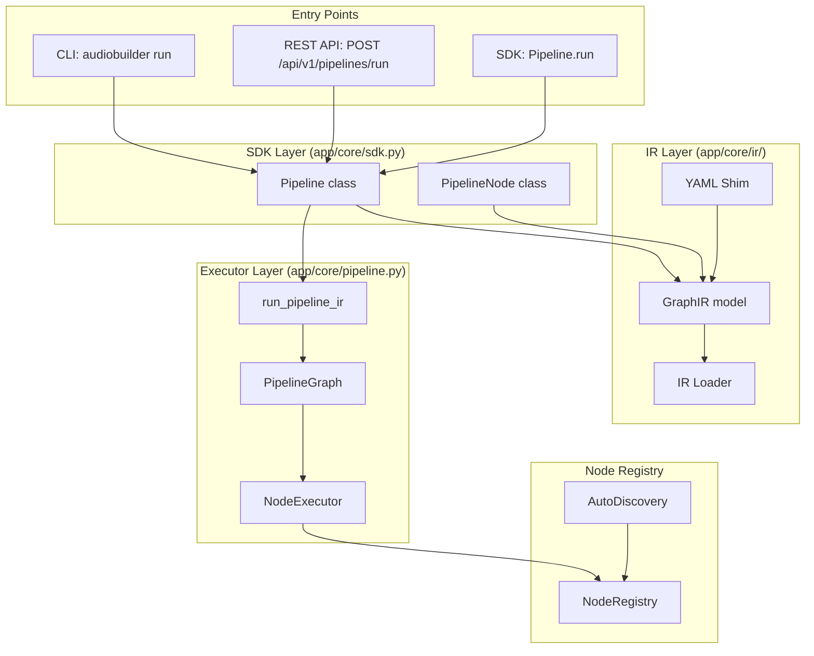
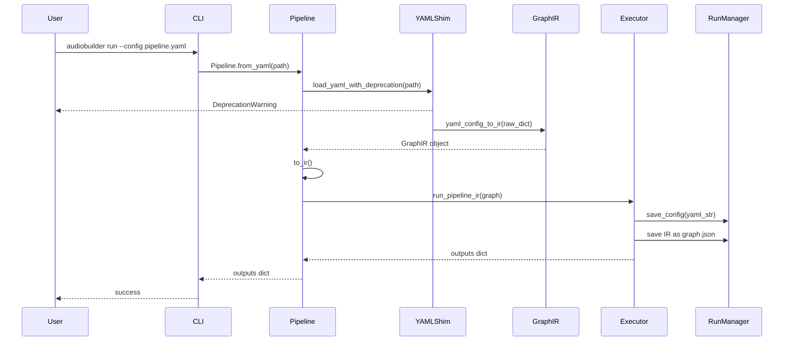
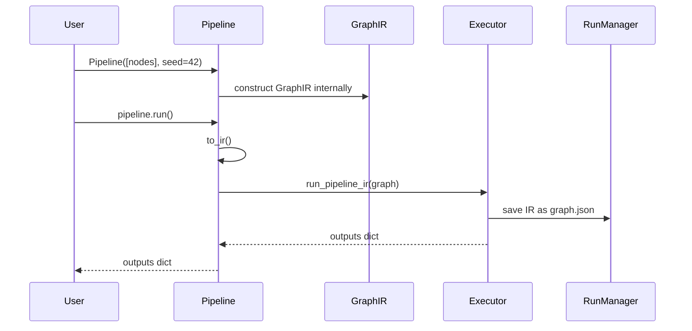

# Design Document — Graph IR + SDK Consolidation (Phase 1)

## Introduction

This is the master design document for Phase 1 of the platform evolution roadmap. Phase 1 introduces a formal **Graph Intermediate Representation (IR)** — a versioned, validated, runtime-agnostic JSON schema — and consolidates the SDK so that all interfaces delegate to a single SDK runtime backed by the IR.

The design is split into sub-documents for maintainability. Each sub-document is concrete and implementation-ready, with class signatures, method signatures, field names, module paths, and Mermaid diagrams.

---

## Design Sub-Documents

| Sub-Document | Description |
|---|---|
| [design-01-graph-ir.md](design-01-graph-ir.md) | IR module structure, Pydantic model definitions, loader functions, version validation logic |
| [design-02-sdk-consolidation.md](design-02-sdk-consolidation.md) | Pipeline/PipelineNode class internals, IR construction, from_json/to_json, to_yaml derivation from IR |
| [design-03-executor-wiring.md](design-03-executor-wiring.md) | run_pipeline_ir() function, _ir_to_pipeline_config() helper, legacy run_pipeline() shim, RunManager IR storage |
| [design-04-yaml-compat.md](design-04-yaml-compat.md) | yaml_config_to_ir() conversion logic, load_yaml_with_deprecation(), migrate.py utility, CLI migrate command |
| [design-05-node-capability-metadata.md](design-05-node-capability-metadata.md) | NodeMetadata model extension, IRCapabilityMetadata model, AutoDiscovery population, API response shape |
| [design-06-correctness-properties.md](design-06-correctness-properties.md) | All property-based tests (Hypothesis) that validate the correctness properties of the IR, SDK, and executor |

---

## Key Design Decisions

These decisions were confirmed by the user and are binding for all implementation:

1. **IR serialization: JSON only.** YAML is a converter on top. The canonical format is `.graph.json`.
2. **SDK surface: Same class names (`Pipeline`, `PipelineNode`).** Transparent migration — existing user code requires no changes. Only internals are rewritten.
3. **Phase 1 scope: IR + SDK + executor wired to IR.** No new execution modes (async, parallel, resumability) — those are Phase 3.
4. **Versioning: IR schema versioning with validation.** Loader rejects incompatible major versions. Minor version mismatches emit warnings.
5. **YAML compat: Shim with deprecation warning + migration utility.** All existing YAML configs continue to work. Users are guided to migrate via `audiobuilder migrate`.

---

## Architecture Overview



---

## Module Structure

### New Module: `app/core/ir/`

```
app/core/ir/
├── __init__.py          # Re-exports all public IR classes
├── models.py            # GraphIR, IRNode, IREdge, IRParameter, IRMetadata, IRCapabilityMetadata
├── loader.py            # load_ir(), dump_ir(), version validation, IRVersionError, IRValidationError
├── yaml_shim.py         # yaml_config_to_ir(), load_yaml_with_deprecation()
└── migrate.py           # migrate_yaml_to_ir_file()
```

### Modified Modules

- `app/core/sdk.py` — `Pipeline` and `PipelineNode` internals rewritten to be IR-backed
- `app/core/pipeline.py` — new `run_pipeline_ir()` function, `run_pipeline()` becomes a shim
- `app/core/nodes/metadata.py` — extended with capability fields
- `app/core/run_manager.py` — stores `graph.json` alongside `config.yaml`
- `app/cli/main.py` — new `migrate` command, `run` and `validate` commands updated
- `app/api/routers/pipelines.py` — endpoints updated to accept IR JSON

---

## Data Flow: YAML → IR → Execution



---

## Data Flow: SDK → IR → Execution



---

## Compatibility Contract

The following public APIs must remain unchanged:

### SDK (`app/core/sdk.py`)

```python
# PipelineNode — unchanged constructor
PipelineNode(node_type: str, config: dict[str, Any] | None = None)

# Pipeline — unchanged constructor
Pipeline(nodes: list[PipelineNode], seed: int = 42)

# Pipeline — unchanged methods
Pipeline.run() -> Any
Pipeline.from_yaml(path: str) -> Pipeline
Pipeline.to_yaml(path: str) -> None
```

### CLI (`app/cli/main.py`)

```bash
# Existing commands — unchanged
audiobuilder run --config <yaml> [--seed N]
audiobuilder validate --config <yaml>
audiobuilder runs list
audiobuilder runs logs <run_id>
```

### REST API (`app/api/routers/pipelines.py`)

```
POST /api/v1/pipelines/validate
POST /api/v1/pipelines/run
POST /api/v1/pipelines/run-async
```

All existing endpoints continue to accept YAML input. IR JSON input is added as the primary format.

---

## Testing Strategy

### Unit Tests

- IR model validation (Pydantic ValidationError cases)
- IR loader (file I/O, JSON parsing, version validation)
- YAML shim (linear format, explicit-edge format, edge cases)
- SDK (Pipeline/PipelineNode construction, to_ir(), from_json())
- Executor (run_pipeline_ir(), _ir_to_pipeline_config())

### Property-Based Tests (Hypothesis)

See [design-06-correctness-properties.md](design-06-correctness-properties.md) for the complete list of properties and their implementations.

Minimum 100 iterations per property test.

### Integration Tests

- End-to-end: YAML → IR → execution → outputs match existing behavior
- End-to-end: SDK → IR → execution → outputs match existing behavior
- CLI: `audiobuilder migrate` produces valid IR JSON
- CLI: `audiobuilder run --graph` executes IR JSON
- API: POST /api/v1/pipelines/run with IR JSON body

### Regression Tests

All 441 existing tests must pass without modification.

---

## Migration Path

### For Pipeline Authors (YAML users)

1. Continue using YAML — it works, but emits a deprecation warning
2. Run `audiobuilder migrate --config pipeline.yaml` to convert to IR JSON
3. Use `audiobuilder run --graph pipeline.graph.json` going forward

### For SDK Users

No changes required. Existing code continues to work:

```python
from app.core.sdk import Pipeline, PipelineNode

pipeline = Pipeline([
    PipelineNode("input", {"path": "workspace/datasets/input/speech"}),
    PipelineNode("clean", {"sample_rate": 16000}),
], seed=42)
pipeline.run()
```

New capability: save/load IR JSON:

```python
pipeline.to_json("pipeline.graph.json")
loaded = Pipeline.from_json("pipeline.graph.json")
```

### For API Consumers

Existing YAML-based requests continue to work. New IR JSON format is preferred:

```bash
# Old (deprecated, still works)
curl -X POST http://localhost:8001/api/v1/pipelines/run \
  -H "Content-Type: application/json" \
  -d '{"yaml": "pipeline:\n  seed: 42\n  nodes: [...]"}'

# New (canonical)
curl -X POST http://localhost:8001/api/v1/pipelines/run \
  -H "Content-Type: application/json" \
  -d '{"schema_version": "1.0", "metadata": {...}, "nodes": [...], "edges": [...]}'
```

---

## Implementation Order

1. **IR models** (`design-01-graph-ir.md`) — foundation for everything else
2. **IR loader** (`design-01-graph-ir.md`) — serialization/deserialization
3. **YAML shim** (`design-04-yaml-compat.md`) — conversion logic
4. **SDK rewrite** (`design-02-sdk-consolidation.md`) — IR-backed internals
5. **Executor wiring** (`design-03-executor-wiring.md`) — run_pipeline_ir()
6. **Capability metadata** (`design-05-node-capability-metadata.md`) — NodeMetadata extension
7. **CLI updates** (`design-04-yaml-compat.md`) — migrate command, --graph flag
8. **API updates** (`design-04-yaml-compat.md`) — IR JSON input
9. **Property tests** (`design-06-correctness-properties.md`) — validation

---

## Success Criteria

- [ ] All 441 existing tests pass
- [ ] All property-based tests pass (100+ iterations each)
- [ ] All existing YAML examples execute successfully
- [ ] SDK examples execute without modification
- [ ] CLI commands work with both YAML and IR JSON
- [ ] REST API accepts both YAML and IR JSON
- [ ] `audiobuilder migrate` produces valid IR JSON
- [ ] IR round-trip: `load_ir(dump_ir(g)) == g`
- [ ] SDK round-trip: `Pipeline.from_json(p.to_json_path()) == p`
- [ ] Executor equivalence: same graph → same outputs (deterministic nodes)

---

## Non-Goals (Deferred to Future Phases)

- Async execution runtime (Phase 3)
- Parallel execution (Phase 3)
- Resumability (Phase 3)
- Conditional branching (Phase 3)
- MCP layer (Phase 2)
- Agent-native architecture (Phase 2)
- Provenance layer (Phase 4)
- Plugin ecosystem (Phase 5)
- Edge AI deployment (Phase 6)

---

## References

- [requirements.md](requirements.md) — master requirements document
- [req-01-graph-ir.md](req-01-graph-ir.md) — IR requirements
- [req-02-sdk-consolidation.md](req-02-sdk-consolidation.md) — SDK requirements
- [req-03-executor-wiring.md](req-03-executor-wiring.md) — executor requirements
- [req-04-yaml-compat.md](req-04-yaml-compat.md) — YAML compat requirements
- [req-05-node-capability-metadata.md](req-05-node-capability-metadata.md) — capability metadata requirements
- [req-06-roadmap.md](req-06-roadmap.md) — full 6-phase roadmap
