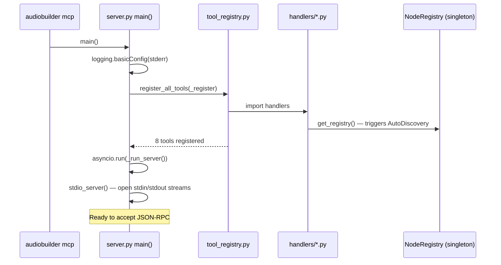

# Design 01 — MCP Server, Auth, and CLI Entry Point

## Overview

This sub-document covers:
- The MCP server process (`app/mcp/server.py`)
- The auth middleware (`app/mcp/auth.py`)
- The tool registry wiring (`app/mcp/tool_registry.py`)
- The `__main__.py` entry point
- The `audiobuilder mcp` CLI subcommand

---

## 1. Package Layout

```
app/mcp/
├── __init__.py          # empty
├── __main__.py          # python -m app.mcp.server
├── server.py            # MCP server: startup, stdio loop, dispatch
├── auth.py              # check_auth() middleware
├── tool_registry.py     # register_all_tools(server)
└── handlers/
    ├── __init__.py
    ├── discovery.py
    ├── graph.py
    ├── execution.py
    └── artifacts.py
```

---

## 2. `app/mcp/__main__.py`

```python
# app/mcp/__main__.py
"""Entry point: python -m app.mcp.server"""
from app.mcp.server import main

if __name__ == "__main__":
    main()
```

---

## 3. `app/mcp/auth.py`

```python
# app/mcp/auth.py
"""Token authentication middleware for MCP tool invocations.

Req 1.9, 1.10, 8.9
"""
from __future__ import annotations

import os
from typing import Any


_TOKEN = os.environ.get("GRAPHYN_API_TOKEN", "")


def check_auth(arguments: dict[str, Any]) -> dict[str, Any] | None:
    """Validate the auth token in the tool arguments.

    Returns None if auth passes (or is not configured).
    Returns a structured error dict if auth fails.

    The token is expected at arguments["_meta"]["auth_token"].
    This mirrors the MCP _meta convention for out-of-band metadata.

    Req 1.9: token required when GRAPHYN_API_TOKEN is set.
    Req 1.10: no auth required when GRAPHYN_API_TOKEN is unset/empty.
    """
    if not _TOKEN:
        return None  # auth not configured — allow all

    provided = (arguments or {}).get("_meta", {}).get("auth_token", "")
    if provided != _TOKEN:
        return {
            "error": True,
            "error_type": "unauthorized",
            "message": (
                "Authentication required. Provide the API token in "
                "_meta.auth_token."
            ),
        }
    return None
```

**Design notes:**
- `_TOKEN` is read once at module import time. This matches the REST API pattern in `app/api/main.py`.
- The `_meta` field is the MCP convention for per-invocation metadata that is not part of the tool's declared input schema.
- Returning `None` on success keeps the hot path allocation-free.

---

## 4. `app/mcp/server.py`

```python
# app/mcp/server.py
"""MCP server — stdio transport, tool dispatch, structured logging.

Req 1.1–1.11
"""
from __future__ import annotations

import asyncio
import json
import logging
import os
import sys
from typing import Any

import mcp.server.stdio
import mcp.types as types
from mcp.server.lowlevel import NotificationOptions, Server
from mcp.server.models import InitializationOptions

from app.mcp.auth import check_auth
from app.mcp.tool_registry import register_all_tools

log = logging.getLogger(__name__)

# ── Server instance ────────────────────────────────────────────────────────────

_server = Server("audiobuilder-mcp")

# ── Tool registration ──────────────────────────────────────────────────────────

_TOOLS: dict[str, dict] = {}  # name → {description, inputSchema, handler}


def _register(
    name: str,
    description: str,
    input_schema: dict[str, Any],
    handler,
) -> None:
    """Register a tool handler. Called by tool_registry.py at startup."""
    _TOOLS[name] = {
        "description": description,
        "inputSchema": input_schema,
        "handler": handler,
    }


# ── MCP protocol handlers ──────────────────────────────────────────────────────

@_server.list_tools()
async def handle_list_tools() -> list[types.Tool]:
    """Return the tool manifest (Req 1.2)."""
    return [
        types.Tool(
            name=name,
            description=info["description"],
            inputSchema=info["inputSchema"],
        )
        for name, info in _TOOLS.items()
    ]


@_server.call_tool()
async def handle_call_tool(
    name: str,
    arguments: dict[str, Any],
) -> list[types.TextContent]:
    """Dispatch a tool invocation (Req 1.4, 1.7, 1.9, 1.11)."""
    # ── Auth check ─────────────────────────────────────────────────────────────
    auth_error = check_auth(arguments)
    if auth_error is not None:
        log.info("tool=%s outcome=unauthorized", name)
        return [types.TextContent(type="text", text=json.dumps(auth_error))]

    # ── Unknown tool ───────────────────────────────────────────────────────────
    if name not in _TOOLS:
        error = {
            "error": True,
            "error_type": "unknown_tool",
            "message": f"Tool '{name}' is not registered.",
            "available_tools": sorted(_TOOLS.keys()),
        }
        log.info("tool=%s outcome=unknown_tool", name)
        return [types.TextContent(type="text", text=json.dumps(error))]

    # ── Dispatch ───────────────────────────────────────────────────────────────
    handler = _TOOLS[name]["handler"]
    try:
        result = await asyncio.get_event_loop().run_in_executor(
            None, lambda: handler(arguments)
        )
        log.info("tool=%s outcome=success", name)
        return [types.TextContent(type="text", text=json.dumps(result))]
    except Exception as exc:
        error = {
            "error": True,
            "error_type": type(exc).__name__,
            "message": str(exc),
        }
        log.info("tool=%s outcome=error error_type=%s", name, type(exc).__name__)
        return [types.TextContent(type="text", text=json.dumps(error))]


# ── Startup ────────────────────────────────────────────────────────────────────

def _startup() -> None:
    """Register all tools. Exit with code 1 on any registration failure (Req 1.3)."""
    try:
        register_all_tools(_register)
    except Exception as exc:
        log.error("Tool registration failed: %s", exc, exc_info=True)
        sys.exit(1)

    log.info(
        "MCP server started — %d tools registered: %s",
        len(_TOOLS),
        sorted(_TOOLS.keys()),
    )


# ── Main ───────────────────────────────────────────────────────────────────────

async def _run_server() -> None:
    async with mcp.server.stdio.stdio_server() as (read_stream, write_stream):
        await _server.run(
            read_stream,
            write_stream,
            InitializationOptions(
                server_name="audiobuilder-mcp",
                server_version="2.0.0",
                capabilities=_server.get_capabilities(
                    notification_options=NotificationOptions(),
                    experimental_capabilities={},
                ),
            ),
        )


def main() -> None:
    """Entry point for `python -m app.mcp.server` and `audiobuilder mcp`."""
    logging.basicConfig(
        level=logging.INFO,
        format="%(asctime)s %(levelname)s %(name)s %(message)s",
        stream=sys.stderr,  # Req 1.11: log to stderr, not stdout (stdout = JSON-RPC)
    )
    _startup()
    asyncio.run(_run_server())


if __name__ == "__main__":
    main()
```

**Design notes:**
- All tool handlers are synchronous Python functions. They are dispatched via `run_in_executor(None, ...)` so the asyncio event loop is never blocked.
- Logging goes to `stderr` (Req 1.11). `stdout` is reserved for JSON-RPC framing.
- The `_TOOLS` dict is populated at startup by `register_all_tools`. If any registration raises, the process exits with code 1 (Req 1.3).

---

## 5. `app/mcp/tool_registry.py`

```python
# app/mcp/tool_registry.py
"""Registers all MCP tools on the server instance.

Req 1.1, 1.2, 1.7
"""
from __future__ import annotations

from typing import Callable, Any


def register_all_tools(register: Callable) -> None:
    """Import all handlers and register them.

    Args:
        register: The _register() function from server.py.
                  Signature: (name, description, input_schema, handler) -> None
    """
    from app.mcp.handlers.discovery import (
        list_nodes_handler,
        LIST_NODES_SCHEMA,
        LIST_NODES_DESCRIPTION,
    )
    from app.mcp.handlers.graph import (
        generate_graph_handler,
        validate_graph_handler,
        get_graph_schema_handler,
        get_graph_capability_summary_handler,
        get_event_schema_handler,
        GENERATE_GRAPH_SCHEMA,
        VALIDATE_GRAPH_SCHEMA,
        GET_GRAPH_SCHEMA_SCHEMA,
        GET_GRAPH_CAPABILITY_SUMMARY_SCHEMA,
        GET_EVENT_SCHEMA_SCHEMA,
        GENERATE_GRAPH_DESCRIPTION,
        VALIDATE_GRAPH_DESCRIPTION,
        GET_GRAPH_SCHEMA_DESCRIPTION,
        GET_GRAPH_CAPABILITY_SUMMARY_DESCRIPTION,
        GET_EVENT_SCHEMA_DESCRIPTION,
    )
    from app.mcp.handlers.execution import (
        execute_pipeline_handler,
        EXECUTE_PIPELINE_SCHEMA,
        EXECUTE_PIPELINE_DESCRIPTION,
    )
    from app.mcp.handlers.artifacts import (
        inspect_run_handler,
        INSPECT_RUN_SCHEMA,
        INSPECT_RUN_DESCRIPTION,
    )

    register("list_nodes",                    LIST_NODES_DESCRIPTION,                    LIST_NODES_SCHEMA,                    list_nodes_handler)
    register("generate_graph",                GENERATE_GRAPH_DESCRIPTION,                GENERATE_GRAPH_SCHEMA,                generate_graph_handler)
    register("validate_graph",                VALIDATE_GRAPH_DESCRIPTION,                VALIDATE_GRAPH_SCHEMA,                validate_graph_handler)
    register("get_graph_schema",              GET_GRAPH_SCHEMA_DESCRIPTION,              GET_GRAPH_SCHEMA_SCHEMA,              get_graph_schema_handler)
    register("get_graph_capability_summary",  GET_GRAPH_CAPABILITY_SUMMARY_DESCRIPTION,  GET_GRAPH_CAPABILITY_SUMMARY_SCHEMA,  get_graph_capability_summary_handler)
    register("get_event_schema",              GET_EVENT_SCHEMA_DESCRIPTION,              GET_EVENT_SCHEMA_SCHEMA,              get_event_schema_handler)
    register("execute_pipeline",              EXECUTE_PIPELINE_DESCRIPTION,              EXECUTE_PIPELINE_SCHEMA,              execute_pipeline_handler)
    register("inspect_run",                   INSPECT_RUN_DESCRIPTION,                   INSPECT_RUN_SCHEMA,                   inspect_run_handler)
```

---

## 6. CLI Entry Point — `audiobuilder mcp`

The only change to an existing file is adding a `mcp` subcommand to `app/cli/main.py`.

```python
# Addition to app/cli/main.py — new subcommand

def cmd_mcp(args):
    """Launch the MCP server (stdio transport)."""
    import subprocess
    import sys
    result = subprocess.run(
        [sys.executable, "-m", "app.mcp.server"],
        stdin=sys.stdin,
        stdout=sys.stdout,
        stderr=sys.stderr,
    )
    sys.exit(result.returncode)

# In build_parser():
mcp_parser = subparsers.add_parser(
    "mcp",
    help="Start the MCP server (stdio transport)",
    description=(
        "Start the AudioBuilder MCP server. "
        "Reads JSON-RPC from stdin, writes responses to stdout. "
        "Set GRAPHYN_API_TOKEN to require authentication."
    ),
)
mcp_parser.set_defaults(func=cmd_mcp)
```

**Alternatively**, `cmd_mcp` can call `main()` directly from `app.mcp.server` to avoid a subprocess:

```python
def cmd_mcp(args):
    """Launch the MCP server (stdio transport) in-process."""
    from app.mcp.server import main
    main()
```

The in-process variant is preferred because it avoids a subprocess fork and shares the already-populated `NodeRegistry` singleton.

---

## 7. Startup Sequence



---

## 8. Structured Logging Format

All tool invocations are logged to `stderr` at INFO level (Req 1.11):

```
2025-01-15 12:34:56 INFO app.mcp.server tool=list_nodes outcome=success
2025-01-15 12:34:57 INFO app.mcp.server tool=execute_pipeline outcome=success
2025-01-15 12:34:58 INFO app.mcp.server tool=unknown_tool outcome=unknown_tool
2025-01-15 12:34:59 INFO app.mcp.server tool=list_nodes outcome=unauthorized
```

The format reuses the existing `logging.basicConfig` pattern from the platform. No separate logging mechanism is introduced (Req 6.7).
