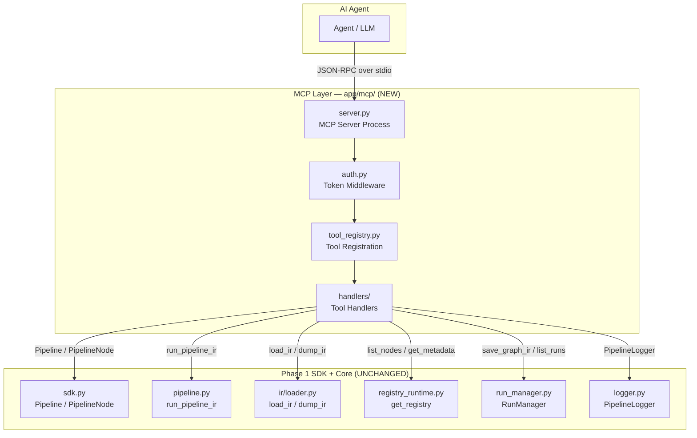
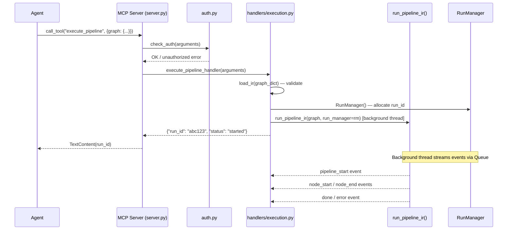
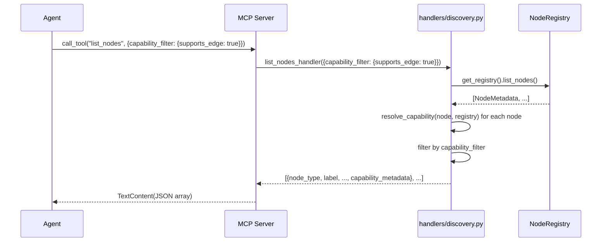

# Design Document — MCP + Agent-Native Architecture (Phase 2)

## Introduction

This is the master design document for Phase 2 of the six-phase platform evolution roadmap. Phase 2 introduces a **Model Context Protocol (MCP) server** as a first-class interface, making the platform natively operable by AI agents. The MCP layer is a thin delegation shell — all business logic remains in the Phase 1 SDK and core components.

The design is split into sub-documents for maintainability. Each sub-document is concrete and implementation-ready, with class signatures, method signatures, tool schemas, and Mermaid diagrams.

---

## Design Sub-Documents

| Sub-Document | Description |
|---|---|
| [design-01-server-and-auth.md](design-01-server-and-auth.md) | MCP server process, stdio transport, tool registry, auth middleware, CLI entry point |
| [design-02-node-discovery.md](design-02-node-discovery.md) | `list_nodes` tool, capability filtering, port-type compatibility, schema export |
| [design-03-graph-tools.md](design-03-graph-tools.md) | `generate_graph`, `validate_graph`, `get_graph_schema`, `get_graph_capability_summary` tools |
| [design-04-execution-and-artifacts.md](design-04-execution-and-artifacts.md) | `execute_pipeline` tool, NDJSON event streaming, `inspect_run` artifact tool |
| [design-05-correctness-properties.md](design-05-correctness-properties.md) | All property-based tests (Hypothesis) validating MCP tool correctness |

---

## Key Design Decisions

1. **Thin delegation only.** Every MCP tool handler is ≤ 30 lines. All logic delegates to `run_pipeline_ir()`, `Pipeline`/`PipelineNode`, `load_ir()`, `get_registry()`, or `RunManager`. No business logic lives in `app/mcp/`.
2. **Low-level MCP server.** The design uses `mcp.server.lowlevel.Server` with `mcp.server.stdio.stdio_server()` for maximum control over tool registration, error framing, and auth injection — matching the requirements' structured error response contract.
3. **Synchronous execution in a thread.** `execute_pipeline` launches `run_pipeline_ir()` in a `ThreadPoolExecutor` background thread and returns `run_id` within 500 ms. Event streaming is delivered via a `queue.Queue` bridged to the MCP response.
4. **Auth via `_meta.auth_token`.** When `GRAPHYN_API_TOKEN` is set, every `call_tool` invocation checks `arguments.get("_meta", {}).get("auth_token")` before dispatching. Unset token = no auth required.
5. **Zero Phase 1 file modifications.** `app/mcp/` only imports from Phase 1 modules. No `app/core/` file is touched.
6. **`audiobuilder mcp` CLI entry point.** Added as a new subcommand in `app/cli/main.py` that calls `python -m app.mcp.server`. This is the only change to an existing file.

---

## Architecture Overview



---

## Module Structure

```
app/mcp/
├── __init__.py              # Empty — marks package
├── __main__.py              # python -m app.mcp.server entry point
├── server.py                # MCP server: startup, stdio loop, tool dispatch
├── auth.py                  # Token auth middleware (check_auth)
├── tool_registry.py         # Registers all tools on the Server instance
└── handlers/
    ├── __init__.py
    ├── discovery.py         # list_nodes tool handler
    ├── graph.py             # generate_graph, validate_graph, get_graph_schema,
    │                        #   get_graph_capability_summary tool handlers
    ├── execution.py         # execute_pipeline tool handler + event bridge
    └── artifacts.py         # inspect_run tool handler
```

---

## MCP Tool Catalogue

| Tool Name | Handler Module | Delegates To | Req |
|---|---|---|---|
| `list_nodes` | `handlers/discovery.py` | `get_registry()` | 2.1–2.11 |
| `generate_graph` | `handlers/graph.py` | `Pipeline`, `PipelineNode`, `load_ir` | 3.1–3.5, 3.10 |
| `validate_graph` | `handlers/graph.py` | `load_ir()` | 3.6–3.9, 3.11 |
| `get_graph_schema` | `handlers/graph.py` | `GraphIR.model_json_schema()` | 3.13, 7.5 |
| `get_graph_capability_summary` | `handlers/graph.py` | `get_registry()`, `_resolve_capability()` | 7.7–7.9 |
| `execute_pipeline` | `handlers/execution.py` | `run_pipeline_ir()`, `RunManager` | 4.1–4.14 |
| `inspect_run` | `handlers/artifacts.py` | `RunManager` workspace paths | 5.1–5.12 |
| `get_event_schema` | `handlers/graph.py` | static schema dict | 7.6 |

---

## Data Flow: Agent → MCP → Execution



---

## Data Flow: Agent → Node Discovery



---

## Error Response Contract

All MCP tool handlers return structured JSON errors (never raw exceptions):

```json
{
  "error": true,
  "error_type": "unknown_node_type",
  "message": "Node type 'foo' is not registered.",
  "available_types": ["input", "clean", "split", "export"]
}
```

The `error_type` values map directly to requirement error codes:

| `error_type` | Trigger |
|---|---|
| `unknown_tool` | Unregistered tool name called |
| `unauthorized` | Missing/wrong `_meta.auth_token` |
| `unknown_node_type` | Node type not in registry |
| `invalid_filter_key` | Unknown capability filter key |
| `invalid_direction` | Port direction not `"input"` or `"output"` |
| `ir_validation_error` | `load_ir()` / Pydantic validation failure |
| `invalid_node_config` | Node config fails Pydantic validation |
| `unknown_run_id` | Run directory does not exist |
| `artifact_not_found` | Specific artifact file missing |
| `checkpoint_not_found` | Node checkpoint directory missing |

---

## Backward Compatibility Contract

- `app/core/pipeline.py` — **not modified**
- `app/core/sdk.py` — **not modified**
- `app/core/ir/models.py` — **not modified**
- `app/core/ir/loader.py` — **not modified**
- `app/api/` — **not modified**
- `app/cli/main.py` — **one addition only**: new `mcp` subcommand that calls `python -m app.mcp.server`
- All 421 Phase 1 tests — **must pass unchanged**

---

## Correctness Properties

*A property is a characteristic or behavior that should hold true across all valid executions of a system — essentially, a formal statement about what the system should do. Properties serve as the bridge between human-readable specifications and machine-verifiable correctness guarantees.*

The MCP layer is a thin delegation shell. Most of its correctness is guaranteed by the Phase 1 tests. The properties below focus on the **cross-interface consistency** and **filtering correctness** that are unique to the MCP layer.

Property-based testing (Hypothesis) is used for properties where input variation reveals edge cases. Example-based tests are used for specific behaviors and error branches.

### Property 1: Category filter correctness

*For any* category string provided to `list_nodes`, all returned nodes SHALL have a `category` field exactly equal to the provided string.

**Validates: Requirements 2.3**

### Property 2: Capability filter correctness

*For any* capability filter dict (with valid keys and boolean values) provided to `list_nodes`, all returned nodes SHALL have capability metadata satisfying every key-value pair in the filter.

**Validates: Requirements 2.4, 7.2, 7.3, 7.4**

### Property 3: Node discovery consistency

*For any* node type registered in the NodeRegistry, the `capability_metadata` returned by `list_nodes` SHALL be field-for-field identical to the `capability_metadata` returned by `GET /api/v1/nodes` for the same node type.

**Validates: Requirements 2.11**

### Property 4: Graph generation round-trip

*For any* valid node list, the GraphIR document produced by `generate_graph` SHALL satisfy `load_ir(dump_ir(graph)).model_dump(mode="json") == graph_dict`.

**Validates: Requirements 3.12**

### Property 5: Validation and execution consistency

*For any* GraphIR document for which `validate_graph` returns `valid: true`, the `execute_pipeline` tool SHALL accept the document and return a `run_id` without returning a validation error.

**Validates: Requirements 4.14**

### Property 6: Run inspection exception safety

*For any* run ID returned by `inspect_run`'s list operation, a subsequent invocation of `inspect_run` with that `run_id` SHALL return a dict containing either run metadata or a structured error — it SHALL NOT raise an unhandled exception.

**Validates: Requirements 5.11**

### Property 7: Capability summary consistency

*For any* GraphIR document, the `any_requires_gpu`, `all_support_cpu`, `all_support_edge`, and `all_deterministic` values returned by `get_graph_capability_summary` SHALL equal the values computed by applying the two-step resolution rule to each node's capability metadata as returned by `list_nodes` for the same node types.

**Validates: Requirements 7.9**

---

## Testing Strategy

### Unit Tests

- Auth middleware: token present/absent/wrong
- Each tool handler: valid inputs, all error branches
- Capability resolution: IRNode override vs. NodeMetadata fallback
- Event schema: static document structure
- Workspace path resolution: `GRAPHYN_PROJECT_DIR` env var

### Property-Based Tests (Hypothesis)

The property-based testing library is **Hypothesis** (already used in Phase 1 tests).

Properties 1–7 above are implemented as Hypothesis tests in `tests/mcp/test_properties.py`. Each test runs a minimum of 100 iterations.

Tag format: `# Feature: mcp-agent-native, Property {N}: {property_text}`

See [design-05-correctness-properties.md](design-05-correctness-properties.md) for the complete test implementations.

### Integration Tests

- End-to-end: `list_nodes` returns same data as `GET /api/v1/nodes`
- End-to-end: `generate_graph` → `validate_graph` → `execute_pipeline` → `inspect_run`
- Auth: token-gated server rejects unauthenticated calls
- Non-regression: all 421 Phase 1 tests pass after Phase 2 implementation

---

## Implementation Order

1. `app/mcp/__init__.py`, `__main__.py` — package scaffolding
2. `app/mcp/auth.py` — token middleware
3. `app/mcp/server.py` — server startup, stdio loop
4. `app/mcp/tool_registry.py` — tool registration wiring
5. `app/mcp/handlers/discovery.py` — `list_nodes`
6. `app/mcp/handlers/graph.py` — `generate_graph`, `validate_graph`, `get_graph_schema`, `get_graph_capability_summary`, `get_event_schema`
7. `app/mcp/handlers/execution.py` — `execute_pipeline`
8. `app/mcp/handlers/artifacts.py` — `inspect_run`
9. `app/cli/main.py` — add `mcp` subcommand
10. `tests/mcp/` — unit + property tests

---

## References

- [requirements.md](requirements.md) — Phase 2 requirements
- [design-01-server-and-auth.md](design-01-server-and-auth.md)
- [design-02-node-discovery.md](design-02-node-discovery.md)
- [design-03-graph-tools.md](design-03-graph-tools.md)
- [design-04-execution-and-artifacts.md](design-04-execution-and-artifacts.md)
- [design-05-correctness-properties.md](design-05-correctness-properties.md)
- Phase 1: [../graph-ir-sdk-consolidation/design.md](../graph-ir-sdk-consolidation/design.md)
