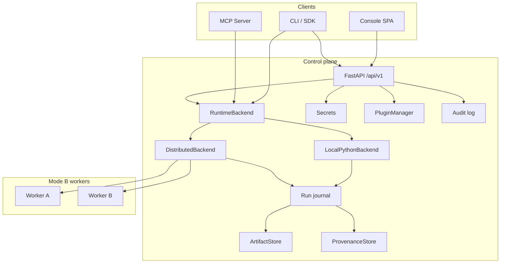

# Graphyn — Software Requirements Specification (Standalone Greenfield SRS)

| Field | Value |
|---|---|
| **Title** | Graphyn Standalone Greenfield Software Requirements Specification — Contract Closure |
| **Document ID** | GRAPHYN-SRS-001 |
| **Version** | **1.2.0 Draft — Contract Closure** |
| **Date** | 2026-09-18 (Asia/Calcutta) |
| **Status** | Draft — contract-closure SRS (P0 APIs, SDK/CLI, SM, repro, NFRs) |
| **Document author** | Samir Kumar Mishra \<samir.nmiet@gmail.com\> |
| **Audience** | Product managers, engineers, QA, agent implementers building Graphyn freshly |

## 1. Document control

This document is the **sole normative Software Requirements Specification** for Graphyn when building the product from a greenfield codebase. It embeds product vision, architecture, data model, Graph IR, **build-contract REST/MCP/CLI contracts**, console UX, runtime state machines, persistence guarantees, distributed execution, plugin lifecycle, security/threat model, operational procedures, journeys, and acceptance criteria **inline**. A new team SHALL implement **P0 requirements that this document fully contracts** using only this document plus ordinary engineering judgment — **without reading any other repository guide**. Residual gaps (Settings UX detail, device API shape, RBAC taxonomy, measurable GA perf numbers still labeled TBD-PERF-*) are listed in §32 / Appendix F and **shall not** be invented by implementers as if specified.

**Change history**

| Version | Date | Notes |
|---|---|---|
| 1.0.0 Draft | 2026-09-18 | Standalone greenfield rewrite: all product facts folded in; zero outbound doc references; Priority P0/P1/P2 only (target product, not tip status) |
| 1.1.0 Draft — Complete Build-Ready | 2026-09-18 | Upgrade to build-contract SRS: normative REST field tables, error envelope, run state machine, distributed P0 failure behavior, persistence, graph validation model, plugin lifecycle/security, model↔pipeline env lineage, Ship package model, dataset version semantics, MCP parity expansion for J1–J6, audit/provenance schemas, threat-model requirements, operational contracts, broadened acceptance matrix, Completeness Review |
| 1.2.0 Draft — Contract Closure | 2026-09-18 | Contract closure: expand compressed P0 REST to equal-precision contracts; normative Python SDK + CLI; executable schemas for worker resources / run metrics / params / pipeline environments; authoritative run Current×Action transition table (failed/cancelled/succeeded resume = NO); Prove pillar provenance/repro capture set; Ship package lifecycle states; performance NFR structure with PROVISIONAL / TBD-PERF-* (no fake product numbers); Completeness Review honesty + Appendix F closed-gaps summary |

**Conventions**

- Requirements use RFC 2119 **shall** / **should** / **may**.
- Every requirement has a unique ID (`FR-*`, `UX-*`, `NFR-*`, `SEC-*`, `RT-*`, `DIST-*`, `MR-*`, `PLG-*`, `MCP-*`, `EDGE-*`, `DATA-*`, `OBS-*`, `QA-*`, `DM-*`, `IR-*`, `API-*`, `CLI-*`, `ARCH-*`, `J-*`, `VAL-*`, `PERS-*`, `OPS-*`, `SHIP-*`, `AUD-*`, `THREAT-*`).
- **Priority only:** **P0** · **P1** · **P2**. This is the **target product**, not tip status.
- **UI noun:** **Workspace** everywhere in the console. API wire fields may use `project` (Project = Workspace, one entity).
- Tables + numbered SHALL requirements preferred.
- **Independence:** zero outbound references to other repository markdown files (no relative sibling-doc hyperlinks).

**Normative vs informative**

| Kind | Meaning |
|---|---|
| **SHALL / MUST** tables & state machines | Build contract |
| **SHOULD** | Strong default; deviation needs rationale |
| **MAY** | Optional; not blocking greenfield P0 |
| Mermaid / examples | Informative; field tables win on conflict |

---

## 2. Purpose, scope, assumptions, constraints
### 2.1 Purpose

**FR-DOC-001** (P0) This SRS **shall** specify Graphyn as one control plane where humans and AI agents design typed DAG workflows, train/evaluate models, place work on the right machines, package for edge, and **always** answer: *what ran, where, with which data/code, and who/what triggered it?*

Graphyn’s product identity is the combination of six pillars in **one** product (not five glued apps):

| Pillar | Analogy | Meaning (inline) |
|---|---|---|
| **Design** | n8n | Visual + IR-native Editor, plugins as nodes, templates, triggers, human-in-the-loop |
| **Learn** | MLflow | Runs, metrics, artifacts, experiments, model registry, compare/promote |
| **Execute** | Orchestrator | Typed DAG execution, waves, resume, cache, distributed workers |
| **Ship** | Edge Impulse | Collect → train → optimize → package → deploy to edge/device runtimes |
| **Collaborate** | Agentic / MCP | Agents build/run/debug graphs via MCP + UI; secrets never in IR |
| **Prove** | Accountability | Provenance, replay, actor trail, backtrack any artifact to graph+run+inputs |

**Operating principles (normative intent)**

1. **Graph IR is canonical** — Console, agents, CLI, and SDK all speak the same graph.
2. **Everything meaningful is a run or an artifact** — if you cannot point to a `run_id` / `artifact_id`, it did not happen.
3. **Agents are first-class users** — MCP parity with UI capabilities where listed; never embed secrets in graphs.
4. **Placement is explicit** — local / GPU worker / edge capability is part of the graph story (Mode A honesty vs Mode B).
5. **Backtrack before blame** — lineage and replay beat screenshots and tribal knowledge.

### 2.2 In scope

- Console SPA: every navigable surface, chrome, routing, Cmd-K, settings
- REST API (`/api/v1/`), CLI, Python SDK, MCP server
- Runtime: Graph IR, LocalPython + Distributed backends, pause/cancel/resume, cache, checkpoints, provenance, artifacts
- Plugins, secrets, schedules/webhooks, model registry, datasets/ingest
- Ship/edge packaging (and device loop when device APIs exist)
- Security/trust, observability/audit, non-functionals, quality gates
- End-to-end journeys J1–J6

### 2.3 Out of scope (named for clarity; also listed in §25)

- Generic chat-only LLM product without Graph IR
- Replacing Kubernetes (workers/backends may *use* K8s later as optional scale)
- Audio-only product identity (audio is a plugin pack, not the brand)
- Full multi-tenant IdP / SSO as a shipped requirement of v1 (Access UI may stub; future requirement documented)
- Cursor cloud / external cloud-agent product features
- Inventing a second Project type (Decision B locked: Project = Workspace)

### 2.4 Assumptions

| ID | Assumption |
|---|---|
| A-001 | Operators are trusted on a single-tenant shared-bearer deployment unless multi-user auth is later added |
| A-002 | Desktop browsers (Chrome/Edge/Firefox latest-2) are the primary console clients |
| A-003 | Workspace filesystem roots (`GRAPHYN_PROJECT_DIR` / `workspace/`) and platform home (`GRAPHYN_HOME`) are writable by the API process |
| A-004 | Mode A (single process) is the default; Mode B requires operator-started workers with shared bearer |
| A-006 | Persistence may be files or DB; §16 guarantees apply equally |
| A-005 | Plugin authors follow the plugin package contract; untrusted multi-tenant plugin execution needs future isolation beyond AST filters |

### 2.5 Constraints

| ID | Constraint |
|---|---|
| C-001 | Path URLs only for console navigation — no hash routing as product navigation |
| C-002 | Secrets **shall never** appear in Graph IR, URLs, or logs |
| C-003 | API field name `project` may appear on the wire; UI **shall** say Workspace |
| C-004 | Stable IDE rail structure is locked (§10) — strip vs groups must not morph |
| C-005 | Hostnames of lab boxes are deployment detail, not product requirements |
| C-007 | Zero outbound refs from this SRS to other repository markdown files |
| C-006 | Pickle deserialization is same-trust-plane only (distributed blobs / isolated plugins) |
---

## 3. Glossary
| Term | Definition | Is not |
|---|---|---|
| **Workspace** | Project context owning pipelines, runs, linked datasets, models, ship packages. **UI term.** | Dataset-only folder |
| **Project** | Same entity as Workspace; **API/query wire name** (`project`, `/projects`) | A second entity type |
| **Home** | Workspace home surface (`/workspaces/:id`) | Global picker only |
| **Editor** | Graph IR canvas (Builder) | Raw route ids in chrome |
| **Runs** | Execution History + Live + Compare | The Editor **Run** button |
| **Run outputs** | Per-run downloadable files under a run | Datasets or Artifacts library |
| **Artifacts** | Cross-run content-addressed registry / ids | Run outputs panel |
| **Datasets** | Shared Inputs/Outputs under `workspace/datasets` | Run downloads |
| **Models** | Registry versions + stages (`latest` / `staging` / `prod`) | Raw trainer blobs until registered |
| **Ship** | Edge package wizard + devices | Worker fleet |
| **Agent inbox** | Graph proposals + generate/review | Chat-only LLM product |
| **Lineage** | Backtrack chain (under Runs or artifact Trace) | Separate daily-nav peer on the strip |
| **Triggers / Always-on** | Schedule / webhook / event attached to a graph | One-shot Editor Run |
| **Graph IR** | Canonical versioned JSON DAG (`schema_version` **1.2**) | UI-only canvas state |
| **Mode A** | `LocalPython` backend — nodes run in API/control process | Requires workers |
| **Mode B** | `GRAPHYN_BACKEND=distributed` + registered workers | Edge packaging |
| **Actor** | Identity string on mutations (`X-Actor` header) | Full OIDC user (future) |
| **Route** | Path URL under HTML5 History API | Hash fragment `#/...` |
| **Plugin** | Installable package (`plugin.toml`) registering node types | Ad-hoc pasted Python without registry |
| **Node** | Typed processing unit with ports + config schema | Untyped script block without ports |
| **Wave** | Parallel-safe set of nodes from level BFS after topo sort | Arbitrary batch |
| **Placement** | Per-node routing hint (`IRPlacement`) for Mode B | Mode A requirement |
| **Provenance** | Record linking artifact → node → run → inputs | Merely a filename |
| **Proposal** | Agent-suggested Graph IR awaiting human accept/reject | Auto-applied graph without gate |
| **Secret** | Named credential in platform secret store | Value embedded in IR |
| **Worker** | Mode B process that claims jobs and executes nodes | Edge device |
| **Switch** | Single control to change/clear active workspace (sidebar strip only) | Dual header+sidebar switchers |
---
| **Ship package** | Deployable edge bundle with manifest, checksums, model version refs | Worker fleet |
| **Job** | Unit of remote work (one node execution) in Mode B | Entire pipeline run |
| **Lease** | Time-bounded claim on a job; renewed by heartbeat | Permanent ownership |
| **Error envelope** | Canonical JSON error body (§9.0) | Ad-hoc string-only errors |
| **ETag / resource_version** | Optimistic concurrency token | Soft advisory only |
| **Dataset version** | Immutable content-addressed snapshot under datasets/output | Mutable input label folder |


## 4. Stakeholders / personas
| Persona | Goals | Primary surfaces |
|---|---|---|
| **ML / workflow engineer** | Design graphs, run, compare, promote models | Editor, Runs, Models, Home |
| **Data engineer** | Ingest/upload datasets, version, link to workspace | Datasets, Home links |
| **Edge / embed engineer** | Package models for device runtimes | Ship, Models, Runs lineage |
| **Platform / ops** | Health, workers, schedules, cleanup, secrets | Ops, Workers, Secrets |
| **AI agent (MCP)** | Propose/validate/execute graphs with human gate | MCP + Agent inbox + Editor |
| **Reviewer / auditor** | Backtrack any artifact to graph+run+actor | Lineage, Audit, Access |
| **Product owner** | Journeys J1–J6 complete without leaving Graphyn | All |
---

## 5. Goals & success criteria
### 5.1 Goals

1. One product for Design · Learn · Execute · Ship · Collaborate with AI · Prove.
2. Graph IR is canonical across UI, API, CLI, MCP.
3. Everything meaningful is a **run** or **artifact** with lineage.
4. Agents are first-class users; secrets never embedded in IR or URLs.
5. Placement is explicit (Mode A honesty vs Mode B workers).
6. A greenfield team can implement from this SRS alone.

### 5.2 Success metrics (measurable)

| ID | Metric | Target | Pri |
|---|---|---|---|
| SM-001 | Time to first successful run via Templates | ≤ 10 minutes (P0 path) | P0 |
| SM-002 | Artifact → graph Trace | ≤ 2 clicks | P0 |
| SM-003 | Share run lineage URL | Opens same run lineage (path URL, no hash) | P0 |
| SM-004 | Model staging → prod without CLI | 100% via Models UI when APIs available | P0 |
| SM-005 | Agent proposal → saved pipeline | ≤ 3 clicks after review | P1 |
| SM-006 | Always-on failure → failed run | ≤ 2 clicks from Home | P1 |
| SM-007 | E2E smoke login → run → lineage path | Green in CI | P0 |
| SM-008 | Journeys J1–J6 | Completable by human **and** MCP agent without leaving Graphyn | P0 |

---


## 6. System context & architecture

### 6.1 Logical context

```
Humans (Console SPA) ─┐
CLI / Python SDK ─────┼──► FastAPI /api/v1 ──► RuntimeBackend
MCP agents (stdio) ───┘         │                 ├── LocalPythonBackend (Mode A)
                                │                 └── DistributedBackend (Mode B + workers)
                                ▼
              Run journal · ArtifactStore · ProvenanceStore · Secrets · Plugins · Audit
```

**ARCH-001** (P0) All interfaces (Console, CLI, SDK, MCP, REST) **shall** execute graphs through a single canonical entry: `get_backend().execute(graph, ...)`.

**ARCH-002** (P0) The system **shall** expose backend mode honestly in readiness (`backend_mode`) and a console Mode chip.

**ARCH-003** (P0) Mode A empty Workers **shall not** present as an error state.

### 6.2 Component catalog (responsibilities & trust boundaries)

| Component | Responsibility | Trust boundary |
|---|---|---|
| **Console SPA** | Path-routed Web IDE; Workspace-first chrome; calls REST with Bearer + `X-Actor` | Browser; token in Settings (localStorage interim); never put secrets in URLs/IR |
| **API (FastAPI)** | REST `/api/v1/*`; auth gate; routers for nodes, pipelines, runs, projects, plugins, secrets, workers, jobs, proposals, models, data, ingest, system, trace, audit, experiments | Control plane; holds bearer secret; fail-closed when auth required |
| **Runtime LocalPython** | Default backend; orchestrator waves; NodeExecutor; cache; checkpoints; conditions | Same process as API (Mode A) |
| **Runtime Distributed** | Wave scheduler; placement; job queue; blob transfer; hydrate outputs on control plane | Control plane + workers sharing bearer |
| **Workers** | Register/heartbeat; claim jobs; execute nodes; upload `output_refs`; stream events | Same bearer as API; semi-trusted pickle outputs → RestrictedUnpickler on host |
| **Plugin packages** | `plugin.toml` + entry points; register node types / port types | Install allowlist when auth required; isolated vs inprocess runtime |
| **ArtifactStore** | Content-addressed blobs; index; download/replay | Bearer holders can read all (single-tenant) |
| **ProvenanceStore** | Lineage records per artifact / by run | Append + query; never raise on missing → error nodes |
| **Secrets store** | Named files under `GRAPHYN_HOME/secrets` (0700/0600) | Names via API; values only via in-process `resolve_secret()` |
| **MCP server** | Stdio JSON-RPC tools (~28–29) mirroring core agent ops | Same token policy; `accept_proposal` gated by human-approval flag |
| **CLI / SDK** | `graphyn` CLI + Python `Pipeline` / `get_backend()` | Operator machine; same IR |



### 6.3 Mode A vs Mode B

| | Mode A (default) | Mode B |
|---|---|---|
| Backend | LocalPython | `GRAPHYN_BACKEND=distributed` |
| Who runs nodes | API process / single box | Control plane + workers by labels/GPU/pool |
| Workers UI | Empty is OK (honest copy + CLI) | Live heartbeats, stale, labels, GPU |
| Placement IR | Optional; **ignored** with honesty badge | Routes GPU / pool / pin work |
| Cross-machine data | N/A | `artifact://` URIs + blob put/get |

**ARCH-004** (P0) `DistributedBackend.execute()` **shall** compute waves from Graph IR, place each node, run local via NodeExecutor or enqueue remote jobs, materialize inputs as refs, hydrate outputs on the control plane.

**ARCH-005** (P1) All-local graphs in Mode B **may** short-circuit to LocalPython behavior.

### 6.4 Workspace layout (filesystem)

Conceptual roots (env-configurable):

| Path | Role |
|---|---|
| `GRAPHYN_HOME` (default `~/.graphyn/`) | Secrets, plugin registry/installed/venvs, durable worker/job state |
| `GRAPHYN_PROJECT_DIR` (default `workspace/`) | Runs, artifacts, datasets, templates |
| `workspace/datasets/input/{label}/` | Dataset inputs |
| `workspace/datasets/output/{project}/` | Dataset outputs + **pipelines** + versions |
| `workspace/runs/{run_id}/` | `meta.json`, `graph.json`, logs, checkpoints |
| `workspace/artifacts/` | Content-addressed artifacts + distributed blobs |
| `workspace/artifacts/_registry/models.json` | Model registry lite |

**ARCH-006** (P0) Dataset and export paths **shall** be jailed under workspace roots (symlink policy: resolve and reject escapes unless explicitly allowed for Docker layouts).

### 6.5 Interface summary

- REST `/api/v1/*` (Bearer when configured)
- MCP stdio JSON-RPC
- Console SPA (path routes; reverse-proxy SPA fallback for non-`/api` paths)
- Static mounts for datasets / run files (same bearer policy when token set)
- CLI: validate, run, migrate, worker, mcp, plugin ops
- SDK: build Graph IR / Pipeline nodes; `get_backend().execute()`

---


## 7. Domain data model

Enough fields to implement. Types are conceptual JSON/Python; persistence may be files or DB.

### 7.1 Workspace (API: Project)

| Field | Type | Notes |
|---|---|---|
| `name` / `id` | string | Stable id; URL segment `:workspaceId`; API `{name}` |
| `display_name` | string | Optional |
| `description` | string | Optional |
| `created_at` / `updated_at` | ISO-8601 | |
| `tags` | string[] | Optional |
| `linked_input_labels` | string[] | Dataset input pins |
| `favorite_pipelines` | string[] | Home pins |
| `spec` / `taxonomy` / `contract` | object | Dataset workspace metadata (optional advanced) |

**DM-WS-001** (P0) UI **shall** label this entity **Workspace**; API paths **may** remain `/api/v1/projects/{name}`.

### 7.2 Pipeline

| Field | Type | Notes |
|---|---|---|
| `name` | string | Unique within workspace |
| `draft` | Graph IR | Head file `pipelines/{name}.graph.json` |
| `versions[]` | `{ version: "vN", graph, message, created_at, actor }` | Snapshots |
| `environments` | object | See below |
| `project` | string | Owning workspace wire name |

**Environments object — executable schema (P0)**

```json
{
  "$id": "graphyn.pipeline.environments",
  "type": "object",
  "additionalProperties": false,
  "required": ["draft", "staging", "prod", "pending_prod"],
  "properties": {
    "draft": {
      "type": "object",
      "description": "Always present editable head metadata (not a version pointer)",
      "required": ["updated_at"],
      "properties": {
        "updated_at": {"type": "string", "format": "date-time"},
        "resource_version": {"type": "string"},
        "graph_hash": {"type": ["string", "null"]}
      }
    },
    "staging": {"type": ["string", "null"], "description": "version id e.g. v3 or null"},
    "prod": {"type": ["string", "null"]},
    "pending_prod": {"type": ["string", "null"], "description": "version awaiting approve; null when none"}
  }
}
```

**Null rules (normative):** `staging`/`prod`/`pending_prod` **shall** be `null` when unset (not omitted). `draft` **shall never** be null. Setting `prod` **shall** clear `pending_prod` to null atomically.

**DM-PIPE-001** (P0) Publish **shall** create `vN` and optionally set staging.  
**DM-PIPE-002** (P0) Promote to prod **shall** require explicit approve.  
**DM-PIPE-003** (P0) Rollback **shall** copy a version onto draft.

### 7.3 Graph IR (summary — normative detail in §8)

Top-level: `schema_version`, `metadata`, `nodes[]`, `edges[]`, optional `parameters`.

### 7.4 Run

| Field | Type | Notes |
|---|---|---|
| `run_id` | string | ASCII alphanumeric |
| `status` | enum | `pending` \| `running` \| `paused` \| `succeeded` \| `failed` \| `cancelled` (alias `active`→`in-progress` for legacy clients) |
| `project` | string \| null | Workspace scope |
| `pipeline` | string \| null | Optional |
| `env` | `draft`\|`staging`\|`prod` \| null | Scheduled default `prod` |
| `graph_hash` | string | Hash of saved Graph IR |
| `started_at` / `ended_at` | ISO-8601 | |
| `actor` | string | Who/what triggered |
| `backend_mode` | string | `local_python` \| `distributed` |
| `distributed_node_workers` | map | node_id → worker_id (Mode B) |
| `metrics` | object | See §7.16 executable schema — values **shall** be numbers |
| `params` | object | See §7.16 — allowed JSON types only |
| `error` | string \| object \| null | Failure detail |

### 7.5 Artifact

| Field | Type | Notes |
|---|---|---|
| `artifact_id` | string | `^[A-Za-z0-9_-]+$` |
| `content_hash` | string | SHA-256 |
| `artifact_type` | string | e.g. `audio_samples`, `model`, JSON fallback |
| `node_id` / `node_type` | string | Producer |
| `run_id` | string | |
| `data_path` | string | Relative under artifacts store |
| `created_at` | ISO-8601 | |

### 7.6 Provenance

| Field | Type | Notes |
|---|---|---|
| `artifact_id` | string | |
| `run_id` | string | |
| `node_id` / `node_type` | string | |
| `input_artifact_ids` | string[] | Upstream |
| `graph_hash` | string | |
| `plugin_versions` | object | Optional freeze |
| `worker_id` | string \| null | Mode B |
| `actor` | string \| null | |

### 7.7 Model registry entry

| Field | Type | Notes |
|---|---|---|
| `name` | string | Model key |
| `stages` | object | `latest` / `staging` / `prod` → `{ run_id, slug, version?, updated_at }` |
| `pending_prod` | object \| null | Request awaiting approve |
| `project` | string \| null | Optional workspace scope |

### 7.8 Dataset labels / versions

| Concept | Fields |
|---|---|
| **Input label** | `label`, `path` under `datasets/input/{label}`, file listing, size |
| **Output project/version** | `project`, `version`, stats, files under `datasets/output/{project}/{version}` |
| **Merge** | source labels/versions → new target project/version |

### 7.9 Schedule

| Field | Type | Notes |
|---|---|---|
| `id` | string | |
| `project` | string | Workspace |
| `pipeline` | string | |
| `env` | string | Default `prod` for scheduled |
| `interval_s` or `cron` | number \| string | Cron honesty if not fully durable |
| `enabled` | bool | |
| `last_run_id` / `last_error` / `last_tick_at` | | Always-on strip |

### 7.10 Webhook

| Field | Type | Notes |
|---|---|---|
| `url` | string | Outbound; block private/loopback |
| `events` | string[] | e.g. terminal run states |
| `secret_name` | string \| null | HMAC via secrets store — never inline |

### 7.11 Proposal

| Field | Type | Notes |
|---|---|---|
| `id` | string | |
| `status` | `pending`\|`accepted`\|`rejected` | |
| `graph` | Graph IR | Proposed |
| `base_graph` | Graph IR \| null | Optional diff base |
| `message` / `rationale` | string | |
| `actor` | string | Agent id |
| `project` / `pipeline` | string \| null | Bind |
| `created_at` / `resolved_at` | ISO-8601 | |
| `reject_reason` | string \| null | |

### 7.12 Secret

| Field | Type | Notes |
|---|---|---|
| `name` | string | Listed only |
| `value` | string | Write-only; never returned by list/get |
| `updated_at` | ISO-8601 | Metadata only |

### 7.13 Worker

| Field | Type | Notes |
|---|---|---|
| `worker_id` | string | |
| `labels` | string[] | e.g. `gpu`, `lab` |
| `pools` | string[] | |
| `resources` | object | See §7.16 WorkerResources schema |
| `plugins` | string[] | Advertised node types |
| `graphyn_version` | string | |
| `heartbeat_at` | ISO-8601 | Stale ~45s |
| `status` | `idle`\|`busy`\|`stale` | |

### 7.14 Actor

| Field | Type | Notes |
|---|---|---|
| `actor_id` | string | Sent as `X-Actor` |
| `kind` | `human`\|`agent`\|`system` | UI chips |
| `display` | string | Optional |

**DM-ACT-001** (P1) Mutations **shall** accept `X-Actor` and persist on audit/run metadata when provided.

### 7.15 Job (Mode B)

| Field | Type | Notes |
|---|---|---|
| `job_id` | string | |
| `run_id` / `node_id` / `node_type` | string | |
| `config` | object | |
| `seed` | int | |
| `input_refs` | map port→`artifact://…` | |
| `placement` | IRPlacement | |
| `timeout_s` | number | |
| `status` | enum | |
| `output_refs` | map | On complete |
| `worker_id` | string | |
| `error` | string \| null | |

---


### 7.16 Executable schemas for formerly-loose objects (P0)

**DM-SCHEMA-001** (P0) The following JSON Schema fragments **shall** be enforced on write (REST body / SDK / worker register) and echoed on read. Unknown keys **shall** be rejected (`additionalProperties: false`) unless noted.

#### WorkerResources

```json
{
  "$id": "graphyn.worker.resources",
  "type": "object",
  "additionalProperties": false,
  "required": ["cpus", "memory_mib"],
  "properties": {
    "cpus": {"type": "number", "exclusiveMinimum": 0},
    "memory_mib": {"type": "integer", "minimum": 1},
    "gpu": {"type": "integer", "minimum": 0, "description": "GPU count; 0 if none"},
    "gpu_name": {"type": ["string", "null"]},
    "vram_mib_total": {"type": ["integer", "null"], "minimum": 0},
    "vram_mib_free": {"type": ["integer", "null"], "minimum": 0}
  }
}
```

| Field | Mandatory | Notes |
|---|---|---|
| `cpus` | YES | Logical CPU capacity advertised |
| `memory_mib` | YES | Host RAM MiB |
| `gpu` | NO (default 0) | Count |
| `gpu_name` | NO | e.g. `NVIDIA RTX 4090` |
| `vram_mib_total` / `vram_mib_free` | NO | Required when `gpu` ≥ 1 |

#### RunMetrics

```json
{
  "$id": "graphyn.run.metrics",
  "type": "object",
  "additionalProperties": {"type": "number"},
  "properties": {
    "loss": {"type": "number"},
    "accuracy": {"type": "number"},
    "f1": {"type": "number"},
    "latency_ms": {"type": "number"},
    "throughput_samples_s": {"type": "number"},
    "duration_s": {"type": "number"}
  }
}
```

Known keys above are **optional**; any additional key **shall** still have a **number** value (not string/object/array/bool/null). Empty object `{}` is valid.

#### RunParameters

```json
{
  "$id": "graphyn.run.params",
  "type": "object",
  "additionalProperties": {
    "type": ["string", "number", "boolean", "null", "array", "object"]
  }
}
```

Nested objects/arrays **shall** be JSON-serializable and **shall not** contain secret-shaped keys with non-empty values (same IR secret policy). Binary blobs **shall not** be stored in `params` (use artifacts).

#### PipelineEnvironments

See §7.2 — schema id `graphyn.pipeline.environments`.

---

## 8. Graph IR specification (normative)

### 8.1 Top-level required keys

**IR-001** (P0) A Graph IR document **shall** be JSON with:

| Key | Required | Type | Rules |
|---|---|---|---|
| `schema_version` | YES | string | `"1.0"` \| `"1.1"` \| `"1.2"`; current write target **`"1.2"`** |
| `metadata` | YES | object | See §8.2 |
| `nodes` | YES | array | May be empty for draft; Run disabled when empty in UI |
| `edges` | YES | array | May be empty |
| `parameters` | NO | object | Graph-level parameters |

**IR-002** (P0) Major version mismatch **shall** hard-fail (`IRVersionError`). Minor version greater than supported **should** warn and continue. Loaders **shall** accept `1.0`/`1.1` with defaults (`placement=null`, missing condition/event_trigger).

**IR-003** (P0) YAML as authoring format is **deprecated**; systems **may** convert YAML→IR once with deprecation warning. New APIs **shall** accept Graph IR JSON.

### 8.2 Metadata

| Field | Required | Type | Notes |
|---|---|---|---|
| `name` | YES | string | Pipeline display/name |
| `seed` | NO | int | Default 0; drives node seed derivation |
| `description` | NO | string | |
| `project` | NO | string | Stamped on save to workspace pipeline |

### 8.3 Node shape (`IRNode`)

| Field | Required | Type | Notes |
|---|---|---|---|
| `id` | YES | string | Unique within graph |
| `node_type` | YES | string | Registry key |
| `config` | NO | object | Validated against node config schema; **no secret values** |
| `capability_metadata` | NO | object | Per-instance override |
| `placement` | NO | object | IR 1.2; Mode B |
| `event_trigger` | NO | object | Event-driven sources |
| `ui` | NO | object | Canvas position `{x,y}` — non-semantic for execution |
| `labels` | NO | string[] | Free tags — **shall** round-trip on load/save |

**IRCapabilityMetadata**

| Field | Default | Type |
|---|---|---|
| `requires_gpu` | false | bool |
| `supports_cpu` | true | bool |
| `supports_edge` | false | bool |
| `deterministic` | true | bool |
| `cacheable` | true | bool |
| `streaming_support` | false | bool |
| `realtime_support` | false | bool |

**Two-step capability resolution:** if `capability_metadata` set → use it; else registry `NodeMetadata`.

**IRPlacement (1.2)**

| Field | Default | Meaning |
|---|---|---|
| `mode` | `"auto"` | `auto` \| `local` \| `worker` \| `pool` |
| `worker` | null | Pin worker id when `mode=worker` |
| `pool` | null | Logical pool |
| `tags` | `[]` | e.g. `["gpu"]` |
| `require_gpu` | false | Hard constraint |
| `min_vram_mib` | null | Hard VRAM floor |

**Resolution order (Mode B):** explicit `worker` → `pool` → tags + capability → least-loaded eligible → fail closed if none.

### 8.4 Edge shape (`IREdge`)

| Field | Required | Type | Notes |
|---|---|---|---|
| `src_id` | YES | string | Source node id |
| `src_port` | YES | string | Output port name |
| `dst_id` | YES | string | Dest node id |
| `dst_port` | YES | string | Input port name |
| `condition` | NO | string | Safe expression; skip/branch when false |

**IR-004** (P0) Condition evaluator **shall** whitelist AST: comparisons, boolean ops, `len()`, `output["key"]` only — no arbitrary code.

**IR-005** (P0) Load/save through Console/API **shall** preserve `condition`, `event_trigger`, `labels`, `parameters`, `placement` (no silent strip).

### 8.5 Ports (runtime / catalogue — not stored fully in IR)

Nodes declare ports in code/registry:

| Port field | Notes |
|---|---|
| `name` | Port id |
| `data_type` | PortDataType or collection |
| `required` | Input ports |
| `cardinality` | `single` \| `multi` |

Edges validated by CompatibilityChecker at graph build.

### 8.6 Example (normative shape)

```json
{
  "schema_version": "1.2",
  "metadata": {"name": "my-pipeline", "seed": 42, "description": "", "project": "demo"},
  "nodes": [
    {
      "id": "cond_0",
      "node_type": "audio_conditioner",
      "config": {"sample_rate": 16000},
      "placement": {"mode": "auto", "tags": [], "require_gpu": false}
    },
    {
      "id": "seg_0",
      "node_type": "segmenter",
      "config": {"mode": "vad"}
    }
  ],
  "edges": [
    {
      "src_id": "cond_0",
      "src_port": "output",
      "dst_id": "seg_0",
      "dst_port": "input",
      "condition": null
    }
  ]
}
```

### 8.7 Secret policy in IR

**IR-006** (P0) Validate **shall** fail closed when `config` contains non-empty secret-shaped keys (`api_key`, `token`, `password`, `hmac_secret`, `*_secret`, …). Use Secrets store names or `*_env` fields instead.

### 8.8 Artifact refs (distributed)

Remote nodes exchange ports as `artifact://{store}/{key}` / `input_refs` / `output_refs`. Blob bytes live under distributed blob storage with HTTP put/get via control API.

---


## 9. External interfaces: REST, MCP, CLI/SDK

### 9.0 REST conventions (normative — build contract)

**API-CONV-001** (P0) Base prefix **shall** be `/api/v1`. Content-Type `application/json` unless multipart upload or binary download.

**API-CONV-002** (P0) All authenticated endpoints **shall** accept `Authorization: Bearer <token>` when `GRAPHYN_API_TOKEN` is set. Fail-closed when `GRAPHYN_AUTH_REQUIRED=1` or `GRAPHYN_ENV` ∈ {`production`,`prod`,`staging`}.

**API-CONV-003** (P0) Mutations **shall** accept optional `X-Actor` (string, max 256 chars) and persist it on audit/run metadata when provided.

**API-CONV-004** (P0) Idempotent creates/mutations that are retry-safe **shall** accept `Idempotency-Key` header (ASCII, 1–128 chars). Replays with the same key + same body **shall** return the original status/body; same key + different body **shall** return **409** with `error.code=idempotency_conflict`.

**API-CONV-005** (P0) Resources that support concurrent writers (pipeline draft, schedule, webhook config, secret metadata, ship package status) **shall** support optimistic concurrency via one of:
- `If-Match: "<etag>"` / response `ETag` header, or
- body/query `resource_version` (integer or opaque string echoed from GET).
Mismatch **shall** return **412** (If-Match) or **409** with `error.code=version_conflict`.

#### 9.0.1 Error envelope schema

**API-ERR-001** (P0) Every non-2xx JSON response from `/api/v1/*` **shall** use this envelope (FastAPI `detail` string **may** additionally appear for legacy clients, but `error` object is normative):

```json
{
  "error": {
    "code": "string_snake_case",
    "message": "human-readable summary",
    "detail": "optional longer explanation",
    "field_errors": [{"field": "path.to.field", "message": "…", "code": "optional"}],
    "request_id": "opaque correlation id",
    "resource": {"type": "run|pipeline|artifact|…", "id": "…"},
    "retryable": false
  }
}
```

| Field | Required | Type | Rules |
|---|---|---|---|
| `error.code` | YES | string | Stable machine code (`not_found`, `validation_failed`, `conflict`, `forbidden`, `unauthorized`, `precondition_failed`, `idempotency_conflict`, `version_conflict`, `invalid_transition`, `secret_in_ir`, `worker_stale`, …) |
| `error.message` | YES | string | Safe for UI toast; **shall not** contain secret values |
| `error.detail` | NO | string | Extra context |
| `error.field_errors` | NO | array | For 422 validation |
| `error.request_id` | YES | string | Matches response header `X-Request-Id` when set |
| `error.resource` | NO | object | When applicable |
| `error.retryable` | YES | bool | Client guidance |

**Standard status codes**

| Code | When |
|---|---|
| 200 | Success with body |
| 201 | Created |
| 204 | Success no body |
| 400 | Malformed request / invalid id shape |
| 401 | Missing/invalid bearer |
| 403 | Authenticated but forbidden operation |
| 404 | Resource not found |
| 409 | Conflict (state, idempotency, duplicate) |
| 412 | Precondition failed (If-Match) |
| 422 | Schema / Graph IR / config validation failed |
| 429 | Rate limited (optional; if used, include `Retry-After`) |
| 500 | Unexpected server error (`retryable` true only if safe) |
| 503 | Not ready (readiness false / disk-full / store unavailable) |

**Forbidden API behaviors**

| ID | Forbidden | Pri |
|---|---|---|
| API-FORBID-001 | Returning secret **values** in any list/get response | P0 |
| API-FORBID-002 | Echoing submitted secret values in 422 `input` fields on secrets routes | P0 |
| API-FORBID-003 | Silent empty list when index is corrupted (must 503 or quarantine error) | P0 |
| API-FORBID-004 | Accepting Graph IR that embeds non-empty secret-shaped config keys | P0 |
| API-FORBID-005 | Committing new artifacts for a run after cancel is acknowledged | P0 |
| API-FORBID-006 | Claiming a job without CAS / lease fencing | P0 |
| API-FORBID-007 | Cross-tenant data via path traversal (`../`) | P0 |

#### 9.0.2 Pagination, filter, sort (list endpoints)

**API-PAGE-001** (P0) List endpoints **shall** support:

| Query | Type | Default | Notes |
|---|---|---|---|
| `limit` | int | 50 | Max 500 (artifacts/runs max 1000 where noted) |
| `offset` | int | 0 | Or `cursor` opaque string — pick one per resource; document below |
| `sort` | string | resource default | `field` or `-field` (desc) |
| `q` | string | — | Free-text where applicable |

**List response envelope**

```json
{
  "items": [],
  "total": 0,
  "limit": 50,
  "offset": 0,
  "next_offset": null
}
```

Resources that historically returned bare arrays **shall** accept `?envelope=1` (P0) and **should** migrate default to envelope (P1). Bare array remains allowed for nodes catalogue until P1.

### 9.1 Auth (all `/api/v1` unless noted)

| Mode | When | Behaviour |
|---|---|---|
| Unauthenticated-dev | Token unset and auth not required | Local single-user only |
| Shared bearer | `GRAPHYN_API_TOKEN` set | `Authorization: Bearer <token>` |
| Fail-closed | `GRAPHYN_AUTH_REQUIRED=1` or `GRAPHYN_ENV` in {production,prod,staging} | Empty token rejected |

Always unauthenticated: `GET /`, `GET /health` (liveness). Static mounts use same bearer when token set.

**API-AUTH-001** (P0) Mutations **shall** accept `X-Actor` for audit.

### 9.2 Resource contracts (field-level)

Base prefix: `/api/v1`. Error envelope section 9.0. List pagination section 9.0.2 unless noted.

#### 9.2.1 Workspaces / projects

Wire name: `project`. UI: Workspace.

##### `GET /projects`

| Query | Type | Required | Notes |
|---|---|---|---|
| limit | int | NO | default 50 |
| offset | int | NO |  |
| q | string | NO | name search |
| sort | string | NO | name or -updated_at |

| Response field | Type | Notes |
|---|---|---|
| items[] | object | Project summary |
| total | int |  |
| limit | int |  |
| offset | int |  |

| Status | When |
|---|---|
| 200 | OK |
| 401 | Unauthorized |

##### `POST /projects`

| Request header | Required | Notes |
|---|---|---|
| Idempotency-Key | NO | Recommended |

| Body field | Type | Required | Notes |
|---|---|---|---|
| name | string | YES | slug id |
| display_name | string | NO |  |
| description | string | NO |  |
| tags | string[] | NO |  |

| Response field | Type | Notes |
|---|---|---|
| name | string |  |
| display_name | string |  |
| created_at | ISO-8601 |  |

| Status | When |
|---|---|
| 201 | Created |
| 400 | Invalid name |
| 409 | Duplicate name |
| 401 | Unauthorized |

*Idempotency-Key supported.*

##### `GET /projects/{name}`

| Response field | Type | Notes |
|---|---|---|
| name | string |  |
| display_name | string |  |
| description | string |  |
| tags | string[] |  |
| linked_input_labels | string[] |  |
| favorite_pipelines | string[] |  |
| created_at | ISO-8601 |  |
| updated_at | ISO-8601 |  |
| resource_version | string | For If-Match |

| Status | When |
|---|---|
| 200 | OK |
| 404 | Not found |

*ETag / If-Match / resource_version.*

##### `PUT /projects/{name}`

| Request header | Required | Notes |
|---|---|---|
| If-Match | NO | Recommended |

| Body field | Type | Required | Notes |
|---|---|---|---|
| display_name | string | NO |  |
| description | string | NO |  |
| tags | string[] | NO |  |
| linked_input_labels | string[] | NO |  |
| favorite_pipelines | string[] | NO |  |
| resource_version | string | NO | alt to If-Match |

| Response field | Type | Notes |
|---|---|---|
| name | string |  |
| updated_at | ISO-8601 |  |
| resource_version | string |  |

| Status | When |
|---|---|
| 200 | OK |
| 404 | Not found |
| 409 | version_conflict |
| 412 | If-Match failed |

*ETag / If-Match / resource_version.*

##### `DELETE /projects/{name}`

| Query | Type | Required | Notes |
|---|---|---|---|
| force | bool | NO | default false |

| Status | When |
|---|---|
| 204 | Deleted |
| 404 | Not found |
| 409 | Has runs/pipelines and force=false |

**Forbidden:** Creating a second entity type for Workspace; returning secret values in project metadata.

#### 9.2.2 Pipelines (workspace)

##### `GET /projects/{name}/pipelines`

| Query | Type | Required | Notes |
|---|---|---|---|
| limit | int | NO |  |
| offset | int | NO |  |

| Response field | Type | Notes |
|---|---|---|
| items[].name | string |  |
| items[].version_count | int |  |
| items[].environments | object | draft/staging/prod/pending_prod |
| total | int |  |

| Status | When |
|---|---|
| 200 | OK |
| 404 | Project missing |

##### `GET /projects/{name}/pipelines/{pipeline}`

| Query | Type | Required | Notes |
|---|---|---|---|
| env | string | NO | draft (default) | staging | prod |

| Response field | Type | Notes |
|---|---|---|
| name | string |  |
| graph | object | Graph IR |
| env | string |  |
| resource_version | string |  |

| Status | When |
|---|---|
| 200 | OK |
| 404 | Missing |
| 409 | env pointer null |

*ETag / If-Match / resource_version.*

##### `PUT /projects/{name}/pipelines/{pipeline}`

Stamps metadata.project. Secret-shaped config fail-closed.

| Request header | Required | Notes |
|---|---|---|
| If-Match | NO |  |
| Idempotency-Key | NO |  |

| Body field | Type | Required | Notes |
|---|---|---|---|
| graph | object | YES | Graph IR |
| resource_version | string | NO |  |

| Response field | Type | Notes |
|---|---|---|
| name | string |  |
| saved_at | ISO-8601 |  |
| resource_version | string |  |

| Status | When |
|---|---|
| 200 | Saved |
| 422 | Validation/secret policy |
| 409 | version_conflict |
| 412 | If-Match |

*Idempotency-Key supported, ETag / If-Match / resource_version.*

##### `DELETE /projects/{name}/pipelines/{pipeline}`

| Query | Type | Required | Notes |
|---|---|---|---|
| force | bool | NO |  |

| Status | When |
|---|---|
| 204 | Deleted |
| 404 | Missing |
| 409 | Env pointers set without force |

##### `GET /projects/{name}/pipelines/{pipeline}/versions`

| Query | Type | Required | Notes |
|---|---|---|---|
| limit | int | NO |  |
| offset | int | NO |  |

| Response field | Type | Notes |
|---|---|---|
| items[].version | string | vN |
| items[].message | string |  |
| items[].created_at | ISO-8601 |  |
| items[].actor | string |  |
| total | int |  |

| Status | When |
|---|---|
| 200 | OK |

##### `GET /projects/{name}/pipelines/{pipeline}/environments`

| Response field | Type | Notes |
|---|---|---|
| draft | object | Always head metadata |
| staging | string|null | version id |
| prod | string|null |  |
| pending_prod | string|null |  |

| Status | When |
|---|---|
| 200 | OK |

##### `POST /projects/{name}/pipelines/{pipeline}/publish`

| Request header | Required | Notes |
|---|---|---|
| Idempotency-Key | YES | Required |

| Body field | Type | Required | Notes |
|---|---|---|---|
| message | string | NO |  |
| set_env | string | NO | staging|prod |

| Response field | Type | Notes |
|---|---|---|
| version | string |  |
| environments | object |  |

| Status | When |
|---|---|
| 201 | Published |
| 422 | Invalid graph |
| 409 | idempotency_conflict |

*Idempotency-Key supported.*

##### `POST /projects/{name}/pipelines/{pipeline}/promote`

| Request header | Required | Notes |
|---|---|---|
| Idempotency-Key | YES |  |

| Body field | Type | Required | Notes |
|---|---|---|---|
| to_env | string | YES | staging|prod |
| version | string | NO |  |
| from_env | string | NO |  |
| approve | bool | NO | required true for prod |

| Response field | Type | Notes |
|---|---|---|
| environments | object |  |

| Status | When |
|---|---|
| 200 | OK |
| 400 | approve missing for prod |
| 409 | conflict |

*Idempotency-Key supported.*

##### `POST /projects/{name}/pipelines/{pipeline}/rollback`

| Body field | Type | Required | Notes |
|---|---|---|---|
| version | string | YES | Copy onto draft |

| Response field | Type | Notes |
|---|---|---|
| graph | object | New draft |
| resource_version | string |  |

| Status | When |
|---|---|
| 200 | OK |
| 404 | Version missing |

*Idempotency-Key supported.*

#### 9.2.3 Ad-hoc pipelines / templates / nodes

##### `POST /pipelines/validate`

| Body field | Type | Required | Notes |
|---|---|---|---|
| graph | object | YES |  |

| Response field | Type | Notes |
|---|---|---|
| valid | bool |  |
| errors | array | VAL schema |
| warnings | array |  |

| Status | When |
|---|---|
| 200 | Always 200 with valid flag |
| 401 | Unauthorized |

##### `POST /pipelines/run`

| Request header | Required | Notes |
|---|---|---|
| Idempotency-Key | NO | For non-stream |

| Query | Type | Required | Notes |
|---|---|---|---|
| stream | bool | NO | NDJSON when true |

| Body field | Type | Required | Notes |
|---|---|---|---|
| graph | object | YES |  |
| project | string | NO |  |
| pipeline | string | NO |  |
| env | string | NO |  |
| seed | int | NO |  |
| checkpoint | bool | NO |  |
| use_cache | bool | NO |  |

| Response field | Type | Notes |
|---|---|---|
| run_id | string | non-stream |
| status | string |  |

| Status | When |
|---|---|
| 200 | OK |
| 422 | Invalid graph |
| 401 | Unauthorized |

*Idempotency-Key supported.*

##### `POST /pipelines/run-async`

| Request header | Required | Notes |
|---|---|---|
| Idempotency-Key | YES | Required |

| Body field | Type | Required | Notes |
|---|---|---|---|
| graph | object | YES |  |
| project | string | NO |  |
| pipeline | string | NO |  |
| env | string | NO |  |

| Response field | Type | Notes |
|---|---|---|
| run_id | string |  |
| status | string | pending|running |

| Status | When |
|---|---|
| 202 | Accepted |
| 422 | Invalid |
| 409 | idempotency_conflict |

*Idempotency-Key supported.*

#### Templates & examples (P0 — equal-precision)

##### `GET /pipelines/templates`

| Attribute | Contract |
|---|---|
| **METHOD / PATH** | `GET /pipelines/templates` |
| **Auth** | Bearer when token set; fail-closed when auth required |
| **Actor** | human | agent | system (`X-Actor`) |
| **Idempotency** | N/A (safe/read) unless noted |
| **Concurrency** | Concurrent readers OK |
| **Request headers** | `Authorization` (conditional); `X-Request-Id` optional |
| **Request query** | `limit`, `offset`, `q?`, `sort?` |
| **Request body** | — |
| **Response** | List envelope; `items[]`: `name`, `description`, `tags[]`, `created_at` |
| **HTTP statuses** | 200; 401 |
| **Error codes** | `unauthorized` |
| **Side effects** | None |
| **Audit event** | None |
| **Idempotency semantics** | If `Idempotency-Key` used: same key+body → original response; same key+different body → 409 `idempotency_conflict` |
| **Concurrency semantics** | Writers: `If-Match` / `resource_version` → 412/409 `version_conflict` when applicable |


| Field | Type | Null | Notes |
|---|---|---|---|
| items[].name | string | NO | |
| items[].description | string | YES | |
| items[].tags | string[] | NO | |
| items[].created_at | ISO-8601 | NO | |
##### `POST /pipelines/templates`

| Attribute | Contract |
|---|---|
| **METHOD / PATH** | `POST /pipelines/templates` |
| **Auth** | Bearer when token set; fail-closed when auth required |
| **Actor** | human | agent | system (`X-Actor`) |
| **Idempotency** | `Idempotency-Key` recommended |
| **Concurrency** | Create-once by name |
| **Request headers** | `Authorization`; `Idempotency-Key` optional; `X-Actor` optional |
| **Request query** | — |
| **Request body** | `{name, graph, description?, tags?}` |
| **Response** | `{name, description, graph, tags, created_at}` |
| **HTTP statuses** | 201; 400; 401; 409; 422 |
| **Error codes** | `validation_failed` | `conflict` | `secret_in_ir` |
| **Side effects** | Persists template under templates store |
| **Audit event** | `template.create` |
| **Idempotency semantics** | If `Idempotency-Key` used: same key+body → original response; same key+different body → 409 `idempotency_conflict` |
| **Concurrency semantics** | Writers: `If-Match` / `resource_version` → 412/409 `version_conflict` when applicable |

##### `GET /pipelines/templates/{name}`

| Attribute | Contract |
|---|---|
| **METHOD / PATH** | `GET /pipelines/templates/{name}` |
| **Auth** | Bearer when token set; fail-closed when auth required |
| **Actor** | human | agent | system (`X-Actor`) |
| **Idempotency** | N/A (safe/read) unless noted |
| **Concurrency** | Concurrent readers OK |
| **Request headers** | `Authorization` (conditional); `X-Request-Id` optional |
| **Request query** | — |
| **Request body** | — |
| **Response** | `{name, description, graph, tags, created_at, resource_version}` |
| **HTTP statuses** | 200; 401; 404 |
| **Error codes** | `unauthorized` | `not_found` |
| **Side effects** | None |
| **Audit event** | None |
| **Idempotency semantics** | If `Idempotency-Key` used: same key+body → original response; same key+different body → 409 `idempotency_conflict` |
| **Concurrency semantics** | Writers: `If-Match` / `resource_version` → 412/409 `version_conflict` when applicable |


| Field | Type | Null |
|---|---|---|
| name | string | NO |
| graph | object (Graph IR) | NO |
| description | string | YES |
| tags | string[] | NO |
| created_at | ISO-8601 | NO |
| resource_version | string | NO |
##### `DELETE /pipelines/templates/{name}`

| Attribute | Contract |
|---|---|
| **METHOD / PATH** | `DELETE /pipelines/templates/{name}` |
| **Auth** | Bearer when token set; fail-closed when auth required |
| **Actor** | human | agent | system (`X-Actor`) |
| **Idempotency** | Yes (repeat DELETE → 404 or 204) |
| **Concurrency** | Concurrent readers OK |
| **Request headers** | `Authorization` (conditional); `X-Request-Id` optional |
| **Request query** | `force?` bool default false |
| **Request body** | — |
| **Response** | empty |
| **HTTP statuses** | 204; 401; 404; 409 |
| **Error codes** | `not_found` | `conflict` |
| **Side effects** | Removes template; 409 if referenced unless force |
| **Audit event** | `template.delete` |
| **Idempotency semantics** | If `Idempotency-Key` used: same key+body → original response; same key+different body → 409 `idempotency_conflict` |
| **Concurrency semantics** | Writers: `If-Match` / `resource_version` → 412/409 `version_conflict` when applicable |

##### `POST /pipelines/templates/sync-examples`

| Attribute | Contract |
|---|---|
| **METHOD / PATH** | `POST /pipelines/templates/sync-examples` |
| **Auth** | Bearer when token set; fail-closed when auth required |
| **Actor** | system | human |
| **Idempotency** | `Idempotency-Key` recommended |
| **Concurrency** | Concurrent readers OK |
| **Request headers** | `Authorization` (conditional); `X-Request-Id` optional |
| **Request query** | — |
| **Request body** | `{}` or `{overwrite?: bool}` |
| **Response** | `{synced: string[], skipped: string[]}` |
| **HTTP statuses** | 200; 401; 403 |
| **Error codes** | `forbidden` |
| **Side effects** | Upserts bundled example templates |
| **Audit event** | `template.sync_examples` |
| **Idempotency semantics** | If `Idempotency-Key` used: same key+body → original response; same key+different body → 409 `idempotency_conflict` |
| **Concurrency semantics** | Writers: `If-Match` / `resource_version` → 412/409 `version_conflict` when applicable |

##### `GET /pipelines/examples`

| Attribute | Contract |
|---|---|
| **METHOD / PATH** | `GET /pipelines/examples` |
| **Auth** | Bearer when token set; fail-closed when auth required |
| **Actor** | human | agent | system (`X-Actor`) |
| **Idempotency** | N/A (safe/read) unless noted |
| **Concurrency** | Concurrent readers OK |
| **Request headers** | `Authorization` (conditional); `X-Request-Id` optional |
| **Request query** | — |
| **Request body** | — |
| **Response** | List envelope of example template summaries (same shape as templates list) |
| **HTTP statuses** | 200; 401 |
| **Error codes** | `unauthorized` | `not_found` |
| **Side effects** | None |
| **Audit event** | None |
| **Idempotency semantics** | If `Idempotency-Key` used: same key+body → original response; same key+different body → 409 `idempotency_conflict` |
| **Concurrency semantics** | Writers: `If-Match` / `resource_version` → 412/409 `version_conflict` when applicable |

##### `GET /pipelines/templates/{name}/versions`

| Attribute | Contract |
|---|---|
| **METHOD / PATH** | `GET /pipelines/templates/{name}/versions` |
| **Auth** | Bearer when token set; fail-closed when auth required |
| **Actor** | human | agent | system (`X-Actor`) |
| **Idempotency** | N/A (safe/read) unless noted |
| **Concurrency** | Concurrent readers OK |
| **Request headers** | `Authorization` (conditional); `X-Request-Id` optional |
| **Request query** | `limit`, `offset` |
| **Request body** | — |
| **Response** | `items[].version`, `created_at`, `actor`; `total` |
| **HTTP statuses** | 200; 404 |
| **Error codes** | `unauthorized` | `not_found` |
| **Side effects** | None |
| **Audit event** | None |
| **Idempotency semantics** | If `Idempotency-Key` used: same key+body → original response; same key+different body → 409 `idempotency_conflict` |
| **Concurrency semantics** | Writers: `If-Match` / `resource_version` → 412/409 `version_conflict` when applicable |

#### Nodes & types (P0 — equal-precision)

##### `GET /nodes`

| Attribute | Contract |
|---|---|
| **METHOD / PATH** | `GET /nodes` |
| **Auth** | Bearer when token set; fail-closed when auth required |
| **Actor** | human | agent | system (`X-Actor`) |
| **Idempotency** | N/A (safe/read) unless noted |
| **Concurrency** | Concurrent readers OK |
| **Request headers** | `Authorization` (conditional); `X-Request-Id` optional |
| **Request query** | `q?`, `envelope?=1` |
| **Request body** | — |
| **Response** | Bare array **or** list envelope when `envelope=1`; items: `node_type`, `display_name`, `category`, `version?` |
| **HTTP statuses** | 200; 401 |
| **Error codes** | `unauthorized` | `not_found` |
| **Side effects** | None |
| **Audit event** | None |
| **Idempotency semantics** | If `Idempotency-Key` used: same key+body → original response; same key+different body → 409 `idempotency_conflict` |
| **Concurrency semantics** | Writers: `If-Match` / `resource_version` → 412/409 `version_conflict` when applicable |


*Notes:* Bare array allowed until P1 default-envelope migration.
##### `GET /nodes/{node_type}`

| Attribute | Contract |
|---|---|
| **METHOD / PATH** | `GET /nodes/{node_type}` |
| **Auth** | Bearer when token set; fail-closed when auth required |
| **Actor** | human | agent | system (`X-Actor`) |
| **Idempotency** | N/A (safe/read) unless noted |
| **Concurrency** | Concurrent readers OK |
| **Request headers** | `Authorization` (conditional); `X-Request-Id` optional |
| **Request query** | — |
| **Request body** | — |
| **Response** | `{node_type, display_name, category, description, version, plugin?}` |
| **HTTP statuses** | 200; 404 |
| **Error codes** | `unauthorized` | `not_found` |
| **Side effects** | None |
| **Audit event** | None |
| **Idempotency semantics** | If `Idempotency-Key` used: same key+body → original response; same key+different body → 409 `idempotency_conflict` |
| **Concurrency semantics** | Writers: `If-Match` / `resource_version` → 412/409 `version_conflict` when applicable |

##### `GET /nodes/{node_type}/config-schema`

| Attribute | Contract |
|---|---|
| **METHOD / PATH** | `GET /nodes/{node_type}/config-schema` |
| **Auth** | Bearer when token set; fail-closed when auth required |
| **Actor** | human | agent | system (`X-Actor`) |
| **Idempotency** | N/A (safe/read) unless noted |
| **Concurrency** | Concurrent readers OK |
| **Request headers** | `Authorization` (conditional); `X-Request-Id` optional |
| **Request query** | — |
| **Request body** | — |
| **Response** | JSON Schema object for node config |
| **HTTP statuses** | 200; 404 |
| **Error codes** | `unauthorized` | `not_found` |
| **Side effects** | None |
| **Audit event** | None |
| **Idempotency semantics** | If `Idempotency-Key` used: same key+body → original response; same key+different body → 409 `idempotency_conflict` |
| **Concurrency semantics** | Writers: `If-Match` / `resource_version` → 412/409 `version_conflict` when applicable |

##### `GET /nodes/{node_type}/port-schema`

| Attribute | Contract |
|---|---|
| **METHOD / PATH** | `GET /nodes/{node_type}/port-schema` |
| **Auth** | Bearer when token set; fail-closed when auth required |
| **Actor** | human | agent | system (`X-Actor`) |
| **Idempotency** | N/A (safe/read) unless noted |
| **Concurrency** | Concurrent readers OK |
| **Request headers** | `Authorization` (conditional); `X-Request-Id` optional |
| **Request query** | — |
| **Request body** | — |
| **Response** | `{inputs: Port[], outputs: Port[]}` where Port=`{name, type, required?}` |
| **HTTP statuses** | 200; 404 |
| **Error codes** | `unauthorized` | `not_found` |
| **Side effects** | None |
| **Audit event** | None |
| **Idempotency semantics** | If `Idempotency-Key` used: same key+body → original response; same key+different body → 409 `idempotency_conflict` |
| **Concurrency semantics** | Writers: `If-Match` / `resource_version` → 412/409 `version_conflict` when applicable |

##### `POST /nodes/{node_type}/validate-config`

| Attribute | Contract |
|---|---|
| **METHOD / PATH** | `POST /nodes/{node_type}/validate-config` |
| **Auth** | Bearer when token set; fail-closed when auth required |
| **Actor** | human | agent | system (`X-Actor`) |
| **Idempotency** | N/A (pure validation) |
| **Concurrency** | Concurrent readers OK |
| **Request headers** | `Authorization` (conditional); `X-Request-Id` optional |
| **Request query** | — |
| **Request body** | `{config: object}` |
| **Response** | `{valid: bool, errors: [{field, message, code?}]}` |
| **HTTP statuses** | 200; 404; 401 |
| **Error codes** | `not_found` |
| **Side effects** | None |
| **Audit event** | None |
| **Idempotency semantics** | If `Idempotency-Key` used: same key+body → original response; same key+different body → 409 `idempotency_conflict` |
| **Concurrency semantics** | Writers: `If-Match` / `resource_version` → 412/409 `version_conflict` when applicable |

##### `GET /types`

| Attribute | Contract |
|---|---|
| **METHOD / PATH** | `GET /types` |
| **Auth** | Bearer when token set; fail-closed when auth required |
| **Actor** | human | agent | system (`X-Actor`) |
| **Idempotency** | N/A (safe/read) unless noted |
| **Concurrency** | Concurrent readers OK |
| **Request headers** | `Authorization` (conditional); `X-Request-Id` optional |
| **Request query** | — |
| **Request body** | — |
| **Response** | `{items: [{name, description?}]}` port data types |
| **HTTP statuses** | 200; 401 |
| **Error codes** | `unauthorized` | `not_found` |
| **Side effects** | None |
| **Audit event** | None |
| **Idempotency semantics** | If `Idempotency-Key` used: same key+body → original response; same key+different body → 409 `idempotency_conflict` |
| **Concurrency semantics** | Writers: `If-Match` / `resource_version` → 412/409 `version_conflict` when applicable |

##### `GET /nodes/compatible`

| Attribute | Contract |
|---|---|
| **METHOD / PATH** | `GET /nodes/compatible` |
| **Auth** | Bearer when token set; fail-closed when auth required |
| **Actor** | human | agent | system (`X-Actor`) |
| **Idempotency** | N/A (safe/read) unless noted |
| **Concurrency** | Concurrent readers OK |
| **Request headers** | `Authorization` (conditional); `X-Request-Id` optional |
| **Request query** | `output_type` (required), `direction` = `downstream`|`upstream` (required) |
| **Request body** | — |
| **Response** | `{items: [{node_type, port_name, port_type}]}` |
| **HTTP statuses** | 200; 400; 401 |
| **Error codes** | `validation_failed` |
| **Side effects** | None |
| **Audit event** | None |
| **Idempotency semantics** | If `Idempotency-Key` used: same key+body → original response; same key+different body → 409 `idempotency_conflict` |
| **Concurrency semantics** | Writers: `If-Match` / `resource_version` → 412/409 `version_conflict` when applicable |


#### 9.2.4 Runs & run-control

##### `GET /runs`

| Query | Type | Required | Notes |
|---|---|---|---|
| project | string | NO | Workspace scope |
| pipeline | string | NO |  |
| status | string | NO | comma enum |
| limit | int | NO | default 50 max 1000 |
| offset | int | NO |  |
| sort | string | NO | -started_at default |

| Response field | Type | Notes |
|---|---|---|
| items[] | RunSummary | run_id,status,project,pipeline,started_at,ended_at,actor,backend_mode |
| total | int |  |

| Status | When |
|---|---|
| 200 | OK |

##### `GET /runs/{run_id}`

| Response field | Type | Notes |
|---|---|---|
| run_id | string |  |
| status | enum | state machine |
| project | string|null |  |
| pipeline | string|null |  |
| env | string|null |  |
| graph_hash | string |  |
| started_at | ISO-8601 |  |
| ended_at | ISO-8601|null |  |
| actor | string |  |
| backend_mode | string |  |
| distributed_node_workers | object | Mode B |
| metrics | object |  |
| params | object |  |
| error | object|string|null |  |
| resource_version | string |  |

| Status | When |
|---|---|
| 200 | OK |
| 400 | Bad id |
| 404 | Missing |

#### Run sub-resources (P0 — equal-precision)

##### `GET /runs/{run_id}/graph`

| Attribute | Contract |
|---|---|
| **METHOD / PATH** | `GET /runs/{run_id}/graph` |
| **Auth** | Bearer when token set; fail-closed when auth required |
| **Actor** | human | agent | system (`X-Actor`) |
| **Idempotency** | N/A (safe/read) unless noted |
| **Concurrency** | Concurrent readers OK |
| **Request headers** | `Authorization` (conditional); `X-Request-Id` optional |
| **Request query** | — |
| **Request body** | — |
| **Response** | Graph IR object saved for the run (`schema_version`, `metadata`, `nodes`, `edges`, `parameters?`) |
| **HTTP statuses** | 200; 400; 404 |
| **Error codes** | `unauthorized` | `not_found` |
| **Side effects** | None |
| **Audit event** | None |
| **Idempotency semantics** | If `Idempotency-Key` used: same key+body → original response; same key+different body → 409 `idempotency_conflict` |
| **Concurrency semantics** | Writers: `If-Match` / `resource_version` → 412/409 `version_conflict` when applicable |

##### `GET /runs/{run_id}/status`

| Attribute | Contract |
|---|---|
| **METHOD / PATH** | `GET /runs/{run_id}/status` |
| **Auth** | Bearer when token set; fail-closed when auth required |
| **Actor** | human | agent | system (`X-Actor`) |
| **Idempotency** | N/A (safe/read) unless noted |
| **Concurrency** | Concurrent readers OK |
| **Request headers** | `Authorization` (conditional); `X-Request-Id` optional |
| **Request query** | — |
| **Request body** | — |
| **Response** | `{run_id, status, started_at, ended_at, progress?: {completed_nodes, total_nodes}}` |
| **HTTP statuses** | 200; 404 |
| **Error codes** | `unauthorized` | `not_found` |
| **Side effects** | None |
| **Audit event** | None |
| **Idempotency semantics** | If `Idempotency-Key` used: same key+body → original response; same key+different body → 409 `idempotency_conflict` |
| **Concurrency semantics** | Writers: `If-Match` / `resource_version` → 412/409 `version_conflict` when applicable |

##### `GET /runs/{run_id}/checkpoints`

| Attribute | Contract |
|---|---|
| **METHOD / PATH** | `GET /runs/{run_id}/checkpoints` |
| **Auth** | Bearer when token set; fail-closed when auth required |
| **Actor** | human | agent | system (`X-Actor`) |
| **Idempotency** | N/A (safe/read) unless noted |
| **Concurrency** | Concurrent readers OK |
| **Request headers** | `Authorization` (conditional); `X-Request-Id` optional |
| **Request query** | — |
| **Request body** | — |
| **Response** | `{items: [{node_id, status, updated_at, has_sample: bool}]}` |
| **HTTP statuses** | 200; 404 |
| **Error codes** | `unauthorized` | `not_found` |
| **Side effects** | None |
| **Audit event** | None |
| **Idempotency semantics** | If `Idempotency-Key` used: same key+body → original response; same key+different body → 409 `idempotency_conflict` |
| **Concurrency semantics** | Writers: `If-Match` / `resource_version` → 412/409 `version_conflict` when applicable |

##### `GET /runs/{run_id}/checkpoints/{node_id}`

| Attribute | Contract |
|---|---|
| **METHOD / PATH** | `GET /runs/{run_id}/checkpoints/{node_id}` |
| **Auth** | Bearer when token set; fail-closed when auth required |
| **Actor** | human | agent | system (`X-Actor`) |
| **Idempotency** | N/A (safe/read) unless noted |
| **Concurrency** | Concurrent readers OK |
| **Request headers** | `Authorization` (conditional); `X-Request-Id` optional |
| **Request query** | — |
| **Request body** | — |
| **Response** | `{node_id, status, resume_token?, updated_at, metrics?}` |
| **HTTP statuses** | 200; 404 |
| **Error codes** | `unauthorized` | `not_found` |
| **Side effects** | None |
| **Audit event** | None |
| **Idempotency semantics** | If `Idempotency-Key` used: same key+body → original response; same key+different body → 409 `idempotency_conflict` |
| **Concurrency semantics** | Writers: `If-Match` / `resource_version` → 412/409 `version_conflict` when applicable |

##### `GET /runs/{run_id}/checkpoints/{node_id}/samples`

| Attribute | Contract |
|---|---|
| **METHOD / PATH** | `GET /runs/{run_id}/checkpoints/{node_id}/samples` |
| **Auth** | Bearer when token set; fail-closed when auth required |
| **Actor** | human | agent | system (`X-Actor`) |
| **Idempotency** | N/A (safe/read) unless noted |
| **Concurrency** | Concurrent readers OK |
| **Request headers** | `Authorization` (conditional); `X-Request-Id` optional |
| **Request query** | `limit?` default 20 max 100 |
| **Request body** | — |
| **Response** | `{items: [{sample_id, preview_type, bytes?, truncated: bool}]}` — **no secrets** |
| **HTTP statuses** | 200; 404 |
| **Error codes** | `unauthorized` | `not_found` |
| **Side effects** | None |
| **Audit event** | None |
| **Idempotency semantics** | If `Idempotency-Key` used: same key+body → original response; same key+different body → 409 `idempotency_conflict` |
| **Concurrency semantics** | Writers: `If-Match` / `resource_version` → 412/409 `version_conflict` when applicable |

##### `GET /runs/{run_id}/artifacts`

| Attribute | Contract |
|---|---|
| **METHOD / PATH** | `GET /runs/{run_id}/artifacts` |
| **Auth** | Bearer when token set; fail-closed when auth required |
| **Actor** | human | agent | system (`X-Actor`) |
| **Idempotency** | N/A (safe/read) unless noted |
| **Concurrency** | Concurrent readers OK |
| **Request headers** | `Authorization` (conditional); `X-Request-Id` optional |
| **Request query** | — |
| **Request body** | — |
| **Response** | `{items: ArtifactSummary[], total}` ArtifactSummary=`artifact_id,content_hash,artifact_type,node_id,created_at` |
| **HTTP statuses** | 200; 404 |
| **Error codes** | `unauthorized` | `not_found` |
| **Side effects** | None |
| **Audit event** | None |
| **Idempotency semantics** | If `Idempotency-Key` used: same key+body → original response; same key+different body → 409 `idempotency_conflict` |
| **Concurrency semantics** | Writers: `If-Match` / `resource_version` → 412/409 `version_conflict` when applicable |

##### `GET /runs/{run_id}/outputs`

| Attribute | Contract |
|---|---|
| **METHOD / PATH** | `GET /runs/{run_id}/outputs` |
| **Auth** | Bearer when token set; fail-closed when auth required |
| **Actor** | human | agent | system (`X-Actor`) |
| **Idempotency** | N/A (safe/read) unless noted |
| **Concurrency** | Concurrent readers OK |
| **Request headers** | `Authorization` (conditional); `X-Request-Id` optional |
| **Request query** | — |
| **Request body** | — |
| **Response** | `{items: [{path, size, sha256?, content_type?}]}` paths relative to run outputs dir |
| **HTTP statuses** | 200; 404 |
| **Error codes** | `unauthorized` | `not_found` |
| **Side effects** | None |
| **Audit event** | None |
| **Idempotency semantics** | If `Idempotency-Key` used: same key+body → original response; same key+different body → 409 `idempotency_conflict` |
| **Concurrency semantics** | Writers: `If-Match` / `resource_version` → 412/409 `version_conflict` when applicable |

##### `GET /runs/{run_id}/outputs/zip`

| Attribute | Contract |
|---|---|
| **METHOD / PATH** | `GET /runs/{run_id}/outputs/zip` |
| **Auth** | Bearer when token set; fail-closed when auth required |
| **Actor** | human | agent | system (`X-Actor`) |
| **Idempotency** | N/A (safe/read) unless noted |
| **Concurrency** | Concurrent readers OK |
| **Request headers** | `Authorization` (conditional); `X-Request-Id` optional |
| **Request query** | — |
| **Request body** | — |
| **Response** | `application/zip` binary |
| **HTTP statuses** | 200; 404; 409 |
| **Error codes** | `not_found` | `conflict` (still running) |
| **Side effects** | None |
| **Audit event** | None |
| **Idempotency semantics** | If `Idempotency-Key` used: same key+body → original response; same key+different body → 409 `idempotency_conflict` |
| **Concurrency semantics** | Writers: `If-Match` / `resource_version` → 412/409 `version_conflict` when applicable |


*Notes:* 409 if run non-terminal and zip incomplete policy enabled.
##### `GET /runs/{run_id}/provenance`

| Attribute | Contract |
|---|---|
| **METHOD / PATH** | `GET /runs/{run_id}/provenance` |
| **Auth** | Bearer when token set; fail-closed when auth required |
| **Actor** | human | agent | system (`X-Actor`) |
| **Idempotency** | N/A (safe/read) unless noted |
| **Concurrency** | Concurrent readers OK |
| **Request headers** | `Authorization` (conditional); `X-Request-Id` optional |
| **Request query** | — |
| **Request body** | — |
| **Response** | `{run_id, records: ProvenanceRecord[]}` — see §22.2 + Prove capture set |
| **HTTP statuses** | 200; 404 |
| **Error codes** | `unauthorized` | `not_found` |
| **Side effects** | None |
| **Audit event** | None |
| **Idempotency semantics** | If `Idempotency-Key` used: same key+body → original response; same key+different body → 409 `idempotency_conflict` |
| **Concurrency semantics** | Writers: `If-Match` / `resource_version` → 412/409 `version_conflict` when applicable |

##### `GET /runs/{run_id}/debug-report`

| Attribute | Contract |
|---|---|
| **METHOD / PATH** | `GET /runs/{run_id}/debug-report` |
| **Auth** | Bearer when token set; fail-closed when auth required |
| **Actor** | human | agent | system (`X-Actor`) |
| **Idempotency** | N/A (safe/read) unless noted |
| **Concurrency** | Concurrent readers OK |
| **Request headers** | `Authorization` (conditional); `X-Request-Id` optional |
| **Request query** | — |
| **Request body** | — |
| **Response** | `{run_id, status, graph_hash, error?, node_summaries[], worker_map?, created_at}` — redacted |
| **HTTP statuses** | 200; 404 |
| **Error codes** | `unauthorized` | `not_found` |
| **Side effects** | None |
| **Audit event** | None |
| **Idempotency semantics** | If `Idempotency-Key` used: same key+body → original response; same key+different body → 409 `idempotency_conflict` |
| **Concurrency semantics** | Writers: `If-Match` / `resource_version` → 412/409 `version_conflict` when applicable |

##### `GET /outputs/file`

| Attribute | Contract |
|---|---|
| **METHOD / PATH** | `GET /outputs/file` |
| **Auth** | Bearer when token set; fail-closed when auth required |
| **Actor** | human | agent | system (`X-Actor`) |
| **Idempotency** | N/A (safe/read) unless noted |
| **Concurrency** | Concurrent readers OK |
| **Request headers** | `Authorization` (conditional); `X-Request-Id` optional |
| **Request query** | `path` (required) — must resolve under allowed roots |
| **Request body** | — |
| **Response** | file bytes (`Content-Type` sniffed/safe) |
| **HTTP statuses** | 200; 400; 403; 404 |
| **Error codes** | `validation_failed` | `forbidden` | `not_found` |
| **Side effects** | None |
| **Audit event** | None |
| **Idempotency semantics** | If `Idempotency-Key` used: same key+body → original response; same key+different body → 409 `idempotency_conflict` |
| **Concurrency semantics** | Writers: `If-Match` / `resource_version` → 412/409 `version_conflict` when applicable |


*Notes:* Path **shall** be jail-checked (SEC-030). `../` → 400/403.

##### `POST /runs/{run_id}/pause`

Legal from running only.

| Response field | Type | Notes |
|---|---|---|
| run_id | string |  |
| status | string | paused |

| Status | When |
|---|---|
| 200 | Paused |
| 404 | Missing |
| 409 | invalid_transition |

##### `POST /runs/{run_id}/resume`

| Body field | Type | Required | Notes |
|---|---|---|---|
| expected_graph_hash | string | NO | If set must match |

| Response field | Type | Notes |
|---|---|---|
| run_id | string |  |
| status | string | running |

| Status | When |
|---|---|
| 200 | Resumed |
| 404 | Missing |
| 409 | invalid_transition or hash mismatch |

##### `POST /runs/{run_id}/cancel`

After success: artifact commit for run forbidden.

| Response field | Type | Notes |
|---|---|---|
| run_id | string |  |
| status | string | cancelled |

| Status | When |
|---|---|
| 200 | Cancelled |
| 404 | Missing |
| 409 | already terminal |

##### `DELETE /runs/{run_id}`

| Query | Type | Required | Notes |
|---|---|---|---|
| force | bool | NO |  |

| Status | When |
|---|---|
| 204 | Deleted |
| 404 | Missing |
| 409 | Non-terminal and force=false |

##### `POST /runs/{run_id}/promote`

| Request header | Required | Notes |
|---|---|---|
| Idempotency-Key | YES |  |

| Body field | Type | Required | Notes |
|---|---|---|---|
| stage | string | YES | latest|staging|prod |
| name | string | NO | model name |
| slug | string | NO |  |
| approve | bool | NO | required for prod if gate enabled |

| Response field | Type | Notes |
|---|---|---|
| model | object | Updated registry entry |

| Status | When |
|---|---|
| 200 | OK |
| 400 | Bad stage |
| 404 | Run missing |
| 409 | No artifact slug |

*Idempotency-Key supported.*

#### 9.2.5 Artifacts & outputs

##### `GET /artifacts`

| Query | Type | Required | Notes |
|---|---|---|---|
| project | string | NO | P0 server-side filter |
| run_id | string | NO |  |
| artifact_type | string | NO |  |
| limit | int | NO | max 1000 |
| offset | int | NO |  |
| sort | string | NO | -created_at |

| Response field | Type | Notes |
|---|---|---|
| items[] | Artifact | artifact_id,content_hash,artifact_type,node_id,run_id,created_at |
| total | int |  |
| truncated | bool | If limited |

| Status | When |
|---|---|
| 200 | OK |
| 503 | store_corrupt |

##### `GET /artifacts/{artifact_id}/lineage`

| Response field | Type | Notes |
|---|---|---|
| artifact_id | string |  |
| run_id | string |  |
| node_id | string |  |
| input_artifact_ids | string[] |  |
| graph_hash | string |  |
| worker_id | string|null |  |
| parents | array | recursive summary |

| Status | When |
|---|---|
| 200 | OK |
| 404 | Missing |

##### `POST /artifacts/blob`

Worker/control data plane.

| Body field | Type | Required | Notes |
|---|---|---|---|
| key | string | YES | store key |
| content | binary | YES | multipart or raw |

| Response field | Type | Notes |
|---|---|---|
| key | string |  |
| sha256 | string |  |
| uri | string | artifact:// |

| Status | When |
|---|---|
| 201 | Stored |
| 401 | Unauthorized |
| 409 | key exists different hash |

##### `GET /artifacts/blob/{key}`

| Status | When |
|---|---|
| 200 | OK binary |
| 404 | Missing |

#### 9.2.6 Models

##### `GET /models`

| Query | Type | Required | Notes |
|---|---|---|---|
| project | string | NO | Filter by stamped project |
| limit | int | NO |  |
| offset | int | NO |  |

| Response field | Type | Notes |
|---|---|---|
| items[].name | string |  |
| items[].stages | object |  |
| items[].pending_prod | object|null | sibling of stages |
| items[].project | string|null |  |
| total | int |  |

| Status | When |
|---|---|
| 200 | OK |

##### `GET /models/{name}`

| Response field | Type | Notes |
|---|---|---|
| name | string |  |
| stages | object | latest|staging|prod pointers |
| pending_prod | object|null |  |
| project | string|null |  |
| resource_version | string |  |

| Status | When |
|---|---|
| 200 | OK |
| 404 | Missing |

*ETag / If-Match / resource_version.*

##### `POST /models`

| Request header | Required | Notes |
|---|---|---|
| Idempotency-Key | YES |  |

| Body field | Type | Required | Notes |
|---|---|---|---|
| name | string | YES |  |
| run_id | string | YES |  |
| slug | string | YES |  |
| stage | string | NO | default latest |
| project | string | NO | Stamp |

| Response field | Type | Notes |
|---|---|---|
| name | string |  |
| stages | object |  |

| Status | When |
|---|---|
| 201 | Registered |
| 404 | Run missing |
| 409 | conflict |

*Idempotency-Key supported.*

##### `POST /models/{name}/request-prod`

| Request header | Required | Notes |
|---|---|---|
| Idempotency-Key | YES |  |

| Body field | Type | Required | Notes |
|---|---|---|---|
| run_id | string | NO |  |
| slug | string | NO |  |

| Response field | Type | Notes |
|---|---|---|
| pending_prod | object |  |

| Status | When |
|---|---|
| 200 | OK |
| 404 | Missing |

*Idempotency-Key supported.*

##### `POST /models/{name}/approve-prod`

| Request header | Required | Notes |
|---|---|---|
| Idempotency-Key | YES |  |

| Body field | Type | Required | Notes |
|---|---|---|---|
| approve | bool | YES | must true |

| Response field | Type | Notes |
|---|---|---|
| stages | object |  |
| pending_prod | null | cleared |

| Status | When |
|---|---|
| 200 | OK |
| 400 | approve not true |
| 404 | Missing |
| 409 | no pending |

*Idempotency-Key supported.*

#### 9.2.7 Data / datasets

#### Datasets & ingest (P0 — equal-precision)

##### `GET /data/inputs`

| Attribute | Contract |
|---|---|
| **METHOD / PATH** | `GET /data/inputs` |
| **Auth** | Bearer when token set; fail-closed when auth required |
| **Actor** | human | agent | system (`X-Actor`) |
| **Idempotency** | N/A (safe/read) unless noted |
| **Concurrency** | Concurrent readers OK |
| **Request headers** | `Authorization` (conditional); `X-Request-Id` optional |
| **Request query** | — |
| **Request body** | — |
| **Response** | `{items: [{label, file_count, total_bytes, updated_at?}]}` |
| **HTTP statuses** | 200; 401 |
| **Error codes** | `unauthorized` |
| **Side effects** | None |
| **Audit event** | None |
| **Idempotency semantics** | If `Idempotency-Key` used: same key+body → original; mismatch → 409 `idempotency_conflict` |
| **Concurrency semantics** | Writers use `If-Match` / `resource_version` when applicable → 412/409 `version_conflict` |

##### `GET /data/inputs/{label}`

| Attribute | Contract |
|---|---|
| **METHOD / PATH** | `GET /data/inputs/{label}` |
| **Auth** | Bearer when token set; fail-closed when auth required |
| **Actor** | human | agent | system (`X-Actor`) |
| **Idempotency** | N/A (safe/read) unless noted |
| **Concurrency** | Concurrent readers OK |
| **Request headers** | `Authorization` (conditional); `X-Request-Id` optional |
| **Request query** | — |
| **Request body** | — |
| **Response** | `{label, files: [{name, size, sha256?, modified_at?}]}` |
| **HTTP statuses** | 200; 404 |
| **Error codes** | `unauthorized` | `not_found` |
| **Side effects** | None |
| **Audit event** | None |
| **Idempotency semantics** | If `Idempotency-Key` used: same key+body → original; mismatch → 409 `idempotency_conflict` |
| **Concurrency semantics** | Writers use `If-Match` / `resource_version` when applicable → 412/409 `version_conflict` |

##### `POST /data/inputs/upload`

| Attribute | Contract |
|---|---|
| **METHOD / PATH** | `POST /data/inputs/upload` |
| **Auth** | Bearer when token set; fail-closed when auth required |
| **Actor** | human | agent | system (`X-Actor`) |
| **Idempotency** | `Idempotency-Key` recommended |
| **Concurrency** | Concurrent readers OK |
| **Request headers** | `Authorization`; `Content-Type: multipart/form-data`; `Idempotency-Key`; `X-Actor` |
| **Request query** | — |
| **Request body** | multipart fields: `label` (string), `file` (binary) |
| **Response** | `{label, filename, size, sha256}` |
| **HTTP statuses** | 201; 400; 401; 413 |
| **Error codes** | `validation_failed` | `payload_too_large` |
| **Side effects** | Writes under datasets/input/{label}/ with sanitized name |
| **Audit event** | `dataset.input_upload` |
| **Idempotency semantics** | If `Idempotency-Key` used: same key+body → original; mismatch → 409 `idempotency_conflict` |
| **Concurrency semantics** | Writers use `If-Match` / `resource_version` when applicable → 412/409 `version_conflict` |

##### `GET /data/outputs`

| Attribute | Contract |
|---|---|
| **METHOD / PATH** | `GET /data/outputs` |
| **Auth** | Bearer when token set; fail-closed when auth required |
| **Actor** | human | agent | system (`X-Actor`) |
| **Idempotency** | N/A (safe/read) unless noted |
| **Concurrency** | Concurrent readers OK |
| **Request headers** | `Authorization` (conditional); `X-Request-Id` optional |
| **Request query** | `project?` |
| **Request body** | — |
| **Response** | `{items: [{project, version, created_at, content_hash?}]}` |
| **HTTP statuses** | 200; 401 |
| **Error codes** | `unauthorized` | `not_found` |
| **Side effects** | None |
| **Audit event** | None |
| **Idempotency semantics** | If `Idempotency-Key` used: same key+body → original; mismatch → 409 `idempotency_conflict` |
| **Concurrency semantics** | Writers use `If-Match` / `resource_version` when applicable → 412/409 `version_conflict` |

##### `GET /data/outputs/{project}/{version}`

| Attribute | Contract |
|---|---|
| **METHOD / PATH** | `GET /data/outputs/{project}/{version}` |
| **Auth** | Bearer when token set; fail-closed when auth required |
| **Actor** | human | agent | system (`X-Actor`) |
| **Idempotency** | N/A (safe/read) unless noted |
| **Concurrency** | Concurrent readers OK |
| **Request headers** | `Authorization` (conditional); `X-Request-Id` optional |
| **Request query** | — |
| **Request body** | — |
| **Response** | `{project, version, files: [{path, size, sha256}], content_hash, created_at}` |
| **HTTP statuses** | 200; 404 |
| **Error codes** | `unauthorized` | `not_found` |
| **Side effects** | None |
| **Audit event** | None |
| **Idempotency semantics** | If `Idempotency-Key` used: same key+body → original; mismatch → 409 `idempotency_conflict` |
| **Concurrency semantics** | Writers use `If-Match` / `resource_version` when applicable → 412/409 `version_conflict` |

##### `GET /data/outputs/{project}/{version}/stats`

| Attribute | Contract |
|---|---|
| **METHOD / PATH** | `GET /data/outputs/{project}/{version}/stats` |
| **Auth** | Bearer when token set; fail-closed when auth required |
| **Actor** | human | agent | system (`X-Actor`) |
| **Idempotency** | N/A (safe/read) unless noted |
| **Concurrency** | Concurrent readers OK |
| **Request headers** | `Authorization` (conditional); `X-Request-Id` optional |
| **Request query** | — |
| **Request body** | — |
| **Response** | `{file_count: int, total_bytes: int, content_hash: string}` |
| **HTTP statuses** | 200; 404 |
| **Error codes** | `unauthorized` | `not_found` |
| **Side effects** | None |
| **Audit event** | None |
| **Idempotency semantics** | If `Idempotency-Key` used: same key+body → original; mismatch → 409 `idempotency_conflict` |
| **Concurrency semantics** | Writers use `If-Match` / `resource_version` when applicable → 412/409 `version_conflict` |

##### `POST /data/merge`

| Attribute | Contract |
|---|---|
| **METHOD / PATH** | `POST /data/merge` |
| **Auth** | Bearer when token set; fail-closed when auth required |
| **Actor** | human | agent | system (`X-Actor`) |
| **Idempotency** | `Idempotency-Key` **required** |
| **Concurrency** | Concurrent readers OK |
| **Request headers** | `Authorization`; `Idempotency-Key`; `X-Actor` |
| **Request query** | — |
| **Request body** | `{sources: [{kind: label|version, ref: string}], target_project: string, message?}` |
| **Response** | `{project, version, content_hash}` |
| **HTTP statuses** | 201; 400; 404; 409 |
| **Error codes** | `validation_failed` | `not_found` | `idempotency_conflict` |
| **Side effects** | Creates **new immutable** output version; sources unchanged |
| **Audit event** | `dataset.merge` |
| **Idempotency semantics** | If `Idempotency-Key` used: same key+body → original; mismatch → 409 `idempotency_conflict` |
| **Concurrency semantics** | Writers use `If-Match` / `resource_version` when applicable → 412/409 `version_conflict` |

##### `DELETE /data/outputs/{project}/{version}`

| Attribute | Contract |
|---|---|
| **METHOD / PATH** | `DELETE /data/outputs/{project}/{version}` |
| **Auth** | Bearer when token set; fail-closed when auth required |
| **Actor** | human | agent | system (`X-Actor`) |
| **Idempotency** | Yes |
| **Concurrency** | Concurrent readers OK |
| **Request headers** | `Authorization` (conditional); `X-Request-Id` optional |
| **Request query** | `force` bool default false |
| **Request body** | — |
| **Response** | empty |
| **HTTP statuses** | 204; 404; 409 |
| **Error codes** | `not_found` | `conflict` |
| **Side effects** | Deletes version; 409 if referenced unless force (force audited) |
| **Audit event** | `dataset.version_delete` |
| **Idempotency semantics** | If `Idempotency-Key` used: same key+body → original; mismatch → 409 `idempotency_conflict` |
| **Concurrency semantics** | Writers use `If-Match` / `resource_version` when applicable → 412/409 `version_conflict` |

##### `POST /ingest/url`

| Attribute | Contract |
|---|---|
| **METHOD / PATH** | `POST /ingest/url` |
| **Auth** | Bearer when token set; fail-closed when auth required |
| **Actor** | human | agent | system (`X-Actor`) |
| **Idempotency** | `Idempotency-Key` recommended |
| **Concurrency** | Concurrent readers OK |
| **Request headers** | `Authorization` (conditional); `X-Request-Id` optional |
| **Request query** | — |
| **Request body** | `{url: string, label?: string}` |
| **Response** | `{job_id, status}` |
| **HTTP statuses** | 202; 400; 403; 401 |
| **Error codes** | `validation_failed` | `ssrf_blocked` | `forbidden` |
| **Side effects** | Starts async ingest job; blocks private/loopback URLs |
| **Audit event** | `ingest.url_start` |
| **Idempotency semantics** | If `Idempotency-Key` used: same key+body → original; mismatch → 409 `idempotency_conflict` |
| **Concurrency semantics** | Writers use `If-Match` / `resource_version` when applicable → 412/409 `version_conflict` |


*Notes:* SSE progress at `GET /ingest/url/{job_id}/stream`.
##### `GET /ingest/url/{job_id}/stream`

| Attribute | Contract |
|---|---|
| **METHOD / PATH** | `GET /ingest/url/{job_id}/stream` |
| **Auth** | Bearer when token set; fail-closed when auth required |
| **Actor** | human | agent | system (`X-Actor`) |
| **Idempotency** | N/A (safe/read) unless noted |
| **Concurrency** | Concurrent readers OK |
| **Request headers** | `Authorization` (conditional); `X-Request-Id` optional |
| **Request query** | — |
| **Request body** | — |
| **Response** | `text/event-stream` events `{status, bytes?, error?}` |
| **HTTP statuses** | 200; 404 |
| **Error codes** | `unauthorized` | `not_found` |
| **Side effects** | None |
| **Audit event** | None |
| **Idempotency semantics** | If `Idempotency-Key` used: same key+body → original; mismatch → 409 `idempotency_conflict` |
| **Concurrency semantics** | Writers use `If-Match` / `resource_version` when applicable → 412/409 `version_conflict` |


*Notes:* SSE; ends on terminal status.
##### `POST /ingest/huggingface`

| Attribute | Contract |
|---|---|
| **METHOD / PATH** | `POST /ingest/huggingface` |
| **Auth** | Bearer when token set; fail-closed when auth required |
| **Actor** | human | agent | system (`X-Actor`) |
| **Idempotency** | `Idempotency-Key` recommended |
| **Concurrency** | Concurrent readers OK |
| **Request headers** | `Authorization` (conditional); `X-Request-Id` optional |
| **Request query** | — |
| **Request body** | `{repo: string, revision?, label?, allow_patterns?}` |
| **Response** | `{job_id, status}` |
| **HTTP statuses** | 202; 400; 403; 401 |
| **Error codes** | `validation_failed` | `forbidden` |
| **Side effects** | Starts HF ingest job |
| **Audit event** | `ingest.hf_start` |
| **Idempotency semantics** | If `Idempotency-Key` used: same key+body → original; mismatch → 409 `idempotency_conflict` |
| **Concurrency semantics** | Writers use `If-Match` / `resource_version` when applicable → 412/409 `version_conflict` |


*Notes:* SSE at `GET /ingest/huggingface/{job_id}/stream`.
##### `GET /ingest/huggingface/{job_id}/stream`

| Attribute | Contract |
|---|---|
| **METHOD / PATH** | `GET /ingest/huggingface/{job_id}/stream` |
| **Auth** | Bearer when token set; fail-closed when auth required |
| **Actor** | human | agent | system (`X-Actor`) |
| **Idempotency** | N/A (safe/read) unless noted |
| **Concurrency** | Concurrent readers OK |
| **Request headers** | `Authorization` (conditional); `X-Request-Id` optional |
| **Request query** | — |
| **Request body** | — |
| **Response** | `text/event-stream` |
| **HTTP statuses** | 200; 404 |
| **Error codes** | `unauthorized` | `not_found` |
| **Side effects** | None |
| **Audit event** | None |
| **Idempotency semantics** | If `Idempotency-Key` used: same key+body → original; mismatch → 409 `idempotency_conflict` |
| **Concurrency semantics** | Writers use `If-Match` / `resource_version` when applicable → 412/409 `version_conflict` |


#### 9.2.8 Plugins

##### `GET /plugins`

| Query | Type | Required | Notes |
|---|---|---|---|
| enabled | bool | NO |  |

| Response field | Type | Notes |
|---|---|---|
| items[].name | string |  |
| items[].version | string |  |
| items[].enabled | bool |  |
| items[].runtime | string |  |
| items[].status | string |  |

| Status | When |
|---|---|
| 200 | OK |

##### `POST /plugins/install`

Remote may be async — poll GET /plugins/{name}. Failed install rolls back.

| Request header | Required | Notes |
|---|---|---|
| Idempotency-Key | YES |  |

| Body field | Type | Required | Notes |
|---|---|---|---|
| source | string | YES | path|pkg|git|https |
| upgrade | bool | NO |  |
| expected_sha256 | string | NO |  |
| enable | bool | NO | default false |

| Response field | Type | Notes |
|---|---|---|
| name | string |  |
| version | string |  |
| status | string |  |

| Status | When |
|---|---|
| 201 | Installed/queued |
| 400 | Bad source |
| 403 | Allowlist deny |
| 409 | Already installed |
| 422 | Manifest/compat |

*Idempotency-Key supported.*

#### Plugin sub-resources (P0 — equal-precision)

##### `GET /plugins/search`

| Attribute | Contract |
|---|---|
| **METHOD / PATH** | `GET /plugins/search` |
| **Auth** | Bearer when token set; fail-closed when auth required |
| **Actor** | human | agent | system (`X-Actor`) |
| **Idempotency** | N/A (safe/read) unless noted |
| **Concurrency** | Concurrent readers OK |
| **Request headers** | `Authorization` (conditional); `X-Request-Id` optional |
| **Request query** | `q` required; `limit?` |
| **Request body** | — |
| **Response** | `{items: [{name, version, summary?}]}` |
| **HTTP statuses** | 200; 401 |
| **Error codes** | `unauthorized` |
| **Side effects** | None |
| **Audit event** | None |
| **Idempotency semantics** | If `Idempotency-Key` used: same key+body → original; mismatch → 409 `idempotency_conflict` |
| **Concurrency semantics** | Writers use `If-Match` / `resource_version` when applicable → 412/409 `version_conflict` |

##### `GET /plugins/{name}`

| Attribute | Contract |
|---|---|
| **METHOD / PATH** | `GET /plugins/{name}` |
| **Auth** | Bearer when token set; fail-closed when auth required |
| **Actor** | human | agent | system (`X-Actor`) |
| **Idempotency** | N/A (safe/read) unless noted |
| **Concurrency** | Concurrent readers OK |
| **Request headers** | `Authorization` (conditional); `X-Request-Id` optional |
| **Request query** | — |
| **Request body** | — |
| **Response** | `{name, version, enabled, runtime, status, description?, resource_version}` |
| **HTTP statuses** | 200; 404 |
| **Error codes** | `unauthorized` | `not_found` |
| **Side effects** | None |
| **Audit event** | None |
| **Idempotency semantics** | If `Idempotency-Key` used: same key+body → original; mismatch → 409 `idempotency_conflict` |
| **Concurrency semantics** | Writers use `If-Match` / `resource_version` when applicable → 412/409 `version_conflict` |

##### `GET /plugins/{name}/dependencies`

| Attribute | Contract |
|---|---|
| **METHOD / PATH** | `GET /plugins/{name}/dependencies` |
| **Auth** | Bearer when token set; fail-closed when auth required |
| **Actor** | human | agent | system (`X-Actor`) |
| **Idempotency** | N/A (safe/read) unless noted |
| **Concurrency** | Concurrent readers OK |
| **Request headers** | `Authorization` (conditional); `X-Request-Id` optional |
| **Request query** | — |
| **Request body** | — |
| **Response** | `{items: [{name, version_spec, resolved_version?, status}]}` |
| **HTTP statuses** | 200; 404 |
| **Error codes** | `unauthorized` | `not_found` |
| **Side effects** | None |
| **Audit event** | None |
| **Idempotency semantics** | If `Idempotency-Key` used: same key+body → original; mismatch → 409 `idempotency_conflict` |
| **Concurrency semantics** | Writers use `If-Match` / `resource_version` when applicable → 412/409 `version_conflict` |

##### `POST /plugins/{name}/dependencies/install`

| Attribute | Contract |
|---|---|
| **METHOD / PATH** | `POST /plugins/{name}/dependencies/install` |
| **Auth** | Bearer when token set; fail-closed when auth required |
| **Actor** | human | agent | system (`X-Actor`) |
| **Idempotency** | `Idempotency-Key` recommended |
| **Concurrency** | Concurrent readers OK |
| **Request headers** | `Authorization`; `Idempotency-Key`; `X-Actor` |
| **Request query** | — |
| **Request body** | `{deps?: string[]}` optional subset |
| **Response** | `{status, installed[]}` |
| **HTTP statuses** | 200; 202; 404; 422 |
| **Error codes** | `not_found` | `validation_failed` |
| **Side effects** | Installs deps into plugin venv |
| **Audit event** | `plugin.deps_install` |
| **Idempotency semantics** | If `Idempotency-Key` used: same key+body → original; mismatch → 409 `idempotency_conflict` |
| **Concurrency semantics** | Writers use `If-Match` / `resource_version` when applicable → 412/409 `version_conflict` |

##### `POST /plugins/{name}/enable`

| Attribute | Contract |
|---|---|
| **METHOD / PATH** | `POST /plugins/{name}/enable` |
| **Auth** | Bearer when token set; fail-closed when auth required |
| **Actor** | human | agent | system (`X-Actor`) |
| **Idempotency** | Yes |
| **Concurrency** | Concurrent readers OK |
| **Request headers** | `Authorization`; `X-Actor` |
| **Request query** | — |
| **Request body** | `{}` |
| **Response** | `{name, enabled: true, status}` |
| **HTTP statuses** | 200; 404; 409 |
| **Error codes** | `unauthorized` | `not_found` |
| **Side effects** | Loads plugin into registry |
| **Audit event** | `plugin.enable` |
| **Idempotency semantics** | If `Idempotency-Key` used: same key+body → original; mismatch → 409 `idempotency_conflict` |
| **Concurrency semantics** | Writers use `If-Match` / `resource_version` when applicable → 412/409 `version_conflict` |

##### `POST /plugins/{name}/disable`

| Attribute | Contract |
|---|---|
| **METHOD / PATH** | `POST /plugins/{name}/disable` |
| **Auth** | Bearer when token set; fail-closed when auth required |
| **Actor** | human | agent | system (`X-Actor`) |
| **Idempotency** | Yes |
| **Concurrency** | Concurrent readers OK |
| **Request headers** | `Authorization`; `X-Actor` |
| **Request query** | — |
| **Request body** | `{}` |
| **Response** | `{name, enabled: false, status}` |
| **HTTP statuses** | 200; 404; 409 |
| **Error codes** | `not_found` | `conflict` |
| **Side effects** | Unloads from registry if safe |
| **Audit event** | `plugin.disable` |
| **Idempotency semantics** | If `Idempotency-Key` used: same key+body → original; mismatch → 409 `idempotency_conflict` |
| **Concurrency semantics** | Writers use `If-Match` / `resource_version` when applicable → 412/409 `version_conflict` |

##### `DELETE /plugins/{name}`

| Attribute | Contract |
|---|---|
| **METHOD / PATH** | `DELETE /plugins/{name}` |
| **Auth** | Bearer when token set; fail-closed when auth required |
| **Actor** | human | agent | system (`X-Actor`) |
| **Idempotency** | Yes |
| **Concurrency** | Concurrent readers OK |
| **Request headers** | `Authorization` (conditional); `X-Request-Id` optional |
| **Request query** | `force?` bool default false |
| **Request body** | — |
| **Response** | empty |
| **HTTP statuses** | 204; 404; 409 |
| **Error codes** | `not_found` | `conflict` |
| **Side effects** | Uninstall; 409 if in-use unless force |
| **Audit event** | `plugin.uninstall` |
| **Idempotency semantics** | If `Idempotency-Key` used: same key+body → original; mismatch → 409 `idempotency_conflict` |
| **Concurrency semantics** | Writers use `If-Match` / `resource_version` when applicable → 412/409 `version_conflict` |

##### `POST /plugins/venvs/gc`

| Attribute | Contract |
|---|---|
| **METHOD / PATH** | `POST /plugins/venvs/gc` |
| **Auth** | Bearer when token set; fail-closed when auth required |
| **Actor** | human | system |
| **Idempotency** | Yes (GC is repeatable) |
| **Concurrency** | Concurrent readers OK |
| **Request headers** | `Authorization` (conditional); `X-Request-Id` optional |
| **Request query** | — |
| **Request body** | `{dry_run?: bool}` |
| **Response** | `{removed: string[], bytes_freed: int}` |
| **HTTP statuses** | 200; 401; 403 |
| **Error codes** | `unauthorized` | `not_found` |
| **Side effects** | Deletes unused plugin venvs |
| **Audit event** | `plugin.venv_gc` |
| **Idempotency semantics** | If `Idempotency-Key` used: same key+body → original; mismatch → 409 `idempotency_conflict` |
| **Concurrency semantics** | Writers use `If-Match` / `resource_version` when applicable → 412/409 `version_conflict` |


#### 9.2.9 Secrets

##### `GET /secrets`

| Response field | Type | Notes |
|---|---|---|
| items[].name | string |  |
| items[].updated_at | ISO-8601 | never value |

| Status | When |
|---|---|
| 200 | OK |

##### `POST /secrets`

##### `PUT /secrets/{name}`

| Attribute | Contract |
|---|---|
| **METHOD / PATH** | `PUT /secrets/{name}` |
| **Auth** | Bearer when token set; fail-closed when auth required |
| **Actor** | human | agent | system (`X-Actor`) |
| **Idempotency** | Yes (last-write wins with version) |
| **Concurrency** | `If-Match` / `resource_version` recommended |
| **Request headers** | `Authorization`; `If-Match?`; `X-Actor` |
| **Request query** | — |
| **Request body** | `{value: string}` write-only |
| **Response** | `{name, updated_at, resource_version}` — **value never echoed** |
| **HTTP statuses** | 200; 400; 401; 404; 412; 422 |
| **Error codes** | `validation_failed` | `not_found` | `version_conflict` | `precondition_failed` |
| **Side effects** | Replaces secret ciphertext |
| **Audit event** | `secret.set` (name only) |
| **Idempotency semantics** | If `Idempotency-Key` used: same key+body → original; mismatch → 409 `idempotency_conflict` |
| **Concurrency semantics** | Writers use `If-Match` / `resource_version` when applicable → 412/409 `version_conflict` |

##### `DELETE /secrets/{name}`

| Attribute | Contract |
|---|---|
| **METHOD / PATH** | `DELETE /secrets/{name}` |
| **Auth** | Bearer when token set; fail-closed when auth required |
| **Actor** | human | agent | system (`X-Actor`) |
| **Idempotency** | Yes |
| **Concurrency** | Concurrent readers OK |
| **Request headers** | `Authorization`; `X-Actor` |
| **Request query** | — |
| **Request body** | — |
| **Response** | empty |
| **HTTP statuses** | 204; 404 |
| **Error codes** | `unauthorized` | `not_found` |
| **Side effects** | Deletes secret material |
| **Audit event** | `secret.delete` (name only) |
| **Idempotency semantics** | If `Idempotency-Key` used: same key+body → original; mismatch → 409 `idempotency_conflict` |
| **Concurrency semantics** | Writers use `If-Match` / `resource_version` when applicable → 412/409 `version_conflict` |


*Notes:* **Forbidden:** any GET-by-name that returns secret **value**.

| Body field | Type | Required | Notes |
|---|---|---|---|
| name | string | YES |  |
| value | string | YES | write-only |

| Response field | Type | Notes |
|---|---|---|
| name | string |  |
| updated_at | ISO-8601 | value not echoed |

| Status | When |
|---|---|
| 201 | Set |
| 400 | Bad name |
| 422 | Empty value policy |

#### 9.2.10 Schedules & webhooks

##### `GET /system/schedules`

| Query | Type | Required | Notes |
|---|---|---|---|
| project | string | NO |  |

| Response field | Type | Notes |
|---|---|---|
| items[].id | string |  |
| items[].project | string |  |
| items[].pipeline | string |  |
| items[].env | string |  |
| items[].interval_s | int|null |  |
| items[].cron | string|null |  |
| items[].enabled | bool |  |
| items[].last_run_id | string|null |  |
| items[].last_error | string|null |  |

| Status | When |
|---|---|
| 200 | OK |

##### `POST /system/schedules`

| Request header | Required | Notes |
|---|---|---|
| Idempotency-Key | YES |  |

| Body field | Type | Required | Notes |
|---|---|---|---|
| project | string | YES |  |
| pipeline | string | YES |  |
| env | string | NO | default prod |
| interval_s | int | NO |  |
| cron | string | NO |  |
| enabled | bool | NO | default true |

| Response field | Type | Notes |
|---|---|---|
| id | string |  |
| enabled | bool |  |

| Status | When |
|---|---|
| 201 | Created |
| 400 | Missing timing |
| 404 | Pipeline missing |

*Idempotency-Key supported.*

#### Schedule control & webhooks (P0)

##### `POST /system/schedules/tick`

| Attribute | Contract |
|---|---|
| **METHOD / PATH** | `POST /system/schedules/tick` |
| **Auth** | Bearer when token set; fail-closed when auth required |
| **Actor** | system | human |
| **Idempotency** | Yes (tick is safe to retry; duplicate fires guarded by schedule cursor) |
| **Concurrency** | Concurrent readers OK |
| **Request headers** | `Authorization` (conditional); `X-Request-Id` optional |
| **Request query** | — |
| **Request body** | `{now?: ISO-8601}` optional override for tests |
| **Response** | `{fired: [{schedule_id, run_id}], skipped: int}` |
| **HTTP statuses** | 200; 401; 403 |
| **Error codes** | `unauthorized` | `forbidden` |
| **Side effects** | May create runs for due schedules (env default `prod`) |
| **Audit event** | `schedule.tick` |
| **Idempotency semantics** | If `Idempotency-Key` used: same key+body → original; mismatch → 409 `idempotency_conflict` |
| **Concurrency semantics** | Writers use `If-Match` / `resource_version` when applicable → 412/409 `version_conflict` |

##### `POST /system/schedules/{id}/run`

| Attribute | Contract |
|---|---|
| **METHOD / PATH** | `POST /system/schedules/{id}/run` |
| **Auth** | Bearer when token set; fail-closed when auth required |
| **Actor** | human | agent | system (`X-Actor`) |
| **Idempotency** | `Idempotency-Key` recommended |
| **Concurrency** | Concurrent readers OK |
| **Request headers** | `Authorization`; `Idempotency-Key`; `X-Actor` |
| **Request query** | — |
| **Request body** | `{}` |
| **Response** | `{run_id, status}` |
| **HTTP statuses** | 202; 404; 409 |
| **Error codes** | `unauthorized` | `not_found` |
| **Side effects** | Creates run from schedule pipeline/env |
| **Audit event** | `schedule.run_now` |
| **Idempotency semantics** | If `Idempotency-Key` used: same key+body → original; mismatch → 409 `idempotency_conflict` |
| **Concurrency semantics** | Writers use `If-Match` / `resource_version` when applicable → 412/409 `version_conflict` |

##### `POST /system/schedules/{id}/enable`

| Attribute | Contract |
|---|---|
| **METHOD / PATH** | `POST /system/schedules/{id}/enable` |
| **Auth** | Bearer when token set; fail-closed when auth required |
| **Actor** | human | agent | system (`X-Actor`) |
| **Idempotency** | Yes |
| **Concurrency** | Concurrent readers OK |
| **Request headers** | `Authorization` (conditional); `X-Request-Id` optional |
| **Request query** | — |
| **Request body** | `{enabled: bool}` |
| **Response** | `{id, enabled}` |
| **HTTP statuses** | 200; 404 |
| **Error codes** | `unauthorized` | `not_found` |
| **Side effects** | Toggles schedule |
| **Audit event** | `schedule.enable` |
| **Idempotency semantics** | If `Idempotency-Key` used: same key+body → original; mismatch → 409 `idempotency_conflict` |
| **Concurrency semantics** | Writers use `If-Match` / `resource_version` when applicable → 412/409 `version_conflict` |

##### `DELETE /system/schedules/{id}`

| Attribute | Contract |
|---|---|
| **METHOD / PATH** | `DELETE /system/schedules/{id}` |
| **Auth** | Bearer when token set; fail-closed when auth required |
| **Actor** | human | agent | system (`X-Actor`) |
| **Idempotency** | Yes |
| **Concurrency** | Concurrent readers OK |
| **Request headers** | `Authorization` (conditional); `X-Request-Id` optional |
| **Request query** | — |
| **Request body** | — |
| **Response** | empty |
| **HTTP statuses** | 204; 404 |
| **Error codes** | `unauthorized` | `not_found` |
| **Side effects** | Deletes schedule |
| **Audit event** | `schedule.delete` |
| **Idempotency semantics** | If `Idempotency-Key` used: same key+body → original; mismatch → 409 `idempotency_conflict` |
| **Concurrency semantics** | Writers use `If-Match` / `resource_version` when applicable → 412/409 `version_conflict` |

##### `GET /system/webhooks`

| Attribute | Contract |
|---|---|
| **METHOD / PATH** | `GET /system/webhooks` |
| **Auth** | Bearer when token set; fail-closed when auth required |
| **Actor** | human | agent | system (`X-Actor`) |
| **Idempotency** | N/A (safe/read) unless noted |
| **Concurrency** | Concurrent readers OK |
| **Request headers** | `Authorization` (conditional); `X-Request-Id` optional |
| **Request query** | — |
| **Request body** | — |
| **Response** | `{url, events[], secret_name: string|null, resource_version}` — **never** secret value |
| **HTTP statuses** | 200; 401 |
| **Error codes** | `unauthorized` | `not_found` |
| **Side effects** | None |
| **Audit event** | None |
| **Idempotency semantics** | If `Idempotency-Key` used: same key+body → original; mismatch → 409 `idempotency_conflict` |
| **Concurrency semantics** | Writers use `If-Match` / `resource_version` when applicable → 412/409 `version_conflict` |

##### `PUT /system/webhooks`

| Attribute | Contract |
|---|---|
| **METHOD / PATH** | `PUT /system/webhooks` |
| **Auth** | Bearer when token set; fail-closed when auth required |
| **Actor** | human | agent | system (`X-Actor`) |
| **Idempotency** | Yes with version |
| **Concurrency** | `If-Match` / `resource_version` |
| **Request headers** | `Authorization`; `If-Match?`; `X-Actor` |
| **Request query** | — |
| **Request body** | `{url: string, events: string[], secret_name?: string|null}` |
| **Response** | `{url, events, secret_name, resource_version}` |
| **HTTP statuses** | 200; 400; 401; 412 |
| **Error codes** | `validation_failed` | `ssrf_blocked` | `version_conflict` |
| **Side effects** | Replaces webhook config; private/loopback URL → 400 |
| **Audit event** | `webhook.put` |
| **Idempotency semantics** | If `Idempotency-Key` used: same key+body → original; mismatch → 409 `idempotency_conflict` |
| **Concurrency semantics** | Writers use `If-Match` / `resource_version` when applicable → 412/409 `version_conflict` |

##### `POST /system/webhooks/test`

| Attribute | Contract |
|---|---|
| **METHOD / PATH** | `POST /system/webhooks/test` |
| **Auth** | Bearer when token set; fail-closed when auth required |
| **Actor** | human | agent | system (`X-Actor`) |
| **Idempotency** | N/A |
| **Concurrency** | Concurrent readers OK |
| **Request headers** | `Authorization` (conditional); `X-Request-Id` optional |
| **Request query** | — |
| **Request body** | `{event?: string}` |
| **Response** | `{ok: bool, status_code?, error?}` |
| **HTTP statuses** | 200; 400; 401 |
| **Error codes** | `unauthorized` | `not_found` |
| **Side effects** | Sends test delivery (still SSRF-blocked) |
| **Audit event** | `webhook.test` |
| **Idempotency semantics** | If `Idempotency-Key` used: same key+body → original; mismatch → 409 `idempotency_conflict` |
| **Concurrency semantics** | Writers use `If-Match` / `resource_version` when applicable → 412/409 `version_conflict` |


#### 9.2.11 Workers & jobs

##### `POST /workers/register`

| Body field | Type | Required | Notes |
|---|---|---|---|
| worker_id | string | YES |  |
| labels | string[] | NO |  |
| pools | string[] | NO |  |
| resources | object | YES |  |
| plugins | string[] | YES |  |
| graphyn_version | string | YES |  |

| Response field | Type | Notes |
|---|---|---|
| worker_id | string |  |
| status | string |  |

| Status | When |
|---|---|
| 200 | Upserted |
| 401 | Unauthorized |
| 400 | Bad payload |

##### `POST /workers/{id}/heartbeat`

| Body field | Type | Required | Notes |
|---|---|---|---|
| resources | object | NO |  |
| status | string | NO | idle|busy |

| Response field | Type | Notes |
|---|---|---|
| ok | bool |  |
| server_time | ISO-8601 |  |

| Status | When |
|---|---|
| 200 | OK |
| 404 | Unknown worker |

##### `GET /workers`

| Attribute | Contract |
|---|---|
| **METHOD / PATH** | `GET /workers` |
| **Auth** | Bearer when token set; fail-closed when auth required |
| **Actor** | human | agent | system (`X-Actor`) |
| **Idempotency** | N/A (safe/read) unless noted |
| **Concurrency** | Concurrent readers OK |
| **Request headers** | `Authorization` (conditional); `X-Request-Id` optional |
| **Request query** | `status?`, `pool?`, `limit?`, `offset?` |
| **Request body** | — |
| **Response** | `{items: Worker[], total}` Worker includes `worker_id,labels,pools,resources,plugins,graphyn_version,heartbeat_at,status` |
| **HTTP statuses** | 200; 401 |
| **Error codes** | `unauthorized` | `not_found` |
| **Side effects** | None |
| **Audit event** | None |
| **Idempotency semantics** | If `Idempotency-Key` used: same key+body → original; mismatch → 409 `idempotency_conflict` |
| **Concurrency semantics** | Writers use `If-Match` / `resource_version` when applicable → 412/409 `version_conflict` |

##### `DELETE /workers/{id}`

| Attribute | Contract |
|---|---|
| **METHOD / PATH** | `DELETE /workers/{id}` |
| **Auth** | Bearer when token set; fail-closed when auth required |
| **Actor** | human | agent | system (`X-Actor`) |
| **Idempotency** | Yes |
| **Concurrency** | Concurrent readers OK |
| **Request headers** | `Authorization` (conditional); `X-Request-Id` optional |
| **Request query** | `force?` bool |
| **Request body** | — |
| **Response** | empty |
| **HTTP statuses** | 204; 404; 409 |
| **Error codes** | `not_found` | `conflict` |
| **Side effects** | Deregisters worker; 409 if busy unless force (force cancels leased jobs) |
| **Audit event** | `worker.deregister` |
| **Idempotency semantics** | If `Idempotency-Key` used: same key+body → original; mismatch → 409 `idempotency_conflict` |
| **Concurrency semantics** | Writers use `If-Match` / `resource_version` when applicable → 412/409 `version_conflict` |


##### `POST /jobs/claim`

CAS claim — P0.

| Body field | Type | Required | Notes |
|---|---|---|---|
| worker_id | string | YES |  |
| max_jobs | int | NO | default 1 |

| Response field | Type | Notes |
|---|---|---|
| jobs[] | object | job_id,run_id,node_id,node_type,config,seed,input_refs,placement,timeout_s,lease_generation,lease_expires_at |

| Status | When |
|---|---|
| 200 | OK maybe empty |
| 401 | Unauthorized |
| 409 | Worker stale |

##### `POST /jobs/{id}/complete`

| Body field | Type | Required | Notes |
|---|---|---|---|
| worker_id | string | YES |  |
| lease_generation | int | YES |  |
| status | string | YES | succeeded|failed|cancelled |
| output_refs | object | NO |  |
| events | array | NO |  |
| error | string | NO |  |
| duration_s | number | NO |  |

| Response field | Type | Notes |
|---|---|---|
| ok | bool |  |

| Status | When |
|---|---|
| 200 | OK |
| 409 | Fencing mismatch |
| 404 | Missing |

`POST /jobs/{id}/events`; `POST /jobs/{id}/cancel`; `GET /jobs/{id}`.

#### 9.2.12 Proposals

##### `POST /proposals`

| Request header | Required | Notes |
|---|---|---|
| Idempotency-Key | YES |  |

| Body field | Type | Required | Notes |
|---|---|---|---|
| graph | object | YES |  |
| base_graph | object | NO |  |
| message | string | NO |  |
| rationale | string | NO |  |
| project | string | NO |  |
| pipeline | string | NO |  |

| Response field | Type | Notes |
|---|---|---|
| id | string |  |
| status | string | pending |

| Status | When |
|---|---|
| 201 | Created |
| 422 | Invalid graph |

*Idempotency-Key supported.*

#### Proposal read/decide (P0)

##### `GET /proposals`

| Attribute | Contract |
|---|---|
| **METHOD / PATH** | `GET /proposals` |
| **Auth** | Bearer when token set; fail-closed when auth required |
| **Actor** | human | agent | system (`X-Actor`) |
| **Idempotency** | N/A (safe/read) unless noted |
| **Concurrency** | Concurrent readers OK |
| **Request headers** | `Authorization` (conditional); `X-Request-Id` optional |
| **Request query** | `status?`, `project?`, `limit?`, `offset?` |
| **Request body** | — |
| **Response** | `{items: ProposalSummary[], total}` |
| **HTTP statuses** | 200; 401 |
| **Error codes** | `unauthorized` | `not_found` |
| **Side effects** | None |
| **Audit event** | None |
| **Idempotency semantics** | If `Idempotency-Key` used: same key+body → original; mismatch → 409 `idempotency_conflict` |
| **Concurrency semantics** | Writers use `If-Match` / `resource_version` when applicable → 412/409 `version_conflict` |

##### `GET /proposals/{id}`

| Attribute | Contract |
|---|---|
| **METHOD / PATH** | `GET /proposals/{id}` |
| **Auth** | Bearer when token set; fail-closed when auth required |
| **Actor** | human | agent | system (`X-Actor`) |
| **Idempotency** | N/A (safe/read) unless noted |
| **Concurrency** | Concurrent readers OK |
| **Request headers** | `Authorization` (conditional); `X-Request-Id` optional |
| **Request query** | — |
| **Request body** | — |
| **Response** | Full proposal: `id,status,graph,base_graph,message,rationale,actor,project,pipeline,created_at,resolved_at,reject_reason` |
| **HTTP statuses** | 200; 404 |
| **Error codes** | `unauthorized` | `not_found` |
| **Side effects** | None |
| **Audit event** | None |
| **Idempotency semantics** | If `Idempotency-Key` used: same key+body → original; mismatch → 409 `idempotency_conflict` |
| **Concurrency semantics** | Writers use `If-Match` / `resource_version` when applicable → 412/409 `version_conflict` |

##### `POST /proposals/{id}/accept`

| Attribute | Contract |
|---|---|
| **METHOD / PATH** | `POST /proposals/{id}/accept` |
| **Auth** | Bearer when token set; fail-closed when auth required |
| **Actor** | human | agent | system (`X-Actor`) |
| **Idempotency** | `Idempotency-Key` **required** |
| **Concurrency** | Single-decider: second accept → 409 |
| **Request headers** | `Authorization`; `Idempotency-Key`; `X-Actor` |
| **Request query** | — |
| **Request body** | `{save_pipeline?: bool, project?, pipeline?}` |
| **Response** | `{id, status: accepted, pipeline?, resource_version?}` |
| **HTTP statuses** | 200; 404; 409; 422 |
| **Error codes** | `not_found` | `conflict` | `invalid_transition` | `validation_failed` |
| **Side effects** | Marks accepted; optionally writes pipeline draft (secret policy enforced) |
| **Audit event** | `proposal.accept` |
| **Idempotency semantics** | If `Idempotency-Key` used: same key+body → original; mismatch → 409 `idempotency_conflict` |
| **Concurrency semantics** | Writers use `If-Match` / `resource_version` when applicable → 412/409 `version_conflict` |


*Notes:* Double-accept **shall** return 409.
##### `POST /proposals/{id}/reject`

| Attribute | Contract |
|---|---|
| **METHOD / PATH** | `POST /proposals/{id}/reject` |
| **Auth** | Bearer when token set; fail-closed when auth required |
| **Actor** | human | agent | system (`X-Actor`) |
| **Idempotency** | `Idempotency-Key` recommended |
| **Concurrency** | Concurrent readers OK |
| **Request headers** | `Authorization`; `Idempotency-Key`; `X-Actor` |
| **Request query** | — |
| **Request body** | `{reason?: string}` |
| **Response** | `{id, status: rejected}` |
| **HTTP statuses** | 200; 404; 409 |
| **Error codes** | `not_found` | `invalid_transition` |
| **Side effects** | Marks rejected |
| **Audit event** | `proposal.reject` |
| **Idempotency semantics** | If `Idempotency-Key` used: same key+body → original; mismatch → 409 `idempotency_conflict` |
| **Concurrency semantics** | Writers use `If-Match` / `resource_version` when applicable → 412/409 `version_conflict` |


#### 9.2.13 System / readiness / trace / audit / experiments

| Method | Path | Response highlights | Codes |
|---|---|---|---|
| GET | `/system/health` | `{status:ok}` liveness | 200 |
| GET | `/system/readiness` | `{ready, registry_ready, backend_mode, workers?, stores?}` | 200 or 503 |
| GET | `/system/auth-status` | `{auth_required, token_configured}` public | 200 |
| GET | `/system/metrics` | counters | 200 |
| POST | `/system/cleanup` | body `{arm: CLEANUP, targets[]}` | 200/400/403 |
| GET | `/system/projects-registry` | registry dump | 200 |
| GET | `/trace` | query artifact_id/run_id | 200/404 |
| GET | `/audit` | actor,resource,from,to,limit,offset | 200 |
| GET | `/experiments` | list | 200 |
| GET | `/experiments/compare?ids=` | compare payload | 200/400 |

#### 9.2.14 Ship packages

##### `GET /projects/{name}/ship/packages`

| Query | Type | Required | Notes |
|---|---|---|---|
| limit | int | NO |  |
| env | string | NO |  |

| Response field | Type | Notes |
|---|---|---|
| items[] | ShipPackageSummary | package_id,status,env,model_ref,created_at,checksum |
| total | int |  |

| Status | When |
|---|---|
| 200 | OK |

##### `POST /projects/{name}/ship/packages`

| Request header | Required | Notes |
|---|---|---|
| Idempotency-Key | YES |  |

| Body field | Type | Required | Notes |
|---|---|---|---|
| model_name | string | YES |  |
| model_stage_or_version | string | YES |  |
| target | object | YES | runtime/arch |
| env | string | NO | draft|staging |

| Response field | Type | Notes |
|---|---|---|
| package_id | string |  |
| status | string | creating|ready|failed |
| manifest | object |  |

| Status | When |
|---|---|
| 201 | Created/queued |
| 404 | Model missing |
| 422 | Incompatible |

*Idempotency-Key supported.*

#### Ship package sub-resources (P0)

##### `GET /projects/{name}/ship/packages/{id}`

| Attribute | Contract |
|---|---|
| **METHOD / PATH** | `GET /projects/{name}/ship/packages/{id}` |
| **Auth** | Bearer when token set; fail-closed when auth required |
| **Actor** | human | agent | system (`X-Actor`) |
| **Idempotency** | N/A (safe/read) unless noted |
| **Concurrency** | Concurrent readers OK |
| **Request headers** | `Authorization` (conditional); `X-Request-Id` optional |
| **Request query** | — |
| **Request body** | — |
| **Response** | `{package_id, status, env, manifest, checksums, created_at, resource_version}` |
| **HTTP statuses** | 200; 404 |
| **Error codes** | `unauthorized` | `not_found` |
| **Side effects** | None |
| **Audit event** | None |
| **Idempotency semantics** | If `Idempotency-Key` used: same key+body → original; mismatch → 409 `idempotency_conflict` |
| **Concurrency semantics** | Writers use `If-Match` / `resource_version` when applicable → 412/409 `version_conflict` |

##### `GET /projects/{name}/ship/packages/{id}/download`

| Attribute | Contract |
|---|---|
| **METHOD / PATH** | `GET /projects/{name}/ship/packages/{id}/download` |
| **Auth** | Bearer when token set; fail-closed when auth required |
| **Actor** | human | agent | system (`X-Actor`) |
| **Idempotency** | N/A (safe/read) unless noted |
| **Concurrency** | Concurrent readers OK |
| **Request headers** | `Authorization` (conditional); `X-Request-Id` optional |
| **Request query** | — |
| **Request body** | — |
| **Response** | `application/octet-stream` archive; headers `X-Content-SHA256`, `Content-Disposition` |
| **HTTP statuses** | 200; 404; 409 |
| **Error codes** | `not_found` | `conflict` (not ready) |
| **Side effects** | None |
| **Audit event** | None |
| **Idempotency semantics** | If `Idempotency-Key` used: same key+body → original; mismatch → 409 `idempotency_conflict` |
| **Concurrency semantics** | Writers use `If-Match` / `resource_version` when applicable → 412/409 `version_conflict` |


*Notes:* UI **shall** display checksums from manifest.
##### `POST /projects/{name}/ship/packages/{id}/promote`

| Attribute | Contract |
|---|---|
| **METHOD / PATH** | `POST /projects/{name}/ship/packages/{id}/promote` |
| **Auth** | Bearer when token set; fail-closed when auth required |
| **Actor** | human | agent | system (`X-Actor`) |
| **Idempotency** | `Idempotency-Key` **required** |
| **Concurrency** | Concurrent readers OK |
| **Request headers** | `Authorization`; `Idempotency-Key`; `X-Actor` |
| **Request query** | — |
| **Request body** | `{to_env: staging|prod, approve?: bool}` |
| **Response** | `{package_id, env, status}` |
| **HTTP statuses** | 200; 400; 404; 409 |
| **Error codes** | `validation_failed` | `not_found` | `conflict` |
| **Side effects** | Moves package channel; prod may require approve=true |
| **Audit event** | `ship.promote` |
| **Idempotency semantics** | If `Idempotency-Key` used: same key+body → original; mismatch → 409 `idempotency_conflict` |
| **Concurrency semantics** | Writers use `If-Match` / `resource_version` when applicable → 412/409 `version_conflict` |


*Notes:* Device flash/OTA routes **shall** return **501** with honesty until device API exists (EDGE-007).

### 9.3 MCP tool categories

See **section 21** for normative expanded catalog (J1–J6 parity). Transport: stdio JSON-RPC; auth `_meta.auth_token`.

### 9.4 CLI / SDK (normative — Contract Closure)

**CLI-000** (P0) Entry point binary/module **shall** be `graphyn` (Python: `python -m graphyn`). Global flags: `--api-url`, `--token` (or env `GRAPHYN_API_TOKEN`), `--actor`, `--json` (machine stdout), `--verbose`. Exit codes: `0` success; `1` general failure; `2` validation failure; `3` auth failure; `4` not found; `5` conflict/invalid transition; `130` cancelled.

#### 9.4.1 CLI commands (P0)

| Command | Args / options | Stdout | Stderr | Auth | Failure behavior |
|---|---|---|---|---|---|
| `graphyn validate <path>` | `--strict`; `--json` | ValidationResult JSON/text | diagnostics | token if remote schema needed | exit 2 if `valid=false` |
| `graphyn run <path>` | `--project`; `--pipeline`; `--env`; `--seed`; `--async`; `--param KEY=VAL` repeatable; `--json` | `run_id` + status (or NDJSON events) | progress/errors | Bearer when required | exit 1 on failed run; 2 invalid graph; 3 auth |
| `graphyn migrate <yaml>` | `--out <json>`; `--in-place` | migrated Graph IR path | deprecation warnings | local | exit 2 on migrate error |
| `graphyn worker start` | `--worker-id`; `--labels`; `--pools`; `--api-url`; `--token` | status lines / `--json` heartbeats | errors | **Bearer required** in Mode B | exit 1 on register/heartbeat failure |
| `graphyn worker status` | `--worker-id?`; `--json` | worker list/detail | errors | Bearer when required | exit 4 if unknown id |
| `graphyn mcp` | `--transport stdio` (default) | MCP JSON-RPC on stdio | logs on stderr only | `_meta.auth_token` / env token | non-zero on transport crash |
| `graphyn plugin install <source>` | `--upgrade`; `--enable`; `--expected-sha256` | plugin name/version | progress | Bearer when required | exit 1/5 on deny/conflict |
| `graphyn plugin list` | `--enabled?`; `--json` | names/versions (no secrets) | — | Bearer when required | exit 0 |
| `graphyn secrets set <name>` | value via stdin or `--value` (discouraged); `--json` | `{name, updated_at}` only | — | Bearer | exit 1 on policy fail; **never** echo value |
| `graphyn secrets list` | `--json` | names only | — | Bearer | exit 0 |

**CLI-001** (P0) Commands in the table above **shall** exist with listed exit codes and JSON mode.

**CLI-003** (P1) `graphyn worker register|heartbeat|claim|complete` low-level verbs **may** expose Mode B protocol for debugging (bearer required).

#### 9.4.2 Python SDK public surface (P0)

**SDK-001** (P0) Public import path **shall** be `from graphyn import Pipeline` (or `from graphyn.sdk import Pipeline`). Implementation **shall** serialize to Graph IR and execute via the same backend entry as REST/CLI (`get_backend().execute` in-process, or REST client when `GRAPHYN_API_URL` / constructor `api_url` set).

```python
class Pipeline:
    def __init__(
        self,
        name: str = "pipeline",
        *,
        seed: int = 42,
        description: str = "",
        schema_version: str = "1.2",
        api_url: str | None = None,
        token: str | None = None,
    ) -> None: ...

    def add(
        self,
        node_type: str,
        config: dict | None = None,
        *,
        node_id: str | None = None,
        placement: dict | None = None,
    ) -> str:
        """Validate config; append node; return node_id."""

    def connect(
        self,
        src: str,
        src_port: str,
        dst: str,
        dst_port: str,
        *,
        condition: str | None = None,
    ) -> None: ...

    def validate(self, *, strict: bool = True) -> "ValidationResult":
        """Return ValidationResult; does not raise on valid=false unless raise_on_error=True."""

    def run(
        self,
        *,
        project: str | None = None,
        pipeline: str | None = None,
        env: str | None = None,
        seed: int | None = None,
        params: dict | None = None,
        use_cache: bool = True,
        checkpoint: bool = True,
    ) -> "RunResult":
        """Sync execute; returns RunResult(run_id, status, artifacts, metrics, error)."""

    async def run_async(self, **kwargs) -> "RunResult":
        """Async variant; same semantics as run()."""

    def to_ir(self) -> dict: ...
    def to_json(self, path: str | None = None) -> str: ...
    @classmethod
    def from_ir(cls, graph: dict, **kwargs) -> "Pipeline": ...
    @classmethod
    def from_json(cls, path: str, **kwargs) -> "Pipeline": ...

    def pause(self, run_id: str) -> None: ...
    def resume(self, run_id: str, *, expected_graph_hash: str | None = None) -> None: ...
    def cancel(self, run_id: str) -> None: ...
```

| Topic | Normative rule |
|---|---|
| Exceptions | `GraphynValidationError`, `GraphynAuthError`, `GraphynApiError(code, status)`, `GraphynInvalidTransition`, `IRVersionError` |
| Sync/async | `run` blocks; `run_async` awaits same backend; both **shall not** embed secrets in IR |
| IR serialization | `to_ir()` **shall** produce schema_version 1.2 write-target JSON matching §8 |
| Version compat | SDK major **shall** refuse IR major it does not support; minor newer → warn |
| REST vs in-process | If `api_url` set → HTTP `/api/v1` client; else in-process backend. Behavior (validation, SM, artifacts) **shall** be equivalent for P0 paths |
| Builder alternate | Constructing with a pre-built node list **may** be offered; `add`/`connect` **shall** remain the normative builder surface |

**SDK-002** (P0) `Pipeline.run` / `run_async` **shall** refuse graphs with validation errors (same as REST 422).

**CLI-002** (P0) SDK **shall** build Graph IR and execute only through the shared backend entry (no side execution path).

## 10. Information architecture & navigation (normative UX)

### 10.1 Product rule: Project = Workspace

**UX-NAV-000** (P0) One entity. UI **shall** say **Workspace** everywhere. API/query fields **may** stay `project`. Internal store ids may keep `activeProject` / view id `projects` without user-facing “Project” chrome (except unavoidable API error strings).

### 10.2 Stable IDE rail (LOCKED)

The left sidebar **shall always** present the same DOM structure — it does **not** morph between global and workspace. Only enabled vs disabled (and active highlight) change.

**UX-NAV-001** (P0) Structure:

1. **Workspace strip** (always visible) — the **only Switch**
2. **Groups** (always visible, same titles): Build · Library · Deploy · Admin

**Workspace strip items**

| Item | Enabled when |
|---|---|
| **Home** | Always (picker or workspace home) |
| **Editor**, **Runs**, **Models**, **Ship**, **Datasets** | Active workspace set; else disabled + title “Open a workspace first” |

Quiet strip header: `Workspace: {name}` + **Switch**, or “No workspace open” + **Open**.

**UX-NAV-002** (P0) **One Switch only** — do not also show workspace name + Switch in the top header when the sidebar strip is visible. Header may show a single “Open workspace” affordance on global pages with no URL workspace.

**Groups below (identical whether workspace open or not)**

- **Build:** Templates, Agent inbox  
- **Library:** Plugins, **Artifacts only** (NO Models, NO Datasets in the rail)  
- **Deploy:** Workers only (NO Ship)  
- **Admin:** Secrets, Ops, Access  

**UX-NAV-003** (P0) Models, Ship, and Datasets **shall** live on the workspace strip only — **not** as Library/Deploy peers.  
**UX-NAV-004** (P0) Artifacts **shall not** be a workspace-strip peer; Library-secondary only.  
**UX-NAV-005** (P0) Lineage and Compare **shall not** be activity-bar peers; they live under Runs (or deep links).  
**UX-NAV-006** (P0) Navigation **shall** use path URLs only; new features **shall not** write `location.hash`.  
**UX-NAV-007** (P0) Cold boot with leftover `#/` **shall** clear the hash and land on `/workspaces` (no product hash router; no dual Switch).  
**UX-NAV-008** (P1) Breadcrumbs **should** mirror path: `Workspaces / {id} / {Surface} / {entityShort}`.  
**UX-NAV-009** (P1) Document title **should** be `Graphyn · {surface} · {workspace?}`.

### 10.3 Path map (required routes)

#### Global

| Path | Surface |
|---|---|
| `/` | Redirect → `/workspaces` or last workspace Home |
| `/workspaces` | Workspaces picker |
| `/login` | Auth token entry |
| `/settings` | API base URL, token, preferences |
| `/templates` | Templates |
| `/agent/inbox` | Agent inbox list |
| `/agent/inbox/:proposalId` | Proposal detail |
| `/library/datasets` | Secondary shared dataset library catalog |
| `/library/plugins` | Plugins |
| `/library/artifacts` | Artifacts registry (`?artifactId=`) |
| `/deploy/workers` | Worker fleet |
| `/deploy/workers/queue` | Job queue |
| `/admin/secrets` | Secrets |
| `/admin/ops` | Ops |
| `/admin/ops/audit` | Audit |
| `/admin/access` | Access |
| `/404` | Not found |

**Canonicalization:** `/library/models`, `/deploy/ship` (and devices) **shall** redirect to `/workspaces` (open a workspace first). Dead global Models/Ship path builders **shall not** be used.

#### Workspace-scoped

| Path | Surface |
|---|---|
| `/workspaces/:workspaceId` | Home |
| `/workspaces/:workspaceId/editor` | Editor |
| `/workspaces/:workspaceId/editor/pipelines/:pipelineId` | Editor + pipeline |
| `/workspaces/:workspaceId/editor/pipelines/:pipelineId/:env` | `draft` \| `staging` \| `prod` |
| `/workspaces/:workspaceId/runs` | History |
| `/workspaces/:workspaceId/runs/live` | Live |
| `/workspaces/:workspaceId/runs/compare` | Compare (`?ids=`) |
| `/workspaces/:workspaceId/runs/:runId` | Run detail |
| `/workspaces/:workspaceId/runs/:runId/logs` | Logs |
| `/workspaces/:workspaceId/runs/:runId/outputs` | Run outputs |
| `/workspaces/:workspaceId/runs/:runId/lineage` | Lineage |
| `/workspaces/:workspaceId/runs/:runId/details` | Details |
| `/workspaces/:workspaceId/runs/:runId/checkpoints` | Checkpoints |
| `/workspaces/:workspaceId/models` | Models |
| `/workspaces/:workspaceId/models/:modelName` | Model detail |
| `/workspaces/:workspaceId/models/:modelName/versions/:version` | Version |
| `/workspaces/:workspaceId/datasets` | Workspace datasets |
| `/workspaces/:workspaceId/ship` | Ship package |
| `/workspaces/:workspaceId/ship/devices` | Devices |
| `/workspaces/:workspaceId/ship/packages/:packageId` | Package detail |
| `/workspaces/:workspaceId/agent` | Opens Editor + agent drawer |

**UX-NAV-010** (P0) With workspace open, Models/Ship/Datasets use `/workspaces/:id/...`. Path id is source of truth — **do not** mirror redundant `?project=` when path already has `/workspaces/:id`.

**UX-NAV-011** (P0) `pathForView` for models/ship/data without workspace id returns null → open Workspaces picker (toast: open a workspace first).

### 10.4 Router implementation contract

- Browser History API router — **not** HashRouter  
- Layout routes: AppShell → WorkspaceLayout (`:workspaceId`) → feature outlets  
- Navigation only via router (`Link`, `navigate`, typed path helpers)  
- SPA fallback for all non-`/api` paths in reverse proxy / Compose  
- Optional `GRAPHYN_UI_BASE_PATH` for subpath hosting (P2)

---

## 11. Cross-cutting UX / API behavior

### 11.1 Auth, token, actor

| ID | Requirement | Pri |
|---|---|---|
| FR-AUTH-001 | Unauthenticated users **shall** be directed to `/login` or Settings with `returnTo` when API returns 401 | P0 |
| FR-AUTH-002 | Console **shall** store API Bearer token (Settings); values **shall not** appear in URLs or Graph IR | P0 |
| FR-AUTH-003 | When token set, API **shall** require Bearer; fail-closed when auth required / prod\|staging | P0 |
| FR-AUTH-004 | Mutations **shall** accept `X-Actor`; console **shall** allow editing actor (Access / localStorage) | P1 |
| FR-AUTH-005 | Auth honesty banner **shall** distinguish Connected / Sign in required / Can't reach API | P0 |
| FR-AUTH-006 | Full RBAC (roles, per-workspace ACL, SSO) **shall** be deferred; Access UI **may** stub until APIs exist | P2 |

### 11.2 Errors, empty, loading

| ID | Requirement | Pri |
|---|---|---|
| UX-STATE-001 | Every primary surface **shall** define loading, empty, and error states (no blank white) | P0 |
| UX-STATE-002 | Empty states **shall** offer a next-click CTA | P0 |
| UX-STATE-003 | Destructive actions **shall** require confirm (armed button / typed CLEANUP for cleanup) | P0 |
| UX-STATE-004 | Toasts **shall** cover success/error/info; dismissible | P0 |
| UX-STATE-005 | Per-route error boundary **should** provide recovery CTA | P1 |
| UX-STATE-006 | Offline / API-down **should** show retry wall | P1 |
| UX-STATE-007 | 404 and 403 pages (resource missing vs forbidden) **should** exist | P1 |

### 11.3 Routing & deep links

| ID | Requirement | Pri |
|---|---|---|
| FR-ROUTE-001 | Deep links **shall** survive refresh for workspace, run, panel, proposal, artifact query | P0 |
| FR-ROUTE-002 | Cross-links **shall** pass context (`run_id`, workspace, artifact_id) — users **shall not** re-paste IDs for primary flows | P0 |
| FR-ROUTE-003 | URL **shall** be source of truth for workspace id; store mirrors URL | P0 |
| FR-ROUTE-004 | Copy-link **should** exist on run, model, proposal, lineage | P1 |
| FR-ROUTE-005 | Open-in-new-tab **shall** work for primary resources | P1 |

### 11.4 Command palette & shortcuts

| ID | Requirement | Pri |
|---|---|---|
| FR-CMDK-001 | ⌘/Ctrl+K (and `/` where scoped) **shall** open Command palette | P1 |
| FR-CMDK-002 | Jump keys **shall** match sidebar destinations (incl. Secrets, Models, Access) | P1 |
| FR-CMDK-003 | `?` **shall** open keyboard help overlay; Esc closes | P1 |

### 11.5 Linkage rule

**UX-LINK-001** (P0) Each surface **shall** have one primary job and explicit bridges to related surfaces. Observe duplication (Trace/Compare as strip peers) **shall not** return.

| Surface | Primary job | Bridges |
|---|---|---|
| Home | Situation + pipelines + next actions | Editor, Runs, Datasets, Templates, Models, Ship, Ops |
| Editor | Design / validate / run / save | Runs panels, Templates, Agent inbox, Datasets chip |
| Runs | Execution ops | Editor, Models register, Ship, Agent explain |
| Models | Registry stages | Trace/run, Datasets, Ship |
| Ship | Package (+ devices) | Models, Runs lineage |
| Datasets | Files in/out | Home pins, Editor |
| Agent inbox | Review proposals | Editor |
| Artifacts | Cross-run registry | Runs, Trace, Models |
| Workers | Mode B fleet | Ops readiness |
| Secrets | Named credentials | Editor credential picker |
| Ops | Health / schedules / cleanup / audit | Home always-on |
| Access | Actor / future roles | Settings token |

---

## 12. Per-surface requirements (all screens)

For each surface: purpose, layout/controls, empty/loading/error, bridges, acceptance (Given/When/Then). Priority P0/P1/P2 only.

### 12.1 Login (`/login`)

**Purpose:** Enter Bearer token and continue to `returnTo`.  
**Actors:** Human operator.

**Layout / controls:** Token input (password-style), Continue, link to Settings; optional API base URL note.

| ID | Requirement | Pri |
|---|---|---|
| FR-LOGIN-001 | System **shall** provide token input and Continue that persists token client-side | P0 |
| FR-LOGIN-002 | After save, system **should** verify token (readiness/nodes) before claiming success | P1 |
| FR-LOGIN-003 | Enter key **shall** submit the form | P2 |
| FR-LOGIN-004 | 401 remediation **may** use Settings drawer; `/login` **shall** remain a valid path | P1 |

**Empty/loading/error:** Empty = blank token field + CTA; loading = verifying; error = clear invalid-token message.  
**Bridges:** → `returnTo` or `/workspaces`.  
**Acceptance:**  
- Given valid token When Continue Then subsequent catalog calls succeed.  
- Given invalid token When verified Then user sees clear failure (when FR-LOGIN-002 shipped).

---

### 12.2 Workspaces picker & Home (`/workspaces`, `/workspaces/:id`)

**Purpose:** Pick/create workspace; situation strip; pipelines + envs; always-on; linked datasets; next actions.  
**Actors:** Engineer, agent (via project APIs).

**Layout:** Picker: create/open/filter mine·examples/rename/clone/delete. Home: situation strip; pipelines table with env badges; recent runs; always-on; linked datasets; next-action cards.

| ID | Requirement | Pri |
|---|---|---|
| FR-HOME-001 | User **shall** create, open, filter (mine/examples), rename, clone, delete workspaces | P0 |
| FR-HOME-002 | Home **shall** list pipelines with draft/staging/prod and open Editor | P0 |
| FR-HOME-003 | User **shall** Publish→staging, Request prod, Approve prod, Rollback draft when APIs allow | P0 |
| FR-HOME-004 | Home **shall** show recent runs scoped by workspace and open run detail | P0 |
| FR-HOME-005 | Home **shall** show Always-on schedules with Run now + link to Ops | P1 |
| FR-HOME-006 | User **shall** link/unlink dataset inputs; Browse library/Artifacts | P0 |
| FR-HOME-007 | User **should** pin favorite pipelines | P2 |
| FR-HOME-008 | Spec/taxonomy/contract/versions/snapshots/diff **shall** remain available (collapsed OK) | P1 |
| FR-HOME-009 | Situation strip **should** show Mode, last run, pending proposals, always-on count, failed schedule | P1 |
| FR-HOME-010 | Partial API failure on Home load **shall not** silently blank successful sections | P1 |

**Empty:** First-run cards — Template / Editor / Register model / Ship.  
**Loading:** Skeletons per section.  
**Error:** Per-section error with retry.  
**Acceptance:**  
- Given workspace with pipeline When Publish staging Then env badge updates.  
- Given no versions When open Versions Then honest empty + CTAs.

---

### 12.3 Editor (`/workspaces/:id/editor…`)

**Purpose:** Design Graph IR, validate, run, save, triggers, agent propose.  
**Layout:** Catalog · canvas · inspector · log; toolbar Run / Validate / Save / Templates / Triggers / Agent.

| ID | Requirement | Pri |
|---|---|---|
| FR-ED-001 | Canvas **shall** add/wire nodes from catalog with typed ports, config from schema, zoom/pan | P0 |
| FR-ED-002 | Validate **shall** surface errors; Run disabled on empty canvas | P0 |
| FR-ED-003 | Run **shall** stream events (NDJSON); Cancel **shall** cancel backend run and abort stream | P0 |
| FR-ED-004 | Save to workspace pipeline **shall** persist Graph IR | P0 |
| FR-ED-005 | Import/export graph and save-as-template **shall** work | P0 |
| FR-ED-006 | Triggers dock **shall** manage schedules for current pipeline and show webhook honesty | P1 |
| FR-ED-007 | Agent drawer **shall** create proposals into Agent inbox | P1 |
| FR-ED-008 | Credential picker **shall** select secret **names** only | P1 |
| FR-ED-009 | Mode A **shall** show placement-ignored badge; Mode B **shall** expose placement fields | P1 |
| FR-ED-010 | Load/save **shall** preserve edge conditions, event triggers, labels, graph parameters | P0 |
| FR-ED-011 | Dirty Editor **should** block route leave with confirm | P1 |
| FR-ED-012 | HITL / wait node UX **should** guide operators; full HITL node **may** need API | P2 |
| FR-ED-013 | Subflows **may** be deferred | P2 |

**Empty catalog:** Auth / offline / plugins empty honesty.  
**Bridges:** Run → Runs panels; Templates stamp → Editor; Accept proposal → Editor; dataset chip → Datasets.  
**Acceptance:**  
- Given valid graph Mode A When Run Then `run_id` + last-run strip.  
- Given Open in Editor with dataset Then dataset chip shows workspace/version.

---

### 12.4 Runs — History / Live / Compare + panels

**Paths:** `/workspaces/:id/runs`, `…/live`, `…/compare`, `…/:runId/{logs|outputs|lineage|details|checkpoints}`  
**Purpose:** Execution ops — not a second Editor.

| ID | Requirement | Pri |
|---|---|---|
| FR-RUN-001 | History **shall** list runs (workspace-scoped) with status, time, id, filters | P0 |
| FR-RUN-002 | Detail **shall** support Pause / Resume / Cancel (stale-aware) / Delete terminal | P0 |
| FR-RUN-003 | Panels **shall** include Logs, Outputs, Lineage, Details/Debug, Checkpoints | P0 |
| FR-RUN-004 | Live **shall** poll running/pending with node/worker visibility | P1 |
| FR-RUN-005 | Compare **shall** select 2–5 runs; params/metrics table; honest empty metrics; charts/CSV when available | P1 |
| FR-RUN-006 | Promote aliases and Register model **shall** be available from succeeded runs | P1 |
| FR-RUN-007 | Mode B **shall** show `node → worker` chips when placement map exists | P1 |
| FR-RUN-008 | Explain/fix failure **shall** create an agent proposal | P1 |
| FR-RUN-009 | Lineage panel **shall** show hop chain, graph hash/plugin versions header, repro pack (lite OK) | P0 |
| FR-RUN-010 | Standalone Trace as strip peer **shall not** be required; run lineage path is canonical | P0 |
| FR-RUN-011 | Error `detail` objects from run control **should** surface precise messages | P1 |
| FR-RUN-012 | History **should** support multi-select affordance before Compare | P1 |

**Acceptance:**  
- Given completed run When open lineage Then chain loads without pasting id.  
- Given stale RUNNING When Cancel Then leaves running.  
- Given ≥2 metric runs When Compare Then diffs highlight.

---

### 12.5 Models (`/workspaces/:id/models`)

**Purpose:** Registry list/stages; request/approve prod; register from runs; link Trace/datasets/Ship.

| ID | Requirement | Pri |
|---|---|---|
| FR-MOD-001 | List/filter models; show stages latest/staging/prod and pending_prod | P0 |
| FR-MOD-002 | Request prod / Approve prod **shall** call registry APIs from UI | P0 |
| FR-MOD-003 | Register model from run id/slug **shall** work | P0 |
| FR-MOD-004 | Model card **shall** deep-link Trace/run and **should** link datasets | P1 |
| FR-MOD-005 | Use in Ship CTA **should** prefill package wizard | P1 |
| FR-MOD-006 | Workspace scope vs all-registries **shall** be clear | P1 |

**Acceptance:** Given staging model When Approve prod Then stage updates and audit can record actor.

---

### 12.6 Ship (+ Devices)

**Paths:** `/workspaces/:id/ship`, `…/ship/devices`  
**Purpose:** Optimize + package trained model; devices when API exists.

| ID | Requirement | Pri |
|---|---|---|
| FR-SHIP-001 | Package wizard **shall** support template → configure → run-async → download | P0 |
| FR-SHIP-002 | Missing model path **shall** warn with CTAs (Templates/Editor/Artifacts) | P0 |
| FR-SHIP-003 | Tabs Package \| Devices **shall** exist; Devices **may** be needs-API stub | P1 |
| FR-SHIP-004 | Auto-pick model from registry **should** work | P1 |
| FR-SHIP-005 | Package diagnostics + lineage bar **shall** link source run | P1 |
| FR-SHIP-006 | Device inventory, flash, OTA **shall** require device registry API | P2 |
| FR-SHIP-007 | On-device metrics → Runs/Models **shall** require API | P2 |

**Acceptance:**  
- Given valid model When Run then Download Then package file downloads.  
- Given Devices tab When no API Then honest needs-API empty (not fake devices).

---

### 12.7 Datasets

**Paths:** `/workspaces/:id/datasets`, `/library/datasets`  
**Purpose:** Files in / files out under `workspace/datasets/` — not workspace metadata-only editor.

| ID | Requirement | Pri |
|---|---|---|
| FR-DATA-001 | Browse Inputs/Outputs; Manage Upload/Ingest/Merge | P0 |
| FR-DATA-002 | Paths **shall** stay jailed inside workspace | P0 |
| FR-DATA-003 | Merge **shall** create target workspace/version consumable by Home | P1 |
| FR-DATA-004 | Ingest (URL/HF) **shall** show progress/log; SSE when available | P1 |
| FR-DATA-005 | Mode B **should** warn about shared storage for workers | P2 |
| FR-DATA-006 | Collect/label lite **may** use annotations APIs | P2 |
| FR-DATA-007 | Workspace Datasets **should** CTA “Browse shared library” → `/library/datasets` | P1 |

**Acceptance:**  
- Given upload When complete Then label lists file.  
- Given output version When browse Outputs Then only version dirs shown as versions.

---

### 12.8 Templates (`/templates`)

| ID | Requirement | Pri |
|---|---|---|
| FR-TPL-001 | List Examples/Saved; search; sync examples; stamp into workspace | P0 |
| FR-TPL-002 | Without active workspace, gate create/select before stamp | P0 |
| FR-TPL-003 | Save from Editor **shall** create Saved card | P1 |
| FR-TPL-004 | Category tags on cards **should** improve gallery | P2 |

**Acceptance:** Given Sync examples When Open Then IR loads in Editor under chosen workspace.

---

### 12.9 Agent inbox (`/agent/inbox`, `/:proposalId`)

| ID | Requirement | Pri |
|---|---|---|
| FR-AGT-001 | List/filter by status; detail with structural diff; Accept/Reject | P0 |
| FR-AGT-002 | Accept **shall** load graph into Editor with toast | P0 |
| FR-AGT-003 | Generate in UI **shall** create proposals (API/MCP parity) | P1 |
| FR-AGT-004 | Accept & save to pipeline + dirty-draft guard **should** exist | P1 |
| FR-AGT-005 | Actor chips **shall** show human vs agent | P1 |
| FR-AGT-006 | Partial apply **may** stay stub until API | P2 |
| FR-AGT-007 | MCP connection status **should** appear in console (Ops honesty OK) | P2 |

**Acceptance:** Given pending proposal When Accept Then Editor has graph. Given Reject Then leaves pending; audit event.

---

### 12.10 Artifacts (`/library/artifacts`)

| ID | Requirement | Pri |
|---|---|---|
| FR-ART-001 | Filter by run/type; detail Trace/Download/Open run/Replay | P0 |
| FR-ART-002 | Copy **shall** clarify Runs→Outputs vs Artifacts library | P1 |
| FR-ART-003 | Register model CTA **should** appear when applicable | P1 |
| FR-ART-004 | Repro pack **should** download from lineage | P1 |

**Acceptance:** Given `artifactId` query When open Then detail focuses that artifact.

---

### 12.11 Plugins (`/library/plugins`)

| ID | Requirement | Pri |
|---|---|---|
| FR-PLG-001 | Install from path/package/git/https; enable/disable/uninstall | P0 |
| FR-PLG-002 | Deps install **shall** show real package names + progress | P0 |
| FR-PLG-003 | After install, catalog refresh **shall** be visible to user | P1 |
| FR-PLG-004 | Venv GC **should** be available from Ops/Plugins | P2 |
| FR-PLG-005 | Mode B **should** document worker plugin parity | P2 |

**Acceptance:** Given valid plugin When Install Then appears Installed and nodes list in Editor after refresh.

---

### 12.12 Workers (`/deploy/workers`, `/queue`)

| ID | Requirement | Pri |
|---|---|---|
| FR-WRK-001 | Mode A empty **shall** explain local mode + copyable CLI | P0 |
| FR-WRK-002 | Mode B table **shall** show heartbeat, stale, labels, GPU/VRAM, refresh | P0 |
| FR-WRK-003 | Deregister worker **shall** be available | P1 |
| FR-WRK-004 | Job queue visibility **should** list jobs (honesty if list-all limited) | P1 |
| FR-WRK-005 | Reclaim / labels PATCH **may** need API/UI completion | P2 |

**Acceptance:** Given no workers When open Then not an error. Given live worker When heartbeat old Then Stale chip.

---

### 12.13 Secrets (`/admin/secrets`)

| ID | Requirement | Pri |
|---|---|---|
| FR-SEC-UI-001 | Store/list/delete **names**; values never re-displayed | P0 |
| FR-SEC-UI-002 | Replace same name **shall** confirm | P1 |
| FR-SEC-UI-003 | Docs/UI **shall** state workers resolve names via platform (not IR) | P1 |

**Acceptance:** Given store OPENAI_API_KEY When list Then name only.

---

### 12.14 Ops (`/admin/ops`, `/admin/ops/audit`)

| ID | Requirement | Pri |
|---|---|---|
| FR-OPS-001 | Health/readiness/metrics cards **shall** load; Raw JSON collapsed | P0 |
| FR-OPS-002 | Schedules CRUD + tick; webhook URL save/test | P0 |
| FR-OPS-003 | Cleanup **shall** default non-destructive; require typed CLEANUP; never delete running runs / examples / datasets/input | P0 |
| FR-OPS-004 | Audit table **shall** show when/actor/action/resource; filters/export **should** | P1 |
| FR-OPS-005 | Backend mode + worker count **should** surface when distributed | P1 |
| FR-OPS-006 | Build SHA / version **should** appear | P2 |

**Acceptance:** Given accepted proposal When refresh Audit Then event row. Given CLEANUP confirm Then toast summarizes deletions.

---

### 12.15 Access (`/admin/access`)

| ID | Requirement | Pri |
|---|---|---|
| FR-ACS-001 | Edit actor identity for `X-Actor` | P1 |
| FR-ACS-002 | Link to API token Settings | P1 |
| FR-ACS-003 | Roles matrix (admin/prod-approve/secret-write) **shall** wait for multi-user API | P2 |

**Acceptance:** Given actor set When mutate Then audit shows actor.

---

### 12.16 Command palette

| ID | Requirement | Pri |
|---|---|---|
| FR-PAL-001 | Palette **shall** navigate to primary views and recent resources when listed | P1 |
| FR-PAL-002 | Keyboard nav ↑↓ Enter Esc **shall** work | P1 |

---

### 12.17 Settings

| ID | Requirement | Pri |
|---|---|---|
| FR-SET-001 | Settings panel **shall** edit/clear API token and refresh catalog | P0 |
| FR-SET-002 | `/settings` path **should** exist as first-class route (drawer OK interim) | P1 |
| FR-SET-003 | Env badge (local/staging/prod API) **should** appear in shell | P2 |

---

## 13. Runtime / pipeline execution

### 13.1 Canonical execution entry

| ID | Requirement | Pri |
|---|---|---|
| RT-001 | Graph IR **shall** be canonical (`schema_version` 1.2 write target); UI/API/CLI/MCP speak same IR | P0 |
| RT-002 | `get_backend().execute(graph, …)` **shall** be the sole execution entry for Console, REST, CLI, SDK, MCP | P0 |
| RT-003 | Planner **shall** topo-sort into waves; parallel execution within wave when enabled | P0 |
| RT-004 | Pause / resume / cancel **shall** obey the normative state machine (§13.2) | P0 |
| RT-005 | Per-node checkpoints **shall** support resume/inspect samples | P0 |
| RT-006 | Pipeline cache **shall** key by content hash; skip on hit when enabled | P1 |
| RT-007 | Edge conditions **shall** skip/branch safely (AST whitelist evaluator) | P1 |
| RT-008 | ProvenanceStore **shall** record lineage for artifacts | P0 |
| RT-009 | ArtifactStore **shall** content-address artifacts; download/replay | P0 |
| RT-010 | Schedules **shall** fire runs (interval; cron honesty); default env=`prod` for scheduled | P1 |
| RT-011 | Outbound webhooks **shall** fire on terminal run states when configured | P1 |
| RT-012 | Run journal **shall** persist meta, graph, logs under run dir before acknowledging start | P0 |
| RT-013 | Secret resolution in nodes **shall** use names; fail closed if required secret missing | P0 |
| RT-014 | Per-node retry policies **may** retry the **node** within the same run; they **shall not** silently create a new `run_id` | P1 |
| RT-015 | Resume **shall** validate `graph_hash` match or fail closed | P0 |
| RT-016 | Event-driven mode **shall** re-execute on event_trigger sources (mutually exclusive with parallel) | P2 |
| RT-017 | Node lifecycle **shall** support setup → process/on_start/on_end → teardown | P0 |
| RT-018 | Write paths for node outputs **shall** be mkdir-jailed before process | P0 |
| RT-019 | **Retry policy (product decision, locked):** operator-facing “Retry failed run” **shall** create a **new run** (`run_id` new) copying graph + params; optional `resume_from_checkpoints_of` may hydrate cache from prior run but status machine starts at `pending`. In-run node retries are not a new run. | P0 |
| RT-020 | After terminal status is durably written, further node side-effects for that run **shall** be forbidden | P0 |

### 13.2 Run state machine (normative)

**States (canonical wire values):**

| State | Terminal? | Meaning |
|---|---|---|
| `pending` | No | Run created; not yet executing nodes |
| `running` | No | At least one node executing or waves in progress |
| `paused` | No | Cooperative pause acknowledged; no new nodes start |
| `succeeded` | Yes | All required nodes completed successfully |
| `failed` | Yes | Unrecoverable node/system failure (or exhausted node retries) |
| `cancelled` | Yes | Cancel acknowledged; run stopped by operator/system |

Legacy aliases: `active` / `in-progress` **may** be accepted on read as `running` (P1); writers **shall** emit canonical names.

```
pending → running → paused ⇄ running → succeeded
                              ↘ failed
                              ↘ cancelled
pending → cancelled          (cancel before first node)
running → failed | cancelled | succeeded
paused  → running | cancelled | failed
```

#### Authoritative Current × Action → Next matrix (P0)

Actions: `start` (executor), `pause`, `resume`, `cancel`, `succeed` (internal), `fail` (internal), `retry` (operator — always new run).

| Current \ Action | start | pause | resume | cancel | succeed | fail | retry (operator) |
|---|---|---|---|---|---|---|---|
| `pending` | `running` | ❌ | ❌ | `cancelled` | ❌ | ❌ | new run only |
| `running` | ❌ | `paused` | ❌ | `cancelled` | `succeeded` | `failed` | new run only |
| `paused` | ❌ | ❌ | `running`¹ | `cancelled` | ❌ | `failed`² | new run only |
| `succeeded` | ❌ | ❌ | ❌ | ❌ | ❌ | ❌ | **new run** |
| `failed` | ❌ | ❌ | ❌ | ❌ | ❌ | ❌ | **new run** |
| `cancelled` | ❌ | ❌ | ❌ | ❌³ | ❌ | ❌ | **new run** |

¹ Resume **shall** require matching `graph_hash` (else 409 or → `failed`).  
² Resume validation / crash detection may mark `failed`.  
³ Cancel when already `cancelled` is ack no-op **200** with same status (idempotent cancel) — not a state change.

❌ = **disallowed** → HTTP **409** `error.code=invalid_transition` (status unchanged), except idempotent cancel on `cancelled`.

#### Locked resume / pause decisions (Contract Closure)

| Question | Decision | Notes |
|---|---|---|
| Resume a **failed** run? | **NO** | Operator **shall** create a **new** `run_id` (RT-019). Optional checkpoint hydration via `resume_from_checkpoints_of` does **not** revive the failed run. |
| Resume a **cancelled** run? | **NO** | New run required. |
| Pause / resume a **succeeded** run? | **NO** | Terminal. |
| Resume a **paused** run? | **YES** | Only legal resume path; graph_hash must match. |

*v1.1 already treated failed/cancelled/succeeded as terminal; v1.2.0 makes the Current×Action table and the three NO answers explicit and authoritative.*

**RT-SM-001** (P0) Illegal transitions **shall** return **409** with `error.code=invalid_transition` and leave status unchanged.

**RT-SM-002** (P0) Status transitions **shall** be atomic w.r.t. run meta durability (§16).

**RT-SM-003** (P0) Implementers **shall** treat the Current×Action matrix as the sole authority for run control APIs (pause/resume/cancel) and executor-driven succeed/fail.

#### Cancel semantics

| ID | Rule | Pri |
|---|---|---|
| RT-CANCEL-001 | Cancel **shall** be acknowledged only after durable status=`cancelled` (or already terminal) | P0 |
| RT-CANCEL-002 | After cancel ack: **no new nodes** start; in-flight Mode A nodes **shall** be cooperatively stopped at next cancel check; Mode B jobs **shall** be marked cancelled and workers polled to stop | P0 |
| RT-CANCEL-003 | **Artifact commit after cancel is FORBIDDEN** — stores **shall** reject new artifact registration for that `run_id` once cancel is durable (409/`run_cancelled`) | P0 |
| RT-CANCEL-004 | Partially written node outputs for in-flight cancelled nodes **shall** be discarded or marked `incomplete`; they **shall not** appear as succeeded provenance | P0 |
| RT-CANCEL-005 | Webhooks for `cancelled` **shall** fire once | P1 |
| RT-CANCEL-006 | In-process `node.process()` without isolation **cannot** be force-killed mid-call; cancel **shall** still prevent subsequent nodes and mark run cancelled when the call returns or cancel check hits | P0 |

#### Pause / resume semantics

| ID | Rule | Pri |
|---|---|---|
| RT-PAUSE-001 | Pause **shall** stop scheduling new nodes after current cancel-check boundary; status→`paused` when no new work starts | P0 |
| RT-RESUME-001 | Resume **shall** require status=`paused`, matching `graph_hash` (else fail closed → `failed` or 409), and continue from checkpoint/`resume_state` completed node set | P0 |
| RT-RESUME-002 | Resume **shall not** re-execute successfully checkpointed nodes unless cache invalidated | P0 |
| RT-RESUME-003 | Resume of a run whose control process crashed **shall** follow crash recovery (§13.3) before accepting resume | P0 |

#### Crash recovery & worker disappearance

| ID | Rule | Pri |
|---|---|---|
| RT-CRASH-001 | On API/control restart: runs with status `running`/`paused` whose process lease is dead **shall** be detected within readiness loop (≤ 60s target) | P0 |
| RT-CRASH-002 | Stale `running` without live executor **shall** transition to `failed` with `error.code=control_plane_crash` **or** be reclaimable to `paused` if checkpoints allow — product default: **failed** with message to Retry (new run) or Resume-from-checkpoint if `resume_state` intact and graph_hash matches | P0 |
| RT-CRASH-003 | Mode B: worker disappearance (heartbeat stale > threshold) while job leased **shall** expire lease and requeue job (**at-least-once**) per §15 — run stays `running` until waves complete or cancel/fail | P0 |
| RT-CRASH-004 | Orphan jobs after run already terminal **shall** be cancelled and not requeue | P0 |

### 13.3 Execution flow (Mode A)

1. `load_ir` → validate schema/version (§14)
2. `get_backend().execute` → LocalPython → orchestrator
3. IR → PipelineConfig → PipelineGraph (instantiate, validate edges, Kahn topo, waves)
4. RunManager creates run dir; durable `pending` meta; save `graph.json`; register active run
5. Transition `pending`→`running`; per wave/node: assemble inputs → conditions → cache → NodeExecutor → checkpoint → resume_state
6. Finalize meta terminal; deregister; fire webhooks

### 13.4 Mode A vs honesty

Mode A empty Workers UI **shall not** present as error. Placement IR ignored with honesty badge when Mode A.

## 14. Graph validation model (complete, normative)

**VAL-001** (P0) Validation **shall** run before execute, on Editor Validate, on pipeline save (configurable warn vs block), and via `POST /pipelines/validate` / MCP `validate_graph`.

### 14.1 Severity

| Severity | Effect |
|---|---|
| **error** | `valid=false`; execute/save-blocking when policy=`strict` (default for execute) |
| **warning** | `valid` may still be true; UI shows warnings; execute **may** proceed |

### 14.2 Checks

| Check ID | Condition | Severity | Notes |
|---|---|---|---|
| VAL-DUP-ID | Duplicate `nodes[].id` | error | |
| VAL-MISS-NODE | Edge references unknown `src_id`/`dst_id` | error | |
| VAL-MISS-PORT | Edge references unknown port for node type | error | |
| VAL-TYPE | Port type incompatibility | error | CompatibilityChecker |
| VAL-REQ-IN | Required input port has no edge and no default | error | |
| VAL-CYCLE | Graph has cycle | error | Kahn residual |
| VAL-UNREACH | Node unreachable from sources (not connected) | warning | May be intentional draft |
| VAL-PLACE | Invalid placement (unknown mode, worker pin without id, min_vram negative) | error | |
| VAL-CONFIG | Config fails node JSON Schema / Pydantic | error | field_errors |
| VAL-COND | Condition expression fails AST whitelist / parse | error | |
| VAL-UNK-TYPE | `node_type` not in registry | error | |
| VAL-SECRET | Secret-shaped non-empty values in config | error | fail closed |
| VAL-MIGRATE | `schema_version` major unsupported | error | |
| VAL-MIGRATE-MINOR | Minor > supported | warning | continue with defaults |
| VAL-EMPTY | Zero nodes | warning (validate) / error (execute) | UI disables Run |
| VAL-EVENT-PAR | event_trigger + parallel mode conflict | error | when both set |

### 14.3 Validation result schema

```json
{
  "valid": false,
  "node_count": 3,
  "edge_count": 2,
  "schema_version": "1.2",
  "errors": [
    {
      "code": "VAL-CYCLE",
      "severity": "error",
      "message": "Cycle detected involving nodes a → b → a",
      "node_ids": ["a", "b"],
      "edge_index": null,
      "field": null
    }
  ],
  "warnings": [
    {
      "code": "VAL-UNREACH",
      "severity": "warning",
      "message": "Node orphan_1 is unreachable",
      "node_ids": ["orphan_1"],
      "edge_index": null,
      "field": null
    }
  ]
}
```

**VAL-002** (P0) `valid` **shall** be true iff `errors` is empty.

**VAL-003** (P0) Execute path **shall** refuse graphs with any error severity findings (HTTP 422 / MCP error).

## 15. Distributed execution (Mode B) — P0 failure behavior

### 15.1 Worker identity & registration

| Field | Type | Required | Notes |
|---|---|---|---|
| `worker_id` | string | YES | Stable unique id (hostname+suffix OK) |
| `labels` | string[] | NO | e.g. `gpu`, `lab` |
| `pools` | string[] | NO | Logical pools |
| `resources` | object | YES | `gpu`, `gpu_name`, `vram_mib_total`, `vram_mib_free`, `cpus` |
| `plugins` | string[] | YES | Advertised node_type names |
| `graphyn_version` | string | YES | Semver / package version |
| `heartbeat_at` | ISO-8601 | YES | Updated on heartbeat |
| `status` | enum | YES | `idle` \| `busy` \| `stale` \| `draining` |

| ID | Requirement | Pri |
|---|---|---|
| DIST-001 | Workers **shall** register/heartbeat/deregister with shared bearer | P0 |
| DIST-008 | Heartbeat interval default **15s**; stale after **45s** without heartbeat → scheduler skips worker | P0 |
| DIST-011 | Registration **shall** upsert by `worker_id` (idempotent) | P0 |
| DIST-012 | Worker missing required `node_type` for a job **shall** be ineligible to claim it | P0 |
| DIST-013 | `graphyn_version` mismatch vs control plane **should** warn; major mismatch **shall** refuse claim (P0 for major) | P0 |

### 15.2 Auth implications (shared bearer)

| ID | Requirement | Pri |
|---|---|---|
| DIST-AUTH-001 | Workers use the **same** Bearer as control plane API | P0 |
| DIST-AUTH-002 | Product honesty **shall** state: any bearer holder can register as worker, claim jobs, read blobs | P0 |
| DIST-AUTH-003 | Separate worker credentials / mTLS **may** ship later (P2); not required for v1 single-tenant | P2 |
| DIST-AUTH-004 | Blob put/get **shall** require bearer when auth configured | P0 |

### 15.3 Job claim — CAS / race

| ID | Requirement | Pri |
|---|---|---|
| DIST-020 | `POST /jobs/claim` **shall** use atomic CAS (flock RMW / Redis WATCH / DB tx) — not process-local Lock alone when durable store on | P0 |
| DIST-021 | Claim response includes `job_id`, `lease_generation`, `lease_expires_at`, full job payload | P0 |
| DIST-022 | Concurrent claims on same job: exactly one winner; loser gets empty/next job | P0 |
| DIST-023 | Complete **shall** require `worker_id == claimed_by` AND matching `lease_generation`; else **409** | P0 |
| DIST-024 | Reclaim increments `lease_generation` and returns job to `pending` | P0 |

### 15.4 Delivery semantics (LOCKED)

**DIST-SEM-001** (P0) Job execution delivery is **at-least-once**.

Required mitigations:

| Mitigation | Rule |
|---|---|
| Idempotent artifact keys | Output blobs keyed by content hash / deterministic job+port key |
| Complete fencing | Only current lease_generation may complete |
| Node side-effects | Authors **should** make `process()` idempotent; non-idempotent nodes **shall** be documented |
| Duplicate complete | Second complete with same generation **shall** be idempotent success; different generation **shall** 409 |
| Exactly-once | **Not** promised for node side-effects outside artifact store |

### 15.5 Lease / heartbeat / reassignment

| ID | Requirement | Pri |
|---|---|---|
| DIST-030 | Default lease TTL **60s** (`GRAPHYN_JOB_LEASE_TTL_S`); heartbeat renews lease | P0 |
| DIST-031 | Expired lease → reclaim to `pending` → eligible for reassignment (**P0**, not deferred) | P0 |
| DIST-032 | After reclaim, `mode=worker` pin **shall** widen to `mode=auto` (keep tags/GPU/VRAM/pool) | P0 |
| DIST-033 | Worker disappearance mid-job: lease expiry path; run stays `running` until wave resolves | P0 |
| DIST-034 | Cancel: control marks job `cancelled`; worker polls (~2 Hz) and stops; complete after cancel with success outputs **forbidden** | P0 |
| DIST-035 | Durable worker registry + job queue **shall** be default for Mode B (disk or Redis); memory-only only for tests | P0 |

### 15.6 Data plane

| ID | Requirement | Pri |
|---|---|---|
| DIST-009 | Cross-machine data **shall** use `artifact://` URIs only — not live Python objects or host-local absolute paths | P0 |
| DIST-010 | Host loads of worker outputs **shall** use RestrictedUnpickler (allowlist) | P0 |
| DIST-005 | Blob transfer put/get via control API **shall** work without shared filesystem | P0 |
| DIST-003 | IR placement (auto/worker/pool/gpu/VRAM) **shall** route work | P0 |
| DIST-004 | Run detail **shall** expose `distributed_node_workers` map | P1 |

### 15.7 Job unit schema

**Request (enqueue/internal):** `{job_id, run_id, node_id, node_type, config, seed, input_refs, placement, timeout_s, created_at, lease_generation?}`

**Result (complete):** `{job_id, status: succeeded|failed|cancelled, output_refs, events, error, worker_id, duration_s, lease_generation}`

Job statuses: `pending` → `claimed` → `running` → `succeeded`|`failed`|`cancelled`; reclaim: `claimed`/`running` → `pending`.

## 16. Persistence & durability (normative)

Persistence **may** be filesystem or database. **Same guarantees apply.**

### 16.1 Minimum durability — what must survive process restart

| Data | Survive restart? | Notes |
|---|---|---|
| Run `meta.json` / status | YES | Including terminal reason |
| Run `graph.json` | YES | Immutable after start |
| Checkpoints / `resume_state.json` | YES | When checkpointing enabled |
| Artifact blobs + index entries | YES | Content-addressed |
| Provenance records | YES | Append-only |
| Model registry | YES | stages + pending_prod |
| Pipeline drafts + versions + env pointers | YES | |
| Plugin registry (installed/enabled) | YES | under GRAPHYN_HOME |
| Secrets (encrypted/at-rest files) | YES | 0600 |
| Schedules / webhooks config | YES | |
| Worker registry + job queue (Mode B) | YES when durable store enabled (default on for Mode B P0) | memory-only **forbidden** for production Mode B |
| Audit events | YES | Append-only |
| Ship package manifests + blobs | YES | |
| Dataset version manifests + content | YES | |
| In-memory only active-run handles | NO | Recover via §13.3 |

**PERS-001** (P0) Before returning `run_id` from async start, durable `pending` meta + graph **shall** be fsynced (or DB committed).

**PERS-002** (P0) Terminal status write **shall** be atomic (temp + `os.replace` / transactional commit).

### 16.2 Atomicity rules

| ID | Rule | Pri |
|---|---|---|
| PERS-010 | Run meta updates **shall** be atomic per run | P0 |
| PERS-011 | Artifact blob write **then** index commit; crash between → orphan blob OK; index without blob **forbidden** (quarantine) | P0 |
| PERS-012 | Provenance append **shall** happen only after artifact index commit for that artifact | P0 |
| PERS-013 | Model registry stage pointer updates **shall** be atomic; approve-prod is single atomic swap | P0 |
| PERS-014 | Pipeline publish: version snapshot commit **then** env pointer update | P0 |
| PERS-015 | Job claim CAS **shall** be single atomic mutate (flock/WATCH/tx) | P0 |

### 16.3 Corrupted index quarantine

**PERS-020** (P0) If artifact/run/registry index fails checksum/parse: **shall not** return silent empty success. **Shall** quarantine corrupt file aside, log error, return **503** or **500** with `error.code=store_corrupt` for affected APIs, and expose Ops signal.

**PERS-021** (P0) Readiness **shall** be false (`ready=false`) when critical stores are corrupt or unwritable (disk-full).

## 17. Plugin lifecycle & security (normative)

### 17.1 Package contract

```
my_plugin/
├── plugin.toml
├── __init__.py
├── types.py      # custom PortDataType — list FIRST in entry_points if present
└── nodes.py
```

**plugin.toml keys:** `name` (slug `^[a-z][a-z0-9_-]*$`), `version` (PEP 440), `description`, `author`, `platform_version`, `entry_points`, `license`, `tags`, `dependencies`, `optional_dependencies`, `runtime` = `inprocess` \| `isolated`.

### 17.2 Lifecycle state machine

```
not_installed → installing → installed_disabled → enabled → disabled → uninstalling → not_installed
                     ↘ failed_install (rollback) → not_installed
enabled → upgrading → enabled | rolled_back
```

| Step | SHALL behavior | Pri |
|---|---|---|
| Install | Fetch/verify (optional SHA256) → extract → parse manifest → check platform_version compat → stage deps → register record `disabled` by default or per flag | P0 |
| Deps | Install declared deps into isolated venv when `runtime=isolated`; fail closed on conflict | P0 |
| Isolate | `isolated` runs out-of-process; `inprocess` loads into host (trust boundary) | P0 |
| Register | Node types appear in catalogue only when **enabled** | P0 |
| Enable | Load entry points; DuplicateNodeTypeError → fail enable, leave previous | P0 |
| Disable | Unload from catalogue; in-flight runs keep already-instantiated classes until run ends | P0 |
| Uninstall | Disable first if enabled; remove files/venv; refuse if `force=false` and active runs reference types (409) | P0 |
| Upgrade | Install new version to stage → swap → on failure rollback to previous version files + registry | P0 |
| Downgrade | Allowed when `allow_downgrade=true`; same rollback rules | P1 |
| Failed install | **Rollback:** delete staged files; registry unchanged; return error envelope | P0 |

| ID | Requirement | Pri |
|---|---|---|
| PLG-SYS-001 | Install via PluginManager (path/pkg/git/https) with optional SHA256 | P0 |
| PLG-SYS-002 | Manifest + registry expose nodes when enabled | P0 |
| PLG-SYS-003 | Isolated runtime indicated in catalog | P1 |
| PLG-SYS-004 | Remote install allowlist fail-closed when auth required | P0 |
| PLG-SYS-005 | Enable/disable/uninstall update catalog on refresh | P0 |
| PLG-SYS-006 | Auto-install bundled PluginPackage when production/empty enabled list (unless skip) | P1 |
| PLG-SYS-007 | Heavy deps prefer optional_dependencies; isolated venvs under GRAPHYN_HOME | P1 |
| PLG-SYS-008 | Domain types in plugin `types.py`, not platform `app/models` | P0 |
| PLG-SYS-009 | Worker/plugin compat: worker advertises plugins; missing type → skip claim / fail job | P0 |
| PLG-SYS-010 | Version compat: `platform_version` constraint evaluated before enable | P0 |

### 17.3 Trust model

| Who | May install? | Code execution boundary |
|---|---|---|
| Bearer holder (single-tenant) | YES | Install executes package code on enable/load — **trusted operator plane** |
| Unauthenticated-dev | YES if auth not required | Same — lab only |
| MCP agent | YES via `install_plugin` when authorized | Same bearer implications |
| Anonymous internet | NO | Endpoint must not be public without auth |

| ID | Requirement | Pri |
|---|---|---|
| PLG-TRUST-001 | Document that plugin install/enable **executes third-party code** | P0 |
| PLG-TRUST-002 | `GRAPHYN_PLUGIN_ALLOWED_SOURCES` structural URL allowlist; empty + auth required → deny remotes | P0 |
| PLG-TRUST-003 | Redirect hops re-validated against allowlist | P0 |
| PLG-TRUST-004 | Never market inprocess plugins as sandboxed | P0 |

## 18. Models vs pipeline environments (formal)

### 18.1 Two parallel promotion axes

| Axis | Stages / envs | Pointer meaning |
|---|---|---|
| **Pipeline environments** | `draft` (mutable head), `staging`, `prod`, `pending_prod` | Points at **pipeline version id** (`vN`) or null |
| **Model stages** | `latest`, `staging`, `prod` (+ `pending_prod` sibling) | Points at `{run_id, slug, version?, updated_at}` |

**MR-ENV-001** (P0) These axes are **independent** records. Promoting a pipeline env **shall not** silently promote a model stage, and vice versa.

**MR-ENV-002** (P0) UX **shall** show linkage when a model’s training `run_id` used a pipeline version / dataset version (lineage).

**MR-ENV-003** (P0) Pipeline promote to prod **shall** require `approve: true`. Model prod **shall** require request + approve gate.

**Lineage chain (normative):**

```
dataset_version → run (graph_hash, actor) → artifact_id → model_version/stage → pipeline_env (optional stamp) → ship_package
```

| ID | Requirement | Pri |
|---|---|---|
| MR-001 | Register model from run artifact/slug | P0 |
| MR-002 | Promote aliases latest\|staging\|prod on runs | P0 |
| MR-003 | request-prod / approve-prod with audit | P0 |
| MR-004 | Pipeline env pointers separate from model stages; linked in UX | P0 |
| MR-005 | Model → training run → dataset version links first-class | P1 |

## 19. Ship package model (normative)

Device registry/flash/OTA APIs may be **needs-API**; **package side is fully specified**.

### 19.1 Manifest fields

| Field | Type | Required | Notes |
|---|---|---|---|
| `package_id` | string | YES | Stable id |
| `schema_version` | string | YES | Package manifest schema e.g. `"1.0"` |
| `created_at` | ISO-8601 | YES | |
| `actor` | string | NO | |
| `project` | string | YES | Workspace wire name |
| `target` | object | YES | `{runtime, arch, os?, device_class?}` |
| `runtime` | string | YES | e.g. `tflite`, `onnx`, `keras_lite`, `custom` |
| `model_ref` | object | YES | `{name, stage_or_version, run_id, artifact_id}` |
| `preprocessing_deps` | array | YES | Node types / plugin versions / config digests used |
| `graph_hash` | string | NO | Source graph if packaged from run |
| `files[]` | array | YES | `{path, sha256, size, role}` |
| `checksums` | object | YES | Aggregate `{sha256: …}` of package archive |
| `signatures` | array | NO | `{alg, value, key_id}` — P1 |
| `compatibility` | object | YES | `{min_runtime_version, opset?, features[]}` |
| `env` | enum | YES | `draft`\|`staging`\|`prod` package channel |
| `status` | enum | YES | See lifecycle |
| `lineage` | object | YES | `{run_id, model_name, dataset_versions[]}` |
| `notes` | string | NO | |

### 19.2 Lifecycle (Contract Closure — normative states)

**Package lifecycle states (P0):**

`draft` → `validated` → `built` → `signed` → `published` → `deployed` → (`failed` | `superseded`)

```
draft → validated → built → signed → published → deployed
                         ↘ failed
published|deployed → superseded (after rollback/replace)
any non-terminal → failed (build/sign/publish error)
```

| State | Meaning |
|---|---|
| `draft` | Package request accepted; manifest draft |
| `validated` | Refs (model/pipeline/runtime) resolved & compatible |
| `built` | Archive + per-file hashes written |
| `signed` | Signature present **or** signing skipped with explicit `unsigned_allowed=true` (dev only) |
| `published` | Available on a channel (`staging`/`prod`) for download |
| `deployed` | Marked deployed to a target (device side may stub) |
| `failed` | Terminal failure for this `package_id` |
| `superseded` | Replaced by newer package on channel |

**Immutable package identity (P0):** `package_id` + aggregate content `checksums.sha256` **shall not** change after `built`. Model/pipeline refs, runtime/arch, deps digests, signing metadata, deploy target, and rollback pointer **shall** be recorded on the manifest (§19.1).

| ID | Requirement | Pri |
|---|---|---|
| SHIP-001 | Creating package from model/run **shall** write manifest + archive with per-file sha256 | P0 |
| SHIP-002 | Download returns archive + manifest; UI shows checksums | P0 |
| SHIP-003 | Promote package env staging/prod with audit | P1 |
| SHIP-004 | Rollback points channel to prior `package_id`; marks current superseded | P1 |
| SHIP-005 | Deployment status on package: `not_deployed`\|`pending`\|`deployed`\|`failed` (device side may be stub) | P1 |
| SHIP-006 | Device identity fields on assign: `device_id`, `display_name`, `last_package_id`, `last_seen_at`, `ota_status` — **needs-API** for live OTA; UI honesty stub | P0 |
| SHIP-007 | Implementers **shall** use the lifecycle states above; wire aliases `creating`→`draft`, `ready`→`built` **may** be accepted on read during migration | P0 |
| EDGE-001 | edge_optimizer + deployment_packager path via template/wizard | P0 |
| EDGE-002 | Download package artifact from completed ship run | P0 |
| EDGE-007 | Fake Devices UI without API **shall not** ship — stub + honesty only | P0 |

## 20. Dataset version semantics (normative)

| ID | Requirement | Pri |
|---|---|---|
| DATA-VER-001 | A **dataset version** under `datasets/output/{project}/{version}` is **immutable** after creation completes | P0 |
| DATA-VER-002 | Content hashing: version manifest **shall** include aggregate sha256 of file digests | P0 |
| DATA-VER-003 | Label (input label) is a mutable pointer name over files under `datasets/input/{label}`; **changing files under a label after a run does not rewrite history** | P0 |
| DATA-VER-004 | Runs **shall** record referenced dataset paths/labels **and** content hash or version id in run meta / provenance when known | P0 |
| DATA-VER-005 | Reproducibility: replay **shall** use recorded version id/hash when present; if only label recorded, replay **shall** warn `DATA-LABEL-MOVED` | P0 |
| DATA-VER-006 | Deletion of a version referenced by any run/model/package **shall** default-deny (409) unless `force=true` (admin) — force **shall** audit | P0 |
| DATA-VER-007 | Input label delete with referencing runs **should** warn; force same as above | P1 |
| DATA-VER-008 | Merge creates a **new** version; sources unchanged | P0 |
| DATA-SYS-001 | Inputs under `datasets/input/{label}`; outputs under `datasets/output/{project}/…` | P0 |
| DATA-SYS-002 | URL + HuggingFace ingest | P1 |
| DATA-SYS-005 | Upload filenames sanitized/timestamped | P0 |

## 21. Agents / MCP / proposals — parity for J1–J6

### 21.1 Transport & auth

- Transport: stdio JSON-RPC (MCP).
- Auth: `_meta.auth_token` mirrors REST bearer policy (fail-closed when auth required).
- **MCP-001** (P0) Agents **shall not** receive secret values via list tools.
- **MCP-002** (P0) Default apply path: propose → human Accept in UI (unless `GRAPHYN_MCP_HUMAN_APPROVAL=1` enables MCP `accept_proposal`).
- **MCP-004** (P1) Agent-facing copy **shall** cite **path URLs**, not hashes.

### 21.2 Decision: expand MCP to journey parity (LOCKED)

**MCP-PARITY-001** (P0) The claim “agents are first-class / J1–J6 via MCP” **shall** be true. Therefore the required MCP tool set **shall** expand beyond the historical ~28–29 tools so an agent can complete J1–J6 without raw REST (except where noted as intentional human-only gates).

### 21.3 Required MCP tools (normative catalog)

#### Core (existing — keep)

| Tool | Purpose |
|---|---|
| `list_nodes` | Discovery |
| `generate_graph` | Build IR |
| `validate_graph` | Validate IR |
| `get_graph_schema` | Schema |
| `get_graph_capability_summary` | Caps |
| `get_event_schema` | Events |
| `execute_pipeline` | Run (returns `run_id` promptly) |
| `inspect_run` | Meta/logs/graph/checkpoints |
| `pause_run` / `resume_run` / `cancel_run` | Control |
| `list_artifacts` / `get_artifact_lineage` / `replay_run` | Provenance |
| `optimize_execution` | Hints |
| `install_plugin` / `list_plugins` / `manage_plugin` | Plugins |
| `secrets_list` / `secrets_set` | Secrets (names only on list) |
| `propose_graph` / `list_proposals` / `get_proposal` / `reject_proposal` / `accept_proposal?` | Proposals |
| `list_experiments` / `get_trace` / `list_projects` / `list_data_inputs` | Observe |

#### P0 additions for J1–J6 parity

| Tool | Journey | Purpose |
|---|---|---|
| `list_pipelines` | J1 | List workspace pipelines + env pointers |
| `get_pipeline` | J1 | Get draft or env-resolved IR |
| `save_pipeline` | J1 | Save draft IR (secret fail-closed) |
| `publish_pipeline` | J1 | Create version; optional set staging |
| `promote_pipeline` | J1 | Promote env; prod requires approve flag |
| `rollback_pipeline` | J1 | Copy version onto draft |
| `list_runs` | J1/J2/J6 | Filter by project/status |
| `get_run` | J1–J6 | Run meta |
| `get_run_outputs` | J1 | List/download descriptors for run outputs |
| `list_templates` / `get_template` / `instantiate_template` | J1 | Template → workspace pipeline/editor graph |
| `register_model` | J2 | From run |
| `list_models` / `get_model` | J2 | Registry |
| `request_model_prod` / `approve_model_prod` | J2 | Gates + audit |
| `compare_runs` | J2 | Compare payload |
| `list_schedules` / `upsert_schedule` / `enable_schedule` / `delete_schedule` / `run_schedule_now` | J3 | Always-on |
| `get_webhooks` / `put_webhooks` / `test_webhook` | J3 | Outbound hooks |
| `create_ship_package` / `get_ship_package` / `list_ship_packages` / `download_ship_package` | J4 | Package side |
| `promote_ship_package` | J4 | P1 tool; P0 if promote API exists |
| `list_dataset_versions` / `get_dataset_version` / `upload_dataset_file` | J1/J6 | Data |
| `get_audit_events` / `export_audit` | J6 | Accountability |
| `get_readiness` | ops | backend_mode, workers, store health |
| `list_workers` / `list_jobs` | Mode B | Observe (admin mutate worker pool may stay REST) |

**MCP-003** (revised P1→narrow): Worker **admin** deregister / force-drain and destructive `system/cleanup` **may** remain REST-only. Schedules, models, pipelines, ship packages, datasets, audit export **shall** be MCP tools (table above).

### 21.4 Journey coverage matrix

| Journey | Human | MCP tools (minimum) | Human-only gate |
|---|---|---|---|
| J1 | Editor/Templates/Runs | templates + save/publish/promote/rollback + execute + inspect + outputs | none required |
| J2 | Compare/Models | compare_runs + register/list + request/approve prod + get_trace | approve may be human policy |
| J3 | Ops/Home | schedule + webhook tools + list_runs | none |
| J4 | Ship | create/list/get/download package (+ promote P1) | device flash needs-API |
| J5 | Agent inbox | propose + list/get + reject; accept via UI or flag | default Accept in UI |
| J6 | Lineage/Audit | get_trace + lineage + replay + audit export | none |

| ID | Requirement | Pri |
|---|---|---|
| AGT-SYS-001 | Propose → human Accept default | P0 |
| AGT-SYS-002 | Create/accept/reject emit audit | P0 |
| AGT-SYS-003 | Explain/fix from failed run creates proposal | P1 |
| AGT-SYS-004 | Agents first-class actors — chips on proposals + audit | P1 |
| MCP-005 | Tool errors **shall** use structured `{error_type, message}` aligned with error.code where possible | P0 |

## 22. Audit & provenance event schemas (normative)

### 22.1 Audit event

| Field | Type | Required | Notes |
|---|---|---|---|
| `event_id` | string (UUID) | YES | Unique |
| `timestamp` | ISO-8601 UTC | YES | Server time |
| `actor` | string | YES | From X-Actor or `system`/`anonymous` |
| `actor_kind` | enum | NO | `human`\|`agent`\|`system` |
| `request_id` | string | YES | Correlation |
| `action` | string | YES | e.g. `pipeline.publish`, `run.cancel`, `model.approve_prod`, `plugin.install` |
| `resource_type` | string | YES | |
| `resource_id` | string | YES | |
| `resource_version` | string\|int\|null | NO | Before mutation |
| `before` | object\|null | NO | Redacted snapshot |
| `after` | object\|null | NO | Redacted snapshot |
| `result` | enum | YES | `success`\|`failure`\|`denied` |
| `error_code` | string\|null | NO | |
| `verification` | object\|null | NO | `{prev_hash, entry_hash}` optional chain P1 |
| `metadata` | object | NO | Non-secret extras |

**AUD-001** (P0) Audit log **shall** be append-only; updates/deletes of past events **forbidden** via API.

**AUD-002** (P0) Secret values **shall never** appear in `before`/`after` (names OK).

**AUD-003** (P0) Retention default ≥ 90 days; configurable; export **shall** support JSONL.

**AUD-004** (P1) Optional hash-chain verification fields for tamper evidence.

**AUD-005** (P0) Required audited actions include: proposal create/accept/reject; pipeline publish/promote/rollback; model request/approve prod; secret set/delete (name only); plugin install/enable/disable/uninstall; schedule CRUD; ship package create/promote; run cancel; cleanup.

### 22.2 Provenance record & Prove-pillar capture set

#### Provenance record (per artifact)

| Field | Type | Required |
|---|---|---|
| `artifact_id` | string | YES |
| `run_id` | string | YES |
| `node_id` / `node_type` | string | YES |
| `input_artifact_ids` | string[] | YES (may empty) |
| `graph_hash` | string | YES |
| `plugin_versions` | object | NO |
| `worker_id` | string\|null | NO |
| `actor` | string\|null | NO |
| `dataset_refs` | array | NO | `{label_or_version, content_hash?}` |
| `created_at` | ISO-8601 | YES |

#### Normative minimum reproducibility / provenance capture (Prove) — **AUD-PROV-010** (P0)

On every terminal run (and on each committed artifact), Graphyn **shall** capture and persist the following (immutable after write; redaction of secret **values** only):

| Field | Type | Required | Source |
|---|---|---|---|
| `graph_hash` | string | YES | Canonical hash of Graph IR |
| `graph_schema_version` | string | YES | IR `schema_version` |
| `pipeline_version` | string\|null | YES* | Version id when run from published env; null if ad-hoc |
| `dataset_versions` | array | YES | `[{project?, version\|label, content_hash?}]` — empty array if none |
| `input_artifact_hashes` | string[] | YES | Content hashes of input artifacts (may empty) |
| `node_implementation_versions` | object | YES | map `node_type` → implementation version/digest |
| `plugin_version` | object | YES | map plugin name → version (empty object if none) |
| `model_version` | object\|null | NO | When run consumes/registry-stamps models |
| `runtime_version` | string | YES | Python/runtime identifier |
| `graphyn_version` | string | YES | Control-plane / package version |
| `worker_id` | string\|null | YES* | Mode B worker; null in Mode A |
| `worker_software_version` | string\|null | YES* | Worker binary/image version; null in Mode A |
| `configuration` | object | YES | Non-secret run params + resolved node configs (secret names only) |
| `seed` | integer\|null | YES | RNG seed when applicable; else null |
| `actor` | string | YES | From `X-Actor` / system |
| `trigger` | string | YES | `ui`\|`cli`\|`sdk`\|`mcp`\|`schedule`\|`webhook`\|`api` |
| `environment` | string\|null | YES | `draft`\|`staging`\|`prod`\|null |
| `timestamp` | ISO-8601 | YES | Capture time (server) |

\* Field always present; value may be null per rules.

**AUD-PROV-011** (P0) Capture records **shall** be immutable (append-only / content-addressed). Updates **forbidden**; corrections require a new run.

**AUD-PROV-012** (P0) Replay / Prove UI **shall** surface this set (partial honesty when a field was historically missing — OBS-007).

**OBS-001** Append-only audit for mutations (P0).  
**OBS-002** `GET /trace` unified backtrack (P0).  
**OBS-003** Audit filters + export (P1).  
**OBS-007** Partial chains render honestly (P0).

## 23. Security & threat-model requirements

### 23.1 Trust model summary

Single-tenant shared bearer. Bearer holder can CRUD all workspaces until multi-user ships. No fake RBAC.

### 23.2 Threats & mitigations (normative)

| Threat ID | Threat | Requirement | Pri |
|---|---|---|---|
| THREAT-001 | XSS steals `localStorage` bearer | **SEC-XSS-001** Console **shall** ship CSP sufficiently strict to block inline script exfil where feasible; sanitize previews; **SEC-XSS-002** document residual risk of bearer-in-localStorage | P0 |
| THREAT-002 | Bearer in localStorage | **SEC-TOKEN-001** Settings token storage in localStorage is **interim**; **SHOULD** prefer httpOnly cookie / session BFF (P1). Product honesty banner when token in localStorage (P0) | P0/P1 |
| THREAT-003 | Shared worker bearer = full API power | **SEC-WORKER-001** Document implication; network-segment workers; **SHOULD** future separate worker token scope (P2) | P0 |
| THREAT-004 | Plugin install executes code | **PLG-TRUST-*** + auth gate + allowlist; never public anonymous install | P0 |
| THREAT-005 | `python_code` AST ≠ sandbox | **SEC-020** AST filters required; **shall not** market as sandbox; disable in multi-tenant future | P0 |
| THREAT-006 | Pickle RCE from worker blobs | RestrictedUnpickler allowlist only (SEC-040/041) | P0 |
| THREAT-007 | Path traversal | Safe-child / jail under workspace roots (SEC-030) | P0 |
| THREAT-008 | SSRF via webhooks/ingest | Block private/loopback; pin-IP preferred (SEC-023) | P0 |
| THREAT-009 | Secrets in IR/logs/URLs | Fail-closed validation + redaction (SEC-012, IR-006) | P0 |
| THREAT-010 | CSRF on cookie auth (future) | If cookie session adopted, CSRF tokens required (P1 with cookie move) | P1 |

### 23.3 Security requirements tables (retain + extend)

| ID | Requirement | Pri |
|---|---|---|
| SEC-001 | Shared-bearer single-tenant documented; no fake RBAC | P0 |
| SEC-002 | Future multi-user default-deny cross-workspace | P2 |
| SEC-010 | Secrets dir 0700, files 0600 under GRAPHYN_HOME/secrets | P0 |
| SEC-011 | List names only; no GET value endpoint | P0 |
| SEC-012 | Secrets never in IR, URLs, logs | P0 |
| SEC-013 | resolve_secret in-process only | P0 |
| SEC-020 | python_code AST filters; not a sandbox | P0 |
| SEC-021 | allow_network default false | P0 |
| SEC-022 | HTTP egress restricted mode + allowlist | P1 |
| SEC-023 | Webhooks block private/loopback | P0 |
| SEC-030 | Path jail / safe-child | P0 |
| SEC-031 | Run/artifact/template id charset hardening | P0 |
| SEC-032 | Condition AST whitelist | P0 |
| SEC-033 | Sanitize previews | P1 |
| SEC-034 | CSP-friendly build; no inline secret logging | P0 |
| SEC-040 | No unrestricted pickle on untrusted bytes | P0 |
| SEC-041 | RestrictedUnpickler for worker/isolated outputs | P0 |
| SEC-042 | Plugin remote allowlist structural match | P0 |
| SEC-050 | Deployment boundary: reverse proxy TLS; do not expose workers/API to open internet without auth | P0 |
| SEC-051 | CORS **shall** be explicit allowlist in non-dev | P1 |

## 24. Operational requirements (normative)

| ID | Requirement | Pri |
|---|---|---|
| OPS-001 | Backup: documented procedure to backup GRAPHYN_HOME + project dir (or DB) consistently (run meta + artifacts + registry) | P0 |
| OPS-002 | Restore: restore procedure **shall** bring runs/artifacts/models/schedules back; verify readiness | P0 |
| OPS-003 | Migration: schema_version / store migrations **shall** be forward-compatible or provide migrate command; refuse start on unsupported major | P0 |
| OPS-004 | Startup: load plugins, verify stores, set readiness; fail readiness on corrupt critical index | P0 |
| OPS-005 | Shutdown: drain — stop new runs, wait in-flight up to grace, cancel remainder, flush audit | P0 |
| OPS-006 | Corrupted state: quarantine + Ops alert; no silent empty (PERS-020) | P0 |
| OPS-007 | Disk-full: detect ENOSPC; fail writes with 503 `disk_full`; readiness false | P0 |
| OPS-008 | Log retention: configurable; default retain API/runtime logs ≥ 14 days | P1 |
| OPS-009 | Artifact cleanup: `POST /system/cleanup` armed; dry-run; never delete artifacts referenced by non-forced model/prod pointers without confirm | P0 |
| OPS-010 | Concurrent API: thread/async safe; run control serialized per run_id | P0 |
| OPS-011 | Graceful shutdown signal (SIGTERM) handled per OPS-005 | P0 |
| OPS-012 | Upgrade compatibility: N to N+1 minor API compatible; breaking changes bump /api/v2 or documented deprecation ≥ 1 minor | P0 |
| OPS-013 | API compatibility policy: additive fields OK; rename/remove fields only with version negotiation or changelog deprecation | P0 |
| OPS-014 | Health `GET /health` liveness vs `GET /system/readiness` readiness separated | P0 |
| NFR-REL-002 | Stale RUNNING detection + cancel/fail path | P0 |
| NFR-REL-003 | Schedule durability across restart | P1 |

## 25. Non-functional requirements

### 25.1 Performance (structure required; numbers provisional / TBD)

**NFR-PERF-000** (P0 for GA release gating; P1 for early alpha) Before GA, every `TBD-PERF-*` slot **shall** be replaced with a measured target + method. **PROVISIONAL** defaults below are engineering placeholders — **not** final product commitments. Implementers **shall not** treat provisional numbers as locked SLOs.

| ID | Metric | Measurement method | Default | Pri |
|---|---|---|---|---|
| NFR-PERF-001 | Console route code-splitting | Bundle analysis in CI | Split by feature route | P1 |
| NFR-PERF-002 | Long list rendering | Manual + e2e scroll 10k rows | Virtualize runs/logs/artifacts | P1 |
| NFR-PERF-003 | Editor isolate from observe | Bundle graph check | Separate async chunk | P1 |
| NFR-PERF-004 | Catalog/list paged latency | API bench ≤1k items page, lab HW | **PROVISIONAL** p95 < 2.0s | P2 |
| NFR-PERF-010 | `POST /pipelines/validate` p95 | Bench 100-node graph, Mode A lab | **PROVISIONAL** < 500ms | P1 / **TBD-PERF-VALIDATE** before GA |
| NFR-PERF-011 | Run start ack (`run-async`) p95 | Bench local, warm process | **PROVISIONAL** < 300ms | P1 / **TBD-PERF-RUN-ACK** before GA |
| NFR-PERF-012 | Mode A empty-graph overhead | Wall time pending→succeeded noop | **TBD-PERF-NOOP** (fill before GA) | P0-for-GA |
| NFR-PERF-013 | Artifact upload 100MiB | Local disk store | **PROVISIONAL** < 5s lab SSD | P2 / **TBD-PERF-ARTIFACT** |
| NFR-PERF-014 | MCP tool round-trip validate | stdio local | **PROVISIONAL** < 750ms | P2 / **TBD-PERF-MCP** |
| NFR-PERF-015 | Worker heartbeat handling | Control plane under 100 workers | **TBD-PERF-HB** before GA | P0-for-GA |

**Labeling rule:** rows marked **PROVISIONAL** may guide early alpha; rows marked **TBD-PERF-*** **must** be filled before GA (release checklist P0). Do **not** invent marketing SLOs in this SRS.

### 25.2 Accessibility

| ID | Requirement | Pri |
|---|---|---|
| NFR-A11Y-001 | Keyboard nav for shell + tables; focus traps in dialogs | P1 |
| NFR-A11Y-002 | WCAG AA for core flows (contrast, labels, live regions) | P1 |
| NFR-A11Y-003 | `aria-current` on active nav | P0 |

### 25.3 i18n

| ID | Requirement | Pri |
|---|---|---|
| NFR-I18N-001 | New user-facing strings should be key-disciplined (i18n-ready) | P2 |
| NFR-I18N-002 | Full locale packs may be deferred | P2 |

### 25.4 Browser support

| ID | Requirement | Pri |
|---|---|---|
| NFR-BRW-001 | Desktop Chrome/Edge/Firefox latest-2 shall be supported | P0 |
| NFR-BRW-002 | Mobile observe-only may be later | P2 |
| NFR-BRW-003 | Desktop-first Editor (wide canvas) | P0 |

### 25.5 Reliability

| ID | Requirement | Pri |
|---|---|---|
| NFR-REL-001 | SPA fallback for non-`/api` paths in Compose/nginx | P0 |
| NFR-REL-002 | Stale RUNNING detection + cancel/fail path | P0 |
| NFR-REL-003 | Schedule durability across process restart should improve | P1 |
| NFR-REL-004 | Optional `GRAPHYN_UI_BASE_PATH` | P2 |

---

## 26. Quality / acceptance strategy

| ID | Requirement | Pri |
|---|---|---|
| QA-001 | Unit tests for path helpers and cold-boot hash clear | P0 |
| QA-002 | API/router unit tests for workspace scoping, runs filter, pipelines, state machine | P0 |
| QA-003 | E2E smoke: login → workspace → run → lineage path in CI | P1 |
| QA-004 | Console production build shall pass in CI | P0 |
| QA-005 | Contract tests path helpers ↔ API ids | P1 |
| QA-006 | a11y CI checks on shell + Runs | P2 |
| QA-007 | Docker IDE loop smoke (workspace→pipeline→run→Trace) should remain green | P1 |
| QA-008 | RestrictedUnpickler + distributed claim CAS + cancel artifact-forbid tests | P0 |
| QA-009 | Acceptance matrix AC-* automated where feasible | P1 |

---


## 27. Observability (console & API)

| ID | Requirement | Pri |
|---|---|---|
| OBS-001 | Append-only audit events for mutations (proposals, envs, model prod, plugin install, run cancel, ship promote, …) | P0 |
| OBS-002 | `GET /trace` unified backtrack payload (artifact → node → run → graph → worker) | P0 |
| OBS-003 | Audit filters (actor/resource/time) + JSONL export | P1 |
| OBS-004 | Client error reporting hook (env-flagged) | P2 |
| OBS-005 | Correlation ids on failure UI (`run_id` / `request_id`) | P1 |
| OBS-006 | OTel span viewer | P2 |
| OBS-007 | Partial chains when pieces missing **shall** still render honestly | P0 |
| OBS-008 | Run Live view **shall** stream node events when backend provides them | P1 |

---

## 28. Acceptance matrix (broadened)

Format: Given / When / Then. Map to FR/RT/API/DIST/SEC IDs.

### 28.1 Happy path

| ID | Given | When | Then | Maps |
|---|---|---|---|---|
| AC-H-001 | Token + empty workspace | Template stamp → Validate → Run | Run succeeded; outputs listable; path URL works | J1, RT-001 |
| AC-H-002 | Two training runs | Compare → register → request/approve prod | Model prod set; audit events | J2, MR-003 |
| AC-H-003 | Saved pipeline | Create schedule → tick/run now | Run created env=prod | J3, RT-010 |
| AC-H-004 | Registered model | Create ship package → download | Manifest checksums match archive | J4, SHIP-001 |
| AC-H-005 | MCP propose | Human accept & save | Pipeline draft updated; audit | J5 |
| AC-H-006 | Artifact id | Trace/lineage | Chain to run+graph+actor | J6, OBS-002 |

### 28.2 Negative / error

| ID | Given | When | Then | Maps |
|---|---|---|---|---|
| AC-N-001 | Graph with cycle | Validate/execute | 422; VAL-CYCLE error; no run | VAL-* |
| AC-N-002 | IR with api_key inline | Save/validate | 422 secret fail-closed | IR-006 |
| AC-N-003 | Unknown run_id | GET run | 404 envelope | API-ERR |
| AC-N-004 | Pause on succeeded run | POST pause | 409 invalid_transition | RT-SM-001 |
| AC-N-005 | Resume with different graph_hash | POST resume | fail closed | RT-015 |
| AC-N-006 | Duplicate Idempotency-Key different body | POST run-async | 409 idempotency_conflict | API-CONV-004 |
| AC-N-007 | Stale ETag save pipeline | PUT draft | 412/409 version_conflict | API-CONV-005 |
| AC-N-008 | Delete dataset version used by run | DELETE | 409 unless force | DATA-VER-006 |

### 28.3 Security

| ID | Given | When | Then | Maps |
|---|---|---|---|---|
| AC-S-001 | Auth required, no bearer | GET /runs | 401 | API-CONV-002 |
| AC-S-002 | Path `../etc/passwd` file fetch | GET outputs/file | 400/403 jail | SEC-030 |
| AC-S-003 | Webhook URL http://127.0.0.1 | PUT webhooks | 400 blocked | SEC-023 |
| AC-S-004 | Secrets list | GET /secrets | names only | SEC-011 |
| AC-S-005 | Plugin remote not on allowlist + auth | install | rejected | PLG-TRUST-002 |

### 28.4 Distributed / restart

| ID | Given | When | Then | Maps |
|---|---|---|---|---|
| AC-D-001 | Two workers claim same job | Simultaneous claim | One winner CAS | DIST-020 |
| AC-D-002 | Worker heartbeat stops | Lease TTL expires | Job requeued; generation++ | DIST-031 |
| AC-D-003 | Cancel during remote node | Cancel + worker poll | Job cancelled; no artifact commit | RT-CANCEL-003, DIST-034 |
| AC-D-004 | Control restart mid-run | Restart | Stale running detected; fail or reclaim per RT-CRASH-* | RT-CRASH-001 |
| AC-D-005 | Kill API during artifact index write | Restart | No index→missing blob; orphans OK; no silent empty | PERS-011, PERS-020 |
| AC-D-006 | Disk full | Start run | 503 disk_full; readiness false | OPS-007 |

### 28.5 Quality strategy (retain)

| ID | Requirement | Pri |
|---|---|---|
| QA-001 | Unit tests path helpers + cold-boot hash clear | P0 |
| QA-002 | API tests workspace scoping, runs filter, pipelines, state machine | P0 |
| QA-003 | E2E smoke login → run → lineage in CI | P1 |
| QA-004 | Console production build passes CI | P0 |
| QA-005 | Contract tests path helpers ↔ API ids | P1 |
| QA-008 | RestrictedUnpickler + claim CAS + cancel artifact-forbid tests | P0 |
| QA-009 | Acceptance matrix AC-* automated where feasible | P1 |

## 29. Journeys (E2E acceptance)

### J1 — Human builds and runs
**J-001** (P0) Given new operator with token When workspace → Template/Editor → Validate → Run → outputs → Save → Publish staging → Request/Approve prod → Rollback Then path URLs shareable; no hash nav.

### J2 — Train, compare, promote
**J-002** (P0) Given training runs When Compare → Register → stages → Request/Approve prod → Trace Then auditable; model links to run.

### J3 — Always-on
**J-003** (P1) Given saved pipeline When schedule/webhook → Home Always-on → failure opens run Then ≤2 clicks from Home.

### J4 — Edge ship
**J-004** (P1) Given registered model When Ship package → Download (Device when API) → Lineage Then package downloads; lineage to run.

### J5 — Agent + human gate
**J-005** (P0) Given MCP/UI proposal When review → Accept & save / Reject → audit Then Editor loads; fix-from-failure optional.

### J6 — Backtrack
**J-006** (P0) Given artifact/model/package When Lineage → Replay → Repro → Audit export Then who/what/where/when/code/data answered in-product.

**Done means:** J1–J6 by human **and** MCP agent (SM-008) using tools in §21.

## 30. Out of scope
- SSO / OIDC / full RBAC / multi-tenant isolation (Access stub)
- Device flash/OTA without registry API
- Nested MLflow parent-child; mandatory full MLflow package
- K8s-native executor as primary backend
- Chat LLM without Graph IR
- Second Project type
- Fake Devices UI without API
- Trace/Compare as activity-bar peers
- Hash-based product routing
- Cursor cloud product features
- Audio-only brand identity

## 31. Traceability (pillars → FR IDs)

| Pillar | Primary IDs |
|---|---|
| Design | FR-ED-*, FR-TPL-*, IR-*, VAL-*, RT-001,007,010 |
| Learn | FR-RUN-*, FR-MOD-*, MR-*, FR-ART-* |
| Execute | RT-*, DIST-*, PERS-*, FR-WRK-*, FR-OPS-002 |
| Ship | FR-SHIP-*, EDGE-*, SHIP-*, FR-DATA-*, DATA-VER-* |
| Agentic | FR-AGT-*, MCP-*, AGT-SYS-* |
| Accountability | OBS-*, AUD-*, SEC-*, THREAT-* |
| Platform / IA | UX-NAV-*, FR-ROUTE-*, FR-AUTH-*, OPS-*, NFR-*, QA-*, ARCH-* |

## 32. Open questions / TBD (true unknowns only)

1. Settings full page vs permanent drawer pattern?
2. Device API minimal registry shape before UI investment?
3. Exact RBAC role set when multi-user ships?
4. Compare charts: server aggregates vs client-only?
5. Cookie/BFF token timeline vs localStorage interim?
6. BASE_PATH subpath hosting customer demand?
7. Partial proposal apply API?
8. Dedicated HITL wait/approve node type vs UX-only?

*(Cron durability, worker plugin sync enforcement, audit signing — decided as P0/P1 requirements above; removed from TBD.)*

## 33. Requirements Completeness Review

### 33.1 Area coverage v1.0 → v1.1 → v1.2.0

| Area | v1.0 | v1.1 | v1.2.0 Contract Closure | Notes |
|---|---|---|---|---|
| Vision / pillars / IA / path URLs | Strong | Preserved | Preserved (not rewritten) | Workspace strip locked |
| Graph IR shape | Strong | + validation model | Preserved | §8 / §14 |
| REST inventory | Path list | Field tables | **Compressed P0 endpoints expanded to equal-precision contracts** | §9 |
| SDK / CLI | Mention | One-liners | **Normative Python SDK + CLI tables** | §9.4 |
| Domain loose objects | Soft types | Soft types | **Executable schemas** (resources/metrics/params/envs) | §7.16 |
| Run state machine | Sketch | Transitions | **Authoritative Current×Action matrix; resume NO on failed/cancelled/succeeded** | §13.2 |
| Distributed failure | Soft | P0 CAS/lease | Preserved | §15 |
| Persistence | Implied | Durability | Preserved | §16 |
| Plugins | Basics | Lifecycle SM | + equal-precision REST | §17 / §9 |
| Models vs pipeline envs | Mentioned | Dual-axis | + env null rules schema | §18 / §7.16 |
| Ship package | Wizard | Manifest | **Lifecycle draft→…→deployed/failed/superseded** | §19 |
| Dataset versions | Paths | Immutability | + equal-precision data/ingest REST | §20 / §9 |
| MCP vs J1–J6 | Risk | Expanded tools | Preserved catalog | §21 |
| Prove / provenance | Light | Event schema | **Minimum repro capture set** | §22.2 |
| Performance NFRs | Thin | Thin | **PROVISIONAL / TBD-PERF-* structure (no fake SLOs)** | §25.1 |
| Threat / ops / acceptance | Notes | Expanded | Preserved | §23–28 |
| Completeness Review | Absent | Present | **Honesty pass + residual gap list** | §33 / App F |

### 33.2 Priority counts (approximate unique IDs in this SRS)

| Priority | Approx count | Role |
|---|---|---|
| P0 | ~240+ | Build blockers / greenfield must (incl. closure IDs) |
| P1 | ~90+ | Journey completeness / product-feel |
| P2 | ~40+ | Polish / future |

*(Exact count may drift; treat tables as authoritative.)*

### 33.3 Greenfield build statement (honest)

**Mostly yes — with named residuals.** After Contract Closure, a greenfield team **can** implement the **contracted P0 surface** from this document alone: console IA, Graph IR, equal-precision P0 REST (including formerly compressed routes), Python SDK + CLI, run Current×Action SM, Mode A/B P0 failure behavior, persistence, validation, plugin lifecycle, model/pipeline promotion, ship lifecycle + manifest, dataset version rules, MCP J1–J6 tools, Prove capture set, threat mitigations, and ops backup/readiness/cleanup.

**This document does *not* claim zero unknowns.** Softened vs v1.1: Settings UX density, device registry/OTA API shape, RBAC role taxonomy, compare aggregation locus, cookie/BFF token timeline, and all **TBD-PERF-*** numeric targets remain **unfilled**. Those **shall not** be invented by implementers as if specified. Early alpha **may** ship against **PROVISIONAL** perf defaults; **GA shall not** until TBD-PERF slots are filled.

**Residual P1/P2 / TBD (not silent P0):** see §32 and Appendix F residual list.

## 34. Appendix

### Appendix A — Full path map

See §10.3 tables (global + workspace-scoped). Additional query conventions:

| Query | Use |
|---|---|
| `?ids=a,b,c` | Runs compare |
| `?artifactId=` | Artifacts focus |
| `?returnTo=` | Login redirect |
| `?actor=&resource=&from=&to=` | Audit filters |

### Appendix B — Full API path list (method + path)

```
GET    /api/v1/nodes
GET    /api/v1/nodes/{node_type}
GET    /api/v1/nodes/{node_type}/config-schema
GET    /api/v1/nodes/{node_type}/port-schema
POST   /api/v1/nodes/{node_type}/validate-config
GET    /api/v1/types
GET    /api/v1/nodes/compatible
POST   /api/v1/pipelines/validate
POST   /api/v1/pipelines/run
POST   /api/v1/pipelines/run-async
GET    /api/v1/pipelines/templates
GET    /api/v1/pipelines/templates/{name}
POST   /api/v1/pipelines/templates
POST   /api/v1/pipelines/templates/sync-examples
GET    /api/v1/pipelines/examples
GET    /api/v1/pipelines/templates/{name}/versions
DELETE /api/v1/pipelines/templates/{name}
GET    /api/v1/projects/{name}/pipelines
GET    /api/v1/projects/{name}/pipelines/{pipeline}
PUT    /api/v1/projects/{name}/pipelines/{pipeline}
DELETE /api/v1/projects/{name}/pipelines/{pipeline}
GET    /api/v1/projects/{name}/pipelines/{pipeline}/versions
GET    /api/v1/projects/{name}/pipelines/{pipeline}/environments
POST   /api/v1/projects/{name}/pipelines/{pipeline}/publish
POST   /api/v1/projects/{name}/pipelines/{pipeline}/promote
POST   /api/v1/projects/{name}/pipelines/{pipeline}/rollback
GET    /api/v1/runs
GET    /api/v1/runs/{run_id}
GET    /api/v1/runs/{run_id}/graph
GET    /api/v1/runs/{run_id}/status
GET    /api/v1/runs/{run_id}/checkpoints
GET    /api/v1/runs/{run_id}/checkpoints/{node_id}
GET    /api/v1/runs/{run_id}/checkpoints/{node_id}/samples
GET    /api/v1/runs/{run_id}/artifacts
GET    /api/v1/runs/{run_id}/outputs
GET    /api/v1/runs/{run_id}/outputs/zip
POST   /api/v1/runs/{run_id}/promote
POST   /api/v1/runs/{run_id}/pause
POST   /api/v1/runs/{run_id}/resume
POST   /api/v1/runs/{run_id}/cancel
DELETE /api/v1/runs/{run_id}
GET    /api/v1/runs/{run_id}/provenance
GET    /api/v1/runs/{run_id}/debug-report
GET    /api/v1/outputs/file
GET    /api/v1/artifacts
GET    /api/v1/artifacts/{artifact_id}/lineage
POST   /api/v1/artifacts/blob
GET    /api/v1/artifacts/blob/{key}
GET    /api/v1/secrets
POST   /api/v1/secrets
PUT    /api/v1/secrets/{name}
DELETE /api/v1/secrets/{name}
GET    /api/v1/data/inputs
GET    /api/v1/data/inputs/{label}
POST   /api/v1/data/inputs/upload
GET    /api/v1/data/outputs
GET    /api/v1/data/outputs/{project}/{version}
GET    /api/v1/data/outputs/{project}/{version}/stats
POST   /api/v1/data/merge
POST   /api/v1/ingest/url
GET    /api/v1/ingest/url/{job_id}/stream
POST   /api/v1/ingest/huggingface
GET    /api/v1/ingest/huggingface/{job_id}/stream
GET    /api/v1/system/health
GET    /api/v1/system/readiness
GET    /api/v1/system/auth-status
GET    /api/v1/system/metrics
POST   /api/v1/system/cleanup
GET    /api/v1/system/projects-registry
GET    /api/v1/system/webhooks
PUT    /api/v1/system/webhooks
POST   /api/v1/system/webhooks/test
GET    /api/v1/system/schedules
POST   /api/v1/system/schedules
POST   /api/v1/system/schedules/tick
POST   /api/v1/system/schedules/{id}/run
POST   /api/v1/system/schedules/{id}/enable
DELETE /api/v1/system/schedules/{id}
GET    /api/v1/models
GET    /api/v1/models/{name}
POST   /api/v1/models
POST   /api/v1/models/{name}/request-prod
POST   /api/v1/models/{name}/approve-prod
GET    /api/v1/plugins
POST   /api/v1/plugins/install
GET    /api/v1/plugins/search
POST   /api/v1/plugins/venvs/gc
GET    /api/v1/plugins/{name}
GET    /api/v1/plugins/{name}/dependencies
POST   /api/v1/plugins/{name}/dependencies/install
POST   /api/v1/plugins/{name}/enable
POST   /api/v1/plugins/{name}/disable
DELETE /api/v1/plugins/{name}
POST   /api/v1/workers/register
POST   /api/v1/workers/{id}/heartbeat
GET    /api/v1/workers
DELETE /api/v1/workers/{id}
POST   /api/v1/jobs/claim
POST   /api/v1/jobs/{id}/complete
POST   /api/v1/jobs/{id}/events
POST   /api/v1/jobs/{id}/cancel
GET    /api/v1/jobs/{id}
POST   /api/v1/proposals
GET    /api/v1/proposals
GET    /api/v1/proposals/{id}
POST   /api/v1/proposals/{id}/accept
POST   /api/v1/proposals/{id}/reject
GET    /api/v1/trace
GET    /api/v1/trace/artifact/{id}
GET    /api/v1/trace/run/{id}
GET    /api/v1/audit
GET    /api/v1/experiments
GET    /api/v1/experiments/{name}
GET    /api/v1/experiments/compare
```

Plus project lifecycle routes under `/api/v1/projects` (CRUD, clone, taxonomy, contract, spec, annotations, quality, snapshots) as implemented by the projects router.

### Appendix C — Console surface checklist

| Surface | Section | Covered |
|---|---|---|
| Login | §12.1 | ✓ |
| Workspaces/Home | §12.2 | ✓ |
| Editor | §12.3 | ✓ |
| Runs History/Live/Compare + panels | §12.4 | ✓ |
| Models | §12.5 | ✓ |
| Ship + Devices | §12.6 | ✓ |
| Datasets | §12.7 | ✓ |
| Templates | §12.8 | ✓ |
| Agent inbox | §12.9 | ✓ |
| Artifacts | §12.10 | ✓ |
| Plugins | §12.11 | ✓ |
| Workers | §12.12 | ✓ |
| Secrets | §12.13 | ✓ |
| Ops | §12.14 | ✓ |
| Access | §12.15 | ✓ |
| Command palette | §12.16 | ✓ |
| Settings | §12.17 | ✓ |
| Runtime / Models / Dist / Plugins / MCP / Edge / Data / Security / Obs / NFR / QA / Journeys | §13–24 | ✓ |

### Appendix D — Key environment variables (operator)

| Variable | Role |
|---|---|
| `GRAPHYN_API_TOKEN` | Shared bearer |
| `GRAPHYN_AUTH_REQUIRED` | Fail-closed auth |
| `GRAPHYN_ENV` | production/prod/staging → fail-closed |
| `GRAPHYN_BACKEND` | `distributed` enables Mode B |
| `GRAPHYN_HOME` | Platform home |
| `GRAPHYN_PROJECT_DIR` | Workspace data root |
| `GRAPHYN_HTTP_EGRESS_MODE` | `trusted` \| `restricted` |
| `GRAPHYN_HTTP_EGRESS_ALLOWLIST` | Hosts when restricted |
| `GRAPHYN_PLUGIN_ALLOWED_SOURCES` | Remote plugin allowlist |
| `GRAPHYN_MCP_HUMAN_APPROVAL` | Enable MCP `accept_proposal` |
| `GRAPHYN_AUTO_INSTALL_PLUGINS` | Bundled plugin install |
| `GRAPHYN_SKIP_PLUGIN_LOAD` | Tests only |
| `GRAPHYN_UI_BASE_PATH` | Subpath hosting |
| `GRAPHYN_DATA_ALLOW_EXTERNAL_SYMLINKS` | Docker symlink layouts |

### Appendix E — Port data types (platform examples)

Implementers **shall** support a typed port system. Platform examples include: `AudioSample`, `FeatureArray`, `TensorBatch`, `ModelArtifact`, `TFLiteArtifact`, `PredictionResult`, `DeploymentArtifact`, `DataSample`. Plugins may register additional `PortDataType` subclasses via `types.py`.

### Appendix F — Contract Closure Gap List (Samir A–G) — closed vs residual

Extracted from v1.1 against J1–J6 + acceptance matrix; closed in v1.2.0 unless marked residual.

#### F.1 Closed in v1.2.0

| Gap | Samir | Closure location |
|---|---|---|
| P0 REST endpoints compressed into prose (templates, nodes, run sub-resources, data/ingest, plugins, secrets PUT/DELETE, schedule control, webhooks, workers list/delete, proposals, ship package sub-resources) | A | §9.2 equal-precision contracts |
| SDK Python public surface underspecified | B | §9.4.2 `Pipeline` add/connect/validate/run(+async), IR, exceptions, REST vs in-process |
| CLI commands underspecified | C | §9.4.1 command table (args, exit codes, stdout/stderr, JSON, auth) |
| Domain fields typed as loose `object` (worker resources, metrics, params, environments) | D | §7.16 executable JSON Schemas |
| Run SM missing authoritative transition table + failed/cancelled resume answers | E | §13.2 Current×Action matrix; resume **NO** for failed/cancelled/succeeded |
| Provenance/repro field list incomplete for Prove pillar | F | §22.2 AUD-PROV-010 capture set + immutability |
| Performance NFRs lack measurable targets | G | §25.1 PROVISIONAL / TBD-PERF-* structure (no fake product numbers) |
| Ship package lifecycle states incomplete | — | §19.2 draft→validated→built→signed→published→deployed→failed/superseded |
| Overclaim “build all P0 from this doc alone” | — | §1 softens; §33.3 honest residual statement |

#### F.2 P0 inventory cross-check (informative summary)

| Class | Count / notes | J1–J6 / AC coverage |
|---|---|---|
| P0 requirement IDs | ~240+ unique IDs with (P0) / Pri P0 | Trace via §28 + §29 + §31 |
| P0 REST | Appendix B path list + §9.2 contracts (expanded) | J1–J6 API paths covered |
| P0 MCP tools | §21.3 core + parity additions | Journey matrix §21.4 |
| P0 CLI | validate, run, migrate, worker start/status, mcp, plugin install/list, secrets set/list | §9.4.1 |
| P0 domain objects | Workspace, Pipeline(+envs), Graph IR, Run, Artifact, Provenance, Model, Dataset version, Schedule, Webhook, Proposal, Secret, Worker(+resources), Actor, Job, Ship package | §7 + §7.16 + §19 |

#### F.3 Residual gaps (explicit — do not invent)

| Residual | Pri | Notes |
|---|---|---|
| Settings UX layout (page vs drawer) | TBD §32 | Product preference |
| Device registry / OTA API shape | P0 honesty stub; API needs-API | EDGE/SHIP device |
| RBAC role taxonomy | P2 | Access stub until multi-user |
| Compare chart aggregation locus | TBD §32 | |
| Cookie/BFF token migration timeline | P1 | localStorage interim remains |
| Numeric GA perf SLO fill-in | **TBD-PERF-*** | Structure present; numbers before GA |
| Partial proposal apply API | TBD §32 | |
| Dedicated HITL node type | TBD §32 | |
| Project advanced routes (clone/taxonomy/…) detail tables | P1 | Appendix B notes projects router extras |

#### F.4 Contradiction check — “sole normative / build P0 from this doc alone”

v1.1 implied **all** P0 were fully contracted. v1.2.0 **resolves** by: (1) closing A–G contract holes; (2) restating sole-normative as covering **fully contracted** P0; (3) listing residuals so implementers cannot silently invent Settings/device/RBAC/perf numbers.

---

*End of GRAPHYN-SRS-001 v1.2.0 Draft — Contract Closure — 2026-09-18 (Asia/Calcutta). Document author: Samir Kumar Mishra \<samir.nmiet@gmail.com\>.*
