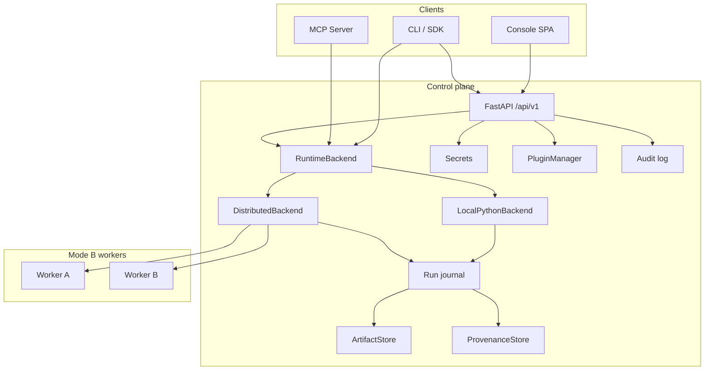

# Graphyn — Software Requirements Specification (Standalone Greenfield SRS)

| Field | Value |
|---|---|
| **Title** | Graphyn Standalone Greenfield Software Requirements Specification |
| **Document ID** | GRAPHYN-SRS-001 |
| **Version** | **1.0.0 Draft** |
| **Date** | 2026-09-18 (Asia/Calcutta) |
| **Status** | Draft — greenfield standalone (build-from-scratch ready) |
| **Document author** | Samir Kumar Mishra \<samir.nmiet@gmail.com\> |
| **Audience** | Product managers, engineers, QA, agent implementers building Graphyn freshly |

## 1. Document control

This document is the **sole normative Software Requirements Specification** for Graphyn when building the product from a greenfield codebase. It embeds product vision, architecture, data model, Graph IR, REST/MCP/CLI contracts, console UX, runtime, security, NFRs, journeys, and acceptance criteria **inline**. A new team SHALL be able to implement the system using only this document plus ordinary engineering judgment — **without reading any other repository guide**.

**Change history**

| Version | Date | Notes |
|---|---|---|
| 1.0.0 Draft | 2026-09-18 | Standalone greenfield rewrite: all product facts folded in; zero outbound doc references; Priority P0/P1/P2 only (target product, not tip status) |

**Conventions**

- Requirements use RFC 2119 **shall** / **should** / **may**.
- Every requirement has a unique ID (`FR-*`, `UX-*`, `NFR-*`, `SEC-*`, `RT-*`, `DIST-*`, `MR-*`, `PLG-*`, `MCP-*`, `EDGE-*`, `DATA-*`, `OBS-*`, `QA-*`, `DM-*`, `IR-*`, `API-*`, `CLI-*`, `ARCH-*`, `J-*`).
- **Priority only:** **P0** (must ship for usable product) · **P1** (product-feel / journey completeness) · **P2** (polish / later). Do **not** track Implemented/Partial against a git tip in this SRS — this is the **target product**.
- **UI noun:** **Workspace** everywhere in the console. API wire fields may use `project` (Project = Workspace, one entity).
- Tables + numbered SHALL requirements are preferred for clarity.
---
## 2. Purpose, scope, assumptions, constraints
### 2.1 Purpose

**FR-DOC-001** (P0) This SRS **shall** specify Graphyn as one control plane where humans and AI agents design typed DAG workflows, train/evaluate models, place work on the right machines, package for edge, and **always** answer: *what ran, where, with which data/code, and who/what triggered it?*

Graphyn’s product identity is the combination of six pillars in **one** product (not five glued apps):

| Pillar | Analogy | Meaning (inline) |
|---|---|---|
| **Design** | n8n | Visual + IR-native Editor, plugins as nodes, templates, triggers, human-in-the-loop |
| **Learn** | MLflow | Runs, metrics, artifacts, experiments, model registry, compare/promote |
| **Execute** | Orchestrator | Typed DAG execution, waves, resume, cache, distributed workers |
| **Ship** | Edge Impulse | Collect → train → optimize → package → deploy to edge/device runtimes |
| **Collaborate** | Agentic / MCP | Agents build/run/debug graphs via MCP + UI; secrets never in IR |
| **Prove** | Accountability | Provenance, replay, actor trail, backtrack any artifact to graph+run+inputs |

**Operating principles (normative intent)**

1. **Graph IR is canonical** — Console, agents, CLI, and SDK all speak the same graph.
2. **Everything meaningful is a run or an artifact** — if you cannot point to a `run_id` / `artifact_id`, it did not happen.
3. **Agents are first-class users** — MCP parity with UI capabilities where listed; never embed secrets in graphs.
4. **Placement is explicit** — local / GPU worker / edge capability is part of the graph story (Mode A honesty vs Mode B).
5. **Backtrack before blame** — lineage and replay beat screenshots and tribal knowledge.

### 2.2 In scope

- Console SPA: every navigable surface, chrome, routing, Cmd-K, settings
- REST API (`/api/v1/`), CLI, Python SDK, MCP server
- Runtime: Graph IR, LocalPython + Distributed backends, pause/cancel/resume, cache, checkpoints, provenance, artifacts
- Plugins, secrets, schedules/webhooks, model registry, datasets/ingest
- Ship/edge packaging (and device loop when device APIs exist)
- Security/trust, observability/audit, non-functionals, quality gates
- End-to-end journeys J1–J6

### 2.3 Out of scope (named for clarity; also listed in §25)

- Generic chat-only LLM product without Graph IR
- Replacing Kubernetes (workers/backends may *use* K8s later as optional scale)
- Audio-only product identity (audio is a plugin pack, not the brand)
- Full multi-tenant IdP / SSO as a shipped requirement of v1 (Access UI may stub; future requirement documented)
- Cursor cloud / external cloud-agent product features
- Inventing a second Project type (Decision B locked: Project = Workspace)

### 2.4 Assumptions

| ID | Assumption |
|---|---|
| A-001 | Operators are trusted on a single-tenant shared-bearer deployment unless multi-user auth is later added |
| A-002 | Desktop browsers (Chrome/Edge/Firefox latest-2) are the primary console clients |
| A-003 | Workspace filesystem roots (`GRAPHYN_PROJECT_DIR` / `workspace/`) and platform home (`GRAPHYN_HOME`) are writable by the API process |
| A-004 | Mode A (single process) is the default; Mode B requires operator-started workers with shared bearer |
| A-005 | Plugin authors follow the plugin package contract; untrusted multi-tenant plugin execution needs future isolation beyond AST filters |

### 2.5 Constraints

| ID | Constraint |
|---|---|
| C-001 | Path URLs only for console navigation — no hash routing as product navigation |
| C-002 | Secrets **shall never** appear in Graph IR, URLs, or logs |
| C-003 | API field name `project` may appear on the wire; UI **shall** say Workspace |
| C-004 | Stable IDE rail structure is locked (§10) — strip vs groups must not morph |
| C-005 | Hostnames of lab boxes are deployment detail, not product requirements |
| C-006 | Pickle deserialization is same-trust-plane only (distributed blobs / isolated plugins) |
---
## 3. Glossary
| Term | Definition | Is not |
|---|---|---|
| **Workspace** | Project context owning pipelines, runs, linked datasets, models, ship packages. **UI term.** | Dataset-only folder |
| **Project** | Same entity as Workspace; **API/query wire name** (`project`, `/projects`) | A second entity type |
| **Home** | Workspace home surface (`/workspaces/:id`) | Global picker only |
| **Editor** | Graph IR canvas (Builder) | Raw route ids in chrome |
| **Runs** | Execution History + Live + Compare | The Editor **Run** button |
| **Run outputs** | Per-run downloadable files under a run | Datasets or Artifacts library |
| **Artifacts** | Cross-run content-addressed registry / ids | Run outputs panel |
| **Datasets** | Shared Inputs/Outputs under `workspace/datasets` | Run downloads |
| **Models** | Registry versions + stages (`latest` / `staging` / `prod`) | Raw trainer blobs until registered |
| **Ship** | Edge package wizard + devices | Worker fleet |
| **Agent inbox** | Graph proposals + generate/review | Chat-only LLM product |
| **Lineage** | Backtrack chain (under Runs or artifact Trace) | Separate daily-nav peer on the strip |
| **Triggers / Always-on** | Schedule / webhook / event attached to a graph | One-shot Editor Run |
| **Graph IR** | Canonical versioned JSON DAG (`schema_version` **1.2**) | UI-only canvas state |
| **Mode A** | `LocalPython` backend — nodes run in API/control process | Requires workers |
| **Mode B** | `GRAPHYN_BACKEND=distributed` + registered workers | Edge packaging |
| **Actor** | Identity string on mutations (`X-Actor` header) | Full OIDC user (future) |
| **Route** | Path URL under HTML5 History API | Hash fragment `#/...` |
| **Plugin** | Installable package (`plugin.toml`) registering node types | Ad-hoc pasted Python without registry |
| **Node** | Typed processing unit with ports + config schema | Untyped script block without ports |
| **Wave** | Parallel-safe set of nodes from level BFS after topo sort | Arbitrary batch |
| **Placement** | Per-node routing hint (`IRPlacement`) for Mode B | Mode A requirement |
| **Provenance** | Record linking artifact → node → run → inputs | Merely a filename |
| **Proposal** | Agent-suggested Graph IR awaiting human accept/reject | Auto-applied graph without gate |
| **Secret** | Named credential in platform secret store | Value embedded in IR |
| **Worker** | Mode B process that claims jobs and executes nodes | Edge device |
| **Switch** | Single control to change/clear active workspace (sidebar strip only) | Dual header+sidebar switchers |
---
## 4. Stakeholders / personas
| Persona | Goals | Primary surfaces |
|---|---|---|
| **ML / workflow engineer** | Design graphs, run, compare, promote models | Editor, Runs, Models, Home |
| **Data engineer** | Ingest/upload datasets, version, link to workspace | Datasets, Home links |
| **Edge / embed engineer** | Package models for device runtimes | Ship, Models, Runs lineage |
| **Platform / ops** | Health, workers, schedules, cleanup, secrets | Ops, Workers, Secrets |
| **AI agent (MCP)** | Propose/validate/execute graphs with human gate | MCP + Agent inbox + Editor |
| **Reviewer / auditor** | Backtrack any artifact to graph+run+actor | Lineage, Audit, Access |
| **Product owner** | Journeys J1–J6 complete without leaving Graphyn | All |
---
## 5. Goals & success criteria
### 5.1 Goals

1. One product for Design · Learn · Execute · Ship · Collaborate with AI · Prove.
2. Graph IR is canonical across UI, API, CLI, MCP.
3. Everything meaningful is a **run** or **artifact** with lineage.
4. Agents are first-class users; secrets never embedded in IR or URLs.
5. Placement is explicit (Mode A honesty vs Mode B workers).
6. A greenfield team can implement from this SRS alone.

### 5.2 Success metrics (measurable)

| ID | Metric | Target | Pri |
|---|---|---|---|
| SM-001 | Time to first successful run via Templates | ≤ 10 minutes (P0 path) | P0 |
| SM-002 | Artifact → graph Trace | ≤ 2 clicks | P0 |
| SM-003 | Share run lineage URL | Opens same run lineage (path URL, no hash) | P0 |
| SM-004 | Model staging → prod without CLI | 100% via Models UI when APIs available | P0 |
| SM-005 | Agent proposal → saved pipeline | ≤ 3 clicks after review | P1 |
| SM-006 | Always-on failure → failed run | ≤ 2 clicks from Home | P1 |
| SM-007 | E2E smoke login → run → lineage path | Green in CI | P0 |
| SM-008 | Journeys J1–J6 | Completable by human **and** MCP agent without leaving Graphyn | P0 |

---

## 6. System context & architecture

### 6.1 Logical context

```
Humans (Console SPA) ─┐
CLI / Python SDK ─────┼──► FastAPI /api/v1 ──► RuntimeBackend
MCP agents (stdio) ───┘         │                 ├── LocalPythonBackend (Mode A)
                                │                 └── DistributedBackend (Mode B + workers)
                                ▼
              Run journal · ArtifactStore · ProvenanceStore · Secrets · Plugins · Audit
```

**ARCH-001** (P0) All interfaces (Console, CLI, SDK, MCP, REST) **shall** execute graphs through a single canonical entry: `get_backend().execute(graph, ...)`.

**ARCH-002** (P0) The system **shall** expose backend mode honestly in readiness (`backend_mode`) and a console Mode chip.

**ARCH-003** (P0) Mode A empty Workers **shall not** present as an error state.

### 6.2 Component catalog (responsibilities & trust boundaries)

| Component | Responsibility | Trust boundary |
|---|---|---|
| **Console SPA** | Path-routed Web IDE; Workspace-first chrome; calls REST with Bearer + `X-Actor` | Browser; token in Settings (localStorage interim); never put secrets in URLs/IR |
| **API (FastAPI)** | REST `/api/v1/*`; auth gate; routers for nodes, pipelines, runs, projects, plugins, secrets, workers, jobs, proposals, models, data, ingest, system, trace, audit, experiments | Control plane; holds bearer secret; fail-closed when auth required |
| **Runtime LocalPython** | Default backend; orchestrator waves; NodeExecutor; cache; checkpoints; conditions | Same process as API (Mode A) |
| **Runtime Distributed** | Wave scheduler; placement; job queue; blob transfer; hydrate outputs on control plane | Control plane + workers sharing bearer |
| **Workers** | Register/heartbeat; claim jobs; execute nodes; upload `output_refs`; stream events | Same bearer as API; semi-trusted pickle outputs → RestrictedUnpickler on host |
| **Plugin packages** | `plugin.toml` + entry points; register node types / port types | Install allowlist when auth required; isolated vs inprocess runtime |
| **ArtifactStore** | Content-addressed blobs; index; download/replay | Bearer holders can read all (single-tenant) |
| **ProvenanceStore** | Lineage records per artifact / by run | Append + query; never raise on missing → error nodes |
| **Secrets store** | Named files under `GRAPHYN_HOME/secrets` (0700/0600) | Names via API; values only via in-process `resolve_secret()` |
| **MCP server** | Stdio JSON-RPC tools (~28–29) mirroring core agent ops | Same token policy; `accept_proposal` gated by human-approval flag |
| **CLI / SDK** | `graphyn` CLI + Python `Pipeline` / `get_backend()` | Operator machine; same IR |



### 6.3 Mode A vs Mode B

| | Mode A (default) | Mode B |
|---|---|---|
| Backend | LocalPython | `GRAPHYN_BACKEND=distributed` |
| Who runs nodes | API process / single box | Control plane + workers by labels/GPU/pool |
| Workers UI | Empty is OK (honest copy + CLI) | Live heartbeats, stale, labels, GPU |
| Placement IR | Optional; **ignored** with honesty badge | Routes GPU / pool / pin work |
| Cross-machine data | N/A | `artifact://` URIs + blob put/get |

**ARCH-004** (P0) `DistributedBackend.execute()` **shall** compute waves from Graph IR, place each node, run local via NodeExecutor or enqueue remote jobs, materialize inputs as refs, hydrate outputs on the control plane.

**ARCH-005** (P1) All-local graphs in Mode B **may** short-circuit to LocalPython behavior.

### 6.4 Workspace layout (filesystem)

Conceptual roots (env-configurable):

| Path | Role |
|---|---|
| `GRAPHYN_HOME` (default `~/.graphyn/`) | Secrets, plugin registry/installed/venvs, durable worker/job state |
| `GRAPHYN_PROJECT_DIR` (default `workspace/`) | Runs, artifacts, datasets, templates |
| `workspace/datasets/input/{label}/` | Dataset inputs |
| `workspace/datasets/output/{project}/` | Dataset outputs + **pipelines** + versions |
| `workspace/runs/{run_id}/` | `meta.json`, `graph.json`, logs, checkpoints |
| `workspace/artifacts/` | Content-addressed artifacts + distributed blobs |
| `workspace/artifacts/_registry/models.json` | Model registry lite |

**ARCH-006** (P0) Dataset and export paths **shall** be jailed under workspace roots (symlink policy: resolve and reject escapes unless explicitly allowed for Docker layouts).

### 6.5 Interface summary

- REST `/api/v1/*` (Bearer when configured)
- MCP stdio JSON-RPC
- Console SPA (path routes; reverse-proxy SPA fallback for non-`/api` paths)
- Static mounts for datasets / run files (same bearer policy when token set)
- CLI: validate, run, migrate, worker, mcp, plugin ops
- SDK: build Graph IR / Pipeline nodes; `get_backend().execute()`

---

## 7. Domain data model

Enough fields to implement. Types are conceptual JSON/Python; persistence may be files or DB.

### 7.1 Workspace (API: Project)

| Field | Type | Notes |
|---|---|---|
| `name` / `id` | string | Stable id; URL segment `:workspaceId`; API `{name}` |
| `display_name` | string | Optional |
| `description` | string | Optional |
| `created_at` / `updated_at` | ISO-8601 | |
| `tags` | string[] | Optional |
| `linked_input_labels` | string[] | Dataset input pins |
| `favorite_pipelines` | string[] | Home pins |
| `spec` / `taxonomy` / `contract` | object | Dataset workspace metadata (optional advanced) |

**DM-WS-001** (P0) UI **shall** label this entity **Workspace**; API paths **may** remain `/api/v1/projects/{name}`.

### 7.2 Pipeline

| Field | Type | Notes |
|---|---|---|
| `name` | string | Unique within workspace |
| `draft` | Graph IR | Head file `pipelines/{name}.graph.json` |
| `versions[]` | `{ version: "vN", graph, message, created_at, actor }` | Snapshots |
| `environments` | object | See below |
| `project` | string | Owning workspace wire name |

**Environments object**

| Key | Meaning |
|---|---|
| `draft` | Always the editable head |
| `staging` | Pointer to version id or null |
| `prod` | Pointer to version id or null |
| `pending_prod` | Version awaiting approve |

**DM-PIPE-001** (P0) Publish **shall** create `vN` and optionally set staging.  
**DM-PIPE-002** (P0) Promote to prod **shall** require explicit approve.  
**DM-PIPE-003** (P0) Rollback **shall** copy a version onto draft.

### 7.3 Graph IR (summary — normative detail in §8)

Top-level: `schema_version`, `metadata`, `nodes[]`, `edges[]`, optional `parameters`.

### 7.4 Run

| Field | Type | Notes |
|---|---|---|
| `run_id` | string | ASCII alphanumeric |
| `status` | enum | `pending` \| `running` \| `paused` \| `succeeded` \| `failed` \| `cancelled` (alias `active`→`in-progress` for legacy clients) |
| `project` | string \| null | Workspace scope |
| `pipeline` | string \| null | Optional |
| `env` | `draft`\|`staging`\|`prod` \| null | Scheduled default `prod` |
| `graph_hash` | string | Hash of saved Graph IR |
| `started_at` / `ended_at` | ISO-8601 | |
| `actor` | string | Who/what triggered |
| `backend_mode` | string | `local_python` \| `distributed` |
| `distributed_node_workers` | map | node_id → worker_id (Mode B) |
| `metrics` / `params` | object | Experiment compare |
| `error` | string \| object | Failure detail |

### 7.5 Artifact

| Field | Type | Notes |
|---|---|---|
| `artifact_id` | string | `^[A-Za-z0-9_-]+$` |
| `content_hash` | string | SHA-256 |
| `artifact_type` | string | e.g. `audio_samples`, `model`, JSON fallback |
| `node_id` / `node_type` | string | Producer |
| `run_id` | string | |
| `data_path` | string | Relative under artifacts store |
| `created_at` | ISO-8601 | |

### 7.6 Provenance

| Field | Type | Notes |
|---|---|---|
| `artifact_id` | string | |
| `run_id` | string | |
| `node_id` / `node_type` | string | |
| `input_artifact_ids` | string[] | Upstream |
| `graph_hash` | string | |
| `plugin_versions` | object | Optional freeze |
| `worker_id` | string \| null | Mode B |
| `actor` | string \| null | |

### 7.7 Model registry entry

| Field | Type | Notes |
|---|---|---|
| `name` | string | Model key |
| `stages` | object | `latest` / `staging` / `prod` → `{ run_id, slug, version?, updated_at }` |
| `pending_prod` | object \| null | Request awaiting approve |
| `project` | string \| null | Optional workspace scope |

### 7.8 Dataset labels / versions

| Concept | Fields |
|---|---|
| **Input label** | `label`, `path` under `datasets/input/{label}`, file listing, size |
| **Output project/version** | `project`, `version`, stats, files under `datasets/output/{project}/{version}` |
| **Merge** | source labels/versions → new target project/version |

### 7.9 Schedule

| Field | Type | Notes |
|---|---|---|
| `id` | string | |
| `project` | string | Workspace |
| `pipeline` | string | |
| `env` | string | Default `prod` for scheduled |
| `interval_s` or `cron` | number \| string | Cron honesty if not fully durable |
| `enabled` | bool | |
| `last_run_id` / `last_error` / `last_tick_at` | | Always-on strip |

### 7.10 Webhook

| Field | Type | Notes |
|---|---|---|
| `url` | string | Outbound; block private/loopback |
| `events` | string[] | e.g. terminal run states |
| `secret_name` | string \| null | HMAC via secrets store — never inline |

### 7.11 Proposal

| Field | Type | Notes |
|---|---|---|
| `id` | string | |
| `status` | `pending`\|`accepted`\|`rejected` | |
| `graph` | Graph IR | Proposed |
| `base_graph` | Graph IR \| null | Optional diff base |
| `message` / `rationale` | string | |
| `actor` | string | Agent id |
| `project` / `pipeline` | string \| null | Bind |
| `created_at` / `resolved_at` | ISO-8601 | |
| `reject_reason` | string \| null | |

### 7.12 Secret

| Field | Type | Notes |
|---|---|---|
| `name` | string | Listed only |
| `value` | string | Write-only; never returned by list/get |
| `updated_at` | ISO-8601 | Metadata only |

### 7.13 Worker

| Field | Type | Notes |
|---|---|---|
| `worker_id` | string | |
| `labels` | string[] | e.g. `gpu`, `lab` |
| `pools` | string[] | |
| `resources` | object | `gpu`, `gpu_name`, `vram_mib_total`, `vram_mib_free`, `cpus` |
| `plugins` | string[] | Advertised node types |
| `graphyn_version` | string | |
| `heartbeat_at` | ISO-8601 | Stale ~45s |
| `status` | `idle`\|`busy`\|`stale` | |

### 7.14 Actor

| Field | Type | Notes |
|---|---|---|
| `actor_id` | string | Sent as `X-Actor` |
| `kind` | `human`\|`agent`\|`system` | UI chips |
| `display` | string | Optional |

**DM-ACT-001** (P1) Mutations **shall** accept `X-Actor` and persist on audit/run metadata when provided.

### 7.15 Job (Mode B)

| Field | Type | Notes |
|---|---|---|
| `job_id` | string | |
| `run_id` / `node_id` / `node_type` | string | |
| `config` | object | |
| `seed` | int | |
| `input_refs` | map port→`artifact://…` | |
| `placement` | IRPlacement | |
| `timeout_s` | number | |
| `status` | enum | |
| `output_refs` | map | On complete |
| `worker_id` | string | |
| `error` | string \| null | |

---

## 8. Graph IR specification (normative)

### 8.1 Top-level required keys

**IR-001** (P0) A Graph IR document **shall** be JSON with:

| Key | Required | Type | Rules |
|---|---|---|---|
| `schema_version` | YES | string | `"1.0"` \| `"1.1"` \| `"1.2"`; current write target **`"1.2"`** |
| `metadata` | YES | object | See §8.2 |
| `nodes` | YES | array | May be empty for draft; Run disabled when empty in UI |
| `edges` | YES | array | May be empty |
| `parameters` | NO | object | Graph-level parameters |

**IR-002** (P0) Major version mismatch **shall** hard-fail (`IRVersionError`). Minor version greater than supported **should** warn and continue. Loaders **shall** accept `1.0`/`1.1` with defaults (`placement=null`, missing condition/event_trigger).

**IR-003** (P0) YAML as authoring format is **deprecated**; systems **may** convert YAML→IR once with deprecation warning. New APIs **shall** accept Graph IR JSON.

### 8.2 Metadata

| Field | Required | Type | Notes |
|---|---|---|---|
| `name` | YES | string | Pipeline display/name |
| `seed` | NO | int | Default 0; drives node seed derivation |
| `description` | NO | string | |
| `project` | NO | string | Stamped on save to workspace pipeline |

### 8.3 Node shape (`IRNode`)

| Field | Required | Type | Notes |
|---|---|---|---|
| `id` | YES | string | Unique within graph |
| `node_type` | YES | string | Registry key |
| `config` | NO | object | Validated against node config schema; **no secret values** |
| `capability_metadata` | NO | object | Per-instance override |
| `placement` | NO | object | IR 1.2; Mode B |
| `event_trigger` | NO | object | Event-driven sources |
| `ui` | NO | object | Canvas position `{x,y}` — non-semantic for execution |
| `labels` | NO | string[] | Free tags — **shall** round-trip on load/save |

**IRCapabilityMetadata**

| Field | Default | Type |
|---|---|---|
| `requires_gpu` | false | bool |
| `supports_cpu` | true | bool |
| `supports_edge` | false | bool |
| `deterministic` | true | bool |
| `cacheable` | true | bool |
| `streaming_support` | false | bool |
| `realtime_support` | false | bool |

**Two-step capability resolution:** if `capability_metadata` set → use it; else registry `NodeMetadata`.

**IRPlacement (1.2)**

| Field | Default | Meaning |
|---|---|---|
| `mode` | `"auto"` | `auto` \| `local` \| `worker` \| `pool` |
| `worker` | null | Pin worker id when `mode=worker` |
| `pool` | null | Logical pool |
| `tags` | `[]` | e.g. `["gpu"]` |
| `require_gpu` | false | Hard constraint |
| `min_vram_mib` | null | Hard VRAM floor |

**Resolution order (Mode B):** explicit `worker` → `pool` → tags + capability → least-loaded eligible → fail closed if none.

### 8.4 Edge shape (`IREdge`)

| Field | Required | Type | Notes |
|---|---|---|---|
| `src_id` | YES | string | Source node id |
| `src_port` | YES | string | Output port name |
| `dst_id` | YES | string | Dest node id |
| `dst_port` | YES | string | Input port name |
| `condition` | NO | string | Safe expression; skip/branch when false |

**IR-004** (P0) Condition evaluator **shall** whitelist AST: comparisons, boolean ops, `len()`, `output["key"]` only — no arbitrary code.

**IR-005** (P0) Load/save through Console/API **shall** preserve `condition`, `event_trigger`, `labels`, `parameters`, `placement` (no silent strip).

### 8.5 Ports (runtime / catalogue — not stored fully in IR)

Nodes declare ports in code/registry:

| Port field | Notes |
|---|---|
| `name` | Port id |
| `data_type` | PortDataType or collection |
| `required` | Input ports |
| `cardinality` | `single` \| `multi` |

Edges validated by CompatibilityChecker at graph build.

### 8.6 Example (normative shape)

```json
{
  "schema_version": "1.2",
  "metadata": {"name": "my-pipeline", "seed": 42, "description": "", "project": "demo"},
  "nodes": [
    {
      "id": "cond_0",
      "node_type": "audio_conditioner",
      "config": {"sample_rate": 16000},
      "placement": {"mode": "auto", "tags": [], "require_gpu": false}
    },
    {
      "id": "seg_0",
      "node_type": "segmenter",
      "config": {"mode": "vad"}
    }
  ],
  "edges": [
    {
      "src_id": "cond_0",
      "src_port": "output",
      "dst_id": "seg_0",
      "dst_port": "input",
      "condition": null
    }
  ]
}
```

### 8.7 Secret policy in IR

**IR-006** (P0) Validate **shall** fail closed when `config` contains non-empty secret-shaped keys (`api_key`, `token`, `password`, `hmac_secret`, `*_secret`, …). Use Secrets store names or `*_env` fields instead.

### 8.8 Artifact refs (distributed)

Remote nodes exchange ports as `artifact://{store}/{key}` / `input_refs` / `output_refs`. Blob bytes live under distributed blob storage with HTTP put/get via control API.

---

## 9. External interfaces: REST, MCP, CLI/SDK

### 9.1 REST auth (applies to all `/api/v1` unless noted)

| Mode | When | Behaviour |
|---|---|---|
| Unauthenticated-dev | Token unset and auth not required | Local single-user only |
| Shared bearer | `GRAPHYN_API_TOKEN` set | `Authorization: Bearer <token>` |
| Fail-closed | `GRAPHYN_AUTH_REQUIRED=1` or `GRAPHYN_ENV` ∈ {production,prod,staging} | Empty token rejected |

Always unauthenticated: `GET /`, `GET /health` (liveness). Static mounts use same bearer policy when token set.

**API-AUTH-001** (P0) Mutations **should** accept `X-Actor` for audit.

### 9.2 REST resource catalog (conceptual contract)

Base prefix: `/api/v1`.

#### Nodes & types

| Method | Path | Purpose | Key fields |
|---|---|---|---|
| GET | `/nodes` | List catalogue | Query filters; returns node_type, metadata, ports |
| GET | `/nodes/{node_type}` | Node detail | Full schema |
| GET | `/nodes/{node_type}/config-schema` | JSON Schema for config | |
| GET | `/nodes/{node_type}/port-schema` | Ports | |
| POST | `/nodes/{node_type}/validate-config` | Body: config object | `{valid, errors}` |
| GET | `/types` | Port data types | |
| GET | `/nodes/compatible` | Compatibility search | Query: type, direction |

#### Pipelines (ad-hoc IR)

| Method | Path | Purpose | Key fields |
|---|---|---|---|
| POST | `/pipelines/validate` | Validate Graph IR | Body: graph; secret fail-closed |
| POST | `/pipelines/run` | Sync execute (or stream NDJSON) | Body: graph, flags |
| POST | `/pipelines/run-async` | Start async | Returns `{run_id, status}` |
| GET/POST/DELETE | `/pipelines/templates…` | Template gallery CRUD + sync-examples | |
| GET | `/pipelines/examples` | Bundled examples | |

#### Workspace pipelines (API `projects`)

| Method | Path | Purpose |
|---|---|---|
| GET | `/projects/{name}/pipelines` | List + environments + version_count |
| GET | `/projects/{name}/pipelines/{pipeline}` | Draft IR; `?env=staging\|prod` resolves pointer |
| PUT | `/projects/{name}/pipelines/{pipeline}` | Save draft (secret fail-closed, stamp project) |
| DELETE | `/projects/{name}/pipelines/{pipeline}` | Delete draft |
| GET | `…/versions` | Published snapshots |
| GET | `…/environments` | draft/staging/prod/pending_prod |
| POST | `…/publish` | `{ message?, set_env?: staging\|prod }` |
| POST | `…/promote` | `{ to_env, version?, from_env?, approve? }` — prod needs `approve: true` |
| POST | `…/rollback` | `{ version }` → copy onto draft |

Additional project lifecycle (create/get/update/delete/clone, taxonomy, contract, spec, annotations, quality, snapshots) **shall** exist under `/projects` for dataset workspace features (P1/P2 as UI prioritizes).

#### Runs

| Method | Path | Purpose |
|---|---|---|
| GET | `/runs` | List; `?project=` scopes |
| GET | `/runs/{run_id}` | Meta |
| GET | `/runs/{run_id}/graph` | Saved IR |
| GET | `/runs/{run_id}/status` | Status |
| GET | `/runs/{run_id}/checkpoints` | List |
| GET | `/runs/{run_id}/checkpoints/{node_id}` | Detail |
| GET | `/runs/{run_id}/checkpoints/{node_id}/samples` | Samples |
| GET | `/runs/{run_id}/artifacts` | Run artifacts |
| GET | `/runs/{run_id}/outputs` | Run outputs listing |
| GET | `/runs/{run_id}/outputs/zip` | Zip download |
| POST | `/runs/{run_id}/promote` | Aliases `latest`\|`staging`\|`prod` |
| POST | `/runs/{run_id}/pause` | Pause |
| POST | `/runs/{run_id}/resume` | Resume |
| POST | `/runs/{run_id}/cancel` | Cancel |
| DELETE | `/runs/{run_id}` | Delete terminal |
| GET | `/runs/{run_id}/provenance` | Provenance |
| GET | `/runs/{run_id}/debug-report` | Debug |
| GET | `/outputs/file` | Safe file fetch |

#### Artifacts

| Method | Path | Purpose |
|---|---|---|
| GET | `/artifacts` | Registry list/filter |
| GET | `/artifacts/{artifact_id}/lineage` | Lineage tree |
| POST | `/artifacts/blob` | Put distributed blob |
| GET | `/artifacts/blob/{key}` | Get blob |

#### Secrets

| Method | Path | Purpose |
|---|---|---|
| GET | `/secrets` | **Names only** |
| POST | `/secrets` | Set `{name, value}` — value not echoed |
| PUT | `/secrets/{name}` | Replace (confirm in UI) |
| DELETE | `/secrets/{name}` | Delete |

#### Data & ingest

| Method | Path | Purpose |
|---|---|---|
| GET | `/data/inputs` | Labels |
| GET | `/data/inputs/{label}` | Files |
| POST | `/data/inputs/upload` | Multipart upload |
| GET | `/data/outputs` | Projects |
| GET | `/data/outputs/{project}/{version}` | Browse |
| GET | `/data/outputs/{project}/{version}/stats` | Stats |
| POST | `/data/merge` | Merge → new version |
| POST | `/ingest/url` | URL ingest job |
| GET | `/ingest/url/{job_id}/stream` | SSE progress |
| POST | `/ingest/huggingface` | HF ingest |
| GET | `/ingest/huggingface/{job_id}/stream` | SSE |

#### System

| Method | Path | Purpose |
|---|---|---|
| GET | `/system/health` | Liveness detail |
| GET | `/system/readiness` | `registry_ready`, `backend_mode`, workers |
| GET | `/system/auth-status` | Auth honesty (public) |
| GET | `/system/metrics` | Metrics |
| POST | `/system/cleanup` | Armed cleanup |
| GET | `/system/projects-registry` | Registry |
| GET/PUT | `/system/webhooks` | Outbound webhook config |
| POST | `/system/webhooks/test` | Test |
| GET/POST | `/system/schedules` | CRUD |
| POST | `/system/schedules/tick` | Tick |
| POST | `/system/schedules/{id}/run` | Run now |
| POST | `/system/schedules/{id}/enable` | Enable |
| DELETE | `/system/schedules/{id}` | Delete |

#### Models

| Method | Path | Purpose |
|---|---|---|
| GET | `/models` | List |
| GET | `/models/{name}` | Detail/stages |
| POST | `/models` | `{ name, run_id, slug, stage? }` |
| POST | `/models/{name}/request-prod` | Request |
| POST | `/models/{name}/approve-prod` | Approve |

#### Plugins

| Method | Path | Purpose |
|---|---|---|
| GET | `/plugins` | Installed |
| POST | `/plugins/install` | `{source, upgrade?, expected_sha256?}` |
| GET | `/plugins/search` | Index search |
| POST | `/plugins/venvs/gc` | GC unused venvs |
| GET | `/plugins/{name}` | Record + install state |
| GET | `/plugins/{name}/dependencies` | Dep status |
| POST | `/plugins/{name}/dependencies/install` | `{include_optional?}` |
| POST | `/plugins/{name}/enable` | Enable |
| POST | `/plugins/{name}/disable` | Disable |
| DELETE | `/plugins/{name}` | Uninstall |

#### Workers & jobs

| Method | Path | Purpose |
|---|---|---|
| POST | `/workers/register` | Register/refresh |
| POST | `/workers/{id}/heartbeat` | Heartbeat + resources |
| GET | `/workers` | List |
| DELETE | `/workers/{id}` | Deregister |
| POST | `/jobs/claim` | Claim next job |
| POST | `/jobs/{id}/complete` | Result |
| POST | `/jobs/{id}/events` | Log events |
| POST | `/jobs/{id}/cancel` | Cancel signal |
| GET | `/jobs/{id}` | Job detail |

#### Proposals

| Method | Path | Purpose |
|---|---|---|
| POST | `/proposals` | Create |
| GET | `/proposals` | List/filter |
| GET | `/proposals/{id}` | Detail |
| POST | `/proposals/{id}/accept` | Accept |
| POST | `/proposals/{id}/reject` | Reject + reason |

#### Trace, audit, experiments

| Method | Path | Purpose |
|---|---|---|
| GET | `/trace` | Unified backtrack (`artifact_id` / `run_id` query) |
| GET | `/trace/artifact/{id}` | Artifact-centric |
| GET | `/trace/run/{id}` | Run-centric |
| GET | `/audit` | Append-only events |
| GET | `/experiments` | List |
| GET | `/experiments/{name}` | Detail |
| GET | `/experiments/compare` | `?ids=` compare payload |

**API-ERR-001** (P0) Error bodies **should** use `{error, detail}` or FastAPI `detail` consistently; UI **shall** surface precise messages for run control.

### 9.3 MCP tool categories

Transport: stdio JSON-RPC. Auth: `_meta.auth_token` mirrors API token policy.

| Category | Tools (names) | Notes |
|---|---|---|
| Discovery | `list_nodes` | Schemas + capabilities |
| Graph | `generate_graph`, `validate_graph`, `get_graph_schema`, `get_graph_capability_summary`, `get_event_schema` | Preserve ids, conditions, event_trigger |
| Execution | `execute_pipeline` | Returns `run_id` quickly; async body |
| Run control | `pause_run`, `resume_run`, `cancel_run` | Active runs |
| Inspect | `inspect_run` | Meta/logs/graph/checkpoints |
| Provenance | `list_artifacts`, `get_artifact_lineage`, `replay_run` | |
| Optimization | `optimize_execution` | Suggestions |
| Plugins | `install_plugin`, `list_plugins`, `manage_plugin` | |
| Secrets | `secrets_list`, `secrets_set` | Names only on list |
| Proposals | `propose_graph`, `list_proposals`, `get_proposal`, `reject_proposal`, `accept_proposal` | `accept_proposal` only when `GRAPHYN_MCP_HUMAN_APPROVAL=1` |
| Workspace observe | `list_experiments`, `get_trace`, `list_projects`, `list_data_inputs` | |

**MCP-001** (P0) Agents **shall not** receive secret values via list tools.  
**MCP-002** (P0) Default apply path: propose → human Accept in UI (unless human-approval flag enables MCP accept).  
**MCP-003** (P1) Schedules, worker pool admin, and document ingest **may** remain REST-only.  
**MCP-004** (P1) MCP/docs copy **shall** cite **path URLs**, not hashes.

### 9.4 CLI / SDK capabilities

**CLI-001** (P0) CLI **shall** support at least: validate graph, run/execute, migrate YAML→JSON, start MCP, start worker, plugin install/list, secrets set/list (names).  
**CLI-002** (P0) SDK **shall** build nodes/edges into Graph IR and call `get_backend().execute()`.  
**CLI-003** (P1) Worker CLI **shall** register, heartbeat, claim, execute, complete with bearer.

---

## 10. Information architecture & navigation (normative UX)

### 10.1 Product rule: Project = Workspace

**UX-NAV-000** (P0) One entity. UI **shall** say **Workspace** everywhere. API/query fields **may** stay `project`. Internal store ids may keep `activeProject` / view id `projects` without user-facing “Project” chrome (except unavoidable API error strings).

### 10.2 Stable IDE rail (LOCKED)

The left sidebar **shall always** present the same DOM structure — it does **not** morph between global and workspace. Only enabled vs disabled (and active highlight) change.

**UX-NAV-001** (P0) Structure:

1. **Workspace strip** (always visible) — the **only Switch**
2. **Groups** (always visible, same titles): Build · Library · Deploy · Admin

**Workspace strip items**

| Item | Enabled when |
|---|---|
| **Home** | Always (picker or workspace home) |
| **Editor**, **Runs**, **Models**, **Ship**, **Datasets** | Active workspace set; else disabled + title “Open a workspace first” |

Quiet strip header: `Workspace: {name}` + **Switch**, or “No workspace open” + **Open**.

**UX-NAV-002** (P0) **One Switch only** — do not also show workspace name + Switch in the top header when the sidebar strip is visible. Header may show a single “Open workspace” affordance on global pages with no URL workspace.

**Groups below (identical whether workspace open or not)**

- **Build:** Templates, Agent inbox  
- **Library:** Plugins, **Artifacts only** (NO Models, NO Datasets in the rail)  
- **Deploy:** Workers only (NO Ship)  
- **Admin:** Secrets, Ops, Access  

**UX-NAV-003** (P0) Models, Ship, and Datasets **shall** live on the workspace strip only — **not** as Library/Deploy peers.  
**UX-NAV-004** (P0) Artifacts **shall not** be a workspace-strip peer; Library-secondary only.  
**UX-NAV-005** (P0) Lineage and Compare **shall not** be activity-bar peers; they live under Runs (or deep links).  
**UX-NAV-006** (P0) Navigation **shall** use path URLs only; new features **shall not** write `location.hash`.  
**UX-NAV-007** (P0) Cold boot with leftover `#/` **shall** clear the hash and land on `/workspaces` (no product hash router; no dual Switch).  
**UX-NAV-008** (P1) Breadcrumbs **should** mirror path: `Workspaces / {id} / {Surface} / {entityShort}`.  
**UX-NAV-009** (P1) Document title **should** be `Graphyn · {surface} · {workspace?}`.

### 10.3 Path map (required routes)

#### Global

| Path | Surface |
|---|---|
| `/` | Redirect → `/workspaces` or last workspace Home |
| `/workspaces` | Workspaces picker |
| `/login` | Auth token entry |
| `/settings` | API base URL, token, preferences |
| `/templates` | Templates |
| `/agent/inbox` | Agent inbox list |
| `/agent/inbox/:proposalId` | Proposal detail |
| `/library/datasets` | Secondary shared dataset library catalog |
| `/library/plugins` | Plugins |
| `/library/artifacts` | Artifacts registry (`?artifactId=`) |
| `/deploy/workers` | Worker fleet |
| `/deploy/workers/queue` | Job queue |
| `/admin/secrets` | Secrets |
| `/admin/ops` | Ops |
| `/admin/ops/audit` | Audit |
| `/admin/access` | Access |
| `/404` | Not found |

**Canonicalization:** `/library/models`, `/deploy/ship` (and devices) **shall** redirect to `/workspaces` (open a workspace first). Dead global Models/Ship path builders **shall not** be used.

#### Workspace-scoped

| Path | Surface |
|---|---|
| `/workspaces/:workspaceId` | Home |
| `/workspaces/:workspaceId/editor` | Editor |
| `/workspaces/:workspaceId/editor/pipelines/:pipelineId` | Editor + pipeline |
| `/workspaces/:workspaceId/editor/pipelines/:pipelineId/:env` | `draft` \| `staging` \| `prod` |
| `/workspaces/:workspaceId/runs` | History |
| `/workspaces/:workspaceId/runs/live` | Live |
| `/workspaces/:workspaceId/runs/compare` | Compare (`?ids=`) |
| `/workspaces/:workspaceId/runs/:runId` | Run detail |
| `/workspaces/:workspaceId/runs/:runId/logs` | Logs |
| `/workspaces/:workspaceId/runs/:runId/outputs` | Run outputs |
| `/workspaces/:workspaceId/runs/:runId/lineage` | Lineage |
| `/workspaces/:workspaceId/runs/:runId/details` | Details |
| `/workspaces/:workspaceId/runs/:runId/checkpoints` | Checkpoints |
| `/workspaces/:workspaceId/models` | Models |
| `/workspaces/:workspaceId/models/:modelName` | Model detail |
| `/workspaces/:workspaceId/models/:modelName/versions/:version` | Version |
| `/workspaces/:workspaceId/datasets` | Workspace datasets |
| `/workspaces/:workspaceId/ship` | Ship package |
| `/workspaces/:workspaceId/ship/devices` | Devices |
| `/workspaces/:workspaceId/ship/packages/:packageId` | Package detail |
| `/workspaces/:workspaceId/agent` | Opens Editor + agent drawer |

**UX-NAV-010** (P0) With workspace open, Models/Ship/Datasets use `/workspaces/:id/...`. Path id is source of truth — **do not** mirror redundant `?project=` when path already has `/workspaces/:id`.

**UX-NAV-011** (P0) `pathForView` for models/ship/data without workspace id returns null → open Workspaces picker (toast: open a workspace first).

### 10.4 Router implementation contract

- Browser History API router — **not** HashRouter  
- Layout routes: AppShell → WorkspaceLayout (`:workspaceId`) → feature outlets  
- Navigation only via router (`Link`, `navigate`, typed path helpers)  
- SPA fallback for all non-`/api` paths in reverse proxy / Compose  
- Optional `GRAPHYN_UI_BASE_PATH` for subpath hosting (P2)

---

## 11. Cross-cutting UX / API behavior

### 11.1 Auth, token, actor

| ID | Requirement | Pri |
|---|---|---|
| FR-AUTH-001 | Unauthenticated users **shall** be directed to `/login` or Settings with `returnTo` when API returns 401 | P0 |
| FR-AUTH-002 | Console **shall** store API Bearer token (Settings); values **shall not** appear in URLs or Graph IR | P0 |
| FR-AUTH-003 | When token set, API **shall** require Bearer; fail-closed when auth required / prod\|staging | P0 |
| FR-AUTH-004 | Mutations **shall** accept `X-Actor`; console **shall** allow editing actor (Access / localStorage) | P1 |
| FR-AUTH-005 | Auth honesty banner **shall** distinguish Connected / Sign in required / Can't reach API | P0 |
| FR-AUTH-006 | Full RBAC (roles, per-workspace ACL, SSO) **shall** be deferred; Access UI **may** stub until APIs exist | P2 |

### 11.2 Errors, empty, loading

| ID | Requirement | Pri |
|---|---|---|
| UX-STATE-001 | Every primary surface **shall** define loading, empty, and error states (no blank white) | P0 |
| UX-STATE-002 | Empty states **shall** offer a next-click CTA | P0 |
| UX-STATE-003 | Destructive actions **shall** require confirm (armed button / typed CLEANUP for cleanup) | P0 |
| UX-STATE-004 | Toasts **shall** cover success/error/info; dismissible | P0 |
| UX-STATE-005 | Per-route error boundary **should** provide recovery CTA | P1 |
| UX-STATE-006 | Offline / API-down **should** show retry wall | P1 |
| UX-STATE-007 | 404 and 403 pages (resource missing vs forbidden) **should** exist | P1 |

### 11.3 Routing & deep links

| ID | Requirement | Pri |
|---|---|---|
| FR-ROUTE-001 | Deep links **shall** survive refresh for workspace, run, panel, proposal, artifact query | P0 |
| FR-ROUTE-002 | Cross-links **shall** pass context (`run_id`, workspace, artifact_id) — users **shall not** re-paste IDs for primary flows | P0 |
| FR-ROUTE-003 | URL **shall** be source of truth for workspace id; store mirrors URL | P0 |
| FR-ROUTE-004 | Copy-link **should** exist on run, model, proposal, lineage | P1 |
| FR-ROUTE-005 | Open-in-new-tab **shall** work for primary resources | P1 |

### 11.4 Command palette & shortcuts

| ID | Requirement | Pri |
|---|---|---|
| FR-CMDK-001 | ⌘/Ctrl+K (and `/` where scoped) **shall** open Command palette | P1 |
| FR-CMDK-002 | Jump keys **shall** match sidebar destinations (incl. Secrets, Models, Access) | P1 |
| FR-CMDK-003 | `?` **shall** open keyboard help overlay; Esc closes | P1 |

### 11.5 Linkage rule

**UX-LINK-001** (P0) Each surface **shall** have one primary job and explicit bridges to related surfaces. Observe duplication (Trace/Compare as strip peers) **shall not** return.

| Surface | Primary job | Bridges |
|---|---|---|
| Home | Situation + pipelines + next actions | Editor, Runs, Datasets, Templates, Models, Ship, Ops |
| Editor | Design / validate / run / save | Runs panels, Templates, Agent inbox, Datasets chip |
| Runs | Execution ops | Editor, Models register, Ship, Agent explain |
| Models | Registry stages | Trace/run, Datasets, Ship |
| Ship | Package (+ devices) | Models, Runs lineage |
| Datasets | Files in/out | Home pins, Editor |
| Agent inbox | Review proposals | Editor |
| Artifacts | Cross-run registry | Runs, Trace, Models |
| Workers | Mode B fleet | Ops readiness |
| Secrets | Named credentials | Editor credential picker |
| Ops | Health / schedules / cleanup / audit | Home always-on |
| Access | Actor / future roles | Settings token |

---

## 12. Per-surface requirements (all screens)

For each surface: purpose, layout/controls, empty/loading/error, bridges, acceptance (Given/When/Then). Priority P0/P1/P2 only.

### 12.1 Login (`/login`)

**Purpose:** Enter Bearer token and continue to `returnTo`.  
**Actors:** Human operator.

**Layout / controls:** Token input (password-style), Continue, link to Settings; optional API base URL note.

| ID | Requirement | Pri |
|---|---|---|
| FR-LOGIN-001 | System **shall** provide token input and Continue that persists token client-side | P0 |
| FR-LOGIN-002 | After save, system **should** verify token (readiness/nodes) before claiming success | P1 |
| FR-LOGIN-003 | Enter key **shall** submit the form | P2 |
| FR-LOGIN-004 | 401 remediation **may** use Settings drawer; `/login` **shall** remain a valid path | P1 |

**Empty/loading/error:** Empty = blank token field + CTA; loading = verifying; error = clear invalid-token message.  
**Bridges:** → `returnTo` or `/workspaces`.  
**Acceptance:**  
- Given valid token When Continue Then subsequent catalog calls succeed.  
- Given invalid token When verified Then user sees clear failure (when FR-LOGIN-002 shipped).

---

### 12.2 Workspaces picker & Home (`/workspaces`, `/workspaces/:id`)

**Purpose:** Pick/create workspace; situation strip; pipelines + envs; always-on; linked datasets; next actions.  
**Actors:** Engineer, agent (via project APIs).

**Layout:** Picker: create/open/filter mine·examples/rename/clone/delete. Home: situation strip; pipelines table with env badges; recent runs; always-on; linked datasets; next-action cards.

| ID | Requirement | Pri |
|---|---|---|
| FR-HOME-001 | User **shall** create, open, filter (mine/examples), rename, clone, delete workspaces | P0 |
| FR-HOME-002 | Home **shall** list pipelines with draft/staging/prod and open Editor | P0 |
| FR-HOME-003 | User **shall** Publish→staging, Request prod, Approve prod, Rollback draft when APIs allow | P0 |
| FR-HOME-004 | Home **shall** show recent runs scoped by workspace and open run detail | P0 |
| FR-HOME-005 | Home **shall** show Always-on schedules with Run now + link to Ops | P1 |
| FR-HOME-006 | User **shall** link/unlink dataset inputs; Browse library/Artifacts | P0 |
| FR-HOME-007 | User **should** pin favorite pipelines | P2 |
| FR-HOME-008 | Spec/taxonomy/contract/versions/snapshots/diff **shall** remain available (collapsed OK) | P1 |
| FR-HOME-009 | Situation strip **should** show Mode, last run, pending proposals, always-on count, failed schedule | P1 |
| FR-HOME-010 | Partial API failure on Home load **shall not** silently blank successful sections | P1 |

**Empty:** First-run cards — Template / Editor / Register model / Ship.  
**Loading:** Skeletons per section.  
**Error:** Per-section error with retry.  
**Acceptance:**  
- Given workspace with pipeline When Publish staging Then env badge updates.  
- Given no versions When open Versions Then honest empty + CTAs.

---

### 12.3 Editor (`/workspaces/:id/editor…`)

**Purpose:** Design Graph IR, validate, run, save, triggers, agent propose.  
**Layout:** Catalog · canvas · inspector · log; toolbar Run / Validate / Save / Templates / Triggers / Agent.

| ID | Requirement | Pri |
|---|---|---|
| FR-ED-001 | Canvas **shall** add/wire nodes from catalog with typed ports, config from schema, zoom/pan | P0 |
| FR-ED-002 | Validate **shall** surface errors; Run disabled on empty canvas | P0 |
| FR-ED-003 | Run **shall** stream events (NDJSON); Cancel **shall** cancel backend run and abort stream | P0 |
| FR-ED-004 | Save to workspace pipeline **shall** persist Graph IR | P0 |
| FR-ED-005 | Import/export graph and save-as-template **shall** work | P0 |
| FR-ED-006 | Triggers dock **shall** manage schedules for current pipeline and show webhook honesty | P1 |
| FR-ED-007 | Agent drawer **shall** create proposals into Agent inbox | P1 |
| FR-ED-008 | Credential picker **shall** select secret **names** only | P1 |
| FR-ED-009 | Mode A **shall** show placement-ignored badge; Mode B **shall** expose placement fields | P1 |
| FR-ED-010 | Load/save **shall** preserve edge conditions, event triggers, labels, graph parameters | P0 |
| FR-ED-011 | Dirty Editor **should** block route leave with confirm | P1 |
| FR-ED-012 | HITL / wait node UX **should** guide operators; full HITL node **may** need API | P2 |
| FR-ED-013 | Subflows **may** be deferred | P2 |

**Empty catalog:** Auth / offline / plugins empty honesty.  
**Bridges:** Run → Runs panels; Templates stamp → Editor; Accept proposal → Editor; dataset chip → Datasets.  
**Acceptance:**  
- Given valid graph Mode A When Run Then `run_id` + last-run strip.  
- Given Open in Editor with dataset Then dataset chip shows workspace/version.

---

### 12.4 Runs — History / Live / Compare + panels

**Paths:** `/workspaces/:id/runs`, `…/live`, `…/compare`, `…/:runId/{logs|outputs|lineage|details|checkpoints}`  
**Purpose:** Execution ops — not a second Editor.

| ID | Requirement | Pri |
|---|---|---|
| FR-RUN-001 | History **shall** list runs (workspace-scoped) with status, time, id, filters | P0 |
| FR-RUN-002 | Detail **shall** support Pause / Resume / Cancel (stale-aware) / Delete terminal | P0 |
| FR-RUN-003 | Panels **shall** include Logs, Outputs, Lineage, Details/Debug, Checkpoints | P0 |
| FR-RUN-004 | Live **shall** poll running/pending with node/worker visibility | P1 |
| FR-RUN-005 | Compare **shall** select 2–5 runs; params/metrics table; honest empty metrics; charts/CSV when available | P1 |
| FR-RUN-006 | Promote aliases and Register model **shall** be available from succeeded runs | P1 |
| FR-RUN-007 | Mode B **shall** show `node → worker` chips when placement map exists | P1 |
| FR-RUN-008 | Explain/fix failure **shall** create an agent proposal | P1 |
| FR-RUN-009 | Lineage panel **shall** show hop chain, graph hash/plugin versions header, repro pack (lite OK) | P0 |
| FR-RUN-010 | Standalone Trace as strip peer **shall not** be required; run lineage path is canonical | P0 |
| FR-RUN-011 | Error `detail` objects from run control **should** surface precise messages | P1 |
| FR-RUN-012 | History **should** support multi-select affordance before Compare | P1 |

**Acceptance:**  
- Given completed run When open lineage Then chain loads without pasting id.  
- Given stale RUNNING When Cancel Then leaves running.  
- Given ≥2 metric runs When Compare Then diffs highlight.

---

### 12.5 Models (`/workspaces/:id/models`)

**Purpose:** Registry list/stages; request/approve prod; register from runs; link Trace/datasets/Ship.

| ID | Requirement | Pri |
|---|---|---|
| FR-MOD-001 | List/filter models; show stages latest/staging/prod and pending_prod | P0 |
| FR-MOD-002 | Request prod / Approve prod **shall** call registry APIs from UI | P0 |
| FR-MOD-003 | Register model from run id/slug **shall** work | P0 |
| FR-MOD-004 | Model card **shall** deep-link Trace/run and **should** link datasets | P1 |
| FR-MOD-005 | Use in Ship CTA **should** prefill package wizard | P1 |
| FR-MOD-006 | Workspace scope vs all-registries **shall** be clear | P1 |

**Acceptance:** Given staging model When Approve prod Then stage updates and audit can record actor.

---

### 12.6 Ship (+ Devices)

**Paths:** `/workspaces/:id/ship`, `…/ship/devices`  
**Purpose:** Optimize + package trained model; devices when API exists.

| ID | Requirement | Pri |
|---|---|---|
| FR-SHIP-001 | Package wizard **shall** support template → configure → run-async → download | P0 |
| FR-SHIP-002 | Missing model path **shall** warn with CTAs (Templates/Editor/Artifacts) | P0 |
| FR-SHIP-003 | Tabs Package \| Devices **shall** exist; Devices **may** be needs-API stub | P1 |
| FR-SHIP-004 | Auto-pick model from registry **should** work | P1 |
| FR-SHIP-005 | Package diagnostics + lineage bar **shall** link source run | P1 |
| FR-SHIP-006 | Device inventory, flash, OTA **shall** require device registry API | P2 |
| FR-SHIP-007 | On-device metrics → Runs/Models **shall** require API | P2 |

**Acceptance:**  
- Given valid model When Run then Download Then package file downloads.  
- Given Devices tab When no API Then honest needs-API empty (not fake devices).

---

### 12.7 Datasets

**Paths:** `/workspaces/:id/datasets`, `/library/datasets`  
**Purpose:** Files in / files out under `workspace/datasets/` — not workspace metadata-only editor.

| ID | Requirement | Pri |
|---|---|---|
| FR-DATA-001 | Browse Inputs/Outputs; Manage Upload/Ingest/Merge | P0 |
| FR-DATA-002 | Paths **shall** stay jailed inside workspace | P0 |
| FR-DATA-003 | Merge **shall** create target workspace/version consumable by Home | P1 |
| FR-DATA-004 | Ingest (URL/HF) **shall** show progress/log; SSE when available | P1 |
| FR-DATA-005 | Mode B **should** warn about shared storage for workers | P2 |
| FR-DATA-006 | Collect/label lite **may** use annotations APIs | P2 |
| FR-DATA-007 | Workspace Datasets **should** CTA “Browse shared library” → `/library/datasets` | P1 |

**Acceptance:**  
- Given upload When complete Then label lists file.  
- Given output version When browse Outputs Then only version dirs shown as versions.

---

### 12.8 Templates (`/templates`)

| ID | Requirement | Pri |
|---|---|---|
| FR-TPL-001 | List Examples/Saved; search; sync examples; stamp into workspace | P0 |
| FR-TPL-002 | Without active workspace, gate create/select before stamp | P0 |
| FR-TPL-003 | Save from Editor **shall** create Saved card | P1 |
| FR-TPL-004 | Category tags on cards **should** improve gallery | P2 |

**Acceptance:** Given Sync examples When Open Then IR loads in Editor under chosen workspace.

---

### 12.9 Agent inbox (`/agent/inbox`, `/:proposalId`)

| ID | Requirement | Pri |
|---|---|---|
| FR-AGT-001 | List/filter by status; detail with structural diff; Accept/Reject | P0 |
| FR-AGT-002 | Accept **shall** load graph into Editor with toast | P0 |
| FR-AGT-003 | Generate in UI **shall** create proposals (API/MCP parity) | P1 |
| FR-AGT-004 | Accept & save to pipeline + dirty-draft guard **should** exist | P1 |
| FR-AGT-005 | Actor chips **shall** show human vs agent | P1 |
| FR-AGT-006 | Partial apply **may** stay stub until API | P2 |
| FR-AGT-007 | MCP connection status **should** appear in console (Ops honesty OK) | P2 |

**Acceptance:** Given pending proposal When Accept Then Editor has graph. Given Reject Then leaves pending; audit event.

---

### 12.10 Artifacts (`/library/artifacts`)

| ID | Requirement | Pri |
|---|---|---|
| FR-ART-001 | Filter by run/type; detail Trace/Download/Open run/Replay | P0 |
| FR-ART-002 | Copy **shall** clarify Runs→Outputs vs Artifacts library | P1 |
| FR-ART-003 | Register model CTA **should** appear when applicable | P1 |
| FR-ART-004 | Repro pack **should** download from lineage | P1 |

**Acceptance:** Given `artifactId` query When open Then detail focuses that artifact.

---

### 12.11 Plugins (`/library/plugins`)

| ID | Requirement | Pri |
|---|---|---|
| FR-PLG-001 | Install from path/package/git/https; enable/disable/uninstall | P0 |
| FR-PLG-002 | Deps install **shall** show real package names + progress | P0 |
| FR-PLG-003 | After install, catalog refresh **shall** be visible to user | P1 |
| FR-PLG-004 | Venv GC **should** be available from Ops/Plugins | P2 |
| FR-PLG-005 | Mode B **should** document worker plugin parity | P2 |

**Acceptance:** Given valid plugin When Install Then appears Installed and nodes list in Editor after refresh.

---

### 12.12 Workers (`/deploy/workers`, `/queue`)

| ID | Requirement | Pri |
|---|---|---|
| FR-WRK-001 | Mode A empty **shall** explain local mode + copyable CLI | P0 |
| FR-WRK-002 | Mode B table **shall** show heartbeat, stale, labels, GPU/VRAM, refresh | P0 |
| FR-WRK-003 | Deregister worker **shall** be available | P1 |
| FR-WRK-004 | Job queue visibility **should** list jobs (honesty if list-all limited) | P1 |
| FR-WRK-005 | Reclaim / labels PATCH **may** need API/UI completion | P2 |

**Acceptance:** Given no workers When open Then not an error. Given live worker When heartbeat old Then Stale chip.

---

### 12.13 Secrets (`/admin/secrets`)

| ID | Requirement | Pri |
|---|---|---|
| FR-SEC-UI-001 | Store/list/delete **names**; values never re-displayed | P0 |
| FR-SEC-UI-002 | Replace same name **shall** confirm | P1 |
| FR-SEC-UI-003 | Docs/UI **shall** state workers resolve names via platform (not IR) | P1 |

**Acceptance:** Given store OPENAI_API_KEY When list Then name only.

---

### 12.14 Ops (`/admin/ops`, `/admin/ops/audit`)

| ID | Requirement | Pri |
|---|---|---|
| FR-OPS-001 | Health/readiness/metrics cards **shall** load; Raw JSON collapsed | P0 |
| FR-OPS-002 | Schedules CRUD + tick; webhook URL save/test | P0 |
| FR-OPS-003 | Cleanup **shall** default non-destructive; require typed CLEANUP; never delete running runs / examples / datasets/input | P0 |
| FR-OPS-004 | Audit table **shall** show when/actor/action/resource; filters/export **should** | P1 |
| FR-OPS-005 | Backend mode + worker count **should** surface when distributed | P1 |
| FR-OPS-006 | Build SHA / version **should** appear | P2 |

**Acceptance:** Given accepted proposal When refresh Audit Then event row. Given CLEANUP confirm Then toast summarizes deletions.

---

### 12.15 Access (`/admin/access`)

| ID | Requirement | Pri |
|---|---|---|
| FR-ACS-001 | Edit actor identity for `X-Actor` | P1 |
| FR-ACS-002 | Link to API token Settings | P1 |
| FR-ACS-003 | Roles matrix (admin/prod-approve/secret-write) **shall** wait for multi-user API | P2 |

**Acceptance:** Given actor set When mutate Then audit shows actor.

---

### 12.16 Command palette

| ID | Requirement | Pri |
|---|---|---|
| FR-PAL-001 | Palette **shall** navigate to primary views and recent resources when listed | P1 |
| FR-PAL-002 | Keyboard nav ↑↓ Enter Esc **shall** work | P1 |

---

### 12.17 Settings

| ID | Requirement | Pri |
|---|---|---|
| FR-SET-001 | Settings panel **shall** edit/clear API token and refresh catalog | P0 |
| FR-SET-002 | `/settings` path **should** exist as first-class route (drawer OK interim) | P1 |
| FR-SET-003 | Env badge (local/staging/prod API) **should** appear in shell | P2 |

---

## 13. Runtime / pipeline

| ID | Requirement | Pri |
|---|---|---|
| RT-001 | Graph IR **shall** be canonical (`schema_version` 1.2 write target); UI/API/CLI/MCP speak same IR | P0 |
| RT-002 | `get_backend().execute(graph)` **shall** be the execution entry | P0 |
| RT-003 | Planner **shall** topo-sort into waves; parallel execution within wave when enabled | P0 |
| RT-004 | Pause / resume / cancel **shall** work for active runs | P0 |
| RT-005 | Per-node checkpoints **shall** support resume/inspect samples | P0 |
| RT-006 | Pipeline cache **shall** key by content hash; skip on hit when enabled | P1 |
| RT-007 | Edge conditions **shall** skip/branch safely (evaluator whitelist) | P1 |
| RT-008 | ProvenanceStore **shall** record lineage for artifacts | P0 |
| RT-009 | ArtifactStore **shall** content-address artifacts; download/replay | P0 |
| RT-010 | Schedules **shall** fire runs (interval; cron honesty); default env=prod for scheduled | P1 |
| RT-011 | Outbound webhooks **shall** fire on terminal run states when configured | P1 |
| RT-012 | Run journal **shall** persist meta, graph, logs under run dir | P0 |
| RT-013 | Secret resolution in nodes **shall** use names; fail closed if required secret missing | P0 |
| RT-014 | Retry policies **should** be configurable per node | P2 |
| RT-015 | Resume **shall** validate `graph_hash` match or fail closed | P0 |
| RT-016 | Event-driven mode **shall** re-execute on event_trigger sources (mutually exclusive with parallel) | P2 |
| RT-017 | Node lifecycle **shall** support setup → process/on_start/on_end → teardown; retry on failure | P0 |
| RT-018 | Write paths for node outputs **shall** be mkdir-jailed before process | P0 |

**Execution flow (Mode A)**

1. `load_ir` → validate schema/version  
2. `get_backend().execute` → LocalPython → orchestrator  
3. IR → PipelineConfig → PipelineGraph (instantiate, validate edges, Kahn topo, waves)  
4. RunManager creates run dir; save graph; register active run  
5. Per wave/node: assemble inputs → conditions → cache → NodeExecutor → checkpoint → resume_state  
6. Finalize meta; deregister; fire webhooks if terminal  

**Acceptance:** Given Graph IR with two independent nodes When execute parallel Then both complete in same wave. Given cancel When in-flight Then no further side effects after cancel acknowledged.

---

## 14. Model registry

| ID | Requirement | Pri |
|---|---|---|
| MR-001 | Register model from run artifact/slug | P0 |
| MR-002 | Promote aliases `latest` \| `staging` \| `prod` on runs | P0 |
| MR-003 | `request-prod` / `approve-prod` gate with audit | P0 |
| MR-004 | Pipeline env pointers separate from model stages but linked in UX | P0 |
| MR-005 | Model → training run → dataset version links **should** be first-class | P1 |

---

## 15. Distributed Mode B

| ID | Requirement | Pri |
|---|---|---|
| DIST-001 | Workers register/heartbeat/deregister with bearer | P0 |
| DIST-002 | Job claim/complete/events/cancel APIs **shall** exist | P0 |
| DIST-003 | IR placement (auto/worker/pool/gpu) **shall** route work in Mode B | P0 |
| DIST-004 | Run detail **shall** expose `distributed_node_workers` map | P1 |
| DIST-005 | Blob transfer for artifacts across workers **shall** work | P1 |
| DIST-006 | Mid-flight reclaim / reassignment UX **may** follow API | P2 |
| DIST-007 | OTel spans per node/job across workers **may** be later | P2 |
| DIST-008 | Heartbeats ~15s; stale after ~45s → scheduler skips worker | P0 |
| DIST-009 | Data plane **shall** cross machines only via artifact URIs — not live Python objects or host-local absolute paths | P0 |
| DIST-010 | Host loads of worker outputs **shall** use RestrictedUnpickler (allowlist builtins/numpy/app.models) | P0 |

**Job unit:** `{job_id, run_id, node_id, node_type, config, seed, input_refs, placement, timeout_s}` → result `{status, output_refs, events, error, worker_id, duration_s}`.

---

## 16. Plugins

### 16.1 Package contract

```
my_plugin/
├── plugin.toml
├── __init__.py
├── types.py      # custom PortDataType — list FIRST in entry_points if present
└── nodes.py
```

**plugin.toml keys:** `name` (slug `^[a-z][a-z0-9_-]*$`), `version` (PEP 440), `description`, `author`, `platform_version`, `entry_points`, `license`, `tags`, `dependencies`, `optional_dependencies`, `runtime` = `inprocess` \| `isolated`.

| ID | Requirement | Pri |
|---|---|---|
| PLG-SYS-001 | Plugins **shall** install via PluginManager (path/pkg/git/https) with optional SHA256 | P0 |
| PLG-SYS-002 | Manifest + registry registration **shall** expose nodes to catalogue | P0 |
| PLG-SYS-003 | Isolated runtime (`iso`) **should** be indicated in catalog | P1 |
| PLG-SYS-004 | Remote install allowlist **shall** fail closed when auth required | P0 |
| PLG-SYS-005 | Enable/disable/uninstall **shall** update catalog on refresh | P0 |
| PLG-SYS-006 | Auto-install bundled PluginPackage when production/empty enabled list (unless skip flag) | P1 |
| PLG-SYS-007 | Heavy deps **shall** prefer `optional_dependencies`; isolated venvs under GRAPHYN_HOME | P1 |
| PLG-SYS-008 | Domain types for plugins **shall** live in plugin `types.py`, not platform `app/models` | P0 |

**Node authoring minimum:** `Node` subclass with `NodeMetadata`, `input_ports`/`output_ports`, `Config(NodeConfig)`, `process` (SISO OK), optional `setup`/`teardown`, optional `RetryPolicy`.

---

## 17. Agents / MCP / proposals

Covered in §9.3 and §12.9. Additional:

| ID | Requirement | Pri |
|---|---|---|
| AGT-SYS-001 | Propose → human Accept in UI **shall** be the default apply path | P0 |
| AGT-SYS-002 | Create/accept/reject **shall** emit audit events | P0 |
| AGT-SYS-003 | Explain/fix from failed run **shall** create a proposal | P1 |
| AGT-SYS-004 | Agents are first-class actors — chips on proposals + audit | P1 |

---

## 18. Edge / Ship / devices

| ID | Requirement | Pri |
|---|---|---|
| EDGE-001 | edge_optimizer + deployment_packager path via template/wizard | P0 |
| EDGE-002 | Download package artifact from completed ship run | P0 |
| EDGE-003 | Promote package env staging/prod when supported | P1 |
| EDGE-004 | Device registry / flash / OTA | P2 |
| EDGE-005 | Signed package / checksum display | P2 |
| EDGE-006 | Multi-target batch packages | P2 |
| EDGE-007 | Fake Devices UI without API **shall not** ship — stub + honesty only | P0 |

---

## 19. Datasets / ingest

| ID | Requirement | Pri |
|---|---|---|
| DATA-SYS-001 | Inputs under `datasets/input/{label}`; outputs under `datasets/output/{project}/…` | P0 |
| DATA-SYS-002 | URL + HuggingFace ingest | P1 |
| DATA-SYS-003 | Project versions, snapshots, lineage, quality APIs **may** exceed UI coverage | P2 |
| DATA-SYS-004 | Annotations / curation / quality-check **should** gain UI when product prioritizes label lite | P2 |
| DATA-SYS-005 | Upload filenames **shall** be sanitized/timestamped | P0 |

**Product loop:** Upload in Datasets → Build in Editor → Runs (outputs / lineage / compare) → manage on Home → package in Ship.

---

## 20. Security & trust

### 20.1 Single-tenant bearer model

**SEC-001** (P0) Shared-bearer single-tenant model **shall** be documented in product honesty; no fake RBAC claims. Bearer holder can read/write all workspaces until multi-user ships.

**SEC-002** (P2) Future multi-user: cross-workspace access **shall** default-deny (membership/ACL).

### 20.2 Secrets

| ID | Requirement | Pri |
|---|---|---|
| SEC-010 | Secrets: dir 0700, files 0600 under GRAPHYN_HOME/secrets | P0 |
| SEC-011 | API/MCP/CLI list **names only**; no GET-by-name value endpoint | P0 |
| SEC-012 | Secrets **shall never** appear in Graph IR, URLs, or logs | P0 |
| SEC-013 | `resolve_secret(name)` in-process only; miss errors cite name never value | P0 |

### 20.3 python_code & HTTP egress

| ID | Requirement | Pri |
|---|---|---|
| SEC-020 | `python_code` **shall** use AST filters; **shall not** be marketed as a sandbox | P0 |
| SEC-021 | `allow_network` default false; `allowed_paths` empty unless intentional | P0 |
| SEC-022 | HTTP egress restricted mode + allowlist **shall** be available (`GRAPHYN_HTTP_EGRESS_MODE`) | P1 |
| SEC-023 | Platform webhooks **shall** block private/loopback; pin-IP connect preferred | P0 |

### 20.4 Path / ID hardening

| ID | Requirement | Pri |
|---|---|---|
| SEC-030 | User path segments **shall** use safe-child checks; dataset paths jailed | P0 |
| SEC-031 | Run IDs alphanumeric; artifact ids `^[A-Za-z0-9_-]+$`; template names restricted | P0 |
| SEC-032 | Condition expressions AST whitelist only | P0 |
| SEC-033 | Sanitize artifact/JSON previews in UI | P1 |
| SEC-034 | CSP-friendly build; no inline secret logging | P1 |

### 20.5 Pickle / isolation

| ID | Requirement | Pri |
|---|---|---|
| SEC-040 | Never deserialize attacker-controlled bytes with unrestricted pickle | P0 |
| SEC-041 | Host loads worker/isolated outputs via RestrictedUnpickler | P0 |
| SEC-042 | Plugin remote sources: allowlist structural match; empty allowlist denies remotes when auth required | P0 |

### 20.6 Authorization matrix (current target honesty)

Bearer holder (or unauthenticated-dev caller): full CRUD/execute on projects, graphs, runs, artifacts, datasets, plugins install, workers, proposals. Secret **values**: never via list/get — only runtime resolve. **Not shipped:** RBAC roles, OIDC/SSO, per-workspace isolation, separate worker credentials.

---

## 21. Observability & audit

| ID | Requirement | Pri |
|---|---|---|
| OBS-001 | Append-only audit events for mutations (proposals, envs, model prod, …) | P0 |
| OBS-002 | `GET /trace` unified backtrack payload (artifact → node → run → graph → worker) | P0 |
| OBS-003 | Audit filters (actor/resource/time) + export | P1 |
| OBS-004 | Client error reporting hook (env-flagged) | P2 |
| OBS-005 | Correlation ids on failure UI (`run_id` / request id) | P1 |
| OBS-006 | OTel span viewer | P2 |
| OBS-007 | Partial chains when pieces missing **shall** still render honestly | P0 |

---

## 22. Non-functional requirements

### 22.1 Performance

| ID | Requirement | Pri |
|---|---|---|
| NFR-PERF-001 | Route-level code splitting for features | P1 |
| NFR-PERF-002 | Virtualize long run/log/artifact lists | P1 |
| NFR-PERF-003 | Editor bundle isolated from observe routes | P1 |
| NFR-PERF-004 | Catalog/list endpoints **should** respond < 2s on lab hardware for ≤1k nodes/runs page | P2 |

### 22.2 Accessibility

| ID | Requirement | Pri |
|---|---|---|
| NFR-A11Y-001 | Keyboard nav for shell + tables; focus traps in dialogs | P1 |
| NFR-A11Y-002 | WCAG AA for core flows (contrast, labels, live regions) | P1 |
| NFR-A11Y-003 | `aria-current` on active nav | P0 |

### 22.3 i18n

| ID | Requirement | Pri |
|---|---|---|
| NFR-I18N-001 | New user-facing strings **should** be key-disciplined (i18n-ready) | P2 |
| NFR-I18N-002 | Full locale packs **may** be deferred | P2 |

### 22.4 Browser support

| ID | Requirement | Pri |
|---|---|---|
| NFR-BRW-001 | Desktop Chrome/Edge/Firefox latest-2 **shall** be supported | P0 |
| NFR-BRW-002 | Mobile observe-only **may** be later | P2 |
| NFR-BRW-003 | Desktop-first Editor (wide canvas) | P0 |

### 22.5 Reliability

| ID | Requirement | Pri |
|---|---|---|
| NFR-REL-001 | SPA fallback for non-`/api` paths in Compose/nginx | P0 |
| NFR-REL-002 | Stale RUNNING detection + cancel path | P0 |
| NFR-REL-003 | Schedule durability across process restart **should** improve | P1 |
| NFR-REL-004 | Optional `GRAPHYN_UI_BASE_PATH` | P2 |

---

## 23. Quality / acceptance strategy

| ID | Requirement | Pri |
|---|---|---|
| QA-001 | Unit tests for path helpers and cold-boot hash clear | P0 |
| QA-002 | API/router unit tests for workspace scoping, runs filter, pipelines | P0 |
| QA-003 | E2E smoke: login → workspace → run → lineage path in CI | P1 |
| QA-004 | Console production build **shall** pass in CI | P0 |
| QA-005 | Contract tests path helpers ↔ API ids | P1 |
| QA-006 | a11y CI checks on shell + Runs | P2 |
| QA-007 | Docker IDE loop smoke (workspace→pipeline→run→Trace) **should** remain green | P1 |
| QA-008 | RestrictedUnpickler + distributed transfer regression tests | P0 |

Acceptance language for surfaces uses Given/When/Then in §12 and journeys in §24.

---

## 24. Journeys (E2E acceptance)

### J1 — Human builds and runs

**J-001** (P0)  
Given a new operator with valid API token  
When they open a workspace → stamp a Template or build in Editor → Validate → Run → view Run outputs → Save pipeline → Publish staging → Request/Approve prod → Rollback if needed  
Then each step completes in-console with path URLs shareable; no hash navigation.

### J2 — Train, compare, promote

**J-002** (P0)  
Given training runs with metrics  
When Compare (table+charts when available) → Register model → Models stages → Request/Approve prod → Trace to data+run  
Then promotion is auditable and model links back to run.

### J3 — Always-on

**J-003** (P1)  
Given a saved pipeline  
When Triggers enable schedule/webhook → Home Always-on shows it → failure opens run → schedule error visible  
Then operator reaches failed run in ≤2 clicks from Home.

### J4 — Edge ship

**J-004** (P1)  
Given a registered model  
When Ship auto-pick → target configure → package → Download (and Device assign when API exists) → Lineage  
Then package downloads and lineage reaches source run.

### J5 — Agent + human gate

**J-005** (P0)  
Given MCP or UI Generate creates a proposal  
When human reviews rich/structural diff → Accept & save / Reject → audit actors  
Then Accept loads Editor (and saves when chosen); optional fix-from-failure proposal works.

### J6 — Backtrack

**J-006** (P0)  
Given any artifact/model/package  
When open Lineage → Replay → Repro pack → Audit filter/export  
Then chain answers who/what/where/when/code/data without leaving Graphyn.

**Done means:** J1–J6 by a new human **and** an MCP agent without leaving Graphyn (SM-008).

---

## 25. Out of scope

- SSO / OIDC / full RBAC / multi-tenant isolation (Access stub only until APIs)
- Device flash/OTA hardware loop without registry API
- Nested MLflow parent-child runs; mandatory full MLflow package dependency
- K8s-native executor as primary backend
- Chat LLM product without Graph IR
- Second Project type (Decision B locked)
- Fake Devices UI without API
- Observe Trace/Compare as activity-bar peers
- Hash-based navigation as product routing
- FaceRecognition (or other) product surface as brand
- Cursor cloud product features
- Becoming a generic chat LLM product
- Audio-only identity — audio is a pack, not the brand

---

## 26. Traceability (pillars → FR IDs)

| Pillar | Primary requirement IDs |
|---|---|
| **n8n — Design** | FR-ED-*, FR-TPL-*, FR-HOME-002..005, RT-001, RT-007, RT-010, IR-* |
| **MLflow — Learn** | FR-RUN-005..006, FR-MOD-*, MR-*, FR-ART-* |
| **Orchestrator — Execute** | RT-*, FR-RUN-001..004,007, FR-WRK-*, DIST-*, FR-OPS-002 |
| **Edge Impulse — Ship** | FR-SHIP-*, EDGE-*, FR-DATA-* |
| **Agentic** | FR-AGT-*, MCP-*, AGT-SYS-*, FR-ED-007, FR-RUN-008 |
| **Accountability** | FR-RUN-009..010, OBS-*, SEC-*, FR-ACS-*, FR-OPS-004 |
| **Platform / IA** | UX-NAV-*, FR-ROUTE-*, FR-AUTH-*, UX-STATE-*, NFR-*, QA-*, ARCH-* |

Journeys: **J1** FR-TPL + FR-ED + FR-RUN + FR-HOME · **J2** FR-RUN-005 + FR-MOD · **J3** FR-ED-006 + FR-HOME-005 · **J4** FR-MOD + FR-SHIP · **J5** FR-AGT · **J6** FR-RUN-009 + OBS + FR-ART.

---

## 27. Open questions / TBD (true unknowns only)

1. **Settings route vs drawer:** Promote `/settings` to full page or keep modal as permanent pattern?
2. **Cron durability:** Persist scheduler across API restarts — file ticker vs external cron?
3. **Device API shape:** Minimal registry (id, target, last package, OTA status) before UI investment?
4. **RBAC roles:** Exact role set for prod-approve vs secret-write vs admin Ops when multi-user ships?
5. **Compare charts:** Server aggregates vs client-only from existing compare payload?
6. **Worker plugin sync:** Require identical packs on workers — enforce in heartbeat or document-only?
7. **BASE_PATH:** First-class subpath hosting requirement for current customers?
8. **Audit retention / signing:** Append-only verification UX timeline?
9. **Partial proposal apply:** API support for accepting subset of node changes?
10. **HITL node:** Dedicated wait/approve node type vs UX-only over existing delay nodes?

---

## 28. Appendix

### Appendix A — Full path map

See §10.3 tables (global + workspace-scoped). Additional query conventions:

| Query | Use |
|---|---|
| `?ids=a,b,c` | Runs compare |
| `?artifactId=` | Artifacts focus |
| `?returnTo=` | Login redirect |
| `?actor=&resource=&from=&to=` | Audit filters |

### Appendix B — Full API path list (method + path)

```
GET    /api/v1/nodes
GET    /api/v1/nodes/{node_type}
GET    /api/v1/nodes/{node_type}/config-schema
GET    /api/v1/nodes/{node_type}/port-schema
POST   /api/v1/nodes/{node_type}/validate-config
GET    /api/v1/types
GET    /api/v1/nodes/compatible
POST   /api/v1/pipelines/validate
POST   /api/v1/pipelines/run
POST   /api/v1/pipelines/run-async
GET    /api/v1/pipelines/templates
GET    /api/v1/pipelines/templates/{name}
POST   /api/v1/pipelines/templates
POST   /api/v1/pipelines/templates/sync-examples
GET    /api/v1/pipelines/examples
GET    /api/v1/pipelines/templates/{name}/versions
DELETE /api/v1/pipelines/templates/{name}
GET    /api/v1/projects/{name}/pipelines
GET    /api/v1/projects/{name}/pipelines/{pipeline}
PUT    /api/v1/projects/{name}/pipelines/{pipeline}
DELETE /api/v1/projects/{name}/pipelines/{pipeline}
GET    /api/v1/projects/{name}/pipelines/{pipeline}/versions
GET    /api/v1/projects/{name}/pipelines/{pipeline}/environments
POST   /api/v1/projects/{name}/pipelines/{pipeline}/publish
POST   /api/v1/projects/{name}/pipelines/{pipeline}/promote
POST   /api/v1/projects/{name}/pipelines/{pipeline}/rollback
GET    /api/v1/runs
GET    /api/v1/runs/{run_id}
GET    /api/v1/runs/{run_id}/graph
GET    /api/v1/runs/{run_id}/status
GET    /api/v1/runs/{run_id}/checkpoints
GET    /api/v1/runs/{run_id}/checkpoints/{node_id}
GET    /api/v1/runs/{run_id}/checkpoints/{node_id}/samples
GET    /api/v1/runs/{run_id}/artifacts
GET    /api/v1/runs/{run_id}/outputs
GET    /api/v1/runs/{run_id}/outputs/zip
POST   /api/v1/runs/{run_id}/promote
POST   /api/v1/runs/{run_id}/pause
POST   /api/v1/runs/{run_id}/resume
POST   /api/v1/runs/{run_id}/cancel
DELETE /api/v1/runs/{run_id}
GET    /api/v1/runs/{run_id}/provenance
GET    /api/v1/runs/{run_id}/debug-report
GET    /api/v1/outputs/file
GET    /api/v1/artifacts
GET    /api/v1/artifacts/{artifact_id}/lineage
POST   /api/v1/artifacts/blob
GET    /api/v1/artifacts/blob/{key}
GET    /api/v1/secrets
POST   /api/v1/secrets
PUT    /api/v1/secrets/{name}
DELETE /api/v1/secrets/{name}
GET    /api/v1/data/inputs
GET    /api/v1/data/inputs/{label}
POST   /api/v1/data/inputs/upload
GET    /api/v1/data/outputs
GET    /api/v1/data/outputs/{project}/{version}
GET    /api/v1/data/outputs/{project}/{version}/stats
POST   /api/v1/data/merge
POST   /api/v1/ingest/url
GET    /api/v1/ingest/url/{job_id}/stream
POST   /api/v1/ingest/huggingface
GET    /api/v1/ingest/huggingface/{job_id}/stream
GET    /api/v1/system/health
GET    /api/v1/system/readiness
GET    /api/v1/system/auth-status
GET    /api/v1/system/metrics
POST   /api/v1/system/cleanup
GET    /api/v1/system/projects-registry
GET    /api/v1/system/webhooks
PUT    /api/v1/system/webhooks
POST   /api/v1/system/webhooks/test
GET    /api/v1/system/schedules
POST   /api/v1/system/schedules
POST   /api/v1/system/schedules/tick
POST   /api/v1/system/schedules/{id}/run
POST   /api/v1/system/schedules/{id}/enable
DELETE /api/v1/system/schedules/{id}
GET    /api/v1/models
GET    /api/v1/models/{name}
POST   /api/v1/models
POST   /api/v1/models/{name}/request-prod
POST   /api/v1/models/{name}/approve-prod
GET    /api/v1/plugins
POST   /api/v1/plugins/install
GET    /api/v1/plugins/search
POST   /api/v1/plugins/venvs/gc
GET    /api/v1/plugins/{name}
GET    /api/v1/plugins/{name}/dependencies
POST   /api/v1/plugins/{name}/dependencies/install
POST   /api/v1/plugins/{name}/enable
POST   /api/v1/plugins/{name}/disable
DELETE /api/v1/plugins/{name}
POST   /api/v1/workers/register
POST   /api/v1/workers/{id}/heartbeat
GET    /api/v1/workers
DELETE /api/v1/workers/{id}
POST   /api/v1/jobs/claim
POST   /api/v1/jobs/{id}/complete
POST   /api/v1/jobs/{id}/events
POST   /api/v1/jobs/{id}/cancel
GET    /api/v1/jobs/{id}
POST   /api/v1/proposals
GET    /api/v1/proposals
GET    /api/v1/proposals/{id}
POST   /api/v1/proposals/{id}/accept
POST   /api/v1/proposals/{id}/reject
GET    /api/v1/trace
GET    /api/v1/trace/artifact/{id}
GET    /api/v1/trace/run/{id}
GET    /api/v1/audit
GET    /api/v1/experiments
GET    /api/v1/experiments/{name}
GET    /api/v1/experiments/compare
```

Plus project lifecycle routes under `/api/v1/projects` (CRUD, clone, taxonomy, contract, spec, annotations, quality, snapshots) as implemented by the projects router.

### Appendix C — Console surface checklist

| Surface | Section | Covered |
|---|---|---|
| Login | §12.1 | ✓ |
| Workspaces/Home | §12.2 | ✓ |
| Editor | §12.3 | ✓ |
| Runs History/Live/Compare + panels | §12.4 | ✓ |
| Models | §12.5 | ✓ |
| Ship + Devices | §12.6 | ✓ |
| Datasets | §12.7 | ✓ |
| Templates | §12.8 | ✓ |
| Agent inbox | §12.9 | ✓ |
| Artifacts | §12.10 | ✓ |
| Plugins | §12.11 | ✓ |
| Workers | §12.12 | ✓ |
| Secrets | §12.13 | ✓ |
| Ops | §12.14 | ✓ |
| Access | §12.15 | ✓ |
| Command palette | §12.16 | ✓ |
| Settings | §12.17 | ✓ |
| Runtime / Models / Dist / Plugins / MCP / Edge / Data / Security / Obs / NFR / QA / Journeys | §13–24 | ✓ |

### Appendix D — Key environment variables (operator)

| Variable | Role |
|---|---|
| `GRAPHYN_API_TOKEN` | Shared bearer |
| `GRAPHYN_AUTH_REQUIRED` | Fail-closed auth |
| `GRAPHYN_ENV` | production/prod/staging → fail-closed |
| `GRAPHYN_BACKEND` | `distributed` enables Mode B |
| `GRAPHYN_HOME` | Platform home |
| `GRAPHYN_PROJECT_DIR` | Workspace data root |
| `GRAPHYN_HTTP_EGRESS_MODE` | `trusted` \| `restricted` |
| `GRAPHYN_HTTP_EGRESS_ALLOWLIST` | Hosts when restricted |
| `GRAPHYN_PLUGIN_ALLOWED_SOURCES` | Remote plugin allowlist |
| `GRAPHYN_MCP_HUMAN_APPROVAL` | Enable MCP `accept_proposal` |
| `GRAPHYN_AUTO_INSTALL_PLUGINS` | Bundled plugin install |
| `GRAPHYN_SKIP_PLUGIN_LOAD` | Tests only |
| `GRAPHYN_UI_BASE_PATH` | Subpath hosting |
| `GRAPHYN_DATA_ALLOW_EXTERNAL_SYMLINKS` | Docker symlink layouts |

### Appendix E — Port data types (platform examples)

Implementers **shall** support a typed port system. Platform examples include: `AudioSample`, `FeatureArray`, `TensorBatch`, `ModelArtifact`, `TFLiteArtifact`, `PredictionResult`, `DeploymentArtifact`, `DataSample`. Plugins may register additional `PortDataType` subclasses via `types.py`.

---

*End of GRAPHYN-SRS-001 v1.0.0 Draft — Standalone greenfield Software Requirements Specification — 2026-09-18 (Asia/Calcutta). Document author: Samir Kumar Mishra \<samir.nmiet@gmail.com\>.*
